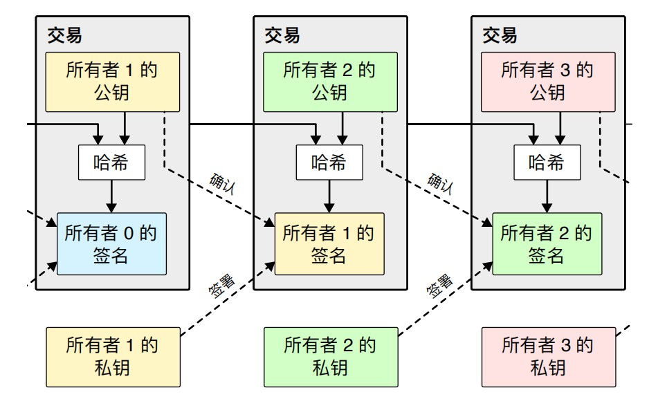
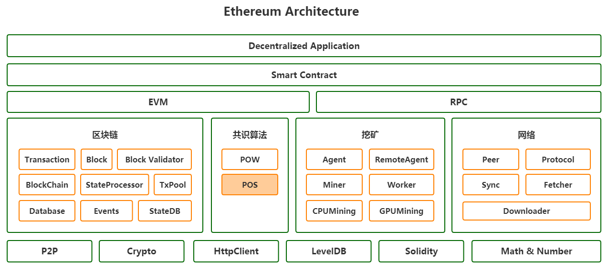
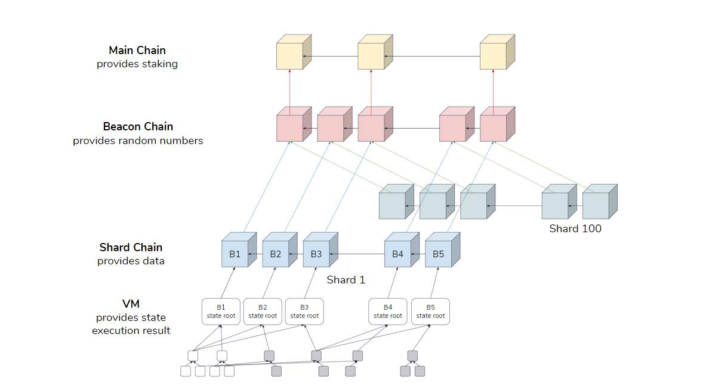

## 比特币

比特币就是个骗局，任何一个程序员都可以再造出更多的比笨币，比傻币，比蠢币，
这种凭空造出来，完全没有实体的虚拟币怎么可能有价值？
没有政府背书担保，怎么可能有信用当货币？

<!-- more -->

新生事物从出生开始就在人们的质疑中不断的成长，亦或是不能适应这个世界的规则就此消亡，到目前为止比特币经历了无数的市场考验和技术攻击，始终屹立不倒，比特币作为一种前所未有的新型货币。现在比特币已成长为一个在全球有着数百万用户，数万商家接受付款，市值最高达百亿美元的货币系统。互联网打破了信息传播的地域和国家界限，信息自由极大地促进了人类经济、政治、文化的发展，比特币将进一步打破基于国家界限的金融和价值传播障碍，对全球造成深远的影响。但我们有理由展望未来，比特币作为数字黄金会在历史中存在多久，还是只是打开了数字经济的潘多拉的盒子，从此区块链就构筑了未来100年经济基石。

2008年11月1日，一个自称中本聪（Satoshi Nakamoto）的人在P2P foundation网站上发布了比特币白皮书《比特币：一种点对点的电子现金系统》，陈述了他对电子货币的新设想——比特币就此面世。2009年1月3日，比特币创世区块诞生。中北葱在创世区块中写下了如下的内容：

```
The Times 03/Jan/2009 Chancellor on brink of second bailout for banks.
首相第二次对处于崩溃边缘的银行进行紧急救助。
```

比特币用分布式账本摆脱了第三方机构的制约，中本聪称之为区块链。用户乐于奉献出CPU的运算能力，运转一个特别的软件来做一名矿工，这会构成一个网络共同来保持区域链。 这个过程中，会生成新比特币。

## 比特币白皮书中比特币定义

⼀个纯粹的点对点版本的电⼦现⾦系统，将允许在线⽀付直接从⼀⽅发送到另⼀⽅，⽽⽆需通过⾦融机构。数字签名虽然提供了部分解决⽅案，但，若是仍然需要被信任的第三⽅来防⽌双重⽀出的话，那么电⼦⽀付的主要优势就被抵消了。我们提出⼀个⽅案，使⽤点对点⽹络去解决双重⽀出问题。点对点⽹络将为每笔交易标记时间戳，⽅法是：把交易的散列数据录⼊⼀个不断延展的、以散列为基础的⼯作证明链上，形成⼀个如⾮完全重做就不可能改变的记录。最⻓链，⼀⽅⾯⽤来证明已被⻅证的事件及其顺序，与此同时，也⽤来证明它来⾃于最⼤的 CPU 算⼒池。只要绝⼤多数 CPU 算⼒被良性节点控制 —— 即，它们不与那些尝试攻击⽹络的节点合作 —— 那么，良性节点将会⽣成最⻓链，并且在速度上超过攻击者。这个⽹络本身需要最⼩化的结构。信息将以最⼤努⼒为基本去传播，节点来去⾃由；但，加⼊之时总是需要接受最⻓的⼯作证明链作为它们未参与期间所发⽣之⼀切的证明。

### 交易

我们将⼀枚电⼦硬币定义为⼀个数字签名链。⼀位所有者将⼀枚硬币交给另⼀个⼈的时候，要通过在这个数字签名链的末尾附加上以下数字签名：上⼀笔交易的哈希（hash，⾳译，亦翻译为“散列值”），以及新所有者的公钥。收款⼈可以通过验证签名去验证数字签名链的所属权，这个⽹络的健壮在于它的⽆结构的简单。节点们可以在很少协同的情况下瞬间同时⼯作。它们甚⾄不需要被辨认，因为消息的路径并⾮取决于特定的终点；消息只需要被以最⼤努⼒为基本去传播即可。节点来去⾃由，重新加⼊时，只需要接受⼯作证明链，作为它们离线之时所发⽣之⼀切的证明。它们通过它们的 CPU 算⼒投票，通过不断为链添加新的有效区块、拒绝⽆效区块，去表示它们对有效交易的接受与否。任何必要的规则和奖励都可以通过这个共识机制来强制实施。


### POW(工作证明)

为了实现⼀个基于点对点的分布式时间戳服务器，我们需要使⽤类似亚当·伯克的哈希现⾦那样的⼀个⼯作证明系统，⽽不是报纸或者新闻组帖⼦那样的东⻄。所谓的⼯作证明，就是去寻找⼀个数值；这个数值要满⾜以下条件：为它提取散列数值之后 —— 例如使⽤ SHA-256 计算散列数值 —— 这个散列数值必须以⼀定数量的 0 开头。每增加⼀个 0 的要求，将使得⼯作量指数级增加，并且，这个⼯作量的验证却只需通过计算⼀个哈希。
在我们的时间戳⽹络中，我们是这样实现⼯作证明的：不断在区块之中增加⼀个随机数（Nonce），直到⼀个满⾜条件的数值被找到；这个条件就是，这个区块的哈希以指定数量的 0 开头。⼀旦 CPU 的耗费算⼒所获的的结果满⾜⼯作证明，那么这个区块将不再能被更改，除⾮重新完成之前的所有⼯作量。随着新的区块不断被添加进来，改变当前区块即意味着说要重新完成所有其后区块的⼯作。


⼯作证明同时解决了如何决定谁能代表⼤多数做决定的问题。如果所谓的“⼤多数”是基于“⼀个IP地址⼀票”的⽅式决定的话，那么任何⼀个可以搞定很多 IP 地址的⼈就可以被认为是“⼤多数”。⼯作证明本质上来看，是“⼀个CPU⼀票”。所谓的“⼤多数决定”是由最⻓链所代表的，因为被投⼊最多⼯作的链就是它。如果⼤多数 CPU 算⼒被诚实的节点所控制，那么诚实链成⻓最为迅速，其速度会远超其他竞争链。为了更改⼀个已经产⽣的区块，攻击者将不得不重新完成那个区块以及所有其后区块的的⼯作证明，⽽后还要追上并超过诚实节点的⼯作。后⽂展示为什么⼀个被拖延了的攻击者能够追上的可能性将随着区块的不断增加⽽指数级降低。

为了应对硬件算⼒综合的不断增加，以及随着时间推进可能产⽣的节点参与数量变化，⼯作证明难度由此决定：基于平均每⼩时产⽣的区块数量的⼀个移动平均值。如果区块⽣成得过快，那么难度将会增加。

### ⽹络 (Network)

1. 所有新的交易向所有节点⼴播；
2. 每个节点将新交易打包到⼀个区块；
3. 每个节点开始为此区块找⼀个具备难度的⼯作证明；
4. 当某个区块找到其⼯作证明，它就要将此区块⼴播给所有节点；
5. 众多其他节点当且只当以下条件满⾜才会接受这个区块：其中所有的交易都是有效的，且未被双重⽀付；
6. 众多节点向⽹络表示⾃⼰接受这个区块的⽅法是，在创建下⼀个区块的时候，把被接受区块的哈希当作新区块之前的哈希。

### 奖励 (Incentive)

按照约定，每个区块的第⼀笔交易是⼀个特殊的交易，它会⽣成⼀枚新的硬币，所属权是这个区块的⽣成者。这么做，使得节点⽀持⽹络有所奖励，也提供了⼀种将硬币发⾏到流通之中的⽅式 —— 在这个系统中，反正也没有⼀个中⼼化的权威⽅去发⾏那些硬币。如此这般稳定地增加⼀定数量的新硬币进⼊流通，就好像是⻩⾦开采者不断耗⽤他们的资源往流通之中增加⻩⾦⼀样。在我们的系统中，被耗⽤的资源是 CPU⼯作时间和它们所⽤的电⼒。奖励还可以来⾃交易费⽤。如果⼀笔交易的输出值⼩于它的输⼊值，那么其中的差额就是交易费；⽽该交易费就是⽤来奖励节点把该交易打包进此区块的。⼀旦既定数量的硬币已经进⼊流通，那么奖励将全⾯交由交易⼿续费来完成，且绝对不会有通货膨胀。

## 货币探讨

人类几万年的文明进程中，货币的演化形态不论是粮食，贝壳，金银，纸币，其本质就是要取消交易的耦合性，以提高交易的效率。货币是否真的需要一个可以触摸的实体作为载体，是否可以完全脱离有形实体，不被任何实相所束缚，从而具备最优越的货币属性、最大的货币价值和最低的货币成本。比特币的思路，直接把价值交换，作为一种债权转移，记录下来。等于是我先欠着，并且广播所有人，下次填坑。把拿了什么刻在石板上，公示给所有人。货币的本质既不是信用，也不是使用价值，而是共识。公众认为黄金作为货币，能为交易提供便利，愿意在交易中使用黄金，那黄金就是货币。政府只能规定黄金是不是法定货币，而不能规定黄金是不是货币。支撑比特币的不是信用，而是公众共识，公众共识则基于支付汇款、智能合约、信息公开、炒作标的、非法用途、价值储存、货币发行与社会公平这些比特币的用途。公众认为比特币能为交易提供便利，是个好货币，甚至不仅是个货币，连合同都能在上面一起搞定（智能合约），于是比特币就作为货币被用起来了。

数字货币最重要的革命性贡献，在于发行和信用创新。和一般认为虚拟货币最大的硬伤在于没有信用来保证兑付相反，虚拟币最大的贡献之一就在于信用的创新，这使得它不但可以成为货币，还可以在另外的重要领域完成比无钞流通更重要更紧迫而且法币从始至终都无法完成的任务。其终结了以往货币必须由一个超级机构进行背书的历史，通过一种分布式背书的信用形式，在最大程度上避免了被超级机构行通过单一背书进行掌控进而行获得并行使货币霸权。

政府对法币做什么信用担保了吗？保证你明天还能用5元买一碗牛肉面吗？黄金背后也没有大炮和政府信用做担保，黄金就没有价值了吗？就不是货币了吗？从理论上说，一种东西如果具有以下特性：获取有成本、数量有限、体积适中、均匀一致、易交易、易分割、易保存、易辨别真伪——总而言之，获取有成本且方便分割货币单位使用，那就有可能被公众作为货币使用。货币的价值是能为交易提供便利。货币的本质不是信用，只有本身毫无价值的纸币才需要信用背书，为了强迫公众使用纸币，政府还规定了纸币的法偿性和强制性。从来没有人为黄金背书，也没人规定黄金的法偿性和强制性，强迫公众使用黄金，但黄金作为货币却横贯数千年，超过任何由政府背书的纸币。

## 法币的背书

谈到货币，就必须谈及信用，经常有人说信用是数字货币/虚拟货币的硬伤，因为没有机构对其背书，所以其价值难以保证，而法币最大的好处就是有强大的政府做背书，因此其价值有保障，法币的背书，从其诞生开始就很不见得是免费的午餐。甚至可以说，几乎所有政府对其法币的背书都是伪善的，在这伪善背书之后隐藏的，几乎都是狰狞的面容。古今中外都是如此，尤其是当社会出现动荡时， 毋庸置疑，货币霸权每时每刻都存在，盘剥每时每刻都发生，因此大家其实都在寻找这么一种方法，希望能对抗这种货币霸权。现在兔子国上上下下，都有一种非常明显的焦虑，都在急迫地寻找一种与其说发财或理财，不如说是保全自己财富的方法，如果说过去十年财富的唯一避风港是房产，那未来还是吗？

## 比特币的价值

目前虽然有部分国家政府认可比特币具有货币属性，但大多数政府不认可比特币是货币，而是将比特币定义为商品，各国政府对比特币的主要观点有比特币不是被政府禁止的非法品，而是一种政府认可的合法商品和投资品，甚至货币。

所以比特币的价值，取决于有多少交易需要比特币结算，和比特币流通总量的关系， 其价值取决于到底有多少产值的交易真的在用比特币做清算。包括但不限于，伊朗朝鲜和委内瑞拉等被美国金融体系禁入的国家，和中国的贸易，很多是用比特币或者 USDT 清算的。大麻和其他毒品的交易，
但全球意识到可以用 bitcoin 清算绕过政府的清算是可行的，这个趋势没有变，且目前没有比 bitcoin 更好的方式，做体系外的清算。

比特币的最高使命——以技术手段限制政府滥发法币，促进社会的公平与效率
人类社会的进化，从根本上来说，不是靠权力，而是靠科技。第一次工业革命，蒸汽机改变了世界，生产力大爆发，人类从物质匮乏的羁绊中解脱。第二次工业革命，电的发明点亮了历史，世界成为一个整体。第三次工业革命，科技改变了世界，统治地球的传统权力轴心开始动摇。而比特币就是科技与互联网精神的杰出产品，比特币意在消除自工业革命以来，就笼罩在人类经济史上的紧箍咒——法币滥发。

抗监管性。抗监管性本身就是价值。监管在很多时候都是市场中“抢劫”的力量，会破坏市场运行的效率。抵抗监管，能够放大市场效率。但我们不能忽视监管维护市场秩序的积极一面。

去中心化POW算力挖坑带来比特币的不可逆性。我几乎认为海枯石烂后比特币还会存在，就像上古文明在石头上画画我们今天还能看见一样。不可逆性使得其可以长久存在，类似于土地这样的资产。无限可能的未来折现到现在，生成一定的价值。

## 比特币归零的风险

如果没人用 bitcoin 记账，它会归 0 的。人类的想象和推理总是基于现有的技术和理论体系，也许总有一种现在人类无法理解的技术使比特币归零，那可能已经是很久之后，对新生事物完全有必有以敬畏的心态去拥抱它。

### 量子计算机攻破比特币加密

加密远比解密代价小，假设以数字+大小写字母（共62种字符）设置密码，某超级计算机1秒能暴力尝试10亿个密码破解12位需要10万年（超过人类文明史量子计算机即使带来一亿倍的破解速度提升，那也不过是抵消了比特币256位私钥长度中的27位而已（2^27=1.3亿）。就算外星人出现，连续发生了数次一亿倍破解速度提升（每次抵消27位私钥长度），比特币也只要简单地把私钥长度升级到512位即可。

### 51%算力攻击

比特币网络会被51%算力攻击，政府只要控制超过一半的矿场或矿池，就能破坏比特币网络。简单地说51%攻击的最大的用处是双花比特币。攻击者买东西付了比特币，然后用51%以上算力挖出另一个分叉，新分叉中没有刚才的交易，那么就能取消刚才的付款，把已付款的比特币拿回来了。听起来似乎很厉害？一知半解的小白往往会神话51%攻击的威力，认为51%攻击是对比特币的致命威胁。然而51%攻击是一种攻击范围、攻击条件、攻击对象都极其有限，仅存在于理论上，完全可以完美防御的攻击。在攻击者和卖家都不犯错误的前提下，攻击者必败。
a、51%攻击必须针对大金额的付款没有任何攻击者会消耗大量算力成本，去51%攻击一杯咖啡的付款。即使是只求破坏的恶意攻击者，为了造成影响，也必须攻击大金额付款。想像一下，51%攻击者宣布：动用超过2/3算力，成功51%攻击了一杯咖啡的付款。
b、51%攻击必须在短时间内发起哪怕有绝对优势的算力（比如总算力的2/3），攻击者也不能在付款后太长时间才发起51%攻击，否则不管是分叉追赶主链的极长耗时，还是攻击矿池的长时间不出块，都将导致社区和卖家的警觉和攻击的失败

c、51%攻击必须针对无法撤回的发货例如攻击者51%了一次购房付款，那售房者肯定会因为攻击者的付款欺诈，把房子追回。在几个小时之内既是大金额，又无法撤回，又接受比特币的发货实在太少太少，甚至少到可以认为只有一种——针对交易所的51%攻击，充值比特币到交易所，卖出提现法币或直接把比特币提出来，然后51%攻击拿回充值的比特币。

## 以太坊ETH

以太坊是目前使用最广泛的支持完备应用开发的公有区块链系统。与比特币相比，以太坊属于区块链 2.0 的范畴，是为了解决比特币网络的一些问题而重新设计的一个区块链系统。为什么会有以太坊呢？因为比特币的设计只适合加密数字货币场景，不具备图灵完备性，也缺乏保存实时状态的账户概念，而且存在 POW机制带来的效率和资源浪费的问题。最关键的问题是，在商业环境下，需要有高效的共识机制、具有图灵完备性、支持智能合约等多应用场景。所以，以太坊在这种情况下应运而生，它的创始人叫做Vitalik Buterin，人称V神。它是一个通用的全球性区块链，也就是说它属于公有链，这一点与比特币是一样的，并且可以用来管理金融和非金融类型的应用。同时，以太坊也是一个平台和编程语言，包括数字货币以太币（Ether）以及用来构建和发布分布式应用的以太脚本，也就是智能合约编程语言。




如图所示，这就是以太坊与比特币最大的一个区别——提供了一个功能更强大的合约编程环境。如果说比特币的功能只是数字货币本身，那么在以太坊上，用户还可以编写智能合约应用程序，直接将区块链技术的发展带入到 2.0 时代。而通过智能合约的设计开发，以太坊可以实现各种商业与非商业环境下的复杂逻辑，如众筹系统、数字货币、融资租赁资产管理、多重签名的安全账户、供应链的追踪监控等。通过智能合约的应用，可以将传统的软件系统链化，发挥出更强大的管理能力，相当于隐藏了底层技术的复杂性而让应用开发者更多地专注在应用逻辑及商业逻辑上。以太坊的模块结构与比特币其实并没有本质的差别，还是那些物件，如区块链账本、共识机制、核心节点、P2P 网络、可编程逻辑等，而本质的特点是智能合约的全面实现，支持了全新的合约编程语言，以及为了运行合约增加了一个以太坊虚拟机。因此我们在理解以太坊的时候，基本上可以参照比特币的结构思路。如果说比特币是利用区块链技术开发的专用计算器，那么以太坊就是利用区块链技术开发的通用计算机。简单地说，以太坊 = 区块链 + 智能合约。从平台的角度来讲，以太坊类似于苹果的应用商店；从技术角度来讲，以太坊类似于一个区块链操作系统。

以太坊在接下来推出的以太坊2.0版本，是区块链网络多年来的一个重要节点。以太坊2.0将标志着从矿工依赖的工作量证明（POW）共识算法到权益证明（POS）算法转变的开始。在POS系统中，不需要矿工挖掘区块和验证交易。相反，将由用户（或权益持有者）验证区块链上的数据。现在，以太坊社区还没公布2.0网络的具体的发布时间。当以太坊2.0启动时，用户可以通过转移32枚以太坊，到合约中完成权益质押。据社区开发者讲解，这32枚以太坊可以通过权益质押获得约4.6％至10.3％的回报。


## 区块链的重要意义

以比特币和以太坊的技术为基础的区块链不仅是人类技术上的重大创新，更是人类组织结构上的重大创新，区块链首次在组织分散的前提下实现了行动的统一：所有的比特币节点是等权的，并没有高人一等的权力节点负责组织指挥，但所有节点却能协调一致，齐心协力地产生出高度一致的区块链。在以往的人类组织结构中，组织分散的人群，必然无法实现行动的统一；能实现行动统一的人群，必然在组织上是统一的。人类为在生产生活上实现行动统一，首先必须进行组织上的统一，产生相应的组织权力中心，并由于权力中心导致了巨量的弊端。而区块链却改变了这一切，区块链从技术上证明了：行动上的统一未必要以组织上的统一和权力中心为代价。不以权力中心，而是以规则为中心的社区完全可以正常运行——这就是 DAC（Distributed Autonomous Corporation，分布式自治机构）的概念。以规则为中心，换个大家都听过的说法，就是“要法治，不要人治”，但这谈何容易！规则终究是要人去执行的，“法治”最终还是需要“人治”去执行，除非不需要人，而是由程序去执行规则——这就是DAC的核心精髓。比特币是人类的首个DAC，比特币网络的本质是一群遵守相同规则的个体组成的社区，社区已经在没有权力中心的情况下，成功运行并进化了6年。社区将来还可能通过货币发行权，智能合约等方式，从权力中心手中夺取越来越多的世界，并置于规则（而不是权力）的管理之下。

## 央行数字货币(DCEP)

### 央行数字货币简介

央行数字货币是人类首次在巨龙国这样巨大的经济体内，用区块链技术结合强铸币权。既然是强铸币权，势必包含着各类型行政权力配套，为央行的数字货币保驾护航。首先，DCEP这不是严格意义上区块链技术发行的数字货币。是央行自己发行的中心化货币。区块链技术的精髓POW共识、挖矿激励、公开账本等DCEP在央行这一层都不具备，但部分的利用了区块链的非对称加密技术。这个系统当然具备支付能力，但和我们通俗意义上的三方电子支付在系统设计、账户形态、清结算手段上大相径庭。这是央行利用非对称加密技术发行的M0，而且是央行直接清算的M0。


匿名：每个公民可以匿名使用，系统并不知道你是谁。
双离线支付：货币的给出方和接收方均可以在没有网络的情况下交易。类似纸钞。
无账户：DCEP就像纸钞那样没有账户。
智能合约不超越货币职能：虽然央行层面不使用链，但商业银行层面可以使用链搭载DCEP。这里是说DCEP的智能合约就只有交易支付这些简单的功能。
无限法偿：DCEP以国家信用作为基础，为一国发行的货币赋予商品和服务的购买力。用国家信用保障货币的价值，Dcep是央行的负债，值得信赖。
摩擦成本：DCEP兑换纸钞，会需要排队预约、手续费等摩擦成本。
对标M0：Dcep对标M0，也就是纸钞和硬币。这里引申一点，既然是M0,那么持有Dcep就会像纸钞那样没有利息的。
双层运营：关于这个双层运营体系，简单而言，就是央行凭空生产Dcep，商业银行兑换Dcep到老百姓手里。分工明确，避免金融脱媒。
货币主权：央行是从国家的立场上，要保护国家自巨龙国己的货币主权。
降低纸钞成本：纸钞、硬币的发行，印制、回笼、贮藏各个环节成本都非常高。数字货币可以降低成本，为社会节约财富。

### 背后意图

货币篡权：美元是当今世界最主流的世界货币，这使得鹰酱国有剪世界羊毛的特权。让大量不事生产的鹰酱国人享受着本不应该的生活水平。人民币也在积极推进国际化，但鹰酱国在全球的美元结算体系和鹰酱国对跨境清算机构SWIFT的控制力是人民币国际化两座大山。如果Dcep可以做到轻松的跨境转账并且全球结算的话，正好可以可以推翻这两座大山。

从我国内部的角度去看。人民币国际化的要点在于海外要接受。目前的困难之一是这外汇管制让人发怵。如果DCEP能做到利用非对称加密支付，且币值稳定。那么，比特傻难以想象海关怎么控制大额DCEP外流和进入。这是逐渐瓦解了外汇管治的思路。而DCEP和人民币币值必须稳定，从蒙代尔三角看，开始往淡化固定汇率的方向去走。就像美元那样。

加强央行的控制力：有人说区块链的“胖协议”效应，使得协议层具有很强的话语权，央行的控制力加强了。央行的控制力的确加强了，但主要是因为直接掌握终端账户体系，削弱了商业银行。使得大部分场景，央行可以脱离商业银行这个媒介。

并且，DCEP是无限法偿、不得不用的。在用户体验差不多的情况下，势必压制了微信支付宝这类三方支付。更多的现金流经由央行自己的账户体系，央行能够直接收集大量消费信息。甚至有可能颠覆现有的我国世界第一的三方支付生态。

实名的DCEP系统留有两个大招。对居民小额交易启动税收和反洗钱监管；让居民资金形成收益，从M0一路进化到M2。这两个大招，分别加强了央行对居民和商业银行的把控力。

应对货币非国家化：以比特币为代表的原生数字货币的趋势是令各国央行深深恐惧的。即：全球化的货币非国家化。这是区块链技术手段支持的超主权的货币体系。各国流血牺牲的枪杆子换来的羊毛，不能让别人截胡啊。一般的专家只是说货币的非国家化，而并没有提到这一趋势一开始就是全球化的。全球化意味着存在着一个监管博弈，没有人可以做到像巨龙国对待P2P那样关门打狗。一国之力打不死它，起来还是要咬人。在货币非国家化的浪潮中，巨龙国和鹰酱国损失最为严重。目前美元是世界国币，羊毛正剪着呢。而人民币也有争霸的机会。两强决斗，谁都不希望被突然的天外陨石砸死。于是巨龙国搞DCEP，鹰酱国有Libra, 战略防御。
