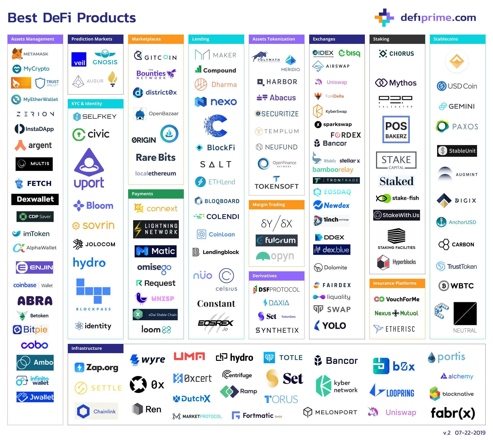
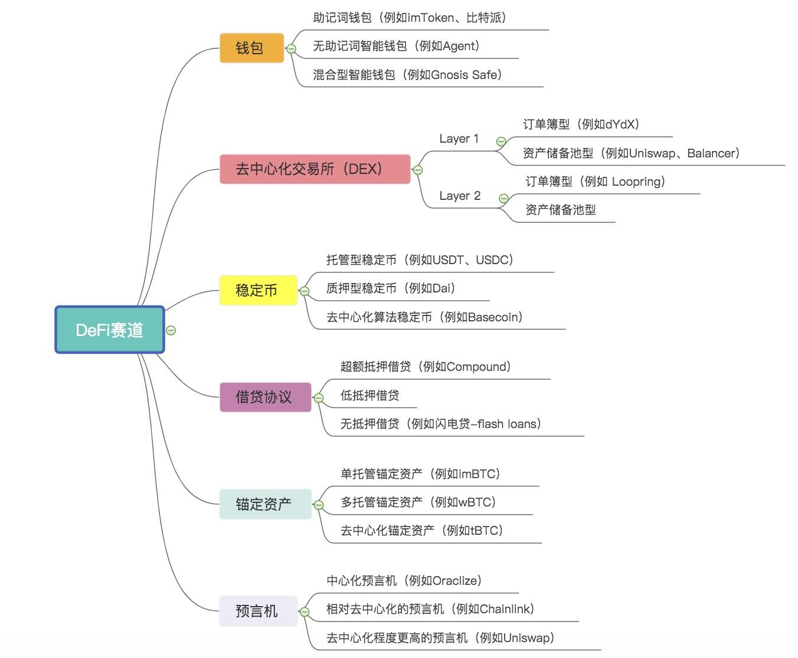

## 中心化金融(DeFi)

DeFi 全称：Decentralized Finance，即：去中心化金融。新闻媒体报道的“分布式金融、可编程金融” 都是指DeFi。DeFi 还包括：去中心化的金融衍生品及相关服务。

<!-- more -->

DeFi 的构想是：利用开源代码和分布式网络，将传统金融产品转变为无需信任、透明的协议，在不需要第三方中介的情况下，自动运行。从而满足当前金融系统的需求，取代传统的金融技术。

DeFi的愿景是：一切资产都可以被通证化。在全球开放的市场上，以任意颗粒度（金额），自由交易。

DeFi从一个想法就发展成为一个在短短几年内锁定超过10亿美元资金的行业，有人说本聪特也可能会欣赏以太坊的脱中心化金融(DeFi)创造的世界。


## DeFi特点

```
1、基于分布式账本和区块链技术
2、开源和互操作性强
3、资产由个人掌控
4、清结算都是通过智能合约实时完
5、无需信任、透明：通过对信任的最小化依赖，降低个体与个体间的信任成本
6、开放包容：无需准入许可和审查
```

对比传统金融服务，DeFi的优势在于：比如去中心化、透明度高、费用低等等。传统金融交易的最终结算层是（公司）实体而非代码，相关的应用程序也面临下架的风险，整个系统存在一定的风险。而DeFi的结算等操作都由智能合约按计划执行，消除了系统中各类交易风险。据世界银行统计，全球有20亿人没有银行账户或进入金融机构的资格。DeFi 提供的开放的金融工具可以让这20亿人，能随时随地访问去信任化的金融服务、自主控制个人财富和数据。DeFi 可以填补新兴市场金融的空白。

## DeFi协议简要介绍

```
0x——流动性协议，市场费用分配给ZRX代币持有者/流动性提供者。
Aave——货币市场协议，应计利息的一部分通过销毁的方式分配给LEND代币持有者
Augur——衍生品协议，预测市场产生的费用分配给参与的REP代币持有者
Bancor——流动性协议，部分交易费用分配给BNT流动性提供方
Compound——货币市场协议，应计利息分配到保险储备池中
dYdX——保证金交易的流动性协议，交易费用分配给母公司
Kyber——流动性协议，交易费用的一部分通过代币销毁或参与治理红利（Katalyst Upgrade）分配给KNC代币持有者
Maker——稳定币协议，未到期Dai产生的应计利息以代币销毁的方式分配给MKR持有者
Nexus Mutual——衍生品协议，通过出售保费（premiums）盈利
Synthetix——衍生品协议，交易费用分配给创造Synths的SNX stakers
Uniswap——流动性协议，交易费用分配给Uniswap流动性提供方
```




## DeFi趋势

### 以太坊继续领先

尽管其他DeFi和智能合约平台（包括币安链、Neo，Waves等）正在争抢一些市场份额，但以太坊区块链会继续在DeFi领域占据主导地位。除了比特币的闪电网络，每一个主要的DeFi协议都是建立在以太坊区块链上的，并且未来也会是这种趋势。尽管ETH有很大的波动性，DeFi中TVL的长期上升趋势仍然保持不变。DeFi中锁定的ETH量，被认为是一种关于采用情况的有用指标，而目前的值大约为历史高点的80%。此外，与DeFi相关的复杂交易在过去两年中增加了5倍。以太坊分析公司Covalent预测了一个“翻转”事件，即DeFi交易会超过简单的ETH传输交易。最后，由于以太坊区块链和Maker协议的可组合性，建立在两者之上的新解决方案，会赋予DeFi生态系统令人难以置信的价值。可组合性有助于创造“网络效应”，这是一种强大的现象，在这种现象下，商品或服务的价值会随着用户数量的增加而增长。正是由于网络效应的影响，Maker协议占到了DeFi中TVL的50%以上。迄今，已有600多个项目将Maker的Dai集成到基于协议构建的应用当中。

### 稳定币

随着交易员寻求链上的方式对冲和存储价值，人们对稳定币的需求会越来越大。Tether（USDT）是一个中心化的稳定币，其大部分供应都集中在以太坊，并保持了其数十亿美元的主导地位。与此同时，其他中心化的法币质押型稳定币正在逐渐普及，而它们都采用了ERC20代币的形式：

```
Circle的USD Coin
TrustToken的TrueUSD
Paxos
Gemini Dollars
```

虽然以太坊区块链本身是去中心化的，而且所有这些代币都可以公开转让和交易，但它们在存储价值这一方面却是中心化的。这是因为，它们是由那些将资金存入一家或多家银行账户的机构管理的，所以它们的价值可以被冻结甚至没收。仅仅使用去中心化的基础设施，并不能消除所有的单点故障。而Dai稳定币则是不同的，它对任何人都开放，也不受中心机构方的约束。一方面，人们对中心化的稳定币很感兴趣，一方面，Dai则是DeFi 领域中最重要的去中心化稳定币。由于其开放性、稳定性和对审查制度的抵制，Dai在拉丁美洲也获得了吸引力，并成为了抵御恶性通货膨胀的一种工具。

Dai在拉丁美洲越来越受欢迎，特别是在巴西、哥伦比亚、委内瑞拉和阿根廷。

### 新产品创新

最初的少数DeFi项目已被该领域的一波实验和创新所取代，这包括提供主流金融产品的去中心化版本。而Dai则是连接这些服务的金融“胶水”。Dai允许任何人获得美元的稳定性，并将其部署到整个DeFi世界。另一方面，Dai已被整合到更复杂的产品当中，包括：

## DeFi风险

3月份在新冠疫情影响下，美股市场暴跌，ETH价格因此在短时间内联动下跌超过50%，导致DeFi市场抵押品市值从10多亿美金暴跌至5亿美金附近。不过，这样的颓势并没持续太久。自3月中旬以来，ETH价格上涨超过133%，DeFi市场抵押品价值再度突破10亿美金，占ETH总供应量2.43%，超过270万ETH被锁定为DeFi抵押物。此外，被锁定在DeFi的比特币也创下历史新高，6月3日该数字跃升至4911，比一个月前的2230增加超过一倍。

### 合规风险

任何自由都必然有代价有边界，自由金融更是如此。美国 CFTC 新任主席 Heath Tarbert11 月时曾说过，ETH 从 POW 转 POS，CFTC 可能会根据 Howay 测试将 ETH 认定为证券，因为 POS 的 ETH 提供了永续收入，相对于 SEC，CFTC 一向对加密资产抱着更开放的态度，如果 CFTC 将 ETH 认定为证券，那 SEC 没有道理仍将 POS 的 ETH 当做商品。如此一来，所有以 ETH 作为基础资产的DeFi协议都有可能被美国监管机构认定为证券业务。这就意味着，所有面向美国客户提供DeFi服务的项目，以及为DeFi协议获客的平台都必须持牌经营，虽然照理说DeFi项目方仅仅是协议开发者，并不直接向客户提供服务，但是，现在大部分DeFi项目方都自己开发客户端，直接面向客户，风险不小。此外，还要考虑其他国家的监管部门是否会跟随美国。

### DeFi项目之间的依赖性

很多DeFi项目直接调用其他项目的功能性协议，很多DeFi项目的交易协议用的是0X，流动性用的是 Uniswap 协议，InstaDapp 直接就在 Maker 上面开 CDP，并导入 Compound，更不用说对于各类预言机协议的依赖，除了协议依赖，DeFi项目之间的资产依赖性更大，DAI 已经成为了DeFi的基础通货，Compound 的 CToken 也在一些DeFi 项目之间流通，随着各类DeFi资产在 DEX 上开始流通，DeFi 资产之间的依赖性合成会更为普遍。这种层层堆叠的协议和资产之间的紧密依赖的现象被称为DeFi乐高，这种现象对于DeFi早期快速发展起到了重要作用，使得加密资产能够在闭环的协议之间顺畅流通，也避免了没有意义的重复开发。DeFi 系统性风险可能通过恐慌传染和模仿性挤兑而产生。

### 区块链系统风险

DeFi已经成长为主导行业，这有充分的理由。它有望消除过时的官僚主义和烦人的银行业通常具有的特征。此外，DeFi正在创建一种更具包容性和透明性的财务系统，该系统使普通用户可以访问曾经只供少数用户使用的服务。
然而，DeFi系统不仅要对区块链行业，而且要对整个全球金融产生可扩展的影响，必须包含三个组件：

```
实时总结算：链上记录了每笔交易的记录。
高吞吐量：即使在拥塞期间，也能够处理比当前容量大得多的事务。
长期存储：记录财务活动对于风险管理，审计和其他财务功能至关重要。
```

即使DeFi 项目有比较完备的协议间和资产间防火墙，可以避免风险在系统内传导，但缺无法杜绝风险通过情绪通道，以参与者为媒介，在系统内传导。在传统金融世界中，当一家银行倒闭时，其他银行的储户可能认为他们的银行也将倒闭，所以便抽回他们的存款，这样便导致这些银行陷入流动性危机，以致最终也倒闭。这种现象在DeFi世界中同样存在，投资人的羊群心态很容易被恶意做空者利用，攻击者可能会为了做空目标DeFi代币的目的，集中攻击某个有漏洞的DeFi协议，击穿该DeFi的超额抵押生命线，造成集体恶意或者被动违约，风险不一定会通过协议通道和资产通道传导到其他 DeFi，但有可能通过情绪通道传导到其他 DeFi，造成群体性恐慌，发生挤兑或者DeFi资产的踩踏式抛售，最后，没有最终兜底方。

code is law，一切是代码说了算，而且还是去中心化的，导致结果就是不可能斩断风险传导的链条。虽然被称为去中心化央行的 Maker 可以通过全局清算机制为 CDP 债务兜底，但是，全局清算的结果是整个以 DAI 为基础的DeFi生态推倒重来，而且 Maker 的全局清算机制存在治理漏洞，有被劫持的可能。现存DeFi系统都可以因黑天鹅事件+蓄意攻击+协议漏洞，而导致无法兜底，整个建筑于上的DeFi生态就会像多米诺骨牌一样连锁倒下，直到债务被动出清，系统重启，开始新的轮回。

### 流动性风险

现在DeFi质押的资产和生成的资产规模都很小，交易机制要么是通过去中心化的资金池闪兑，类似 uniswap 的乘积守恒原理，要么就是去中心化的 orderbook 撮合，这种去中心化的交易基础设施可能会被大笔的恶意卖盘和买盘而操纵，造成交易滑点过大，使得交易价格失真，结果造成整体的市场价格失真，甚至会影响预言机的喂价机制，导致一些DeFi合约爆仓。如果无法控制，任由这种流动性枯竭的风险在DeFi协议之间传导的话，可能会触发之前介绍的系统性风险。而且，2020 年 ETH 要开始正式转 POS，会经历多个 Phase 和升级，每一次升级都是以太坊的惊险闯关，可能会被人利用，并结合恶意市场操纵手段，在DeFi市场兴风作浪。


### 内卷化风险

目前DeFi的用户主要是投机者，使用目的很多就是为了加杠杆炒币，甚至就是合约衍生品对赌，比如现在很火的 Synthtix。直接就是不需要交割的合约对赌，赤裸裸的赌博。
