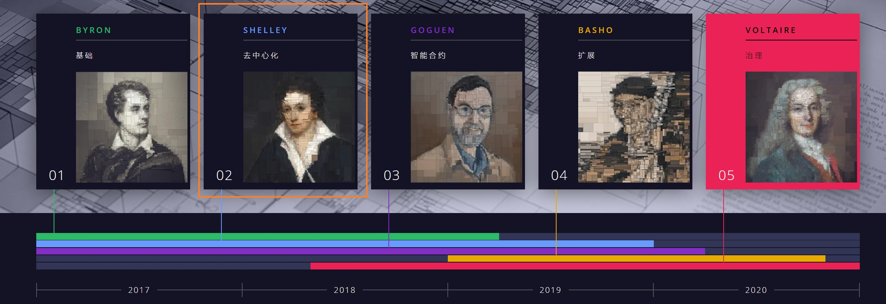

## Cardano简介

正如以太币是以太坊公链上的代币一样，ADA（艾达币）是Cardano（卡尔达诺）项目的代币。

<!-- more -->

Cardano是一个开创性的权益证明区块链网络，正在发展为具有多资产分类账和可验证智能合约的去中心化应用（DApp）开发平台。采用严格的高可信度形式化开发方法打造，旨在实现实际应用所需的可扩展性、互操作性和可持续性。旨在成为支撑未来经济发展的大规模任务关键型DApp的首选平台。

Cardano以同行评审的学术研究为基础，体现了开放性和透明性精神。支持Cardano的所有研究和技术规范都是公开发布的，并且所有Cardano开发活动都向公众开放。Cardano由一支全球专家团队设计，从分布式系统到编程语言和博弈理论，这些专家是各个领域的领导者；并由IOHK与合作伙伴共同开发。IOHK负责开发技术，Cardano Foundation负责监督开发和推广Cardano，而Emurgo则负责推动商业应用。在构建Cardano时，我们仅仅是监督者。当网络完全去中心化时，它将属于社区，社区将通过高级治理功能决定其未来

创始人查尔斯・霍斯金森（Charles Hoskinson）是一名数学家，他也是比特股联合始创人，还是以太坊的前CEO，有过与V神和BM的共事经历；另一位创始人，杰瑞米・伍德（Jeremy Wood）曾经是以太坊的高管。

总量：450 亿，现在流通 259 亿左右。 剩余部分靠出块来奖励来分发。

Cardano追求政府监管和个人隐私之间的平衡，是的另外一大特色。Cardano的愿景是通过融入监管，提供更大的金融包容性，为更多的人提供公平的金融服务。因此，在必要且用户自愿的情况下，可以针对性地选择提交KYC（身份验证）和AML（反洗钱）等信息，满足最基本的政府监管需求。

## CARDANO路线图

Cardano路线图是Cardano开发的摘要，由五个时期构成：Byron、Shelley、Goguen、Basho和Voltaire。每个时期都围绕着一系列功能展开，这些功能将在多个代码版本中提供。
虽然Cardano的各个时期将按顺序交付，但每个时期的工作可以并行展开，研究、原型设计和开发通常可以在不同的开发流程中同时进行。
每个时期的工作都在其专用页面上集中呈现，代表着多年的努力。在这里，您将找到相应时期的目标概述以及核心功能组件的描述、相关学术研究的链接、状态更新，甚至是实时代码提交。

对于Caedano来说，Shelley是最重要的一个阶段，此阶段上线后，Cardano才真正算一个PoS币种，可以进行后续的挖矿以及Staking操作。

## 特点

### 学术研究

与许多其他区块链不同，Cardano不依赖于从比特币或其他加密货币系统获得的技术基础。相反，IOHK与世界领先的基础研究学者合作，其中大部分人都接受过学术同行的评审，论文曾在顶级国际会议上展示。所有主要组件和功能领域的工作都从这样的研究开始，以确定可行的目标和实现目标的最佳方法。

### 原型设计

与研究团队合作的技术原型设计团队尝试实施研究中描述的功能和方法。目标是在学习有关实际技术和功能实施课程的同时将理论变为现实，从而制定用于构建实际产品的技术规范。

### 技术规范

在与原型设计的协作下，根据研究和原型设计结果制定和发布技术规范，列出预期的功能和行为。这些规范确保最终的代码实现符合研究的最初设想，实现所需的功能，并且在技术上可行。

### 形式化开发方法

IOHK工程师充分运用形式化开发方法：严格的数学技术，用来测试软件从而使其完全按照预期工作。这种通常只应用于高风险应用，如航空电子软件、航天飞行系统或大容量银行软件的严格标准，IOHK率先将它应用于区块链行业的Cardano开发。

### 函数式编程

IOHK采用函数式编程语言，最著名的是Haskell。与其他语言相比，函数式编程语言不易出现歧义和人为错误，而且从数学的角度来看，它们更易于测试和验证，从而有助于加强IOHK高可信度形式化的开发。

## 日本以太坊

达币ADA为什么大家会称它为“日本以太坊”呢？

艾达币ADA之所以会被大家称为日本以太坊是因为创造它的人曾经是以太坊开发团队的核心成员。官网上展示了五篇关于ADA核心架构和协议的顶级学术论文。ADA由三家公司和十几个技术团队共同支持维护，众筹时日本投资者占了将近90%，因此便被称为“日本以太坊”

