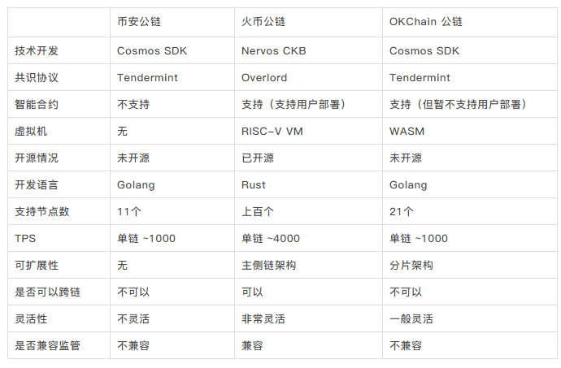

## 简介

Nervos于2018年一季度成立，同年7月完成2800万美元融资，投资方包括红杉、HashKey Capital、招银国际、经纬中国、九合创投、策源创投、峰瑞资本、imToken、星火矿池、币信、Polychain Capital、FBG Capital、1kx、1Confirmation等。

<!-- more -->

该团队核心成员包括谢晗剑、吕国宁、太檑以及王宁宁等。谢晗剑曾与以太坊创始人Vitalik Buterin共同开发Casper和Sharding，利用Ruby语言完整实现Ethereum；吕国宁与太檑分别为云币网核心开发者、CTO，前者曾任imToken联合创始人；王宁宁则为前Launch School及Teahour联合创始人，曾在IBM硅谷实验室从事大数据解决方案工作长达10年，带领Nervos团队设计出经济模型。

```
The Nervos Network is an open source public blockchain ecosystem and collection of protocols solving the biggest challenges facing blockchains like Bitcoin and Ethereum today.

The Nervos CKB (Common Knowledge Base) is the layer 1, proof of work public blockchain protocol of the Nervos Network. It allows any crypto-asset to be stored with the security, immutability and permissionless nature of Bitcoin while enabling smart contracts, layer 2 scaling and captures the total network value through its "store of value" crypto-economic design and native token, the CKByte.

```


## 特点

```
1. A Sustainable Multi-asset and Store of Value Blockchain
2. Maximally secure, permissionless and censorship-resistant
3. Solves the biggest challenges facing blockchains today
4. A layer 1, specifically built for layer 2 scaling solutions
5. Native token CKByte aligns the interests of all network users
6. Built for developers and native smart contract capabilities
```

## 双层架构

自2017年以来，人们逐渐认识到以比特币、以太坊为代表的公链在吞吐量上的局限是未来发展的瓶颈，这个问题将导致其很难在满足全球亿级规模用户应用的需求，因此从那时候开始，很多公链项目都开始寻求更快的速度以及新的区块生成方式，其中一部分是致力于增加节点处理能力、带宽，一部分提出分片技术等解决方案的设计。

但Nervos认为，仅仅提高节点处理速度和网络带宽存不仅会提高基础设施成本和降低去中心化程度，而且终究是无法承载上亿级用户的交互需求的，而分片的方案不仅在片与片之间协作存在问题，而且随着片增多，同样会出现交互障碍。

因此Nervos提出了双层网络架构的解决方案，由生成层即应用层来承载各类应用，而基础层即共识层只用作验证。

举例来说，如果我们把把区块链看作一列开在环形轨道上的火车，那用户就是住在火车上的乘客。

（1）比特币的火车通道很窄，无法让所有乘客自由行动，同一时间只有少数乘客可以起身走动、上厕所、去通道口抽烟之类，其他人要排队，人很多时火车基本无法正常通行，所以比特币只能给乘坐最必要的一部分人；

（2）EOS的解决方案是把车体加得很宽，这样同一时间能有非常多的乘客可以活动，甚至空间足够到可以摆个桌打麻将。但问题是车体不能无限加宽，否则车身在运行中就有撕裂的可能，这样如果将来乘车的人特别多，最后还是会人挤人，出现同样的拥堵问题；

（3）分片的解决方案是，同时4个车厢并排运行，这样每个车厢里都可以容纳很多人，就可以有更多的人乘车了，车厢之间设置了通道，人们可以通过通道在不同车厢之间走动。但是由于不同车厢的状况不一样，人们换车厢时就要安检，还要按照乘务安排规划合理使用通道，这在人多的时候又会造成复杂出错的情况，如果乘客继续增多的话，并列的车厢要变成8节、16节，此时又会由于换车人数在通道处几何级数增加导致出现拥堵。

（4）Nervos的设计是，乘客都下车去，在不同车站外的空地里随便行动，只是把每一站有多少人、需要吃什么、需要什么物资做个报表，送火车上登记就行了，火车只做登记和发物资，不用来载乘客，这样乘客就可以扩展到非常多了，火车也不会不堪重负。

（5）闪电网络其实就是这种“下车”的方案，闪电网络存在的问题是，需要在火车上开一个送登记信息的窗口，但是比特币这列火车太昂贵了，大部分车上的人害怕对车体进行改造会破坏掉火车，谁也担不起车厢出现不可逆损害的责任，于是火车方面迟迟不肯下增加这个窗口的改造决定。

Nervos CKB 是 Layer1 主要负责验证，保证公链的安全性和去中心化，只处理和存储达成共识的状态。而 Layer2 负责计算和承载业务逻辑，保证高性能和多种应用场景的实现，然后通过一套协议来将 Layer2 和 Layer1 对接锚定，通过这种双层理念实现高性能去中心化和安全性。在共识机制的选择上，Nervos 选择前期采用 PoW 共识，PoW 是目前已经被时间检验的安全的共识机制，而且相对来说也更为公平。

## 生成和验证分离

Nervos的双层结构将区块链上状态的生成和验证两个步骤分开，生成层可以有多种生成方式，只有验证才在共识层进行，在生成层上可以用非共识层的适合自身情况的共识算法，只有在需要在验证层记录时才将状态提交去验证，这就实现了很高的灵活性和扩展性。

还是以上面的火车为例，为了确保所有乘客都有座位，没有乘客跳车或是混进来别的人，火车要这样跟踪乘客信息：

```
46座的乘客离开座位了，问他去哪。
乘客要上卫生间，允许上卫生间。
他走向了车厢后部，确实是去上卫生间了。
乘客出来了，看下是不是进去的那位乘客。
乘客回到座位，查验车票确实是这个座位的乘客。
```

这种全程在车上（链上）生成和验证状态的方式不仅占用了相当多的乘务资源、影响了乘客的活动效率，还限制了乘客的行为-只能做车厢允许的事。

Nervos的方案是，给每一站的乘客群配备一个面部识别系统，乘客下车后想干什么干什么，可以不受座位号限制建一排小房子分开居住，可以建个社区按照自己喜欢的方式登记信息，可以租个大巴去游玩，可以随意换掉衣服等等，他们需要做的只是在需要火车给补给时，让面部识别系统扫过所有人，与车上登记信息进行核对，确认没有丢掉人、没有混进来别人后，火车方就可以认定这些就是这站的所有人无误，于是就可以给这些人发盒饭了。

## 经济模型

这里我用将公链类比为城市，解释下不同类型区块链的经济模式的区别。

首先我先为这种类比做必要的前提假设:

```
A）将公链视为一个封闭的城市。
B）交易是进出城市运货的道路。
C）矿工是保护道路的守卫。
D）守卫的力量和雇佣数量成正比。
E）当守卫的投入远低于城市的内货品的价值时，强盗就有动机发动攻击抢劫货物。
F）只有攻击成本远小于攻击获益时，强盗才会发动攻击。
```

（1）比特币
比特币的城市可以视为一个金库，守卫的收入来自城市内建设基金（挖矿收入）和道路运送资金的过路费（矿工费）。目前这座城市的仓储位置有限（BTC总量有限），为了竞拍有限的安全仓库，越来越大额的资金被源源不断送入，当有越来越高额的资金流入且道路资源也十分有限时，竞争路权支付的过路费就会逐渐增多，守卫的收入就随之提升，这会让更多的守卫前来保卫道路，从而让城市中仓库更安全，而更安全的仓库会让更多资金放心地进去竞标存储空间，从而让守卫获得更多资金城市更安全。简言之，资金的流入会传导到资金的安全上，促使资金更安全，从而更有利于资金流入，这就是储值模型。

比特币的问题是，守卫的工资是基金+过路费，但基金是每4年越分越少的，若干年后基金剩余不多时守卫就要逐渐只依靠过路费来获得收入，当有一天城市内储存的资金非常多、竞争仓储位需要非常高资金时，道路却还是有限的，此时竞争路权支付的过路费就可能高到了绝大多数商户都无法承受的地步，以致于他们尽量不使用道路进出资金，此时可能只有少数大商贾能支付过路费，这些过路费又支持不了城市所需安全等级的守卫费用，这就将导致守卫收入下降并纷纷离开，城市的安全水平随之下降，当守卫的力量低到一定程度、消灭守卫力量的花费远低于城中财富时，强盗就有充分的动机去雇佣更多的军队吞掉守卫，从而夺走城市里的资金。

这是比特币的一个远期的危机点，应对方案是逐步扩充道路宽度（扩容）或是加快运送货物速度（减少区块确认时间），但不能像BSV城那样一次性扩大道路，那将导致路随便用根本不需要竞争，于是过路费会锐减而守卫失去绝大部分收入后会纷纷退出。

比特城现存的忧患是由于城市中存储的资金太多，商人们害怕改造道路会将现有的安宁被打破，出现不可控的威胁资金安全的问题，所以不希望城市有任何哪怕一点的变动，于是倾向于阻止城市改建，这导致比特币城的这个问题始终像幽灵一样潜伏者。

（2） 以太坊
以太坊是城市中有无数的仓库（随意建合约），仓库都不收费。但当地政府在道路边上设了一个税务站（ETH本身），任何货物进出都要用当地货币ETH交一点税。至于每个仓库里装什么货，怎么个装法，政府都不关心，只要进出交税就行了，守卫的收入用这些税金支付。

以太坊的问题是，城中仓库中可能价值连城的货物全部依赖于道路的守卫，但守卫从中不会获得一分钱的收益，只有政府发的工资收入，守卫的强度只和政府有关。也就是说，城中财富的积累并不会同步让守卫力量增加，守卫是否有力完全取决于当地政府的财政状况（ETH本身是否值钱）。这样，当城中某些仓库的货物十分十分贵重，贵重到远超过当地政府雇佣的守卫力量时，或当地政府破产（ETH大跌），守卫力量大幅削弱时，强盗就完全有理由扩充力量、消灭守卫，去夺走城中某个仓库的价值连城的货物。

（3）POS
这个城市中不存在武器，所以不需要守卫。由城里仓库的商家分别出资维护道路，大户出得多，小户出得少，因为道路如果不通，所有人都会受损，损失最大的是大商户，所以理论上所有人不会和自己的利益过不去，就一定会努力维护道路。

POS的逻辑建立在如果发生问题就会不可收拾，所以就不会发生问题，但问题是决定权在大户手上，而大户并不是总可靠的，比如大户会越来越有钱，当他力量足够雄厚，雄厚到即使别人拒绝出资，他自己也能维护进出道路时，他就可以把道路改成对自己有利；比如大户出城被绑架了，强盗可以抢来钥匙进入大户账户来破坏道路，但若是比特币城，就算大户被劫持，想破坏道路仍然需要过守卫这一关；除此外POS城还有很多潜在的问题，这都困扰着、阻碍着这类城市的广泛建设。

（4）DPOS
EOS城的道路是免费的，城中公民只要先有当地货币，就可以根据货币量获得有相匹配的仓储与道路权。维护道路由21个长老（节点）负责，所有道路相关决定需要14个长老同意才能通过。每年对城中所有商户收税来给这21个长老做奖励，理论上因为长老不会和钱过不去，所以他们会努力维护道路。

EOS的问题是，虽然商户的繁荣可能会促进当地货币的需求，让当地货币总市值提升，但存储的货物价值并不和商户持有的当地货币相关。现在城市正在兴建，仓储货物还不是很值钱，运输收入远不如从持币中课税的钱多，但如果当地货币不升值，将来城市繁荣了，其中的一些仓库中的财产远超出单个长老的年收入，这些长老会不会不满足于这点收入，而是联合起来去搞一下这个大户呢？

（5）Nervos
Nervos的城市也是有很多地皮（即白皮书中的Cell），且地皮数量是有限的，但这地皮不是像比特城一样只能建仓库存储资金，而是可以建大楼去扩展用途。同时并不像以太城那样一个仓库可以放无限的东西，而是越大的商业规模需要的仓库越多。

这个城市也是由守卫来守护道路（POW），守卫的收入来自城市建设基金（挖矿）、过路费（矿工费）和房产税（增发），每一个仓库都要交房产税。

理论上，越多的商户进入，经济越繁荣，交的过路费越多，这就让守卫的力量更强。但和比特城不一样的是，比特城的商业发达与守卫毫无关系，商人即使在城中有巨额产业，但只要不进出城市运输，守卫就没有收入，而Nervos城中，在城市建设资金用尽后，守卫不是只有过路费收入，而是还有和房产税挂钩的收入，商人若希望在城中存储和收获财富，就要获得更多地皮用于经营，这样就需要交房产税，从而让守卫获得更高收入，守卫力量因此而增强，会给商人们的产业更好的保护，这就解决了比特城的潜在问题。

同时还要解决的问题是，一些居民买了地皮，但并没有进行商业开发，如果还要收税的话，会让很多居民失去购买地皮的意愿，这是很多通胀类城市面临的问题。对此Nervos城的方案是设置一个房产中心，居民可以在其中抵押地皮，这样就不用每年交房产税。也就是说，有钱赚的人才交税，没钱赚的不用交税。

并且，如果商业极度发达，地皮供不应求时，Nervos城还允许城中居民建立私人的地皮租赁中心，可以在其中将地皮直接租给有需求的商户，这样有地产的人不但不用交税，还可能从中赚得收入。


## 火币公链

火币公链是由火币集团和 Nervos Foundation 联合开发的高性能公链。它基于 Muta、CKB-VM、Overlord、Nervos-p2p 等开源组件深度定制，并面向金融应用的场景进行了扩展与优化，是一条为金融应用设计的金融公链。


### 共识算法

火币公链采用的是 Nervos 自主研发的 Overlord 共识算法，是改进版的 BFT 共识算法，能够支持上百个共识节点，满足每秒数千笔的交易处理能力，交易延迟在秒级别。为了适用金融场景，Overlord 是一个确定性共识，也就是说所有上链的交易不支持回滚。Overlord 共识算法还采用自适应流水线算法提高交易吞吐量；采用聚合签名技术降低共识算法延迟。

Overlord 相对于 Tendermint 的主要有以下三个方面改进：

将门限签名技术，应用到 Tendermint 中，使共识的消息复杂度从 O(n^2) 降到 O(n)，从而能够支持更多的共识节点；
采用链式确认，在共识过程中，区块校验和投票过程可以并行；
彻底解耦状态计算和共识，出块无需等待。

### 应用开发

火币公链采用的是同 CKB 一样的基于开源 RISC-V 指令集的虚拟机，是一个基于账户模型的 CKB-VM 实现编译器并且硬件友好的高性能智能合约虚拟机。

开发者也可以通过智能合约开发去中心化应用，现在支持 C 语言编写合约，可以动态地部署到链上。目前 RISC-V 社区中已经有诸多开发者构建了 Ruby、Python、TypeScript、Rust 等解释器，在未来火币公链也将会支持更多的合约编程语言，进一步完善开发者的体验。

在资产层面，目前用户已经可以在火币公链测试网上发行自定义资产，允许用户在公链的底层创建原生代币并直接定义 token 的标识和相关信息，且能够直接进行编程和操作，当前支持发行类 ERC20 的资产，后面还将支持更多类型的资产。而且用户发行的资产属于一等资产类型，对用户资产采用内置服务管理，大幅提高安全性、通用性并降低复杂度。

### 跨链

采用 FCA 实例化的用户自定义资产，具备原生跨链功能，火币公链、Nervos CKB 和基于火币公链或 Muta 技术开发的侧链互相之间，可以直接采用这种跨链协议实现去中心化跨链。

我们采用去中心化 relay 的方式传递跨链证明，relayer 可以是侧链 validator，也可以是其他第三方用户。侧链之间可以不依赖火币公链或 Nervos CKB 实现直接的跨链功能。