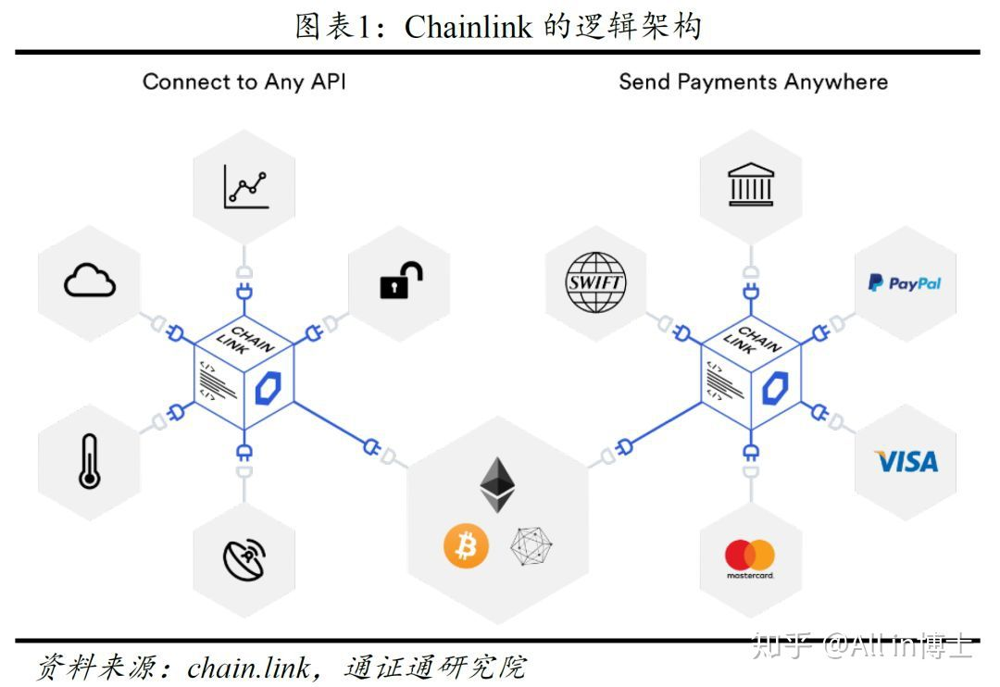
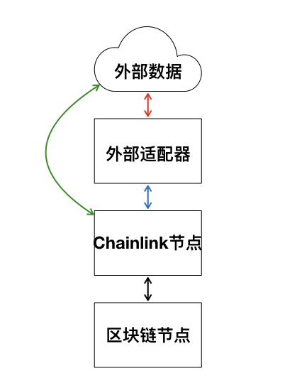
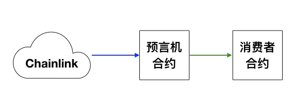

## 预言机

预言机的英文为Oracle，Oracle这个单词是什么意思，下面是我在vocabulary.com上查到的Oracle的含义：

Back in ancient times, an oracle was someone who offered advice or a prophecy thought to have come directly from a divine source. In modern usage, any good source of information can be called an oracle.

<!-- more -->

中文的大概意思是：在古代，oracle是一个提出建议或预言的人，他的建议或预言被认为是直接来自于神。在现代用法中，任何好的信息来源都可以称为oracle。

计算机领域内的预言机一词，最早是图灵提出的。图灵在图灵机（Turing Machine）的基础上，加入了一个称为预言者（oracle）的黑盒，组成了预言机（Oracle Machine）。所谓预言者，是一个可以回答特定问题集合的实体。即它可以向图灵机系统内部输入信息，帮助图灵机完成运算。以太坊的智能合约是“图灵完备（Turing Complete）”的，某种意义上可以看做一个图灵机，所以以太坊的设计者借鉴这个概念，把向“图灵完备的智能合约”这个图灵机输入信息的也被称为预言机oracle。所以说“预言机”这个名字并不是区块链技术领域内的独创概念，它来源于非常早期的计算机抽象设计，在密码学等领域内也都有类似的概念。

## ChainLink

长久以来，区块链上运行的智能合约无法直接的与外部系统进行交流，这一瓶颈限制了智能合约应用场景。

如今，我们可以通过引入预言机（Oracle）的功能来解决这一问题，预言机可以为智能合约提供与外部世界的连接性。但是目前的预言机都是中心化的服务，这会给使用中心化预言机服务的智能合约带来单点故障的风险，使得智能合约的去中心化特性变得毫无意义。

为了解决这个问题，Chainlink开发了首个去中心化预言机项目，来向智能合约提供外部数据。有了这个武器，智能合约的安全性和确定性，与真实世界中发生的各类事件联系了起来。Chainlink将为您的智能合约提供获取任意外部API数据的能力。本文档列出了所有与之相关的信息。

Chainlink利用非中心化的预言机初步实现了区块链技术与现实世界的关联。第一，Chainlink提供了一种非中心化的预言机，任何人都可以运行他们的预言机软件并参与网络；第二，预言机可以支持公共数据源和私有数据源；第三，Chainlink构建了预言机的声誉系统，以便用户了解所使用的预言机的质量；第四，Chainlink制定了抵押制度，具有明确的激励机制。当预言机接受数据请求时，它会提供部分通证作为抵押品，一旦预言机提供了错误的数据，那么它就会丧失这些通证并被降低声誉值。

## Chainlink节点模型

在上图中我们看到四个模块：

- 外部数据
- 外部适配器
- Chainlink节点
- 区块链节点

这些模块代表了Chainlink架构的主要组成部分。下面我们将逐个介绍这些模块以及它们之间的关系。请注意，尽管外部适配器、Chainlink节点及区块链节点在图中是单独的模块，但是它们可能位于同一个项目资源中。

### 外部数据

外部数据代表了其他区块链、网络以及任何想要读写的数据的接口，不管是公开的还是私有的。

### 外部适配器

外部适配器用于Chainlink核心适配器之外的数据适配功能。外部适配器可以用任意语言来编写，可以作为单独的服务运行，接收和回复JSON类型的数据。

图中外部适配器方框上红色的箭头表示适配器和外部数据的连接性。连接可能需要外部数据提供者授权。数据提供者的证书可以保存在适配器中，而不需要Chainlink节点来保存，从而给予节点运营人员对于证书存储的安全性的全面掌控。Chainlink节点会传递给外部适配器一个"id"字段，这个"id"就是任务运行ID，外部适配器需要在回复中包含这个字段。

### Chainlink节点

Chainlink节点处理任务、单一任务、任务进度，以及向区块链提交事务。Chainlink节点运行一组特定顺序的进程，并包含许多核心适配器，用于支持读取和处理数据和写入区块链。Chainlink节点持有keystore，用于签署事务。
绿色的箭头代表了与外部数据的连接性，这个连接不需要任何形式的授权。不需要任何外部适配器，Chainlink就可以读取开发的API，获取它们返回的数据，然后提交到区块链上。
蓝色的箭头代表了与外部适配器的连接性。
节点运营人员必须为每个外部适配器提供桥接器，适配器可以与Chainlink节点分别运行在不同的系统上。

### 区块链节点

区块链节点监听区块链状态，为Chainlink节点提供特定的事件来启动任务。区块链节点也可以帮助Chainlink节点签署和广播事务，将数据返回给消费者合约。如果与区块链节点连接中断，Chainlink节点会持续不断的进行重连尝试，在连接恢复之前，监听器会错过这期间的区块。
黑色的箭头代表了Chainlink节点和区块链节点的连接性。Chainlink节点会订阅区块事件，通过发布事务提交回复。

## Chainlink请求模型

### 创建请求

当创建一个Chainlink请求时，您的请求者合约在链上向Oracle（预言机）合约发送一个事务，下图中通过红色的箭头表示。事务通过transferAndCall方法发送LINK代币，并携带有请求相关的数据。Oracle合约跟踪来自请求者的LINK余额，在通过transferAndCall方法接收到LINK时，发出相关事件(event)，该事件会通知链下的Chainlink网络，一个新的请求已经启动，下图中通过黑色的箭头表示。Chainlink节点会监听和处理区块链上的这些事件。

### 收取结果

收到请求后，Chainlink就会去完成请求的相关工作，并将结果返回给Oracle合约，下图中通过蓝色的箭头表示。Oracle合约将会想节点运营方支付LINK，并将结果返回给消费者合约，即下图中的绿色箭头。

