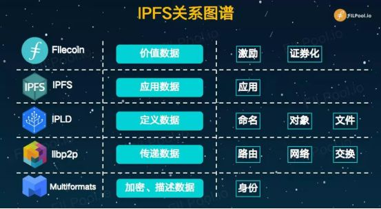
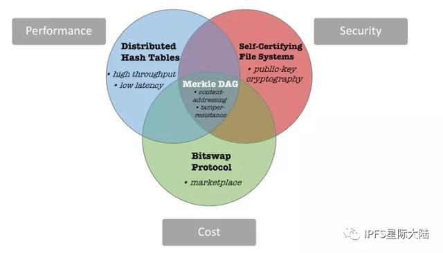

## IPFS简介


IPFS由Juan Benet（胡安·贝内特）在2014年5月份发起。2015年，他创建 的项目“IPFS”在Y Combinator创业孵化竞赛中获奖并得到了天使投资，同时成立了协议实验室。
IPFS本质上是一种内容可寻址、版本化、点对点超媒体的分布式存储、传输协议，目标是补充甚至取代过去20年里使用的超文本媒体传输协议（HTTP），希望构建更快、更安全、更自由的互联网时代。

<!-- more -->

星际文件系统是一种点对点的分布式文件系统， 旨在连接所有有相同的文件系统的计算机设备。在某些方面， IPFS类似于web, 但web 是中心化的，而IPFS是一个单一的Bittorrent 群集， 用git 仓库分布式存储。换句话说， IPFS 提供了高吞吐量的内容寻址块存储模型， 具有内容寻址的超链接。这形成了一个广义的Merkle DAG 数据结构，可以用这个数据结构构建版本文件系统，区块链，甚至是永久性网站。IPFS 结合了分布式哈希表，带有激励机制的块交换和自我认证命名空间。IPFS 没有单故障点， 节点不需要相互信任。

## 关系图谱



### 身份层和路由层

身份和路由层可以一起解释，对等节点身份信息的生成以及路由规则是通过Kademlia协议生成制定，KAD协议实质是构建了一个分布式松散Hash表（distributed hash table），简称DHT，每个加入这个DHT网络的人都要生成自己的身份信息，然后才能通过这个身份信息去负责存储这个网络里的资源信息和其他成员的联系信息。
如同微信名片分享，在无法通过直接搜索微信号的情况下，如果你要找一个人，可以通过有这个人联系方式的朋友分享名片来建立联系。

### 网络层

网络层是IPFS技术的核心层，使用的lib2p可以支持任意传输层协议。ICE NAT traversal框架整合STUN、TURN和其他类型的NAT协议，该框架可以让客户端利用各种NAT方式打通网络，从而完成NAT通信，这对于IPFS的p2p网络非常重要。

### 交换层

交换层是类似迅雷、电驴这样的BT工具，IPFS团队把BitTorrent进行了创新，叫作Bitswap，它增加了信用和帐单体系来激励节点去分享，用户在发送给其他节点数据可以增加信用值，从其他节点接受数据降低信用值。如果用户只去接收数据而不分享数据，信用分会越来越低而被其他节点忽略掉。

### 对象层和文件层

对象层和文件层也可以结合来谈，他们共同管理IPFS上80%的数据结构。大部分数据对象都是以Merkle DAG的结构存在，这为内容寻址和数据去重提供了便利；文件层是一个新的数据结构，和DAG并列，采用Git一样的数据结构来支持版本快照。

### 命名层

具有自我验证的特性（当其他用户获取该对象时，使用指纹公钥进行验签，即验证所用的公钥是否与NodeId匹配，这验证了用户发布对象的真实性，同时也获取到了可变状态），并且加入了IPNS这个巧妙的设计来使得加密后的DAG对象名可定义，增强可阅读性。

### 应用层

IPFS核心价值就在于上面运行的应用程序，可以利用它类似CDN的功能，在成本很低的带宽下，去获得想要的数据，从而提升整个应用程序的效率。

## FileCoin价值

### 诞生使命

随着科技技术的进步,每天都有大量的数据生成，而且数据每年正在以几何级数增长。
第五代通信技术即将大规模应用,这会极大促进物联网的快速发展与成熟。世界正在被数据化。数据存储和传输的成本必然成为制约技术发展的一个瓶颈，Filecoin技术的诞生就是为了解决数据的存储和传输问题的，可以大幅度降低数据存储和传输的成本的同时，还提升了数据存储的安全性。

### 节约能源

算力是区块链系统中计算矿工贡献的主要手段。传统的区块链算力与矿机的计算速度严格呈正相关,计算速度越高,算力就越大,矿工收益也越高。比特币挖矿主要依靠的是算力，挖矿的过程就是运算哈希算法并得到结果的过程。这带来了两个问题：计算资源的浪费和能源的大量消耗。矿工在该种激励方式下必须投入更多的算力来获取更多收益。它依赖的是CPU、GPU和ASIC这类高端芯片。Filecoin协议在设计之初就考虑了这两个问题,从根本上规避了以往区块链的弊端。Filecoin挖矿不需要进行大量的运算，耗电小，但需要你有优质的网络环境和硬盘性能。Filecoin协议取而代之的是激励矿工投入更多的存储设备和网络带宽,这也为提升 Filecoin系统价值奠定了基础。

### 共享经济

Filecoin项目的本质是共享经济,为全球更加有效地利用存储设备和网络、降低数据的存储和传输成本带来了可能。
存储共享
在这个世界上存在着大量的没有有效利用的存储设备，如移动硬盘,如果能将这些处于闲置状态的存储设备有效利用起来,会大大降低数据的存储成本。
宽带共享
与存储设备一样,在目前的互联网技术框架下,大量的带宽同样也没有得到有效利用或者价值没有得到更公平的分配。
Filecoin协议可以将这部分价值利用起来,重新平衡网络的利用,有效降低用户的网络使用成本。

### 技术进步

从比特币和以太坊的成功经验来看,区块链在推动技术进步上面有着巨大影响力(例如,比特币推动芯片行业的发展), Filecoin项目也将推动两个行业的快速发展—存储设备制造业和网络带宽的扩容。
或许在不久的将来我们能够在Filecoin项目的推动下享受到更加廉价和性能更加强大的网络。

### 区块链基础设施

区块链行业目前处在一个基础设施承载力严重不足、生态配套非常不完善，下游场景和应用却过度热情、亟待对接、着急上马的阶段，这也是前两年整个币链矿圈过度泡沫化的主要原因。其实历史一直在重复，2000年左右，世纪之交的互联网泡沫也是这么发生的，那时候的泡沫比现在区块链的泡沫更大。Filecoin作为去中心化存储项目，既是最基础的存储应用、又是基础设施，还是生态配套。

### 数据的确权和可信

区块链最有前途的应用是智能合约，智能合约不能闭环落地的关键是触发事件，触发事件预言机的要害在于数据的可获得性和数据源的公信力，Filecoin去中心的、不可篡改的特性，有希望成为预言机、权威存证、公信力数据，最好的存储仓库和数据来源。数据是一个公司最核心的资产之一，数据的可信和确权，往大处讲可推动国家的产业创新与变革，往小处着眼，可以改变普通百姓的生活习惯。未来，一旦数据的确权和可信真正落地，我们产生的数据将真正属于自己。

## IPFS如何工作

IPFS是基于文件内容进行寻址的。IPFS为每一个文件分配一个独一无二的哈希值（文件指纹：根据文件的内容进行创建），即使是两个文件内容只有1个比特的不同，其哈希值也是不相同的。所以IPFS是基于文件内容进行寻址，而不像传统的HTTP协议基于域名寻址。IPFS为文件建立文件版本管理。IPFS在整个网络范围内去掉重复的文件，并且为文件建立版本管理，也就是说，每一个文件的变更历史都将被记录，可以很容易回到文件的历史版本查看数据。
根据哈希值进行文件查询。当查询文件的时候，IPFS网络根据文件的哈希值（全网唯一）进行查找。由于每个文件的哈希值全网唯一，所以查询将很容易进行。每个节点除了存储自己需要的数据，还存储了一张哈希表，用来记录文件存储所在的位置，用来进行文件的查询、下载。

### 关键组件

```
  使用分布式哈希表，节点无需中央协调即可存储和共享数据
  IPNS允许使用公共密钥加密技术对交换的数据立即进行预身份验证和验证。
  Merkle DAG可实现唯一标识，防篡改和永久存储的数据
  可以通过版本控制系统访问已编辑数据的过去版本
```



## IPFS和FileCoin

IPFS-非区块链项目。IPFS项目主要解决的是数据分发和定位问题，与在线互联网技术领域处于垄断地位的HTTP协议类似。与HTTP协议不同的是，HTTP协议数据为点对点传输，而IPFS的数据为多点传输。
Filecoin-区块链项目。Filecoin是一个基于区块链的分布式存储协议， 用来解决数据的存储问题，降低数据存储和使用成本。

互补协议-IPFS协议与Filecoin协议是一对互补协议。Filecoin是运行在IPFS上面的一个激励层。基于IPFS的应用有着巨大的数据存储和节点数量需求，IPFS作为P2P网络，节点越多下载越快。如果没有激励机制，没有人会愿意无偿贡献如此众多的节点和存储。而Filecoin矿工在经济的激励下可以为IPFS网络贡献巨量的节点，同IPFS带来了一个巨大的分布式存储空间，可供基于IPFS的应用使用，这同时解决了IFPS网络的低成本、高性能存储问题。
