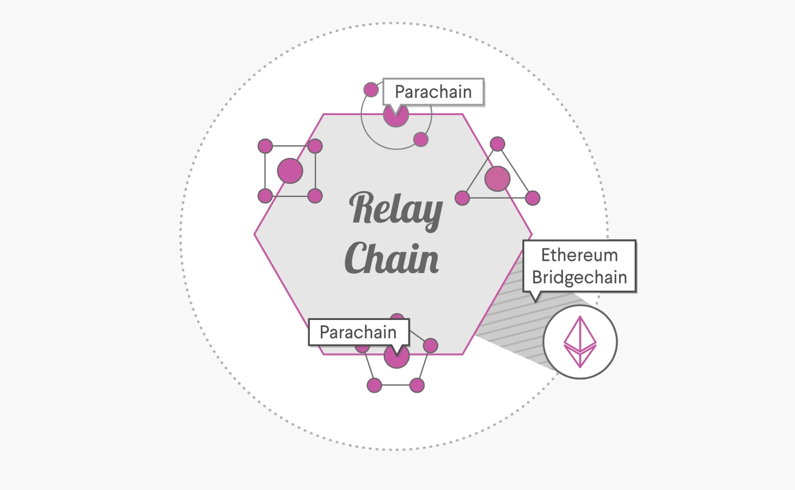
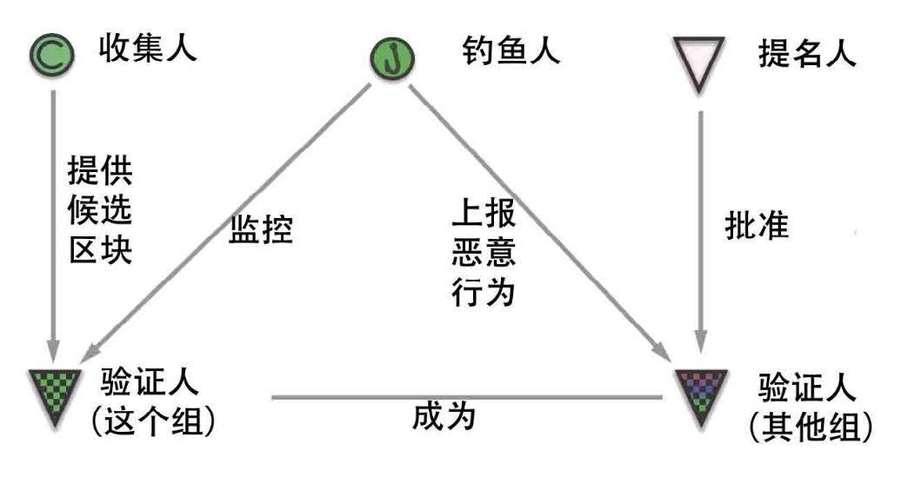

## 基本介绍

Polkadot 是一种异构多链技术，主要由中继链、平行链和转接桥组成。它的建立是为了连接公有链、联盟链、私有链以及未来可能出现在 web3.0 生态系统中的所有技术。它希望使各个独立的区块链网络都能够通过 Polkadot 的中继链实现信息的交换和无需信任的交易。旨在实现区块链一直在努力实现的 3 个目标：互操作性、可扩展性、共享安全性。

<!-- more -->

Polkadot 也是一个协议，它允许独立的区块链之间互相交换信息。Polkadot 是一种链间区块链协议（inter-chain blockchain protocol），它与传统互联网的消息传输协议不同（例如 TCP/IP 协议），Polkadot 还会验证各个链之间在进行消息传输时的消息顺序以及消息的有效性。

Polkadot创始人是Gavin Wood，他是以太坊联合创始人。这可能是Polkadot早期最重要的宣传点。Gavin Wood被誉为“以太坊的隐形大脑”。

“Vitalik (V神)的白皮书让以太坊项目吸引了1800 万美元的融资，可真正实现以太坊技术的，是 Gavin Wood。在 2014 年 4 月份，他写出了被称为以太坊技术圣经的「以太坊黄皮书」，明确了虚拟机的概念，得以让智能合约顺利运行，这也是现在各个链上虚拟机的鼻祖。

以太坊的开发语言 Solidity 也是 Gavin 一手创建的，这种语言专门面向智能合约，现在已经成为了以太坊开发者的必备语言。”

## 愿景

Polkadot 希望能够连接各个区块链网络，主要关注在解决以下三个层面的问题：

### 互操作性

当前区块链的生态中，各个区块链网络之间是孤立存在的，它们之间没有任何通信以及互操作的可能性。在未来区块链的世界中也将会存在各种为了满足于某些特定需求的区块链，但若它们仍然彼此孤立将会非常不利于区块链生态的发展。为了能够打破这个壁垒，拓展区块链网络之间的边界，区块链之间的互操作性是一个必须要解决的问题。
而 Polkadot 的设计目的之一就是让区块链上的 DApp 和智能合约可以无缝地与其他链上的数据或资产进行交易。

### 可拓展性

在当前大多数区块链中，交易都是在节点中一个一个的处理，因此当交易量逐渐增多的时候，由于网络的限制很容易遇到性能上的瓶颈。
而 Polkadot 提供了可以运行多个平行链的能力，每个平行链可以并行处理多笔交易，在这种情况下 Polkadot 网络就相当于获得无限的可拓展性。在测试中，Polkadot 网络中的一条平行链每秒大约可以处理 1000 笔交易，通过平行链的创建，就可以成倍的增加每秒交易的数量，从而使 Polkadot 网络具有较高的性能。

### 共享安全性

基于 PoW 共识的区块链之间存在算力竞争，这样不仅会造成算力等资源的浪费，且一些算力较少的区块链还会非常容易受到攻击，因此各个区块链具有的安全性是不相同的。
且若各个区块链之间想要互相通信的话，还会由于各个区块链之间的算力不同导致了各个区块链之间不能平等的信任对方，这就比较不利于资产等信息的跨链通信。
在 Polkadot 网络中，将由中继链整体负责整个网络的安全，每个加入 Polkadot 网络中的平行链之间都具有同等程度的安全性，因此它们之间在进行跨链通信时可以充分信任对方的平行链。且由于 Polkadot 将网络的安全都集中在中继链上，因此，要想攻击整个 Polkadot 网络的难度是非常大的。

### 架构

Polkadot 网络的整体架构，从中我们可以看到中继链（Relay chain）处于网络的中心位置，它会处理网络中整体的共识和安全性；还有许多平行链（Parachain）通过连接中继链以接入 Polkadot 网络中；同时还可以看到在该图的下方有一个转接桥（bridge），这也是 Polkadot 网络中连接了独立区块链（例如：以太坊）的方式。此外还可以看到许多的参与者，例如：收集人（Collator）、验证人（Validator）、钓鱼人（Fisherman）等。那么接下来我们就分别介绍一下在 Polkadot 网络中的主要链角色和不同的参与者。‌

### 中继链（Relay Chain）

中继链是 Polkadot 网络的中心链，它为整个网络提供了统一的共识和安全性保障。
Polkadot 网络中所有的验证人都会在中继链上质押 DOT 代币，从而参与 Polkadot 网络治理。
由于在 Polkadot 网络中大多数业务相关的操作都会由各个平行链来实现，那么在中继链上就只会发生和网络治理、平行链拍卖等少量的交易类型，因此中继链上的交易手续费通常会高于平行链上的交易手续费。

### 平行链（Parachain）

整个 Polkadot 网络中大部分计算工作都将委托给各个平行链进行处理，平行链会负责具体业务场景的实现。Polkadot 对平行链的功能不作任何限制，平行链可以作为应用链实现任何应用场景，但它们自身却不具备区块的共识能力，它们将共识的职责渡让给了中继链，所有平行链会共享来自中继链的安全保障。平行链之间可以通过 ICMP(Interchain Message Passing) 进行彼此通信，同时它们还会由分配给它的验证人进行区块验证。
但平行链有可能不是一条具体的链，Polkadot 中对其定义是：平行链是特定于某些应用程序的数据结构，它在全局上是一致的，并且可以由 Polkadot 中继链的验证人进行验证。一些平行链可能是某些 Dapp 特定的链，也可能是专注于诸如隐私或可拓展性等特定功能的平行链，可能还会存在一些实验性质的平行链，总之平行链在本质上不一定必须是区块链。

### 转接桥（Bridge）

桥在区块链的链间通信中有着重要作用。在 Polkadot 中关于转接桥的具体实现还有许多待确定的地方，后续官方应该还会有更具体的更新，截止目前在 Polkadot 中转接桥主要由三种不同的含义：
转接桥合约(Bridge Contracts)：通过在 Polkadot 的平行链和外部的区块链（如：Ethereum）上部署智能合约来达到桥的效果，以实现跨链的价值转移。
跨链通信(Cross-Parachain Communication)：由于平行链之间是可以通过 ICMP 进行链间通信的，而无需智能合约承担桥接的功能。且基于 ICMP 的链间通信将是 Polkadot 原生支持的方案。
内置桥接模块(In-built Bridging Modules)：在 Polkadot 网络中，从非平行链中接收平行链上的消息很可能会在 Polkadot 的内置模块中完成。这样的话就不需要在非平行链中部署智能合约扮演“虚拟平行链”了，收集人就可以直接收集整理该区块链上的交易，并提交给中继链了，就像对平行链所做的那样。当前内置的桥接模块可能会考虑基于特定的链进行开发（例如：比特币、以太坊），这就意味着只要是内置交接模块支持的区块链就都可以直接桥接到 Polkadot 网络中了，而无需通过智能合约进行桥接。但对于内置桥接暂不支持的区块链，就还要采用转接桥合约的方法实现了。

### Polkadot参与者角色

验证者
通过质押DOT，验证来自收集人的证据以及与其他验证者达成共识来保护中继链。
提名者
通过投票选择好的验证者和质押DOT来保护继电器链。
收集人
通过收集用户的链式交易并为验证者生成状态转换证明来维护链。他们还监控网络并证明验证者的行为不良。
钓鱼人
最终的安全前沿，他们监控网络并向验证者证明不良行为。

