## 大脑结构

在生物学领域，人脑被称为宇宙间已知的最复杂的组织，关于它的工作原理，我们研究了这么多年还是不知道。目前只是知道了一些关于它的基本的结构，以及基本功能。每个人都应该懂一些脑科学，毕竟它涉及到我们每个人自身。人脑每个人都有，而且正常人都知道它很重要。经常听人说大脑是人体最重要的器官。甚至有这样一句略感惊悚的话“大脑是你最重要的器官，这句话是大脑告诉你的”。

随着神经科学和认知科学的发展，科学家们发现：大脑是个动态的器官，它很大程度上由经验塑造。也就是说，通过不断地学习、不断累积经验，可以重组大脑的结构。

<!-- more -->

脑主要由三部分组成，前脑，中脑，后脑。其中最重要的，主要加工及控制行为的大脑皮层，位于前脑。

### 前脑

大脑皮质：
是神经系统中最重要、最复杂的部分。大脑皮质分左右两半球，中间通过一个名叫“胼（pián）胝（zhī）体”的组织连接相通。皮质表面又分不同的区域，前部（额头）为前额叶，顶部（头顶）未顶叶，后部（后脑勺）为枕叶，下侧部（耳朵附近）叫颞叶。不同区域分别有负责的不同功能的脑区。

边缘系统：
胼胝体下面比较复杂的神经区域，边缘系统包含海马体和杏仁核这两个重要的组织。海马体与记忆相关，杏仁核与动机、情绪相关。

丘脑：
在胼胝体下方，作为神经冲动的中转站，将脊髓获得的神经冲动传递至大脑。

下丘脑：
生物里主要讲过，调节人体器官的自主节律，控制内分泌系统，维持新陈代谢，产生饥、渴、性这些生理反应。

脑垂体：
是人体内分泌系统的主要分泌腺体。

### 中脑

中脑刚好就位于脑部中间的位置。它的中心有一个网状结构控制了不同的意识状态，包括觉醒、注意、睡眠等意识状态。什么叫意识状态？可以理解为，普通人所说的你的脑子的清醒程度或者是集中精神的程度之类。

### 后脑

延脑：
位于脊髓上方。主要控制呼吸、心跳、吞咽及消化，稍受损伤即危及生命。

脑桥：
位于延脑上方，连接延脑与中脑，如果受损可能使睡眠失常。

小脑：
位于脑桥之后，控制身体的运动与平衡。

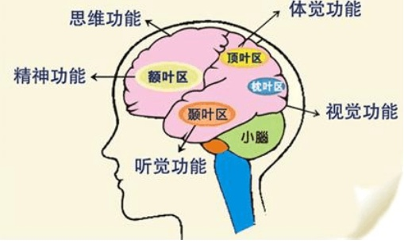

### 神经元

神经元是神经系统最基本的结构和功能单位之一。神经元能感知环境的变化，再将信息传递给其他的神经元，并指令身体做出反应。神经元占了神经系统约10%，其他大部分由胶质细胞所构成。基本构造由树突、轴突、髓鞘、细胞体组成。信息从一个神经元向另一个神经元传递的结合点叫做突触，具有刺激和抑制下一个神经元兴奋的作用。在人类大脑近千亿个神经元的相互作用下，便涌现出了非凡的智慧。

突触是神经系统不可或缺的结构，对感觉和思维的形成极其重要。神经科学家研究发现，突触通过两种基本的方式连接大脑。
第一种方法，产生过量的突触，然后选择性保留恰当的，去除不恰当的。
第二种方法，新突触的增添和修改。新突触的增添和修改是一部分或大部分记忆的基础，它不受年龄的限制，是一个终身的过程。这一过程由经验驱动，一个人接触信息的质量和习得信息的数量反映了其大脑的结构。人是基于过往知晓的事物来理解当下的，对此，神经认知科学从细胞层面进行解释的同时，也表明了经验和学习对大脑结构的深刻影响。由此可知，接触更多的新鲜事物，学习并积累自己的经验，在符合世界客观规律的条件下，增添、修正、强化自己的大脑回路。这是锻造正确三观和思维方式的最佳方式，是培育天赋和潜力的绝佳方法。

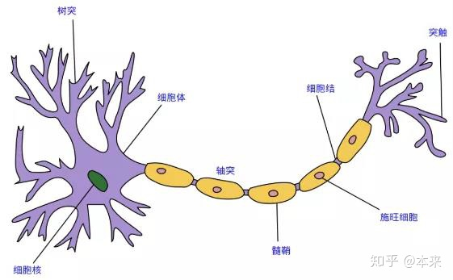

如果长时间进行高兴奋度的事情，比如一直×××，会改变大脑神经突触结构，你的大脑将变得更难以满足，你会开始寻求更多更强的刺激，这就是上瘾的本质，也是为什么那些自控力不足的上瘾者逐渐加大剂量的原因。对这些事情上瘾不重要，重要的是，你会开始对其他事物冷淡，减少对你迷恋的事物以外的关注，不再热衷于学习、进步和努力工作。你开始觉得世界上除了×××，就没有什么值得留恋的事了。然后沉迷于那些让你痴迷的事，走上歧途。当你再得不到它时，或者当你对它也失去兴趣时，你便感觉失去了一切，感觉没有任何动力，甚至开始抑郁。从这个角度来讲，这种放松，并不是一种放松，而是放纵，而放纵可以说让你的大脑在干正事的时候兴奋度降低，变得迟钝，类似于降低智商的作用。

## 锻炼大脑

大脑是一种可塑性极高的器官。也就是说，它有很强的用进废退，不管你是想要让大脑恢复到从前的模样，还是想要保持现状，有很多方法都可以锻炼大脑。

### 运动

在现今你能做的所有事情当中，运动最能改变你的大脑。

第一、运动对你的大脑有立即的效应。你做的每一次运动，都会立即增加神经递质的量，因为我们在运动时，会产生多巴胺、血清素和正肾上腺素，这些重要的神经传导物质都能够马上提升你的心情，那正是我的感受。单一次运动就能改善你转移和聚焦的能力，而那专注的改善会持续至少两个小时。最后，研究显示，单一次运动就会改善你的反应时间，基本上，那就表示如果一杯星巴克咖啡从柜台滑落，你能更快速接住它，这点是非常非常重要的。

但这些立即的效应很短暂，在运动刚结束时帮助你。要改变你的运动规律，增加你的心肺功能，才能得到持久的效应。这些效应之所以能持久，是因为运动确实能改变大脑的结构、生理机能，以及功能。我们从我最爱的大脑区域海马回开始。海马回─运动确实能制造出全新的脑细胞，海马回中新的脑细胞能增加容积，还能改善你的长期记忆。对你我皆是如此。

第二、在神经科学研究中最常见的研究发现，在长期运动的效应这方面，就是改善注意力功能，而这功能取决于你的前额叶皮质。你不但会有更佳的专注和注意力，海马回的容量也会增加。最后，你做运动会得到的不只是心情上的立即效应，还会有长期的效应。所以，你的好心情神经传递质就能得到持续增加。但其实，运动能带来最大的转变，就是对大脑产生保护效应。可以把大脑想成是肌肉。你运动得越多，你的海马回和前额叶皮质就会更大、更强壮。在你的一生中增加运动并不能治愈失智症或阿兹海默病，但能创造出最强壮、最大的海马回和前额叶皮质，所以这些疾病要更长的时间才会对你产生实际的影响。

### 音乐

学乐器音乐对大脑有很大的帮助，除了提升人的创造力、分析能力，记忆力、数学能力以外，还能让我们的动作更加灵活。虽然很多人说，集体项目的体育运动也能达到这些目的，但有一点，是音乐才能做到的：通过不断创建新的连接，促进连接大脑半球的胼胝体的发展。而大脑胼胝体发展越好的人，执行力、记忆力、解决问题的能力，都会优于常人，且不受年龄限制。

### 阅读

阅读不管你偏好的是哪种阅读方式，只要是阅读，都能给人带来相同的好处：降低压力，让人感觉良好，同时还能提升3种智力——晶体智力、流质智力、情商。所以，阅读习惯越坚实的人，往往解决问题的能力也越强，也更善于将零碎的信息整合为有用的知识。另外，他们的理解力、沟通力也会更好。

阅读，是发生在头脑内的高强度、复杂“运动”。脑神经科学家们，曾做过“阅读如何影响大脑”的有趣试验。他们发现：阅读时，大脑皮层的多个区域，会同时“亮起来”。眼睛看到的抽象文字，一瞬间就被大脑编译为准确的含义。在科学家们的眼里，“会阅读”的大脑，像“点石成金”的魔法石一样神奇。
这种强大的功能，只有大脑多个部位“协同合作”，才能实现。就好像是一支交响乐队，各个声部同时运作，才能奏出动听的音乐。阅读过程中，左右脑的信息高速流通，非常依赖位于两脑中间的胼胝（pián zhī）体。你可以把它理解为大脑的“信息中转站”。它像我们身上的肌肉一样，遵循“用进废退”的规律。阅读是人类需要掌握的重要技能，为什么我们的大脑偏偏没有进化出类似“听觉区域”、“视觉区域”的阅读功能专属区域呢？数百万年来，人类的祖先绝大部分时间都生活在非洲的草原上。在大约一万年前，祖先们已经进化出和现代人相差无几的大脑。而成熟的文字被发明出来，距今大约只有四五千年。而阅读，完全是“计划外”的负担。但是好在，我们的大脑有非常强的“可塑性”。通过学习和训练，粗糙会逐步向精细过度。每个神经元都会有精确的分工，对有限范围的刺激做准确的反应。通过高效的协同工作，掌握快速阅读和理解文字信息的能力。形成这样高效的阅读脑，需要长达10年以上、日积月累的训练，才能够应对在学业上越来越复杂的阅读任务，形成正向循环。

坚持读书，读各个领域的经典好书，虽然短时间内改变并不明显，但回过头来仔细想想，阅读确实让人生焕然一新。希腊哲学家芝诺曾经将知识比喻为一个圆，圆周内是你所知道的，圆周外是你所不知道的。一个人掌握的知识越多圆越大，他所接触到的未知越多，困惑也越多，所以学得的知识越多越觉得自己无知。反过来，一个人掌握的知识越少，他反而会觉得自己什么都懂。

### 学一门新语言

研究表明，会说两种以上语言的人，执行力、规划力和解决问题的能力都很强。很多人会因为需求才去学外语，其实这对你来说，是一个很大的帮助——学会一门外语，不仅能让你在学习之路或职场上越爬越高，也能让你的头脑越来越灵活。

### 冥想

1992年，科学家Richard Davidson曾研究达赖喇嘛的头脑，发现当他和他的子弟在冥想时，他们的脑波会呈现一种非常神奇的状态。科学家称，冥想可以让人控制自己的脑波，甚至可以让自己在任何时候感受到自己想感受到的东西。冥想是一种非常私人化的体验，它的内涵甚至远远超出我们对它的理解。其重点在于，将注意力集中在一个点上或去想象某一具体事物。科学研究发现，通过持续的全神贯注于某一事物，并将每次游离的注意力拉回到聚焦的特定点上，大脑将发生重大改变。冥想时大脑会发生什么?

冥想增大海马体积，降低大脑中的应激皮质醇,海马体是人类负责记忆的重要区域，当人承受过高的精神压力时，大脑会产生过量的皮质醇并淹没海马体，导致无法快速准确的存储和调用记忆。Sara Lazar的研究表明冥想组的海马体体积增大。

冥想者内侧前额叶皮层增强，杏仁核缩小,Sara Lazar的研究中还发现了冥想组的内侧前额叶皮层增厚以及杏仁核缩小的趋势。内侧前额叶与人体的认知功能相关，皮层增厚意味着部分认知能力的提升；而杏仁核是大脑中焦虑，恐惧和压力等负面情绪产生的场所，在禅修者的大脑中杏仁核较小，说明其面对同样的外部环境所感受到的消极情绪越少。

顶叶和后扣带皮层增厚,冥想训练后大脑的左上顶叶皮层和后扣带皮质增厚。左侧顶叶在以往的研究中通常被认为与注意力功能相关，结构上的改变也伴随着抑郁和焦虑量表评分的降低。

## 运动好处

当谈到如何保持心理健康时，养成运动习惯是最佳方法之一。如果你有运动的习惯就能体会到一次艰难的运动过程之后的感觉，那种感觉仿佛站在了世界之巅。淡然，如果你生活中的压力过大，让你经常性的发脾气，运动绝对是一个很好的解决方案。这些都是运动给大脑带来的益处，也就是很少人意识到的运动对大脑的好处。

运动不仅会保护你免受衰老——老年痴呆症就是认知能力下降和导致大脑衰弱的疾病造成的，但是有规律的运动习惯可以改善你的大脑处理信息的方式，从更好的角度和高度来处理复杂的问题。大量的研究表明，运动甚至提高智商，它似乎能让人们更好的集中精力、避免分心、更有尊严、减少焦虑、防止抑郁。

有意思的运动还可以改善优化大脑的结构（增加血管和大脑神经元）和功能（如何思考、解决问题、并对压力做出反应）。同时，也改变大脑化学变化，增加了胰岛素敏感性，这样能更有效减少氧化应激对大脑细胞的损害。

### 认知

认知功能是负责记忆、学习和智力，它是由大脑控制中心决定，负责管理一个人生活中的所有任务，比如写一篇文章、设计一个长期的工作计划或者组织一次旅行。同时还可以控制自己的情绪、调节压力、增强意志力、持续性、当事情变得棘手的时候能够优化干扰。这些都是基本的大脑能力，每个人都希望能提高这些功能，但这也是大脑衰老首先受影响的功能。大脑随着年龄的增长而萎缩，大量的脑细胞和神经元产生退化，但运动有预防作用。

例如：常年保持有氧运动的成年人比久坐的人有更好的大脑白质完整性，白质负责信息在你大脑中的传递。大脑拥有更多的白质意味着你的大脑能更有效的传递信息。有一种理论表明这与我们锻炼时体内激素释放有关。在一项研究中发现：耐力运动导致身体释放一种叫做鸢尾素的激素，它增强了一种叫做BDNF（ 脑源性神经营养因子）的大脑健康蛋白的表达，这种蛋白质在大脑中参与学习和记忆。脑源性神经营养因子促进新的神经突触的发展。通过一项研究可以发现，持续6个月的有氧训练可使老年人能够在回忆、反应时间、空间记忆的测试中获得更好的成绩，这些测试包括记住15个随机的单词和电脑屏幕上的点的位置。

### 心理上的好处

运动的最酷的好处之一就是可以改善情绪和克服压力。运动不仅对治疗抑郁症有很大的帮助，而且还能训练你面对困难时的韧性，甚至增加快乐。这些好处可能让你惊讶，因为锻炼身体是一个紧张的、让人痛苦的活动，那么，它是如何做到的呢？

首先，你可以释放出让你感觉良好的内啡肽，这与所谓的"跑步者高有关。内啡肽实际上是天然的，轻度的阿片类物质，在大脑中释放，以应对剧烈运动给身体带来的压力和压力增加而引发得应激激素皮质醇升高。

第二，运动对情绪有长期的影响，使之成为治疗和预防抑郁症的完美工具。运动会增加血液流向大脑，改变大脑的化学变化，导致多巴胺的释放，GABA和谷氨酸的释放，所有这些都会对情绪产生积极的影响。

一项研究表明：规律的运动可以缓解轻度和中度抑郁症。在另一个研究中发现运动和抗抑郁药在对抗抑郁症上有同样的效果，这主要是运动可以减少焦虑和更强烈的自我满足。一个大规模的调查发现，一个人的身体健康程度越高，自我价值的感觉就会越高。这些感受最深的是那些健康水平有大幅度波动的人，运动不仅改变了他们的生活方式和健康习惯，最主要的是心理上的变化巨大。不仅仅是饮食、睡眠、体能培训这些方面。

### 神经上的好处

如果你像大多数人一样，很少会想到你的大脑是个特别复杂的器官，这种令人难以置信的复杂的组织结构（血管和神经元），沐浴在化学物质的海洋中。运动提高了它的物理硬件和燃料供应，使其能够保持在较最高水平运行。

当你结束一天艰辛的工作后，你在精神上和身体上都会感到筋疲力尽，这时候如果你去运动半小时，就会发现自己完全恢复了活力，这是如何发生的?

内啡肽和活跃的神经递质，如多巴胺和去甲肾上腺素的结合能减少疲劳并让你感觉快乐。不仅仅是大脑化学物质的增加：动物实验表明，运动实际上重组了大脑的结构，让身体在疲劳或压力增加时，大脑会有不同的反应而不是屈服于这些负面情绪。研究表明：在对运动的反应中，大脑会释放出一种神经递质，可以降低压力增加时的焦虑水平。研究人员认为这一种神经层面的应对机制，可以提高你做出正确决定得能力，发挥自我控制作用。

### 生活方式的好处

我们所谈论的这一切都是我来让你的生活更加成功和愉快的。运动改变了我们解决问题的方法，对压力做出恰当的反应并想出新的办法。也让你更健康，研究显示：经常健身的人饮食和睡眠会更好，在日常生活中更加活跃、积极。

研究人员认为，运动提高了一个人在工作中的表现。因为他们在工作中面对障碍时更坚持不懈、增加了他们参与竞争的愿望和动力，最主要的是目标导向的行为与运动有直接的关系。当然，我们在运动中获得的认知提升也发挥了重要作用。

这些数据超越了我们以往对运动与大脑之间关系的认知（头脑简单四肢发达）。这表明重视自己健康的人更有可能养成自己喜欢的习惯，并为此克服所有困难，建立阶段目标，最后达到更大的目标和个人的职业目标。

## 记忆能力

记忆究竟是什么？记忆是我们大脑中一个存东西的地方，它为我们提供历史信息，用各种各样的线索让我们感觉到我们是谁。记忆分为三个过程：编码（摄入记忆）、存储（保持记忆）、再现（再次提取记忆）。而从持久性角度来说，记忆又分为短期记忆和长期记忆。总结一下就是：记忆不是机械呆板的，我们的思维运作能提高自己的记忆力，无意识中，我们的记忆力得到了提升，一些不愉快的事情会从我们的记忆中扫除。也许我们并没有意识到记忆中储存着如此多的信息。但请记住，记忆不是一个冷冰冰、死气沉沉的记忆工具，记忆像一个堆满了无数知识的令人惊叹的宝藏。我们不能随意的进入记忆，但我们能够练习、锻炼自己的大脑，为其储存更多的知识宝藏。

### 如何有效记忆

科学研究发现，大脑并不会平等地编码所有的记忆。在编码的过程中，海马体会根据信息的重要程度，释放不同水平的神经递质，从而影响记忆的强度。这种过滤机制在原始社会非常有用，它可以让你的大脑忽视一些与生存无关的次要信息。 但在也对学习制造了一点麻烦，因为你并不总能有意识地决定什么信息重要、什么不重要。毕竟在原始社会“一百米外有一头对你虎视眈眈猛兽”，可比“1911年中国发生了辛亥革命”这样的信息重要得多。 但是没关系，提高大脑对某一信息的关注度，还是有一些技巧的。

大脑有个特点：更加关注有形的、视觉上更加罕见的事物。相反，对抽象的、熟悉的事物不感兴趣。利用好大脑这个特点，就能提高记忆的效率。

技巧1：助记符号、奇怪的故事 你知道那些记忆大师，是如何把小数点后几百位甚至几千位的圆周率记住的吗？其实，他们是通过故事辅助记忆的。外行人以为他们记的是数字，其实他们是记住故事，然后再翻译成数字。操作起来并不难，举个例子你就懂了。 首先，把数字形象化。比如：0—超跑、1—炸弹、2—性感美女、3—鼠标、4—奶茶…… 好，比方说你要记一串数字：01234。第二步：编成故事。比如：我开着超跑（0），车上有颗炸弹（1），开着开着看到斑马线有一位性感美女（2），一手里拿着鼠标（3）一手拿着一杯奶茶（4）。 这些场景不需要合理，并且越刺激、越不同寻常，感情波动越大记忆效果越好。总之，通过自己设计符号啊、故事啊等类似的方法可以降低记忆的难度。

技巧2. 从多种角度、情景去编码信息 如果让你从书本了解中世纪欧洲人们的生活，你可能无法获得一个直观的印象。这时候可以从一些影视作品了解，比如权力的游戏。或者你也可以玩一些相关的游戏，这样做的好处是有代入感，让你能够捕捉一些细节。 当然，想要形成长期记忆，最重要的一点是，你需要不断地复习和回忆。除非这段记忆是依附在特别强烈的情感体验上。 1880年，德国心理学家艾宾浩斯想要了解记忆是如何随着时间的推移遗忘的，这个过程需要多长的时间。于是他开始对自己的记忆进行无数次的测试，迫使自己回忆其长且无意义的字母列表。在经过长期自虐的测试后，他提出了大名鼎鼎的“艾宾浩斯遗忘曲线”。这个模型并不完美，它的细节很大程度上是假设的。但它揭示了记忆的一个特性：除非反复记忆，不然记忆会随着时间的流逝快速衰退。 那么我们该如何复习呢？怎样提高效率？ 这就要说到，我们的记忆强度其实分为：提取强度和存储强度。 想象我们的大脑是一个大型图书馆，所有的书只进不出、没有任何一本书被偷或损坏。这代表了存储强度，根据理论，它不会随着时间的流逝减弱。而且一旦你对某些记忆进行编码，记忆的存储强度就是加强。听起来很好对不对？但是呢，这个图书馆有个很懒的图书管理员，他没有认真的对图书馆的书进行编号，把它们按照标准的方法分门别类的放在对应的书架上。所以就导致有些书虽然你知道你有，但不知道放哪了，找不到了。这就代表你的提取强度，也就是把记忆从脑海里调取出来的能力。提取强度会随着时间推移降低，乃至消失，除非不断复习。但它有个特点，提取的难度越大，即回忆的难度越大，对提取强度的增加也越大。举个例子：我们都有过这样的经历，忘记了某个字怎么写，最后绞尽脑汁才想起来。从那以后对这个字的印象特别深刻。这叫做记忆的间距效应。 显然，时间越长，提取强度下降得越多，提取的难度越大。聪明的人应该想到了什么了？没错，在快要忘记的时候进行回忆和复习，学习的效果越好。这就是理想难度原则（The Principle of Desireable Difficulty）。我们要找到一个复习的时间点，既没有久到完全遗忘，又不能太熟悉的时间点。 是不是感觉挺麻烦的，其实不麻烦。我们可以通过间隔重复来实现，即稳定增加每次复习的时间间隔。 举个例子你们就懂了。下面中那种复习更有效。第一种：每天复习一次第二种：每次复习距上次复习的天数逐渐增大，分别为1、3、7、14、30（天）答案是第二种，因为它利用了间隔效应。追踪系统，我们现在已经知道如何设计复习的时间点了。但这时候又出来另外一个问题：我们要如何追踪记录？有没有什么简单的方法？毕竟这么多内容，要让我记住每一个上次是什么时候复习的好像不可能。再比如，要背50个单词，总有一些比较好背，如果所有的单词都用同样的时间间隔复习，就会浪费一些时间复习那些比较容易的单词，从而挤占较难的单词的学习时间。

### Leitner系统

它可以完美的解决这个问题。操作也非常简单，准备五个箱子（文件夹whatever），把它们从1到5编号。每个箱子代表不同的时间间隔，比如1号箱里的内容每天复习一次，2号箱每3天复习一次，3号箱每7天复习一次……以此类推。

然后把你所有需要记忆的内容都放到1号箱，每天拿出来，先不要看。尝试回忆，能回忆出来的就放到2号箱，不能回忆出来的放回1号箱。2到4号箱也是类似的操作，能回忆出来的就放到大1号的箱。稍微有点不同的是，无论是哪号箱，主要是回忆不出的都放回1号箱。 这样就可以确保你把时间都花费在最难掌握的内容，提高效率。同时，从1号到5号箱，复习的时间间隔越来越大，这样也利用了间隔效应，获得更好的记忆效果。

## 健身

### 肌肉分布

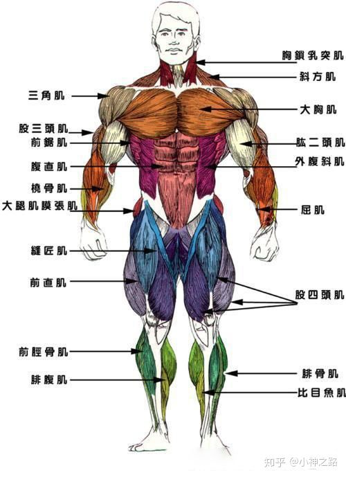

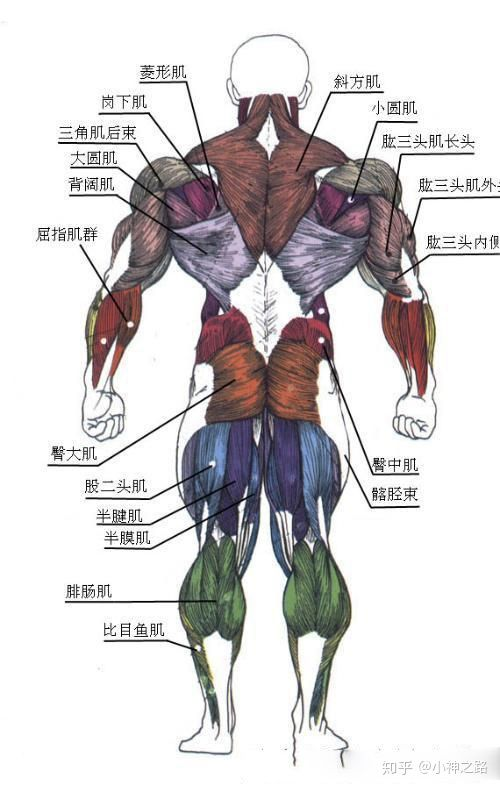

### 动作一：单脚点地

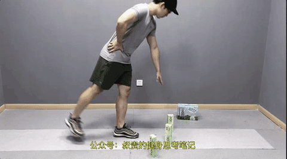

将道具摆放在你面前时钟的样子， 10 点、12 点方向，2 点方向各 三个，单脚俯身轮流去碰它们。你可以一只手扶住胯部，保持稳定。这个动作可以锻炼到核心、臀部、大腿后侧以及你的平衡能力

### 动作二：俯卧撑

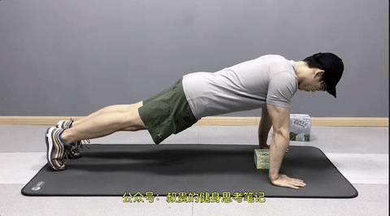

将道具摆放在胸口正下方，来检测自己的运动幅度。你需要把胸口贴到这个盒子才算一个标准的俯卧撑。如果你想增加难度，还有进阶版。

### 动作三：单腿跳

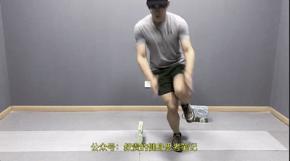

将道具一字排开，然后单腿跳跃。跳的越高，对屁股的刺激越大，如果你想降低难度，可以双脚跳。
当然如果你想增加难度，就加高障碍物的高度，直到你做两个就开始骂娘为止……

### 动作四：屈腿摇摆

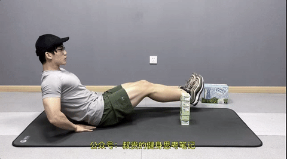
首先将腿部屈起来，减小发力范围，同时双手撑地让尾椎骨稍稍离开地面，更好地控制骨盆。这个动作是仰卧举腿 + 俄罗斯转体的改良版，可以有效减少腰部发力，更好地刺激腹部肌肉。

### 动作五：侧卧抬腿

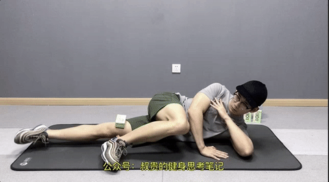
把道具放在抬起腿上方，保持髋部稳定，上下抬腿。注意，全程脚尖往回勾。

### 动作六：侧卧点地

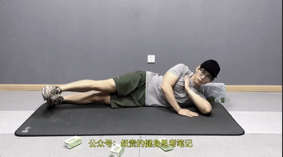

把道具摆在腿部正前方，用脚去交替「点」它们。这个动作可以很好的刺激到你的臀部肌群，每天睡前做一做，拥有翘臀不是梦。

### 动作七：平板搬运

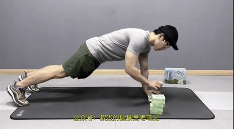

将道具垒在你手边，然后做平板支撑状态，单手做搬运，换边继续。为了不摔倒，你的腰腹需要更多的力量来稳定身体。脚后跟全程保持在脚尖的后面，这样可以让你的整体动作发力更连贯。

### 计划表

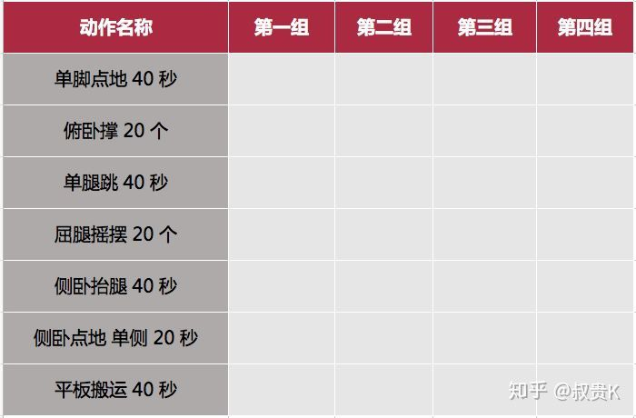
