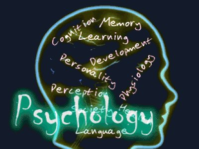

## 心理学

心理学（英语：psychology）是一门研究人类以及其他动物的内在心理历程、精神功能和外在行为的科学，既是一门理论学科，也是一门应用学科，包括理论心理学与应用心理学两大领域。

心理学的研究范围包括个体的和群体的、正常的和异常的心理特点与规律。
现代心理学创建于19世纪末的德国，100多年来心理学成为当代科学中发展最迅速的学科之一。由于心理现象十分复杂，目前已形成了不同的理论来解释心理活动。近几十年来，心理学的基础理论研究和应用研究均日益受到重视，它的研究领域更为精细，并具有更多的跨学科和多学科性质，心理学和一些邻近学科的交叉重叠，相互渗透，促进了彼此的发展。

<!-- more -->

第一，精神分析学派，不仅仅对心理学，对哲学、历史、美学、艺术、文学等等影响深远。主要关于人类的无意识的研究。创始人是弗洛伊德，另外有荣格和阿德勒，之后还有新精神分析学派，主要是弗洛伊德的女儿安娜，弗洛姆，沙利文，克莱因，卡伦·霍妮等等。这里有一些脑洞很大的观点，比如我们日常说的恋母情结也叫俄狄浦斯情结，其实还有对应的恋父情结。还有什么压抑，潜意识，死亡本能，释梦。
第二，行为主义，创始人华生，新行为主义斯金纳。只研究行为，不研究意识了。行为主义对心理治疗还有教育心理学有很多帮助，很多理论和方法现在还在用，比如治疗恐惧症的暴露疗法和系统脱敏。
第三，人本主义，重视个人的潜能和自由发展（很有进步和积极意义），代表人物是马斯洛和罗杰斯，还有积极心理学也是源于这个。
第四，认知学派，就是上面说的认知心理学的学派了，主要研究人的认知与脑机制的关系，还有思维和语言、记忆等等方式和过程。是现在心理学领域最最热门的学科。国内外大多数心理学学者都是做认知方面的研究。以及它衍生学科——认知神经科学，当下心理学最热也是最前沿的领域，也是人工智能的基础之一。

## 心理学技巧

### 期望值管理能力

影视剧中往往有这样的观感：一个地痞或者土匪，平日无恶不作。到了最后一集，哎，这货突然抗日了，例如《大宅门》里的三爷。这时候观众对其好感度会突然爆棚，甚至超过许多没有爆点的正面角色，前几十集的劣迹简直一笔勾销。这就是期望值在前期被编剧压低之后的福利。

我们刚进入一个团队时，如果一开始就大招尽出，会导致周围人和领导对你的期望值不断升高。最后总会有一次你满足不了对方的要求，这时候对你的负面评价也会随之而起，甚至会低过一直表现平平的同仁。有人将其总结为不胜任陷阱，因为在一个上升通道中，只要达到了上层的期望，就会被继续提拔，直到提拔到一个你不能胜任的岗位，让所有人失望，这个升迁过程才会结束。

这一点在情场上也依然适用，你会发现浪子回头会获得相当的赞美，许多女人甚至可以不计较你之前是个多么烂的人。但老实巴交的好好男人一旦被抓到一次不老实就立刻被打入渣男的行列再也不得翻身。娱乐圈这样的例子去年今年都有，不用我再赘述。

这就需要我们对别人对我们的期望值进行有效管理。比较常见的手段是憋大招，有一些在对方期待之外的东西不到关键时刻不能随便拿出来用。但周围人也不是傻瓜，次数多了，别人都会倾向于相信你藏着一手，例如学生时代那些永远叫嚷着这次考砸了的第一名们，信誉早已破产，其他人对其期望值仍然在持续上升，这时候承受的压力可想而知。要真正做到有效控制周围人对你的期望值，需要做到真正无迹可寻，并在所有非必要的时刻压抑自己的表现欲与虚荣心。我认为这是进入职场的第一课。

### 阈值自控意识

阈值又叫临界值，指释放一个行为反应所需要的最小刺激强度。
A片害了无数正常的男青年。没有A片的岁月里，男孩子满脑邪念充盈。可是在这个网络色情泛滥的当今，他们居然对生活中的女人没了想法，这不能不成为信息时代人类异化的经典案例。何以至此？阈值使然。也就是不断的持续刺激，抬高了男人们欲望的触发点。上个世纪初女人旗袍坐下时偶尔可一瞥的白花花大腿就可以触发老夫子们的欲念；可是100年后，看着满屏的器官进出，很多人居然会叹上一句：没意思。这就是时代的变迁，使得阈值不断上升的最好例证。

举个极端的例子，释迦牟尼本是个迦毗罗卫国的王子，很早就过着锦衣玉食的生活。其父为其修筑春、夏、冬三幢宫殿。但他活的很厌世。其父为其选来印度最妖艳美丽的女子来取悦他。但是美酒美女对他的边际效用已经小到忽略，食欲肉欲的一切无法使他获得更高的满足，只有离开世俗创造佛教去了。他一出生就享受物质的极大满足，导致他的阈值高到普通人难以想象的程度，最后凡是物质都无法使他快活。中国的例子是贾宝玉，从小活在女人堆里，最后也做和尚去了。反而自小出家的人却未必能忘俗。所以施耐庵会有和尚最淫一说，潘巧云与裴如海那一段有很精妙的点评。盖因自幼出家的人，从未享受过世俗的快感，所以阈值很低，一点就着。能大彻大悟的慧根人士，往往反而是富家子弟，也就不奇怪了。

女人亦然。泛滥的韩剧将正常的女生活生生逼成大龄剩女，归根到底也是阈值作怪。本来少女看见年轻男子怀春，是老天爷安排的正常心理活动。现在这个自然的程序被突然打断，横插10部韩剧，部部男一号多金英俊完美，还有若干男二男三争抢。电视机前的女人们于是看傻了，爱情阈值被活生生地抬到天上，身边的男人自然再也看不上。”

当你深刻理解了阈值对个人幸福与快乐的影响后，你就知道这个概念不仅用在性和爱情上，更可以推广到人生幸福的方方面面。了解边际效用递减的规律，并学会一定程度的禁欲和自控，是防止阈值升高的不二法门，这绝对是需要在人生早期就要着力培养和锻炼的素质与意识，尤其对于男性。

### 应对时空扭曲的应对能力

这里说的时空扭曲，指的是主观的时间流逝感觉随着年龄开始加速，而且一发不可收拾。相信大部分人都有这样的感觉，时间过得越来越快快了。小学时是一个月一个月过，大学一学期一学期过，工作后就变成了一年一年过，越往上过的越快，问问你的父母，他们会告诉你十年一眨眼就没了，他们讨论着十几年二十年前的陈年旧事，好像就发生在昨天。

有一个说法比较有趣：“五岁的时候人的记忆有五年，这时候过一年，到六岁时，记忆增加了五分之一。六岁到七岁，记忆增加了六分之一。七岁到八岁记忆就只增加了七分之一。以此类推，到了二十岁的时候，过多一年，记忆便只增加二十分之一。这一年的时光虽然没变，但是参照物变了。所以大家就感觉时间过得快了。可能等你六十岁的的时候，过一年记忆只增加六十分之一，那时时间就过得更快了。”这个说法有一定的道理，如果你仔细回忆一下，会发现童年的课间十分钟休息足够你从楼上跑下去玩儿点什么；但现在你坐在公司电脑前，才喝了杯热饮，吧东西摊开准备干活，啥都没干呢一个小时就没了。小时候两个月的暑假特别漫长，现在的一个月不就是四个星期，一眨眼就没了。如果用记忆增量理论来解释，那就说明我们在成年后的工作和生活都是在简单重复，所以大脑中的“总数据”并没有像儿时那样处在迅猛增长的阶段，大脑处理今天的24小时，只需要动用几年前就已经存好的索引，驾轻就熟，总信息量几乎没有增加，你主观上感受到的“新东西”当然就少，而体验“新东西”恰恰是放慢主观时间的命门。套用知乎上“舒适区”的说法，要解决时空扭曲的问题，我们必须走出“熟悉区”，熟悉区是时空黑洞，会不断加速消耗，吞噬你的时间。如果你走出办公室，去陌生的国度一个月，就会发现这一个月并没有像办公室里那样，星期三过完就差不多能指望星期天了，而是觉得比在办公室两个星期都要多，这便是对抗时空扭曲的一个例子。并不是只有旅游才能有这样的效果，你如果在自己身上多试验，会发现能找到很多适用于你个人的手段，但前提是你要有“摆脱熟悉区”的意识。

这是我认为人的一生所需要掌握的最重要能力之一，掌握了对抗时空扭曲的本领，你就能延长主观生命。

### 第一性思考能力 (First Principle Thinking)

第一性思考能力可以理解成一种方法论，即做任何事情，考虑其物理本质的思维方式。这是一个人具备完整思考逻辑和表达逻辑的最关键一步。这个方法经常被我的偶像Elon Musk强调。

We normally think by analogy — by comparing experiences and ideas to what we already know
I think it's important to reason from first principles rather than by analogy，The normal way we conduct our lives is we reason by analogy. [With analogy] we are doing this because it's like something else that was done, or it is like what other people are doing. [With first principles] you boil things down to the most fundamental truths … and then reason up from there.

Musk当初说了特斯拉电池的问题，有人对他说电池包非常贵，这会花600美金/千瓦时，未来也不会比这个更便宜,但是第一性思考原理的思考方式是——你需要追问最根本的问题，电池的基本材料是什么？这些原材料的价格是多少？电池中所需要的碳、镍，铝和隔离物以及不锈钢外壳。把电池组分解成基本原料，然后我们假设从伦敦的金属交易市场购买，每一样需要多少钱?最终得出的结论是只需要80美元/千瓦时。他也是这么降低火箭发射成本的。

### 飞轮效应

假期过后，重新返回工作时总是异常艰难？面对工作，总觉得提不起精神，效率降低，甚至还会焦虑和神经衰弱？
有人说，这是万事开头难的体现，“飞轮效应”的理论正支持了这一点。为了使静止的飞轮转动起来，一开始你必须使很大的力气，一圈一圈反复地推。达到某一临界点后，飞轮的重力和冲力会成为推动力的一部分。这时，你无须再费更大的力气，飞轮依旧会快速转动，而且不停地转动。飞轮开始转动时需要的能量，其实是每次痛苦的突破拓展和积累。这是在为了形成属于自己的体系而做准备。一旦体系能够彼此支撑，那么它的运作就会变得越来越容易。正如科学家富兰克林说的，“如果有什么需要明天做的事，最好现在就开始。”写作文，最难的是开头；造房子，最难的是打地基；准备迎接新的挑战，过了心理的难关，之后的问题总会迎刃而解。有人不信，说“反正万事开头难，然后中间难，最后结尾难”。可若是开头不奋力一搏，连看到中间的机会都没有。相信“飞轮效应”不是追求一劳永逸，而是在一开始，和自己打退堂鼓的心理打个架，别让它拖住你前进的步伐。

### 蘑菇效应

踏出“舒适圈”很难。很多刚刚开始工作的年轻人，总觉得自己不受重视。打杂跑腿，端茶送水，还会受到很多指责、批评，甚至代人受过，或者干脆被无视，任其自生自灭。指导和提携，似乎总是落不到自己头上。这种失落和碰壁感，如同被放置在阴暗角落里的蘑菇一样。而“蘑菇定律”说的就是如此：蘑菇生长必须经历这样一个过程，人的成长也肯定会经历这样一个过程。“前途茫然”的感觉，会持续在整个蘑菇时期——直到长得够高够壮，才会被人重视。只有用现在每一秒的努力萌生，才能换取未来每一秒的不后悔。所有的停滞不前和怯懦担忧，都会延长成为“蘑菇”的时间。终有一日，因为平日的碌碌无为，而错过一个又一个机会，无法对未来形成改变。

### 鸟笼效应

1907年，心理学家詹姆斯从哈佛大学退休，同时退休的还有他的好友——物理学家卡尔森。
两位学者围绕着一个有趣的赌约争论起来。詹姆斯说：“我有个办法，一定会让你不久就养上一只鸟。”
卡尔森不信：“不可能，我压根没想过要养鸟。”于是，詹姆斯为卡尔森送上一只精致漂亮的鸟笼。从那天开始，到卡尔森家里的访客总会在看到空的鸟笼之后，关切地问他，“你养的鸟去哪里了？”卡尔森一次次的解释只能换来客人更加困惑的眼光。久而久之，卡尔森不胜其烦，无奈只好买了一只鸟。他被詹姆斯的“鸟笼”完完全全地控制住了，自我的意识消失，陷入了被别人操控的结果。因为别人送了一只鸟笼，所以养了一只鸟。这就是鸟笼效应。在我们的生活中，这样无意识被其他事物操控的情况，也是鸟笼效应的体现。人们常常说自己要“剁手”，却仍不停地买着本不需要的东西。为了凑单买的衣服，却常常要再花费金钱和精力，为了搭配而大费周折。鸟笼效应于生活的影响具有双面性，关键在于如何利用。一位心理学家曾经说过：敞开的书比合上的书更容易让人想读。这样一来，人们看到打开的书页便想拿起来翻翻，就更容易养成读书的习惯。不要让“鸟笼”束缚你的生活。减少不必要的，增加有效的，这才是鸟笼效应的真正启迪所在。

### 野马结局

管理情绪就是管理人生的开始。学会管理情绪的人，已经领先了那些容易情绪失控的人一大步。在非洲草原上，有一种吸血蝙蝠，常叮在野马的腿上吸血。就像在豹子耳边不停烦扰的蚊子，它们能吸饱血之后黯然离开，而不少野马却因为它被生生折磨死。动物学家说，蝙蝠吸的血量非常少，远不足致死。而这些野马的真正死因是暴怒和狂奔。它们的剧烈情绪反应是造成死亡的直接原因，而吸血蝙蝠只是一种外界的挑战。因为一件小事而暴跳如雷，大动肝火，这样的人往往难成大事，也难有大成就。他们常常用别人的错误惩罚自己，造成了像这群野马一样伤害自己的结局。如果不能学会管理自己的情绪，那么人生也会变得无法掌控。当发现所有事情都不如意，先反思一下自己是否陷入了情绪的困境。冷静一下，总没错。

### 凡勃伦效应

虽然生活中，一般越贵的东西，购买的人越少，但美国经济学家托斯丹·凡勃伦曾经提出：商品价格定得越高，越能畅销。
随着经济的发展和消费观念的进步，人们更愿意花更贵的价格，购买更加好的服务和享受。其实，这一理论在职场中也能体现。如果想要得到“好价钱”，就要思考如何把自己变得更加“值得”，放在更合适的地方待价而沽。而自己的“身价”，有时候却并不是外界的物质赋予的。提升自己真正的身份感，靠的是内修。在工作生活中，提升修养才是拥有好口碑的根本，才能让自己的存在价值得到提升，从而变得“抢手”。

### 南风效应

法国作家拉·封丹写了这样一则寓言：北风和南风比威力，看谁能把行人身上的大衣脱掉。北风使出浑身解数，狂风呼啸，试图吹掉行人的衣服。结果行人为了抵御寒冷，便把大衣裹得更紧了。而南风徐徐吹动，使天气温暖起来，行人因为觉得暖和，相继脱掉大衣。这场比赛，南风获得了胜利。这就是有名的“南风效应”，也说明了在处理人与人之间关系时，一旦方法错误，那么不但不会有效果，反而适得其反。我们都很清楚“见人下菜”的社交法则。其实，不仅是在人际关系间，在工作上也是如此。
“世事洞明皆学问，人情练达即文章”。聪明的人需要拥有一定的“弹性”，温柔灵活比极端刻板更有效果。允许别人比自己优秀，是一种聪明的处世法则。
因为花太多精力在这些看似狂风与暗涌的斗争上，势必导致工作不精和事业发展缓慢。但是，如果学会灵活地和自己的竞争对手相处，各取所长，互相合作，相处的方法一旦转变，正面的效果就会有所体现。

### 毛毛虫效应

为什么觉得自己在去年明明很努力，却依然没长进？
法国心理学家约翰·法伯做过一个实验：将毛毛虫首尾相接，围成一圈放在花盆边缘，在不远的地方撒一些松叶作为它们的食物。然而，毛毛虫夜以继日地不停绕着盆转圈，没有因为饥饿转向食物，最终精疲力竭，相继死亡。很多人总是用“做了多少”来评价工作质量的优劣，并不关注结果。他们盲目地跟随着既定的路线，从未想过重新思考“重生”的方向。这是“埋头拉车”，一味追求前进，但大多方向不明。终有一天倾尽所有才发现，做的都是无用功，而满足感全都来自自我感动。在新的工作生活来临之际，每个人也需要寻找到自己的突破口。如果觉得停滞不前，不要再埋头苦干，试着抬起头，看看周围是否有更广阔的天地、更开阔的视野。个体心理学创始人阿尔弗雷德说，“我们的烦恼和痛苦都不是因为事情的本身，而是因为我们加在这些事情上的观念。全新的开始，认清自己的心，聪明前行。

### 聚光灯效应

聚光灯效应又叫焦点效应，我们总是不经意地把自己的问题放到无限大，当我们出丑时总以为人家会注意到，其实人家或许当时会注意，但事后马上就忘了。你穿一件非常奇怪的衣服——比如超级奇怪的颜色搭配，红配绿等等——上街。你认为，有多少人会注意到你。实验表明，人们会认为有超过50%的人注意到自己，但实际上，只有不到20%的人有兴趣往你身上看一眼。无论你走在哪里，你都会认为聚光灯永远打在你身上。当你在公共场合出丑了，先别感到尴尬。你以为所有人都会注意你，但其实是“聚光灯效应”在作祟。

## 潜意识

意识是指潜藏在我们一般意识底下的一股神秘力量，是相对于“意识”的一种思想。又称“右脑意识”、“宇宙意识”，脑内革命作者春山茂雄则称它为“祖先脑”。学家普遍认为，人的行为举行95%靠的是潜意识，而5%靠的是意识。95%潜意识是受到5%意识支配的，当你的潜意识不再受到支配时，那有可能会发生可怕的现象，比如人格分裂，行为不受控制无目的，在外人看起来像傻子等等。

潜意识分为两种：一种是浅层次、个体化的潜意识，另一种是深层次、属于全人类的集体潜意识。潜意识是温和的、充满爱的领域，我相信这是事实，意识是精神病理学探讨的重心，所有的心理疾病，其实是意识出了问题所致。我们之所以生病，正是意识抗拒潜意识智慧的结果，意识患了疾病，潜意识想给它进行治疗，意识就会与之发生冲突。

潜意识有时会和自己意识相反，有时会相同。当你的潜意识里觉得人生很消极，不想面对人生，而你的意识里觉得人生需要面对，因为人生中还有你的很多朋友，亲戚，家人等等，迫于无奈，你不得不面对人生。当潜意识和意识冲突很厉害时，你不得不静下心来，告诉自己积极的心态，乐观自信面对一切，战胜潜意识里消极的心态，让潜意识接收正面的信息。

### 发现潜意识

当你的潜意识没有进入到你的意识的时候，那就是你的命运。——荣格

人的自我认知的突破需要解决一个习得性无助的问题。
动物园里的大象在小时候被一根绳子拴住，它无法挣脱。在长大之后它往往也挣脱不了。大象不是没有那个力量，而是挣脱不了它心里的那根绳子。

很多事情，当你说自己不会的时候，实际上你就真的办不到了，因为你已经在自己的心上拴了一根绳子。虽然你并不是没有挣脱它的力量。人最难战胜的对手就是自己。比如遇到问题下意识想逃避，遇到自己的无知和错误下意识的不想承认，遇到比自己强的人下意识的不想面对和挑战，遇到机会下意识的怀疑、拒绝、自我保护、厌恶风险。如果你的潜意识你没有意识到，那么你潜移默化的一切行为背后都被潜意识所操控。你莫名其妙的做出一些错误的决定，都源于你的潜意识。你的潜意识里面有问题，而你没有意识到它，你就没法改变它，到最后的结果就是它成为你的命运。 这也是荣格对心理学所做的最大的贡献。

人脑好比一台计算机，你的意识构成计算机上的程序，你的行为是各种程序的运行显化，而潜意识就藏在后台的代码里。学会打开潜意识，学会清理潜意识的垃圾信息。学会读出与写入潜意识信息。你就成为了主宰。但在这之前，你必须要跨过一道鸿沟，恐惧。当你意识到你的潜意识，并突破了各种心灵的限制，驱散了深植内心的各种恐惧。恭喜你，从此“你命由你不由天”！

### 习惯和信念

我所有的自负都来自我的自卑，所有的英雄气概都来自于我内心的软弱，所有的振振有词都因为心中满是怀疑。我假装无情，其实是痛恨自己的深情。我以为人生的意义在于四处游荡流亡，其实只是掩饰至今没有找到愿意驻足的地方。

外界有任何东西触动你的时候，记得，要往内看。看看自己哪个地方的旧伤又被触碰了，看看自己有哪些阴影还没有整理好。不要浪费能量在哪些外在的、不可改变的、不可抗拒的东西上。先在内在层面做一个调和整理，然后在集中精力去应付外在可以改变的部分。我们每天自省，检视思想的目的，就是为了了解自己的需求和欲望，打开最真实的自己。重复信念和行动，并积极暗示我们想要升职加薪，减肥成功，但结果总是不理想。可能是因为潜意识里的根源和信念没有改变，不够坚定，也没有很好地去执行。

很多事情总是嘴上说说，停留在意识层面，还总给自己找借口。这样是发挥不出力量的。大家都知道，每个好习惯要有意识地持续21天，才会转化为潜意识中的习惯。所以将潜意识转化为意识，最重要的做法就是坚定自己的信念和行为，给自己积极暗示并重复不断地通过我们的感官输入给大脑。

一旦我们想做的事情已经成为一种习惯和信念了，那离成功也不远了。