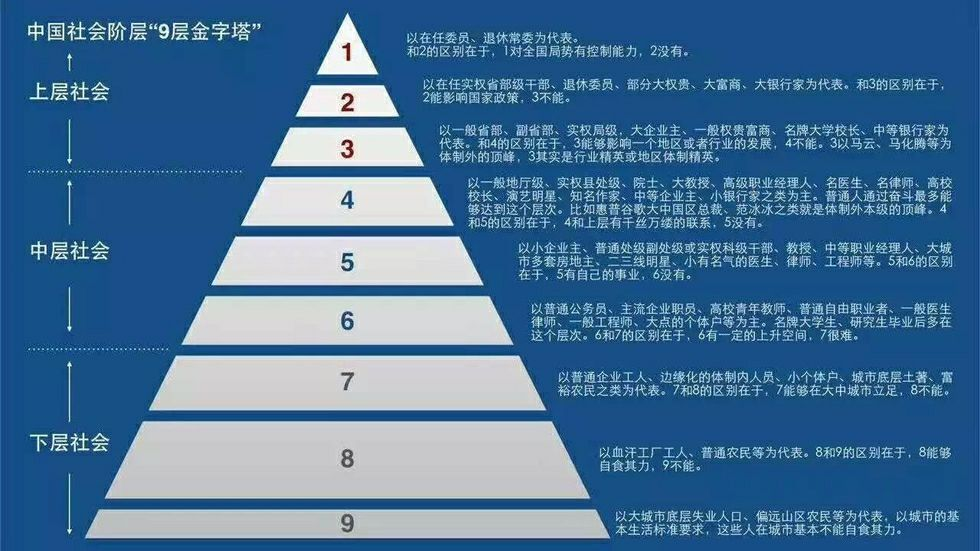

## 前言

致前进奋斗中的我。

## 贫富差距

无论一个社会用何种方式分配财富，总会有一部分人最先搞懂了其中的规律，然后修起围墙，把自己和自己的后代变成事实上的贵族，直到上层腐败不堪，底层痛苦不堪，最后整个社会推倒重来。不同的社会制度，只是分配财富的手段不相同，比如奴隶社会靠武力、封建社会靠土地、资本主义靠资本，马克思早就看透了这个问题，虽然提出了一个充满希望的共产主义，但没人知道那是否只是一个希望。我国曾经力图跳出这个方式，启用按劳分配的制度，但最终也证明无法发动起人的积极性，最终还是选择了资本主义的方式，至少是部分的资本主义。现代和过去的区别，就是现代全球经济一体化，本来以国家为单位基本封闭的社会，变成了全球一个大社会。如果一个国家不大，已经占据了分配链条上最有利的位置，那么这个小国有可能把全国人民都变成近似贵族阶级，目前也就是几个老牌欧洲小国能接近这个效果，全球老大美国也做不到。中国，十几亿人口的大国，在参与全球经济一体化的同时，内部也足够形成自己的经济社会。无论怎么看，都是贫富差距只会越来越大，阶级分化越来越明显。但这整个过程将是非常漫长的，要知道，新中国还不到百年。

当今世界，货币及财政持续扩张，贫富差距持续扩大，富人用廉价货币追涨金融资产，资本市场通胀，富人通胀（金融资产膨胀）；资本市场通胀挤压消费与实体投资，穷人有效需求不足，消费市场通缩，穷人通缩（实体萎缩，失业降薪，财富贬值）。
由此造成世界经济衰退、动荡、萧条，长期形成“低通胀、低增长、低利率、高泡沫、高债务”之局面。

<!-- more -->

阶层金字塔来说，山区大学生努力一辈子也就是当个三线城市默默无闻的白领，其实他已经完成了9-6的三阶飞跃，这已经改变了家族命运了。而处于5-6的城市中产，想飞跃到4，甚至3以上，就不是靠简简单单努力读书工作就能办到的了。我觉得那得祖坟冒青烟吧。

近二十年，我国正在走社会发展的老路子，也就是阶级固化越来越严重的道路。特别是从改革开放开始。当然，很多人对阶级固化这词非常反感。那么我们换位思考一下。现在你有了公司，你希望你的爱人，你的孩子能过的更好吗？摆在你面前让你送孩子出国深造，给爱人更好的环境，自己也不用那么辛苦，你会不会做？你受过良好教育的孩子嫁给一个男生，你是不是比你娃更希望这个男生至少站在和你同样高的角度？人都是利己的，利己就一定会把某些东西传递下去。阶级从来都是加速固化的，特别是改革开放之后这段期间内社会环境如此平稳没有巨大动荡的年代里。这是人性导致的社会阶级固化，鸡汤抵抗不了人性，哪怕你自己换位思考进去，你也会感同身受的。我们这个社会就处在这样一个阶段。贫富差距大、家庭阶级影响因素大、社会固化并且会随着泡沫、不对称和财富再滚动，加剧下去直到临界值。

一个孩子能走多远，家庭至关重要。原生家庭是否健康，影响到人的一生的绝大多数思维和选择。而有没有这种对孩子初期的心理培养，依靠的是父母本身的能力和见识，这便是家庭鸿沟。一个人未来的很多问题，往往都来自于它的原生家庭，比如你未来学习时候的没有战略性（战略性意识不够）、你工作时候的畏手畏脚不敢问问题怕麻烦别人（畏惧心理严重）、你无节制的没有对等心理的付出（付出型人格）、你有轻微的抑郁甚至是双向、你对爱情的不信任等等，往往源头都来自你的原生家庭的心理培养。并不是说小城市和农村家庭就不好，也有很好的，但大概率上，他是和家庭高中低层级分布的类似的。我们社会对不起第一产业，对不起农民，对不起他们的孩子。家庭财富的滚动，并不是我们简单意义上看到的，父辈赚了多少钱给你留下多少钱。真正意义上的家庭财富的滚动，是家庭整体人脉、圈子、能力这些基础滚动下的显性表达而已。

社会会一直这样固化下去吗？如果一个社会发展平稳，那么只有科技发展到某个奇点，这一切才会被解决。或者社会不稳定，乱世再临才会被打破。这和行业变迁是一样的，互联网的野蛮时代带来了多少白手起家的富豪，在互联网这个行业里，阶级因为乱世来临而变得错乱，因为行业定型而变得逐渐固化，行业就是社会的一个个体，也是一个映射。不必坐吃山空等到那个时候的到来，大多数人混的差，并不代表你也要混的差，找到过去你人生每个模块里的问题，解决他们。规划好你未来人生每个模块里的问题，争取吧未来的做到最好，检查过去，铺平未来，拿到你人生里应该拿的那三成努力，那么就算社会再固化，你依然有足够概率的机会。认清了生活，依然能脚踏实地为之奋斗，那么你或者你未来的孩子，也就不是这“混的差”中的一员了。

## 农村出身

人生是一场站在前人肩膀上继续前行的接力赛，农村出来的孩子，不仅起点低，而且在前进的过程中只能孑然独行，还容易陷进泥潭无法自拔。而且，身为一个农村人，即使你跨过了城市、阶级给你设置的各种障碍成就了一番事业，也并不意味着高枕无忧。也许终其一生，我们的终点离王思聪的起点还有很有很远很远，但我们不要为此感到悲哀和气馁，因为我们没法跟别人攀比，只能追求自我超越，成为更好的人。这个世界本来就没有绝对的公平，对于身处劣势的我们来说，只有直面现实，接受命运的安排，然后再尽力去改变自己能改变的。

这个道理很简单，但真的要做到知行合一，明白并贯彻到自己的行为中，并不容易，我年少时不止一次痛苦地想：“为什么我会出身在如此贫穷的家庭？！”这么想的时候不是在怨恨我的家人，纯粹只是不甘心命运赋予我的起点和条件。虽然这么想并没有影响我继续去努力，等到你彻彻底底不再有一丝这样的抱怨时，心甘情愿接受命运的安排，才真的学会为自己的人生选择负责，成长的道路豁然开朗了很多。

硬要说公平，或许真正的公平只在于你想要得到一样东西，你需要付出的资源和具备的能力，和城里的孩子一样，也就是人生那些必修课，你一堂都逃不了，这些课程你修不好，在社会上只会处处碰壁。你和城里孩子的差别只是在于，你得完全依靠自己的能力支付资源，锻炼能力；城里的孩子可以获得城市和父母的加持。除了家族积累，出身还带给了你什么？首先，你要明确，除了家族积累，父母能提供给孩子的最大起跑线是父母人本身, 包括他们的情绪控制能力，行为模式，复盘事情的归因能力。言传身教这句话真的实实在在地影响着每个人，尤其是在你的童年塑造和性格养成上。如果不是别人提醒，很多人甚至都不知道他们潜意识里在模仿父母的诸多行为，包括亲密关系中的矛盾处理，遇到难题时的态度，对于他人负面反馈时的分析等。老友记里有一集，瑞秋说，天呐，我怎么成了我爸那样。因为他们无法避开成长和进阶路上的无数个他们看不见的坑，有时候甚至会觉得这些坑是一种机会，是对自己的一种考验或磨炼。

有人告诉你条条大路通罗马，每个人都有机会成功，只要勤奋；比如，每个时代都有这个时代的人的机会。唯一亘古不变的途径就是，奋斗吧！少年！但是，他们又不会告诉你如何正确地奋斗，如果你只知道要奋斗，那就相当于你面前有一条通天河，你必须过去，过来一个长者告诉你，努力奋斗吧！你终将可以过河的，于是你赤膊下水，终于淹死了。家庭背景一般，父母阅历不深，见识不广的人都会一不小心就跌入深坑而不自知，等醒悟时，许多人都觉得太晚了，自救已经来不及了，此生也就这样了。

而农村出来的大学生，大部分的家庭背景都不具备鉴坑的能力，父母稍有见识的，还会用自己那一点早就过时的处世哲学去干涉影响子女的选择，于是，想不入坑都难，只有少数极其聪明，又有极强的独立思考能力，并有一定好运的人才能在如此复杂的环境下杀出重围，不掉入这些坑。

## 超越阶层

腹有诗书气自华，气质的提升来自于知识的广度和厚度。保持不断的学习，反哺到自己的工作中。提升的对事的思辨能力，有自己的见解，做一个有想法、有趣的人。品味主要是生活情趣。不是别人追求奢侈品，我们也跟风追。当然，我不否认名牌奢侈品能够从面上提升一个人的外在形象。情趣反而在内在的修养上，至于吃穿用度，大方得体，别太挫。

出生有贵贱。投胎是个技术活。既然如此，只能负重前行。农村孩子，谁不是从负数开始奋斗，先把坑填上再说。填坑的过程中，同学朋友已经早早进入下一阶段。这没啥好羡慕的。切不可自暴自弃，我见过很多农村孩子，一个是认命了，三十来岁就认命了，然后教育孩子要好好学习、考出去如何如何。完全在重复着父辈的思维，走不出来。这个比较可怕，代代如此。自己不改变，如何教育孩子能够脱胎换骨呢。

扎扎实实做好眼前的工作。工作即是修行，一方面增长工作方面的经验与教训，另一方面锤炼心性，如何与现状相处，以什么样的心态生活。务实谋划将来。人无远虑必有近忧，不自大亦不自卑。现状和未来是合二为一的，现在不精进，未来也是空想。

不要指望你30岁一个人努力可以超过别人全家几十年的努力，你可以一直努力，努力到45岁，50岁去看看。
就像生物学的进化一样，每一代改变一点点，来适应环境，最终总能适者生存。而对于我来说，进化才刚刚开始。

## 贫穷的本质

稀缺是一种心态。当它俘获我们的注意力时，就会改变我们的思维方式，影响我们的决策和行为方式。

穷并不是一种原罪，但是长期贫穷状态下，资源稀缺状态下形成的一种深入骨髓的穷的思维模式才是会伴随你一生的原罪，如果后天不能很好地正视，治疗并改正，那这个思维模式真的会影响你今后的许多选择和判断，我在这里并不想单说农村背景这个话题，而是所有有过这种成长经历的人，都会面临这种问题，希望大家能逐渐发现这一点，并在继续成长的路上不断地改进自己，让自己活得不拧巴。不管是时间还是金钱，当我们时常处在稀缺的状态下时，都会影响我们的判断，而长期稀缺形成的心态更是会影响自己很长时间而不自知。

认知能力是我们解决问题、获得信息、进行逻辑推理等能力背后的心理学机制。
认知能力中最突出的就是流体智力，即在进行抽象思维和推理时，在无须特定学习或体验的情况下解决问题的能力。

执行控制力其作用存在于我们管理自身认知能力的过程中，包括计划、关注、发起并抑制行为和控制冲动等。
执行控制力就像中央处理器一样，是我们进行日常活动的必要能力，可以决定我们的专注力和转移注意力的能力、从记忆中提取信息的能力、同时处理多项任务的能力以及自我监督的能力。

稀缺会降低所有这些带宽的容量，使我们缺乏洞察力和前瞻性，还会减弱我们的执行控制力。

贫穷会限制人的思维宽度，即心智带宽（同一时间处理多个事件的能力），并消耗人的精力，让人的行为模式和视野缺乏整体性长远性的目光。

要实现阶层跃迁，关键就是扩大信息带宽，或者更深入一点，在有稳定收入（现金流）的基础上，尽可能扩大信息带宽。

## 财富的本质

金钱背后的财富是你的时间和自由。你拥有财富只是一个交易时间的工具。它是存储你的经济能量的容器，直到你准备支配它。但是整个世界都已经偏离真正的金钱的交易，而被愚弄着使用货币一个狡诈的骗子悄悄窃取了你两个最宝贵的财富，你的时间和你的自由。财富也是经历过后留下的精华，深信自己能做富人。坚信本利相称。学习管理。荣辱不惊，温柔敦厚。有感染力。

## 思维的本质

暴力最强者说了算。这是一条元规则，决定规则的规则。 --吴思 血酬定律

社会还是要需要更多的单纯的人，越单纯越好，强者怎么说怎么做，弱者听话就好。本来在斯德哥尔摩牢笼里待得好好的，有吃有喝有小范围的自由，有什么不好，最怕有一天突然意识到自己身在一个牢笼里，想要挣扎逃出去，头破血流也要出去，其实逃出去未必就是更大的世界，可能连活下去都很难。如果人生是一场无知与觉醒的斗争。那觉醒的人未必有无知的人幸福。

穷人思维和富人思维的根本区别在于底层系统不一样，它决定了穷人和富人不管对待任何事情上，都会存在着本质的区别。

底层系统就和电脑的cpu，手机的操作系统一样，不同的CPU在处理同一件事情上，会产生完全不同的结果。每个人的底层系统是由什么来构成的？

第一在穷人的信念里面，对于赚钱方面，觉得最稳妥的方式就是，通过干最累最脏的活，出卖体力加上出卖时间，来获得温饱。凡是要花钱，一定要花在衣食住行玩上，那些基本的物质生活，光花在那些只有产出，没有回报的消费方面。

第二是价值观的不同，一个人如果对未来没有希望，那他现在不可能有所行动和作为。一个人如果没有梦想，那他和行尸走肉有什么区别？这句话虽然很鸡汤，可是事实。在底层的穷人，活的很累的时候，真的需要鸡汤，让自己能够持续的充满斗志，必须要学会不断的激励自己，为自己鼓劲，方能够不管遇到什么样的困难，都能够坚强的走下去。借用乔布斯的一句话：活着就是要改变世界。我想改成：只要不死，终有希望。

第三是能力的不同。面对同样一件事情的时候，你解决的办法越多，就证明你的能力越强。穷人怕麻烦别人，怕被人瞧不起，怕看书学习，不敢走出自己的舒适圈。说真的一个人连钱都没有，在这个社会地位想有多高？面子这东西，是阻碍我们成长最大的绊脚石，要想突破自我，首先就是要放下面子。没有人的能力是天生的，增长能力最快的方式就是多学多想多做，有哪些经典的教我们赚钱，教我们谋略的书，不管它有多枯燥乏味，拿过来就是一顿啃。学东西要么学如何赚钱，要么学如何做人。

在这个社会，穷人翻身唯一的出路就是通过知识渠道，实现阶层的突破。只要在不违反法律的情况，如何最短时间最简单轻松的赚钱，就做这个。打工再怎么勤奋，就是花三十年时间，撑死混个中产的水平，最大受益者，永远是老板。想致富？就是要为自己积累将来创业的资本。因此一个人要想把穷人思维过渡到富人思维，首先要做的第一步是大脑重装系统。从更换大脑CPU开始，只有先放下以前的执念，然后将自己的认知全面提升，才能从穷人思维过渡到富人思维。从自己的信念、价值观和能力开始改变，找身边的成功的人学习，靠近一切比自己优秀的人。向社会上的成功人士学习，研究他们是怎么成功的，他们面对事情的时候，是如何去思考的，最后是如何去解决的。一个人要么被傻子洗脑，想想你身边的家人、亲戚、朋友，对你是产生了多大的影响，要么是被聪明人洗脑，把那些比自己成功的人的思想，选择性的装入自己的头脑中，你的人生才会发生质的变化。

一个人的大脑中，要么存满黄金，要么装满垃圾。想要存黄金之前，首先要做的是清理垃圾，放空自己，去吸收一切对自己有帮助的好的思想，方能真正的从穷人思维，蜕变成富人思维。

## 突破阶层艰难之路

非常难，而且正变得越来越难，因为能力在通往财富自由之路上占的分量越来越小。底层人民上升通道窄的根源是容错能力太低,王思聪最大的优势是他爹有钱吗？是的，因为他可以不断的犯错。他犯过的错的数量比一般的企业家都要高很多，但是他爹可以买单，所以即使王思聪5个亿赚了50个亿其实也没什么难度，一个中等规模学校的学生的试错机会加起来都没有他一个人多。但一个底层人民的孩子在成长路上的任何一步失误都可能将他永远的钉在底层阶级上，比如升学，就业，何时买房，甚至一个小小的投资失误都可能够让他需要几年的时间才能恢复元气。

底层人民通往财富自由之路太远，远到可能需要几辈人的努力。关于国家与阶级的构成，是一个基本常识，国家出现一定会有阶级区分。我们无法根绝阶级层差，并且，阶级层差在不断加速分裂。古话的三教九流，这就是层差。今天，这个层差还明显存在。大致上，有人玩了一个统计数据，中国的中产大约在3200万人。并且，这样的中产，还会细分。中产如此，13.9亿人中，有13.5亿人人处于蓝领和平民阶层。这是国情。形成这样一个底层平民阶层的根源，就是国家权力结构的需要。也是一个达尔文主义的结果。但是，我们处于平民阶层的人，所需要追求的是一个道路，是一个励志和奋斗的道路。这个过程才是需要强调的。我们可能无法改变现实的结果，但是，我们可以改变自己的气质。这种精神，才是最为宝贵的。不断的改变就有量变到质变的可能。正如区块链发展到token阶段，实际上为新力量去突破寡头包围创造了条件。这是去中心化的力量源泉，这位无数赤贫者带来富裕的新机遇。因为，比特币所带来的世界，真真实实颠覆了传统，改变了结构。尤其是人的结构。其实底层人民之所以成为底层，一方面是先天家族因素，也就是说历代都没有什么身份，第二方面是正因为这样，得不到好的教育，没有好的思想，导致恶性循环。

很多人都在推崇读书没用，学历高的人很多都还是混不好，学历低的人群中也能找出很富的人。这是在矮子里面挑高子，不能说明问题。底层和高层的距离往往就是学识、思想的距离。至于一些机会和风口让人实现阶级跨越的故事我们没少听，但这些实现了阶级跨越的人绝非偶然，是思想和执行力让他们抓住了这些机会。文凭高不见得就有文化有思想，但没思想没文化的底层人民是几乎不可能实现阶级跨越的。

思想改变人生，性格决定命运，而思想和性格都是需要从小培养的，底层人民难以获得成功的原因就在于他们小时候没有受到这些教育，而为人父母之后也往往忽略了其重要性。

不想做什么就不做什么的自由足够的财务自由，让他没有什么事情可以为金钱而委曲求全。
财富就是让金钱运用得更有价值真正的财富不是金钱本身，而是让金钱去实现更有价值的事情。在努力寻找将钱用在最合适地方的方法。找出你所需要的！留心观察生活中的点点滴滴，带着善于思考的头脑，常常问自己：我应该怎么改进这件事？这件事还能有什么其他更好的方法来解决？然后你就需要想办法解决问题，只要你找出了正确做事的方法，你就应当自信地去做，然后财富就会按你的设想慢慢积累，同时也源源不断地流入你的口袋。做好你该做的，然后你就可以完全信赖你的“宇宙智慧”，它会找出方法的。
真正的财富就是给予和付出最高尚的财富表现形式，莫过于用已有的财富去帮助那些需要帮助的人。付出金钱的过程，就是传递价值和爱的过程，它可以让财富的存在更有意义。
财富是别人无法拿走的东西所有的富人都不会无缘无故地富有起来，他们的富有总能从内心找到根源——那就是他们的智慧。真正的财富在于你的智慧，而不是金钱。

渴望是人生最大的动力，只有对财富充满渴望，而且在投资过程中享受到赚钱乐趣的人，才有可能将生活费用变成“第一资本”，同时，积累资本意识与经营资本的经验与技巧，获得最后的成功。

贫穷者要变成富人，最大的困难是最初几年。财智学中有一则财富定律：对于白手起家的人来说，如果第一个百万花费了10年时间，那么，从100万元到1000万元，也许只需5年，再从1000万元到1亿元，只需要3年就足够了。这一财富定律告诉我们：因为你已有丰富的经验和启动的资金，就像汽车已经跑起来，速度已经加上去，只需轻轻踩下油门，车就会疾驶如飞。开头的5年可能是最艰苦的日子，接下来会越来越有乐趣，且越来越容易。

贫穷者不仅没有资本，更大的问题的是没有资本意识，没有经营资本的经验和技巧。贫穷者的钱如不是资本，也就只能一直穷下去。

对自身能力的投资，有一位伟人的话，大意是一个人的价值大小，不是看他向社会索取多少，而是看他贡献多少。相比之下，按劳分配并不是按你的劳动量来分配，而是要你生产出更多的价值。只要你愿意，你劳动的能力越强，创造的价值越多，就越可能获得高的收入。多劳多得的根本是质而不是量，贫穷者最根本的投资是对自身能力的投资。

说到资本家，贫穷者就联想到那些剥削工人剩余劳动价值的人，心中自然有种抵触。实际上，只要你愿意，你也可以当资本家，资本市场是向每一个人开放的，其中也有你的那一份天地。接受并拥抱生活中的不确定性，学会从不确定性中收益，而不是躲避不确定性。现代人越来越害怕不确定性，他们喜欢将一切都掌握在手里，不容有半分闪失，一旦一件事带来的后果有半点不确定，他们就会焦虑，心慌，害怕，踌躇。可是他们忘了，这个世界，乃至整个宇宙，就是一个充满了不确定性的混沌汤，你追求确定性，相当于去追求一个本来就不存在的东西。为什么说太用力的人走不远？因为太用力的人往往充满了对确定性追求的执念，直接导致他们的准备多于尝试，焦虑多于期待，整天处于一种害怕任何一件事出乎他们意料的状态。你要是想当一个聪明人，首先应该摒弃的就是对确定性的追求。

当机会来临时，没准备好，也要上，因为你永远无法准备好。人类亿万年来，进化出了时间的概念，人类理解了将来，但或许是因为理解了将来，从而思绪被将来可能发生的各种不确定性而打乱，本来这个世界上只有现在，但人类却总为未来的不确定性而焦虑。和很多人想的不一样，一个系统有时不仅不会从随机性中受害，反而会从中受益。

人的免疫系统就是一个典型的例子，只有把你的免疫系统暴露在一个充满了不确定性的自然环境中，你的免疫系统才能真正健壮完备，这就是为什么如果一个孩子从生下来就在无菌室生活，突然进入自然环境中，马上就会生病。免疫系统就是典型的一个”从不确定性中收益“的系统。

山上的森林，如果没人管的话，每年都有可能发生很多次火灾，每次的火灾发生的位置，大小都是不确定的，但这种不确定，恰恰增强了森林的抗火灾能力，因为随机发生的火灾往往将那些更易燃的树木先烧掉，而且降低了易燃树木的密度，从而大幅度降低大型火灾的发生概率，所以森林也会从不确定性中收益。这时，如果我们人类强行的阻止所有的火灾，反而让森林变得脆弱，更容易发生威胁到整个森林的大型火灾。和火灾一样，人类至今拿病毒没有办法，病毒疫情的爆发充满了不确定性，而且我们发现，如果我们过分追求将病毒赶尽杀绝，病毒反而会在一段很长的潜伏期之后以异常凶猛的形式爆发出来，威胁到整个人类社会。我们人也是一样的，一个人只有暴露在充满了不确定性的环境中，他才能真正地成长，培养孩子，你应该让他去爬山，让他去摔倒，让他去接受这个自然界可能给予他的，随机的好或坏，他的大脑，身体才能健壮发育，反之，把他圈养在温室里，用”确定性“去保护它，反而会增加他的脆弱性。我们健身时的肌肉，就是在一次次地被不断地破坏，然后超量恢复，完成了肌肉的成长，如果你不去破坏肌肉，肌肉不可能成长。这是自然界的一个普遍存在的现象。