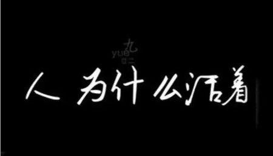

我活在世上,无非想要明白些道理,遇见些有趣的事,倘能如我愿,我的一生就算成功。-王小波

<!-- more -->

## 追寻意义

为什么人会追寻意义？纵观整个生物界，只有人类会追问意义这个问题，其他的动物或者植物不会。这就有趣了，为什么呢？归根到底与人性有关。作为个体层面的人，是有限的，但是你却要面对无限的时空。有限面对无限，必然产生一种不安全感，一种彷徨感，说白了就是不确定感。而人性，基于进化的原因，天然追求一种确定性。上述二者的矛盾，构成了哲学意义上的人生悲剧性。人要欢快地生存在这个世界，需要一种确定感，既然客观世界的无限性无法满足，那只能诉诸精神世界，这个东西就叫做意义，说白了是支撑你获得确定性的一套体系。从哲学层面讲，人类面临着生存的根本焦虑，这就是人诞生的偶然性。偶然性让我们恐慌和焦虑，于是我们要寻求一种必然性，这就需要通过意义构建。于是，我们会通过意义、价值抑或目的等词语来指导我们的一切活动，这样就可以摆脱无限世界和偶然性带来的虚无感和焦虑感。
某种程度上，意义是一个体系：这个体系没有经过论证而被无条件相信，就成了信仰，于是宗教诞生了；经过理性论证而被相信，就成了哲学的基础；经过理性论证和经验验证的，就成了科学的内核。上述三种学科，其实是人类把握这个世界的三种方式。把握世界的目的终究是对人生或者人心安放之处的关切——说白了，是对确定性（即意义）的关切。生命的意义，不是问出来的，而是你自己在人生过程中所构建出来的。诚然，生命到了尽头，终将走出时间。然而，生命存在的过程赋予了时间别样的内涵。换言之，是生命赋予时间以意义，而非时间赋予生命以意义。现代社会最可怕的其实是意义的虚无和价值的式微。这样一种虚无感导致了现代独有的社会问题——群体性孤独。由此带来的后果是一切曾经的崇高都面临着被解构的困境。当人们再也无法找到一套支撑生命或人生内核的意义和价值体系时，只能诉诸最简单、粗暴的东西——货币。是的，货币成为了意义和价值本身。人成了追逐金钱的工具，而没有成为康德所说的“目的”。正如社会学家齐美尔在其1900年左右的著作《货币哲学》中所说，货币成为了衡量人类社会关系系、人际交往、生存发展的根本尺度。古希腊哲学家普罗泰戈拉说：人是万物的尺度。而如今，货币成为人类价值的尺度。这无疑是可悲的。于是，不少人几乎做什么都要来一句：能挣钱么？而后，这些人嘲笑杜甫，嘲笑他自己都吃不饱，还要“大庇天下寒士俱欢颜”；不少人嘲笑卖猪肉的北大毕业生，嘲笑出家的名校博士，嘲笑回乡工作的名校毕业生，嘲笑高考状元却没有挣到最多的钱，嘲笑某些清北毕业生月薪不过7—8K……同时，老同学聚会开始攀比，比谁嫁得好，谁的收入高，谈论着谁开着豪车，谁做着领导，谁过得落魄。不少年轻人开直播，做网红，只为多快好省地挣到钱。我深感无奈的是，这是一个标榜价值多元的时代，这是一个标榜生命多元、自由发展、各有依归的时代。然而，这个社会却又总是拿着货币这把唯一的尺子丈量着每一个个体。一切思考所带来的烦恼，其最好的解药是行动。所以，别光想。与其坐而论道，不如起而行之！

如果你打算活个明白，想要认识世界，你就需要一个智识誓约。这个誓约和使命，像婚姻一样，需要你既坚持自己的理想，又愿意改变自己，这是一场修行。攀登这座智识美德的第二座山。你就加入了一场旷世的对话，你将学会用多个角度，多个模式理解世界。你会摆脱那个以自我为中心的观察角度。你会体验到人类中最优秀的人物在面临各种局面时候的内心感受。你会欣赏到高级的美，真正的美，乃至于神性的美。

## 哲学的答案

问题本质还是关于“人生的意义”这一哲学终极问题。而哲学家们早已纷纷给出了答案。
叔本华认为，人生就是一团欲望。当欲望得不到满足便痛苦，当欲望得到满足便无聊，人生实如钟摆，在痛苦与倦怠之间摆动。欲望永无止尽，所以人生无论追寻什么，它的本质都是痛苦。

尼采则认为，“人类存在的意义就是预估万物与自身的价值”。预估则意味着创造。这是对人生在某种意义上的肯定。

对罗素而言，“对爱的渴望，对知识的追求，对人类苦难不可遏制的同情，这三种单纯而又强烈的激情支配了我的一生”。同时他主张不必迷信权威，去过好自己的人生；

维特根斯坦说，“人生问题的解答要随着问题的消失而现身。”对于人生问题是只能领悟而无法真正言说的，这是理性思维和现实的矛盾；

海德格尔提出“向死而生”的概念，它的意义在于“当你无限接近死亡，才能深切体会生的意义”；

萨特有句名言，“存在先于本质”。比起追寻人生的意义，更重要的是“我存在”这件事本身。他强调自由，认为人的“自由”是注定的，“人生来就是自由的囚徒”；

加缪认为人生本身并无意义，就像西西弗斯一样一遍一遍地推一块必然会滚落的石头。但是活着就“必须去活，去创作，活到流下眼泪”，这是对虚无的最好反抗；

## 个体的生命意义

成功的人生并不是在行动之前就知道自己想做什么，恰恰相反，只有行动、实践、质疑、再次行动，你才能发现自己是谁。我的经历就是这样。我的个性一部分来自遗传，一部分来自早年的经历，但直到我探索了更多的可能性之后，它才最终成型。我现在觉得，人生，就是对自己性格的探索。要是一个人，直到死也不知道自己到底是谁，擅长做什么，那是何等的悲哀啊。人生之旅就像是攀登一种个性的阶梯，在此过程中逐渐证明自己、发现自己。

毛姆在《人性的枷锁》中以主角菲利浦的口吻说：人生没有意义，人活着也没什么目的。一个人生出来还是没有出生，活着还是死去，都无关宏旨。生命似轻尘，死去亦徒然。万事万物犹如过眼烟云，都会逝去，它们留下了什么踪迹呢？世间一切，包括人类本身，就像河中的水滴，它们紧密相联，组成了无名的水流，涌向大海。他还这样写道，人本来就只不过是一个无足轻重的行星上的短暂生命，因此对于永恒的头脑来说，一个人一生的痛苦和奋斗只不过是个笑话而已。

我们都是基因筛选中的一份子，都是为人类进化过程中提供一份基因。为什么人类不是永生的？为了让更好的人类继续生存。每个人都不过是大千世界中的一粒沙，你无法改变什么，也无法阻止什么，你的喜怒哀乐都只是你大脑不断分泌的化学物质。想到这里，我觉得一个人与其苦苦逼迫自己思索人生的意义是什么，让大脑处于一种低落苦闷的状态一直到归于沉寂。你可以这样想想，同样是无意义的度过一生，倒不如在这短暂的人生中让自己的大脑多分泌一些多巴胺，善待身边的人与事，从另一个角度看待无意义的人生，你会发现虽然人生没有意义，但是依然可以一起开开心心度过呀！

工作的意义到底是什么？所谓的好工作又是什么？是公务员朝九晚五、周末双休、上班浑水摸鱼还是民营企业996，忙到飞起。龙应台说过：“现代生活架构里，什么样的工作比较可能给你带来快乐？第一，它给你意义；第二，它给你时间。你的工作使你觉得有意义，你的工作不绑架你使你成为工作的俘虏，容许你去充分体验生活，你就比较可能是快乐的。当你的工作在你心中有意义，你就有成就感。当你的工作给你时间，不剥夺你的生活，你就有尊严。成就感和尊严，给你快乐。”在我看来，工作的意义是自我价值的体现也是为了更好的生活。当你的工作能够实现你自身的价值，你就会收获成就感、满足感，工作不应是生活的全部，而只是生活的一部分，当你的工作成为你生活的全部的时候，你将很容易身心俱疲，感觉到生活乏味，只有当你的工作不霸占你的生活，你才有可能对生活抱有期待和幻想。因此，所谓的好工作从来都没有一个标准的定义。体制内，你朝九晚五、周末双休，每天的工作简单、重复，一眼望到尽头，你常常感到焦虑，我还如此年轻，可灵魂却已入土，每天做着无法体现自身价值的工作使你痛苦不堪，外人常常笑你闲着无病呻吟，是啊，你是闲的，因此才有了为他人所无法理解的苦楚。体制外，你忙到飞起，熬夜加班赶项目，你忙碌而充实，你的自我价值被体现得淋漓尽致，但工作严重剥夺你的时间和生活，久而久之，你也开始厌倦、开始羡慕公务员的朝九晚五、周末双休的清闲工作。世上鲜有完美的、能满足你的所有幻想的工作，很多时候都需要妥协，做出取舍。所以你内心应有一个工作和生活的平衡点，没有人能告诉你到底什么样的工作算好工作，适合自己的才是好的。明确自己内心向往的工作和生活状态。所谓的好工作不过是工作与理想生活的匹配程度。匹配度越高，对你来说就越接近好工作的定义。倘若向往清闲、追求现世安稳，那么体制内或许是不错的选择。倘若你追求富有、充实，那么忙碌、高回报且具有挑战性的工作或许于你而言更接近好工作的定义

活出生命的意义，生命的意义在于每个人、每一天、每一刻都是不同的，因此重要的不是生命意义的普遍性，而是在特定时刻每个人特殊的生命意义……人不应该问他的生命之意义是什么，而必须承认是生命向他提出了问题。简单地说，生命对每个人都提出了问题，他必须通过对自己生命的理解来回答生命的提问。对待生命，他只能担当起自己的责任。因此，意义疗法认为，负责任就是人类存在之本质

人类不要深扒自己，否则，发现一切均是表象，尽是虚无和谎言。生命没有本质的意义，它仅依赖欲望和幻觉得以运转。

正像达尔文发现有机界的发展规律一样，马克思发现了人类历史的发展规律，即历来为纷繁芜杂的意识形态所掩盖着的一个简单事实：人们首先必须吃、喝、住、穿，然后才能从事政治、科学、艺术、宗教等等。所以，直接的物质的生活资料的生产，从而一个民族或一个时代的一定的经济发展阶段，便构成基础，人们的国家设施、法的观点、艺术以至宗教观念，就是从这个基础上发展起来的。因而，也必须由这个基础来解释，而不是像过去那样做得相反。

我们人类，自认为是万物之灵，夜郎自大，其实也只是基因的宿主，基因通过人类的繁殖，得到永生。人类的寿命是有限的，当死亡来临的时候，基因却没有死去，它早已通过人类的生育，复制到下一代的身上，依次传下去，实现永生。

从这个角度出发，很多问题就迎刃而解了。人类的本性是自私的，还是无私的？或者说人性本善，还是人性本恶？从人的角度出发，永远无解。从基因的角度出发，就有答案了，我们有些时候善良，有些时候邪恶，有些时候自私，有些时候具有利他性，这都是基因决定的。基因会判断那种行为有助于自己生存，就会指挥人类这个宿主选择合适的行为。

比如人类的天性就是对下一代比对上一代好，那是因为基因认为，下一代可以继续往下延续基因，而上一代的价值则没那么大。为什么在全世界范围内，都是舅舅比叔叔对小孩好，那是因为，舅舅和妈妈是一个基因序列，进化使他们更容易知道这个小孩是不是延续了自己的基因，而叔叔则没有这个能力。

为什么全世界的婚姻制度中，普遍存在聘礼制度，让男人娶老婆的成本如此之高？那是因为对于男人的基因来说，让女人怀孕后，任务已经完成，该去找下一个女人了。而女人的基因却不这么认为，他怀孕和生育都不容易，孩子生下来后必须把孩子养活，保证这个基因得到延续，才能去生下一个。而养活这个孩子，需要男人的帮助，所以通过聘礼把男人榨干，让男人没有能力找下一个女人。

王羲之说：夫人之相与，俯仰一世，或取诸怀抱，悟言一室之内；或因寄所托，放浪形骸之外。人这一生，如昙花一现。如草木春绿秋枯，如曦月东升西落。但偏偏这一生欲望却有很多。小时候溪头卧剥莲蓬，忙趁东风放纸鸢，急走追黄蝶，也傍桑阴学种瓜，归来饱饭黄昏后，不脱蓑衣卧月明。长大后希望金榜题名，希望有佳人相伴，希望钱财不断，希望节节高升，希望高朋满座，希望夜夜笙歌。老了又想要健康长寿，僮仆欢迎，稚子候门，有一盘棋，一知己，一壶酒，一庭院，安享天伦。
你看世人慌慌张张，不过图碎银几两。偏偏这碎银几两，能解世间万种惆怅。有一大半的人还在为生活挣扎，哪里有时间去寻找意义？其实人这一生，不过是一场体验，就和草木，日月一样，体验这欲望的轮回。活不明白就会觉得，寄蜉蝣于天地，渺沧海之一粟。哀吾生之须臾，羡长江之无穷。活明白了就会欣于所遇，暂得于己，快然自足，不知老之将至。你可以追求这金钱名利，你也可以追求诗酒花茶，你可以追求江上之清风，也可以追求山间之明月。但是不用过分在意追求的结果，结果终将逝去。穷极一生，来到人间，尽可能的体验世间的喜怒哀乐，生老病死。很喜欢大鱼海棠的这句话。我们这一生很短，我们终将会失去它，所以不妨大胆一点， 爱一个人，攀一座山，追一次梦，不妨大胆一点，有很多事没有答案。很喜欢《兰亭集序》和《赤壁赋》。每览昔人兴感之由，若合一契，未尝不临文嗟悼，不能喻之于怀。固知一死生为虚诞，齐彭殇为妄作。后之视今，亦犹今之视昔。悲夫！故写此文，记录所感，虽世殊事异，所以兴怀，其致一也。后之览者，亦将有感于斯文。人生得意须尽欢，于是饮酒乐甚，扣舷而歌之。歌曰：小楼一夜听春雨，深巷明朝卖杏花。

