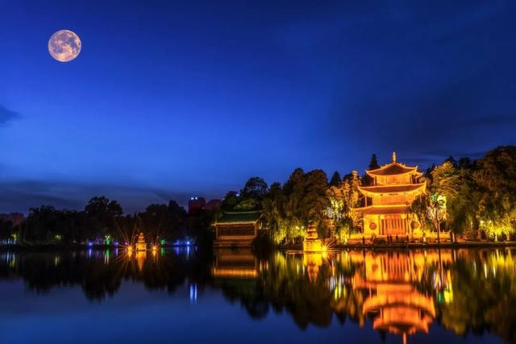
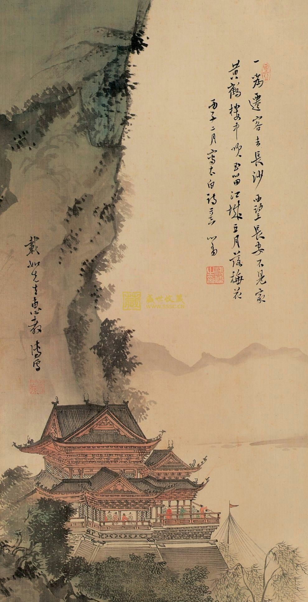
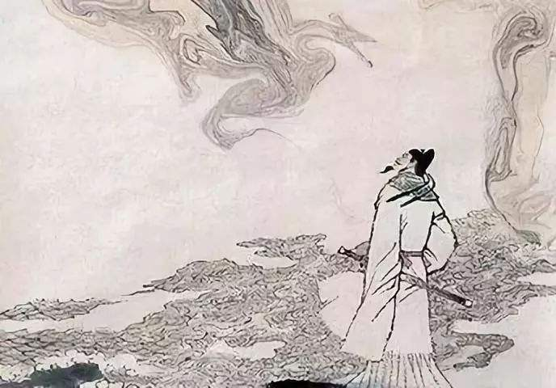
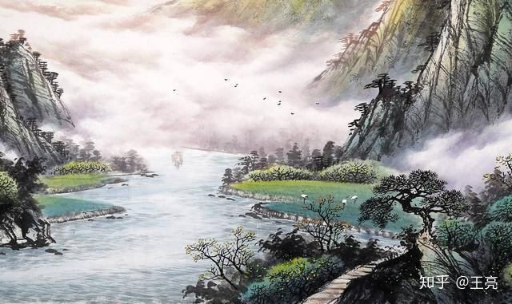
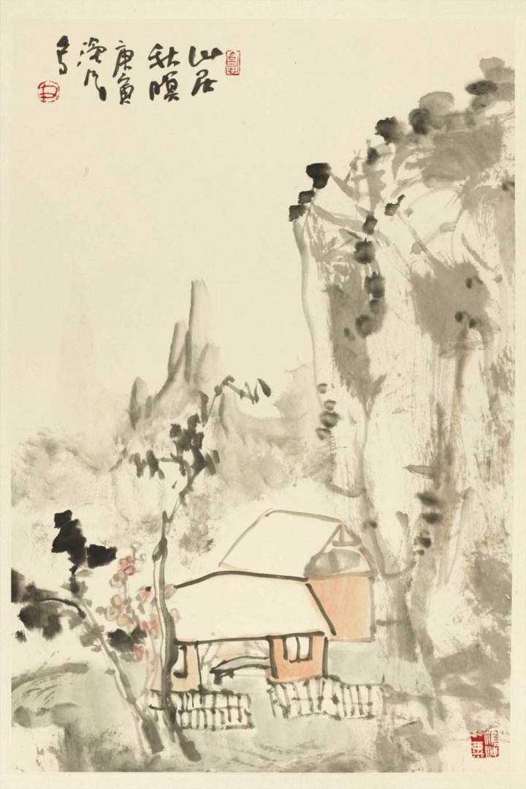

## 唐诗发展

唐代是我国诗歌发展的黄金时代。强大的国力、兼收并蓄的文化精神与丰厚的文化积累，为唐诗的繁荣准备了充足的条件。众多伟大、杰出的诗人把我国诗歌艺术的发展推向高峰。

<!-- more -->

初唐是唐诗的开创时期，诗的表现领域，逐渐从宫廷台阁走向关山与塞漠。诗的情思格调上，北朝文学的清刚劲健之气与南朝文学的清新明媚相结合，走向既有风骨又开朗明丽的境界。诗的形式在永明体的基础上创造了一种既有程式约束，又留有广阔创作空间的新体诗——律诗。此期间号称“初唐四杰”的王勃、杨炯、卢照邻、骆宾王和稍后的陈子昂，在转变诗风上起着重要的作用，而沈佺期、宋之问、杜审言等人则完成了律体的建设，为唐诗繁荣的到来准备了充分的条件。

盛唐是唐诗发展的高峰，此时诗坛群星辉映。王维和孟浩然善于表现山水田园的美，表现人与自然和谐相处的那种宁静平和的心境。盛唐有一些诗人，善于写边塞生活，如王昌龄、高适、岑参、祖咏等。他们大都到过边塞，领略过边塞的壮丽景色，向往边塞立功。在他们的诗中，祖国山河的壮美与保家卫国的豪迈情怀表现得淋漓尽致。边塞诗人的代表，还有岑参。他写边塞风物的雄奇瑰丽，写军人的豪雄奔放。荒漠与艰苦，在他笔下都成了充满豪情的壮丽图画。

最能反映盛唐精神风貌、代表盛唐诗歌高度艺术成就的，是伟大诗人李白。李白是一位性格豪迈、感情奔放、不受拘束而又向往建功立业的诗人，他的诗充分表现了盛唐社会士人的自信与抱负，神采飞扬，充满理想色彩。他的诗里既有建立不世功业在指顾之间的信心，又常常有愤慨不平和对于朝廷黑暗的抨击。当时另一位伟大诗人，是被后人称为“诗圣”杜甫。唐诗到杜甫是一大转变，题材转向写时事、写底层百姓的生活；写法上采取叙事和细节描写，在叙事和细节描写中抒情。—般认为，在中国的诗歌发展史上，杜甫带有集大成的性质，对于后来者有着极为深远的影响。

中唐后期，士人渴望中兴，诗坛上也出现了革新的风气，诗歌创作出现了又一个高潮。在盛唐诗歌盛极难继的局面中，以他们的革新精神和创新勇气又开拓出一片诗歌的新天地，构成了色彩斑斓的“元和诗坛”。其中韩愈、孟郊、李贺等人，着重发展了杜甫的创新技巧，如奇崛，散文化、炼字等，平易奇险，幽僻冷艳，形成韩、孟诗派。白居易、元稹自觉发扬了杜甫的写实精神，并从乐府民歌中汲取养料，把诗写得通俗易懂，形成元白诗派。另外，柳宗元的峻洁和刘禹锡的真率也为世人称道。

晚唐诗歌又一变，中唐的那种改革锐气消失了，诗人们走向自我。这时出现了大量写得非常好的咏史诗，杜牧、许浑是代表。杜牧是写咏史诗的大手笔，对于历史的思索其实是对于现实的感慨，历史感和现实感在流丽自然的形象和感慨苍茫的叹息中融为一体。晚唐艺术成就最高的一位诗人是李商隐。他是一位善于表现心灵历程的诗人，感情浓烈而细腻。他的爱情诗深情绵邈，隐约迷离，刻骨铭心而又不易索解。他的艺术技巧，达到了出神人化的境界，极大地扩大了诗的感情容量，为唐诗的发展作出了最后的贡献。


## 春江花月夜

```
春江潮水连海平，海上明月共潮生。
滟滟随波千万里，何处春江无月明！
江流宛转绕芳甸，月照花林皆似霰。
空里流霜不觉飞，汀上白沙看不见。
江天一色无纤尘，皎皎空中孤月轮。
江畔何人初见月？江月何年初照人？
人生代代无穷已，江月年年望相似。
不知江月待何人，但见长江送流水。
白云一片去悠悠，青枫浦上不胜愁。
谁家今夜扁舟子？何处相思明月楼？
可怜楼上月徘徊，应照离人妆镜台。
玉户帘中卷不去，捣衣砧上拂还来。
此时相望不相闻，愿逐月华流照君。
鸿雁长飞光不度，鱼龙潜跃水成文。
昨夜闲潭梦落花，可怜春半不还家。
江水流春去欲尽，江潭落月复西斜。
斜月沉沉藏海雾，碣石潇湘无限路。
不知乘月几人归，落月摇情满江树。
```



春、江、花、月、夜是诗中最常见的景物和意象，当这五个字结合在一起时，张若虚用神奇的笔，奏出了一曲绝唱。

有景有情有哲理，这是个神话般美妙的世界。入夜了，江潮连海，月共潮生。月光闪耀千万里之遥，哪一处春江不笼罩在月色中呢？望着月亮，诗人对人生和宇宙发出扣问：江边上什么人最初看见月亮，江上的月亮哪一年最初照耀着人？人生一代又一代的无穷无尽，只有月亮是永恒不变的。望着月亮，思考人生，思考永恒。个体的生命转瞬即逝，可一代代的传递，却让人类永恒存在。月亮永远是那个月亮，而人已不知更迭了多少代。望月最易引起思念。思妇思念离人，游子想家了。不绝如缕的思念之情，将月光之情，游子之情，诗人之情交织成一片，洒落在江树上，也洒落在读者心上，情韵袅袅，摇曳生姿，令人心醉神迷。

张若虚(约670年—约730年)，扬州人，兖州兵曹。与贺知章、张旭、包融号吴中四士。

张若虚和他的《春江花月夜》，犹如梵高和他的《向日葵》，生前寂寂无名，身后光芒万丈。事实上，直到宋代张若虚和他的这首诗才为世人所知，此时距张若虚的时代已经过去了三百年。再三百年，明代胡应麟对张的认识又有了提高。又三百年，王闿运称之为“孤篇横绝，竟成大家”，闻一多赞之曰“这是诗中的诗，顶峰上的顶峰”。经历了千年岁月，张若虚和他的《春江花月夜》终于被推上了神坛。

等待是痛苦的，但等待也是充满希望的。有泥土，有种子，春天会来，花儿会开。张若虚无疑是幸运的。他等到了他的诗熠熠生辉的那一天。

## 黄鹤楼

```
昔人已乘黄鹤去，此地空余黄鹤楼。
黄鹤一去不复返，白云千载空悠悠。
晴川历历汉阳树，芳草萋萋鹦鹉洲。
日暮乡关何处是？烟波江上使人愁。
```



崔颢（hào），704—754，汴州（今河南开封市）人 ，原籍博陵安平 ，出身博陵崔氏，唐朝著名诗人，一首《黄鹤楼》诗，使武汉黄鹤楼名扬天下。

黄鹤楼始建于三国吴黄武（孙权年号）二年（公元223年），一开始，黄鹤楼只被用于军事，作夏口城一角瞭望守戍之用。东吴被灭后，黄鹤楼的军事价值也随之失去，随着江城的发展，逐步演变成官商行旅“游必于是”、“宴必于是”的观赏楼。

黄鹤楼的名字来源于一个叫“橘皮画鹤”的传说：这里原为辛氏开设的酒店，有一个穷道士经常在店里赊酒喝，一喝就是半年，辛氏一点也不嫌弃，一直款待他。有一天，道士说我欠了你这么多酒钱，没法还上，我给你画只鹤吧。于是，从篮子里拿出一块橘子皮，画了一只黄色的鹤，并告诉辛氏这只鹤只要听到客人拍手唱歌，就能从墙上下来起舞助兴。后来，道士再也没来，但是辛氏的酒店却因为这只鹤招徕了很多客人，生意兴隆，积累了不少财富。十年后，道士复来，取笛吹奏，黄鹤从墙上下来，道士骑着黄鹤飞上云天。辛氏为纪念这位帮她致富的仙翁，便在这里盖起楼阁，取名“黄鹤楼”。

## 登高

```
风急天高猿啸哀，渚清沙白鸟飞回。
无边落木萧萧下，不尽长江滚滚来。
万里悲秋常作客，百年多病独登台。
艰难苦恨繁霜鬓，潦倒新停浊酒杯。
```


杜甫（712年—770年），字子美，自号少陵野老，唐代伟大的现实主义诗人，与李白合称“李杜”。出生于河南巩县，原籍湖北襄阳。为了与另两位诗人李商隐与杜牧即“小李杜”区别，杜甫与李白又合称“大李杜”，杜甫也常被称为“老杜”。

《登高》是杜甫晚年的作品，当时他流落在夔（kuí）州，就是今天的重庆奉节，肺病严重，生活困顿。大约在重阳节的那天，他孤身一人登高远眺，长江沿岸的萧瑟秋景让他触目伤怀。诗的意思不难理解，先写登高所见的景象：秋风凛冽，江边的树林里传来猿猴的哀鸣，江心的沙洲上冷清清的，鸟儿正在还巢。无边的落叶萧萧飘坠，江水滚滚奔流。在这样的萧瑟气氛里，诗人检讨自己的一生，一年年颠沛流离、辗转万里，徒然羡慕还巢的鸟儿。忽然间人就老了，时间像无尽的江水一样无情地流逝，自己也已经迎来了人生的秋天，拖着病体独自登高。一生的艰辛染白了鬓发，只有酒可以浇愁，但病太重、人太潦倒，连酒也喝不得了。文字的力量，跨越千年，辗转时空，人物皆非，换了人间，我们读完这首诗，想到的都有各自的伤悲。

## 终南别业

```
中岁颇好道，晚家南山陲
兴来每独往，胜事空自知。
行到水穷处，坐看云起时。
偶然值林叟，谈笑无还期。
```


《终南别业》是唐代诗人 王维的代表作之一。此诗把作者退隐后自得其乐的闲适情趣，写得有声有色，惟妙惟肖，突出地表现了退隐者豁达的性格。诗人兴致来了就独自信步漫游，走到水的尽头就坐看行云变幻，这生动地刻画了一位隐居者的形象，如见其人。同山间老人谈谈笑笑，把回家的时间也忘了，十分自由惬意，这是诗人捕捉到了典型环境中的典型事例。全诗平白如话，却极具功力，诗味、理趣二者兼备。

在一次独来独往，独自在山水间行走的过程中，在水的尽头，坐看天上自由自在的白云时，作者突然顿悟到，云因为“无心”——没有什么必须的，不能的之类的执着，因此才能自在，人也应该像天上的白云一样，去掉执着心，做到“无心”，才能得到解脱，没有烦恼，自由自在。这就是这句诗所揭示的禅机。

## 春晓

```
春眠不觉晓，处处闻啼鸟。
夜来风雨声，花落知多少。
```

孟浩然（689～740），唐代诗人。本名浩，字浩然。襄州襄阳人，世称孟襄阳。因他未曾入仕，又被称为孟山人。早年有志用世，在仕途困顿、痛苦失望后，尚能自重，不媚俗世，以隐士终身。曾隐居鹿门山。年四十，游长安，应进士不第。曾在太学赋诗，名动公卿，一座倾服，为之搁笔。后为荆州从事，患疽卒。曾游历东南各地。诗与王维并称“王孟”。

## 山居秋暝

```
空山新雨后，天气晚来秋。
明月松间照，清泉石上流。
竹喧归浣女，莲动下渔舟。
随意春芳歇，王孙自可留。
```



读王维的这首《山居秋暝》，如果明白了“空山”的象征，就会更能体会到诗中清新空明的意境，更能会诗中无所挂碍的人生美学。

在这个秋天的傍晚，王维的内心经一场秋雨洗过，变得无比空明澄净。他的内心有明月照拂，有清泉流过，澄明无比。

但是，王维的空明不是远离人世的，不是隔绝尘寰的，正如空山中，有綄女，有渔人，但是，他们并不会把诗人王维拉入人世的烦忧之中。他们与诗人保持着一个舒适的距离，这个距离，不会让王维脱离人世，成为世外高人，也不会让王维堕入红尘，成为红尘禄蠹。

“空灵”的文化内涵是禅宗的“悟”。 禅宗讲“悟”或“妙悟”。禅宗的“悟”，并不是领悟一般的知识，而是对于宇宙本体的体验、领悟。所以是一种形而上的“悟”。但是，禅宗这种形而上的“悟”并不脱离、摒弃生活世界。禅宗主张在普通的、日常的、富有生命的感性现象中，特别是在大自然的景象中，去领悟那永恒的空寂的本体。这就是禅宗的悟。一旦有了这种领悟和体验，就会得到一种喜悦。这种禅悟和禅悦，形成一种特殊的审美形态，就是空灵澄澈。

## 将进酒

```
君不见，黄河之水天上来，奔流到海不复回。君不见，高堂明镜悲白发，朝如青丝暮成雪。人生得意须尽欢，莫使金樽空对月。天生我材必有用，千金散尽还复来。烹羊宰牛且为乐，会须一饮三百杯。岑夫子，丹丘生，将进酒，杯莫停。与君歌一曲，请君为我倾耳听。钟鼓馔玉不足贵，但愿长醉不复醒。古来圣贤皆寂寞，惟有饮者留其名。陈王昔时宴平乐，斗酒十千恣欢谑。主人何为言少钱，径须沽取对君酌。五花马，千金裘，呼儿将出换美酒，与尔同销万古愁。
```

李白（701年—762年） ，字太白，号青莲居士，又号“谪仙人”。是唐代伟大的浪漫主义诗人，被后人誉为“诗仙”。与杜甫并称为“李杜”，为了与另两位诗人李商隐与杜牧即“小李杜”区别，杜甫与李白又合称“大李杜”。其人爽朗大方，爱饮酒作诗。

《将进酒》原是汉乐府短箫铙歌的曲调，直到邂逅李白，方得流芳千古。篇幅不算长，却五音繁会，气象不凡。它笔酣墨饱，情极悲愤而作狂放，语极豪纵而又沉着。诗篇具有震动古今的气势与力量，这诚然与夸张手法不无关系，比如诗中屡用巨额数目字（“千金”、“三百杯”、“斗酒十千”、“千金裘”、“万古愁”等等）表现豪迈诗情，同时，又不给人空洞浮夸感，其根源就在于它那充实深厚的内在感情，那潜在酒话底下如波涛汹涌的郁怒情绪。此外，全篇大起大落，诗情忽翕忽张，由悲转乐、转狂放、转愤激、再转狂放、最后结穴于“万古愁”，回应篇首，如大河奔流，有气势，亦有曲折，纵横捭阖，力能扛鼎。其歌中有歌的包孕写法，又有鬼斧神工、“绝去笔墨畦径”之妙，既非鑱刻能学，又非率尔可到。通篇以七言为主，而以三、五十言句“破”之，极参差错综之致；诗句以散行为主，又以短小的对仗语点染（如“岑夫子，丹丘生”，“五花马，千金裘”），节奏疾徐尽变，奔放而不流易。《唐诗别裁》谓“读李诗者于雄快之中，得其深远宕逸之神，才是谪仙人面目”，此篇足以当之。


