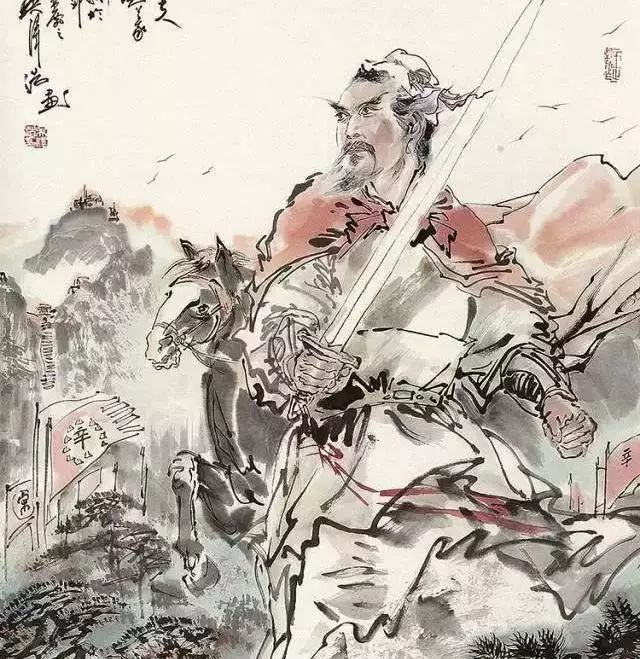
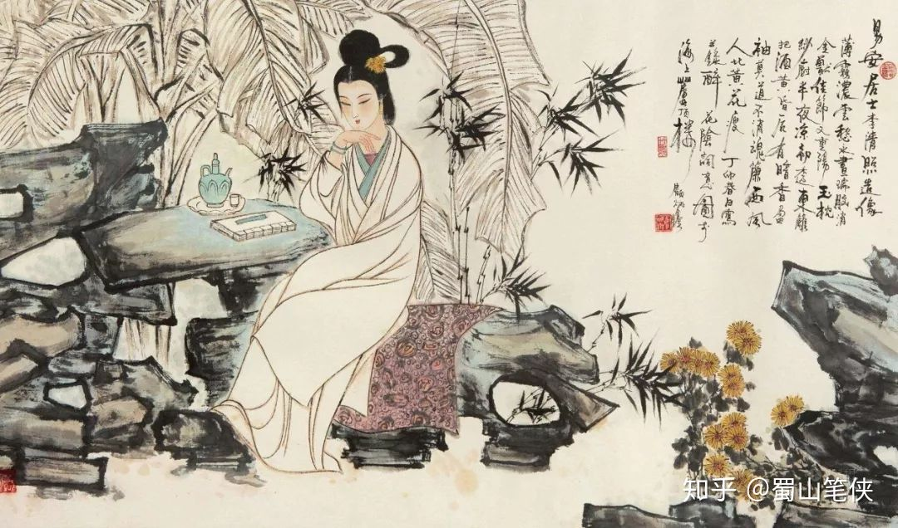
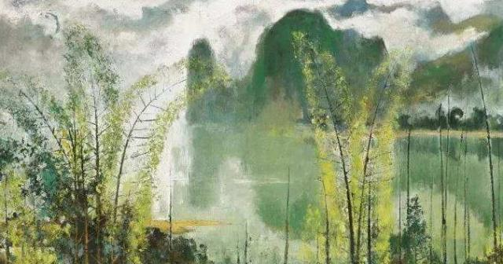
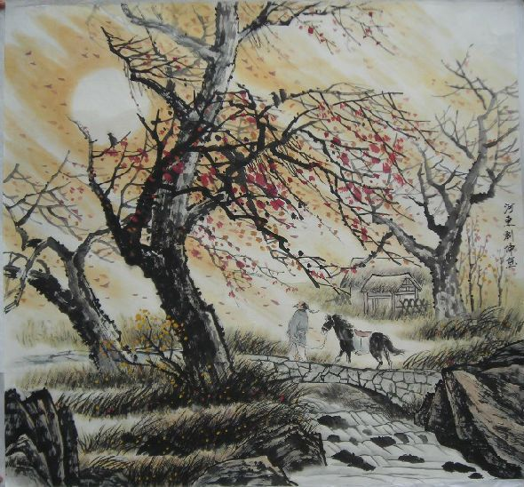

## 宋词发展

宋词是中国文学史上的两颗明珠之一，它标志着宋代文学的最高成就。因此，宋代也被称为词的时代。
王国维在《人间词话》中说“词以境界为最上。有境界，则自成高格，自有名句。五代、北宋之词所以独绝者在此。”
悠悠两宋三百年，数不尽的风流名士，说不完的国仇家恨，所有的悲欢离合、爱恨情仇，都可以在宋代词人留下的著作里遍览无遗。

<!-- more -->

在一字一句的品读中，你既能体会到词句韵律令人心醉的美，也能感受到词人的豪迈放纵与清新婉约。

它的美丽是永恒的，就像那一轮照了千年的明月一样，穿越时空，亘古不变，种种生活琐事，绵绵离情别绪，满腔爱国热血，脉脉儿女情长，在千年后的今天依旧生动，在我们的意会中，得到更完美的诠释。

词牌，就是词的格式的名称。同唐诗不同大多宋词的词牌名与词的内容并无关系，词牌名是人们为了便于记忆和使用，而赋予的名字。有的词牌名经过变换就会形成新的词牌名，如《木兰花》和《减字木兰花》；有的词牌名有不同的称谓，如《念奴娇》又叫《大江东去》，这是由于苏轼有一首《念奴娇》，第一句是“大江东去”，又叫《酹江月》，因为苏轼这首词最后三个字是“酹江月”；最后一种，最早的词牌就是词的内容，如《渔歌子》咏的是打鱼《踏歌词》咏的是舞蹈。

唐诗、宋词，是中国古典文学史上的两座高峰。

对于诗而言，诞生于春秋战国时期，从《诗经》、《楚辞》开始，经过两汉、三国、魏晋南北朝的不断发展，最终在唐朝时达到了顶峰；

唐朝以后，诗仍然在不断革新和流传，宋诗、清诗一直到如今的现代诗，诗歌已经成为四大文学体裁之一。
再来看看词，词是诗的一种变体，萌芽于南朝，唐朝就有了由文人创作的词，相传李白创作的《菩萨蛮·平林漠漠烟如织》和《忆秦娥·箫声咽》是最早由文人创作的词，被后世评价为“百代词曲之祖”。
到了唐朝末期，温庭筠、韦庄等引领的花间派，创作了不少词。不过当时词尚未成为文坛的正统，被称为“诗余”，没有得到文人的高度重视和认同。花间派的词文字华丽，对宋朝婉约词影响很大，不过思想性较低，后世评价不高。

南唐二主李璟和李煜，对词的发展起了非常重要的作用。特别是李煜，被俘之后，写了许多情真意切的词，扩大了词的境界，对后世影响深远，因此李煜被后世誉为“千古词帝”，关于李煜，小仙下次有机会再和大家说。

到了宋朝，词的发展终于成熟，登上了历史舞台。苏轼、柳永、周邦彦、晏殊等等文坛大腕，写下了一首首经典词作，在他们的努力下，宋词终于能成为和唐诗并称的另一座文学高峰。


## 念奴娇·赤壁怀古

```
大江东去，浪淘尽，千古风流人物。故垒西边，人道是：三国周郎赤壁。乱石穿空，惊涛拍岸，卷起千堆雪。江山如画，一时多少豪杰。
遥想公瑾当年，小乔初嫁了，雄姿英发。羽扇纶巾，谈笑间樯橹灰飞烟灭。故国神游，多情应笑我，早生华发。人生如梦，一尊还酹江月。
```

这首被誉为“千古绝唱”的名作，是宋词中流传最广、影响最大的作品，也是豪放词最杰出的代表。
它写于神宗元丰五年（1082）年七月，是苏轼贬居黄州时游黄风城外的赤壁矶时所作。此词对于一度盛行缠绵悱恻之风的北宋词坛，具有振聋发聩的作用。
开篇即景抒情，时越古今，地跨万里，把倾注不尽的大江与名高累世的历史人物联系起来，布置了一个极为广阔而悠久的空间、时间背景。它既使人看到大江的汹涌奔腾，又使人想见风流人物的卓荦气概，并将读者带入历史的沉思之中，唤起人们对人生的思索，气势恢宏，笔大如橼

## 满江红

怒发冲冠，凭栏处、潇潇雨歇。抬望眼，仰天长啸，壮怀激烈。三十功名尘与土，八千里路云和月。莫等闲、白了少年头，空悲切！

靖康耻，犹未雪。臣子恨，何时灭！驾长车，踏破贺兰山缺。壮志饥餐胡虏肉，笑谈渴饮匈奴血。待从头、收拾旧山河，朝天阙。

一首《满江红》，诉不尽，千古多少，铁血英雄梦。其中上阙有掩不住的惆怅、悲怆、失望和郁结于心。下阙满是壮怀激烈、崇高理想、战斗目标，从字面上就能感受其中的热血澎湃，霸气侧漏，凛凛杀气，已然穿透纸背！

诗人壮志冲天直冲霄汉，气势磅礴，气压三山五岳，诗词当为激励我中华热血男儿之雄文，砥砺吾等披荆斩棘，披风斗雨，永往直前！

岳飞本为军事奇才，而且也忠烈千秋，更是民族英雄，但是所遇非君。更重要的是，他自身个性的耿直、情怀的激烈、才情的张扬导致了自己悲惨的结局。使之天妒英才、将星陨落，徒留后世英雄，扼腕叹息！

## 雨霖铃

```
寒蝉凄切，对长亭晚，骤雨初歇。都门帐饮无绪，留恋处，兰舟催发。执手相看泪眼，竟无语凝噎。
念去去，千里烟波，暮霭沉沉楚天阔。
多情自古伤离别，更那堪冷落清秋节！今宵酒醒何处？杨柳岸，晓风残月。此去经年，应是良辰好景虚设。便纵有千种风情，更与何人说？
```

科举失败，只获得了一个很小的官职，对他这样向来自视甚高的人是一个不小的打击。他是一个浪漫主义诗人，但他的遭遇告诉他这个世界非常残酷和黑暗，皇帝也不是大家传说中圣洁、全知的，朝廷更不是一个众正盈朝的地方。因此他在世界观、人生观经历翻天覆地变化时，准备接受现实，去安排他的地方赴任，在路上与一名歌姬一起住了一段日子，产生了情愫，离开的时候写了这首雨霖铃送给他。

柳永的故事是传奇的，同时也是悲剧的。他年轻时逍遥自在，文采风流，却在科举上屡屡受挫。第二次落榜时被皇上诏书批评“属辞浮糜”，写下了一首鹤冲天，在这首词里，柳永不仅自封白衣卿相，而且把功名说成“浮名”。皇帝当然勃然大怒，这首词也给他的仕途宣布了死刑。“文章憎命达”在柳永的身上的体现是矛盾的。繁华与落寞、热闹与凄凉，这两类截然相反的境遇之对比，却正是柳永的人生状态。“奉旨填词柳三变”在市井红尘中获得了巨大的成功。许多青楼女子因唱柳永的词而红透京城， “一生赢得是凄凉，追前事，暗心伤”。又是青楼女子最终成全了柳永，让一个断然无法立足的人成长为一个让人无法忘却并使历史闪烁光辉的词人。

```
对潇潇暮雨洒江天，一番洗清秋。
渐霜风凄紧，关河冷落，残照当楼。
是处红衰翠减，苒苒物华休。
唯有长江水，无语东流。
不忍登高临远，望故乡渺邈，归思难收。
叹年来踪迹，何事苦淹留？
想佳人，妆楼颙望，误几回、天际识归舟。
争知我，倚栏杆处，正恁凝愁！
```

## 破阵子

```
醉里挑灯看剑，梦回吹角连营。
八百里分麾下炙，五十弦翻塞外声。
沙场秋点兵。
马作的卢飞快，弓如霹雳弦惊。
了却君王天下事，赢得生前身后名。
可怜白发生！
```



中国历史上由行伍出身，以武起事，而最终以文为业，成为大诗词作家的只有一人，这就是辛弃疾。这也注定了他的词及他这个人在文人中的唯一性和在历史上的独特地位。

辛弃疾是一个具有强烈爱国情感并付诸行动的诗人，一生都在为恢复中原、驱除鞑虏的理想而奋斗。他生于1140年的山东历县，此时，金人已经占领了淮河以北的大部分疆土，当然也包括他的家乡。在他还只有2岁的时候，一直主张积极抗战、直捣黄龙、一雪前耻的爱国将领岳武穆被以莫须有的罪名杀害，从此主战派的元气大伤，大宋王朝偏安的格局基本形成。所以，他的理想，从一出生，就生不逢时，并将牢牢伴随一生。辛弃疾的建军梦，就是有一支技术先进、实力强大、军容整肃的骑兵；有一个不受过分节制，有一定发挥空间，可以自由磨砺士气的将军，当然，也要有一个开明从容、知人善任的领导核心。

## 声声慢

```
寻寻觅觅，冷冷清清，凄凄惨惨戚戚。乍暖还寒时候，最难将息。
三杯两盏淡酒，怎敌他、晚来风急！雁过也，正伤心，却是旧时相识。
满地黄花堆积，憔悴损，如今有谁堪摘？守着窗儿，独自怎生得黑！
梧桐更兼细雨，到黄昏、点点滴滴。这次第，怎一个愁字了得！
```



李清照出生于一个爱好文学艺术的士大夫的家庭。父亲李格非是济南历下人，进士出身，苏轼的学生，官至提点刑狱、礼部员外郎。藏书甚富，善属文，工于词章。现存于曲阜孔林思堂之东斋的北墙南起第一方石碣刻，上面写有：“提点刑狱、历下李格非，崇宁元年（1102年）正月二十八日率褐、过、迥、逅、远、迈，恭拜林冢下。”母亲是状元王拱宸的孙女，很有文学修养。

李清照已经遭遇了靖康之耻，衣冠南渡，以及赵明诚的因病去世，遭受多重打击的李清照此时一个人孤苦伶仃。其它还好，没有爱情滋润的李清照纵使在诗词方面取得了伟大的进步，奈何余生怎生得过？“怎一个愁字了得？”

## 钗头凤·红酥手

```
红酥手。黄滕酒。满城春色宫墙柳。东风恶。欢情薄。一怀愁绪，几年离索。错错错。
春如旧。人空瘦。泪痕红浥鲛绡透。桃花落。闲池阁。山盟虽在，锦书难托。莫莫莫
```

这首词写的陆游自己的爱情悲剧。陆游的原配夫人是同郡唐氏士族的一个大家闺秀，结婚以后 ，他们“ 伉俪相得”，“ 琴瑟甚和”，是一对情投意和的恩爱夫妻。不料，作为婚姻包办人之一的陆母却对儿媳产生了厌恶感 ，逼迫陆游休弃唐氏。在陆游百般劝谏、哀求而无效的情况下，二人终于被迫分离，唐氏改嫁“同郡宗子”赵士程，彼此之间也就音讯全无了。几年以后的一个春日，陆游在家乡山阴（今绍兴市）城南禹迹寺附近的沈园，与偕夫同游的唐氏邂逅相遇。唐氏安排酒肴，聊表对陆游的抚慰之情。陆游见人感事，心中感触很深，遂乘醉吟赋这首词，信笔题于园壁之上。全首词记述了词人与唐氏的这次相遇，表达了他们眷恋之深和相思之切，也抒发了词人怨恨愁苦而又难以言状的凄楚心情。

## 苏幕遮·怀旧

```
碧云天，黄叶地，
秋色连波，波上寒烟翠。
山映斜阳天接水，
芳草无情，更在斜阳外。
黯乡魂，追旅思，
夜夜除非，好梦留人睡。
明月楼高休独倚，
酒入愁肠，化作相思泪。
```

范仲淹（989年-1052年），字希文，谥号文正，祖籍苏州吴县（今江苏省苏州市）。范仲淹一生居仁由义，力行所知所学，为百姓，为社会，为国家"诚意 "、"正心"做实事，在古人所谓立德、立功、立言"三达德"上达到了非常高的境界。他的好友韩琦曾称赞他"前不愧古人，后可师来哲"，而金代元遗山则称颂其"在布衣为名士，在州县为能吏，在边境为名将，在朝廷又孔子所称谓大臣者，求之千百年间，盖不一二见"。现代人一般把范仲淹定位为北宋著名的政治家、文学家、军事家、改革家、慈善家，其实，无论用多少个"家"来描述，说的都只是表面现象，并不能真正从实质上概括范仲淹的一生。范仲淹是一个儒家学问的大成就者，他在政治、军事和文化教育等方面的成就是他实践儒家学问所取得的成果。

## 兰陵王

```
柳阴直。烟里丝丝弄碧。隋堤上、曾见几番，拂水飘绵送行色。登临望故国。谁识。
京华倦客。长亭路，年去岁来，应折柔条过千尺。闲寻旧踪迹。
又酒趁哀弦，灯照离席。梨花榆火催寒食。愁一箭风快，半篙波暖，回头迢递便数驿。
望人在天北。凄恻。恨堆积。渐别浦萦回，津堠岑寂。斜阳冉冉春无极。
念月榭携手，露桥闻笛。沈思前事，似梦里，泪暗滴。
```



周邦彦（1056—1121），字美成，号清真居士，钱塘（今浙江杭州）人，北宋著名词人。婉约派最著名的两位文人便是柳永、李清照，然而集大成者却另有其人，那就是周邦彦。

陈匪石在《宋词举》中评价道：“周邦彦集词学之大成，前无古人，后无来者，凡两宋之千门万户，清真一集，几擅其全，世间早有定论矣。”把周邦彦抬高到古代词坛“前无古人、后无来者”的地位。

神宗赵顼元丰初，在汴京作太学生，写了一篇《汴都赋》，描述当时汴京盛况，歌颂了新法，受到赵顼的赏识，被提拔为太学正。

他精通音律，妙解音律，能自度曲，词律细密，在大晟府审古乐，制新调，对词乐的提高和发展有一定贡献。词风浑厚和雅，富艳精工，极铺陈之能事，为北宋婉约词之集大成者，在词史上有深远影响。词集名《清真集》，又称《片玉词》。

直直的柳荫道上，缥缈的烟雾里，一缕绿色若明若暗。隋堤上，曾见证过多少离别送行。行至高处，望向长安，京城里谁还记得我这个疲倦的过客？长亭路上，经年累月，我又送别过多少亲朋旧友。
闲下来，本来是寻找旧时足迹，不料却碰上为朋友践行，听着哀怨的音乐，梨花和榆树提醒我寒食节快到了。朋友船行得飞快，转眼就过去了几个驿站，旧友已到了天北。
凄凉中，离别恨堆成山高。送行的江边，水波回旋，渡口慢慢沉寂下来，斜阳挂在天空，春色无边。 想念我们在月色下携手散步，露桥上听笛声。我想来想去，一切仿佛梦里，眼泪暗暗流下来。

## 江城子

```
十年生死两茫茫，不思量，自难忘。千里孤坟，何处话凄凉？纵使相逢应不识，尘满面，鬓如霜。
夜来幽梦忽还乡，小轩窗，正梳妆。相对无言，惟有泪千行。料来年年断肠处，明月夜，短松冈。
```
这首词作于宋神宗熙宁八年，也就是公元1075年，当时苏轼被贬在山东密州任知州。苏轼写这首词的时候，用的标题只有两个字，叫《记梦》，也就是说，他这首词写的是一个梦。那么他做了一个什么样梦呢？
　　词里说梦到一个女子，在窗边梳妆，而苏轼自己与她默然相对，泪流满面，这其中既有相逢的浪漫，又有无奈于命运的悲伤，所以梦醒后，苏轼才说这样的情景足以让他“年年断肠”。
　　那么这个让苏轼断肠的女子到底是谁呢？
　　答案很多人都知道，她就是苏轼的第一任妻子——王弗。正是在词中所说的“千里孤坟”旁，也就是在王弗坟墓所在的山坡旁，苏轼亲手种下了三万棵雪松，以此来纪念自己的亡妻，可见苏轼与王弗的感情之深。

## 鹊桥仙

```
纤云弄巧,飞星传恨,银汉迢迢暗度.金风玉露一相逢,便胜却、人间无数.
柔情似水,佳期如梦,忍顾鹊桥归路.两情若是久长时,又岂在、朝朝暮暮.
```

宋代词人秦观的作品。这是一曲纯情的爱情颂歌，上片写牛郎织女聚会，下片写他们的离别。全词哀乐交织，熔抒情与议论于一炉，融天上人间为一体，优美的形象与深沉的感情结合起来，起伏跌宕地讴歌了美好的爱情。此词议论自由流畅，通俗易懂，却又显得婉约蕴藉，余味无穷，尤其是末二句，使词的思想境界升华到一个崭新的高度，成为词中警句。


## 其他

### 天净沙·秋思

```
枯藤老树昏鸦，小桥流水人家，古道西风瘦马。夕阳西下，断肠人在天涯。
```



```
世事茫茫，光阴有限，算来何必奔忙！人生碌碌，竞短论长，却不道荣枯有数，得失难量。
看那秋风金谷，夜月乌江，阿房宫冷，铜雀台荒。荣华花上露，富贵草头霜。机关参透，万虑皆忘。
夸什么龙楼凤阁，说什么利锁名缰。闲来静处，且将诗酒猖狂。唱一曲归来未晚，歌一调湖海茫茫。
逢时遇景，拾翠寻芳，约几个知心密友，到野外溪旁。或琴棋适性，或曲水流觞，或说些善因果报，或论些今古兴亡。
看花枝堆锦绣，听鸟语弄笙簧。一任他人情反复，世态炎凉。优游闲岁月，潇洒度时光。
```

```
人生到处知何似，应似飞鸿踏雪泥：
泥上偶然留指爪，鸿飞那复计东西。
老僧已死成新塔，坏壁无由见旧题。
往日崎岖还记否，路长人困蹇驴嘶。
```