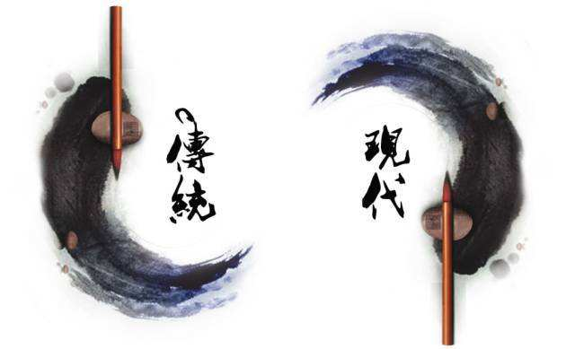

华夏文明指华夏族所创造的文明。华夏也称“华”、“诸华”，又称“夏”或“诸夏”。
夏，大也。中国有礼仪之大，故称夏；有服章之美，谓之华。华，夏一也。华夏皆谓中国，而谓之华夏者，言有礼仪之大，有文章之华也。中国者，聪明睿知之所居也。万物财用之所聚也，贤圣之所教也，仁义之所施也，诗书礼乐之所用也。“亲被王教，自属中国，衣冠威仪，习俗孝悌，居身礼义，故谓之中国”

中华文明是一脉相承、连续发展的，呈现出明显的阶段性。某一阶段的能量耗尽了就会起变化，变化了血脉就畅通，再接着生长、发展，如此螺旋式上升，使中华文明生命力不绝、延续至今，正所谓“穷则变，变则通，通则久”。

中华文明不曾间断，主要靠文明不断累积。这种累积主要体现在两个方面：一是由文字记载而形成的大量书面文献资料；二是众多的实物，包括器物、遗迹、遗址等。

<!-- more -->

## 中华世纪坛序

```
大风泱泱，大潮滂滂。
洪水图腾蛟龙，烈火涅槃凤凰。
文明圣火，千古未绝者，唯我无双；
和天地并存，与日月同光。中华文化，源远流长；博大精深，卓越辉煌。
信步三百米甬道，阅历五千年沧桑。
社稷千秋，祖宗百代；几多荣辱沉浮，几度盛衰兴旺。
圣贤典籍，浩如烟海；四大发明，环球共享。
缅怀漫漫岁月，凝聚缕缕遐想。
回首近代，百年三万六千日，饱尝民族苦难，历尽变革风霜。
烽火硝烟，江山激昂，挽狂澜于既倒，撑大厦于断梁。
春又绿神州，华夏沐朝阳。
登坛远望，前有古人，星光灿烂；后有来者，群英堂堂。
看乾坤旋转：乾恒动，自强不息之精神；坤包容，厚德载物之气量。
继往开来，浩浩荡荡。立民主，兴文明，求统一，图富强。
中华民族，伟大复兴，定将舒天朝晖，磅礴东方。
世纪交汇，万众景仰；共襄盛举，建坛流芳；昭示后代，永世莫忘。
```



## 中国文化

所谓的中国文化，是指中国人认识事物的一种特殊共性、中国人做决策的一种特殊共性。这些共性会导致一群中国人自然而然的形成一种与别的文化成员不同的互动机制和组织关系。会导致一个相同的挑战被一个不同的方案去应对，并且应对的结果也被一种特殊的评分制度去评分。完全不是什么祭祖、民乐之类的东西。也跟这一套合作机制、评价机制是用什么样的语言体系来表达关系甚微。举个例子，一个华人移民，在国外已经很久，可能中国话都说不顺溜了。但是遇到了事情——比如莫名的批评，如果他第一下意识是“我是不是得罪了他？被他穿了小鞋？”接下去他的解决方案是“我应该送点小礼物给他”而不是“我应该去找工会律师发起投诉”，他这样的决策模式就非常中国。哪怕他上诉想法是用英文想的，全程没有闪过任何“中国”的念头，这其实也是个中国念头。起作用的就是中国的文化。深入骨髓、深入灵魂已经化为思维底层逻辑的中国文化。


世人常说中国“保守”，以为这是中国“文化稳定”的根本原因，其实是这些人根本性的本末倒置了，中国实际上一向是世界上最激进的文明。而文化上的“稳定”是它无需任何努力自然就有，甚至想摆脱都轻易摆脱不掉的天然属性。十万吨的巨轮，想“不稳定”，发动机的功率得要多大？每一次中国落后个上百年——这在几千年历史里只是短短的一瞬，就会立刻跳跃性的再次跨越到同时代最先锋的社会形态上去开启新篇章。

周代殷商，分封天下；强秦代周，乃有郡县；汉代秦兴，独尊儒术；隋唐代汉，科举取士、取租庸调；宋代旧唐，以文驭武；明逐元虏，内阁执政；明亡清兴，不立国储；民国肇造，五族共和。每一次都是奔着开创而去，干的都是一马当先的革旧鼎新的新事。现在是先锋到挑战人类经验的共产主义。

## 中华文明

整个近现代，中华文明都处于信心不断丧失的境况中:

鸦片战争摧毁了军事技术的自信；
通商口岸摧毁了经济体系的自信；
甲午惨败摧毁了官僚体制的自信；
维新变法摧毁了儒家思想的自信；
庚子事变摧毁了宗教信仰的自信；
北洋乱世摧毁了对统一格局的自信。

百年的屈辱下来，无论是上层精英、下层黔首，几乎都对脚下这片土地上曾经辉煌的文明彻底失去了信心。在深深的自卑当中，我们深刻地不能再深刻地反省这中华文明的每一根血管、每一个细胞，剜骨挖肉、弃之如敝履，并把物质的困窘、人性的丑恶与人群的失态归咎于文明的劣根性。于是:

我们新鲜又艳羡地渴求着每一件舶来品；
我们把每一个高鼻深目的洋人敬若贵宾；
凡是喝过洋墨水的成为不可置疑的权威；
无论东洋或西洋都成为求知求学以救亡图存的圣地。

一百多年来，我们几乎是趴在地上、虔诚地把中华的未来与希望寄托在对广义的西方文明一板一眼的模仿拷贝之上，毕恭毕敬、奉若圭臬，用几代人的血汗与交织百年的恩怨情仇缴纳了一笔笔昂贵的学费。

任何国家只要是试图走工业化、现代化这条路，在不择手段获取第一桶金之后，都逃不过马克思所归纳的那四个字——生产过剩:由于市场投资的盲目与逐利，社会商品生产总量大大超过有支付能力需求量的经济现象，是经济危机的主要特征。改革开放到今天，中国经历了数次经济波动，是靠什么在一路成长为世界上最大的工业国的过程中不被生产过剩、经济危机击垮？不是西方那套经济学术语。而是……

靠一失去低薪低保障的工作就回到农村自给自足的几千万农民工；
靠国企改制工厂裁员后就在寒风中推着小车上街卖早点的下岗工人；
靠人均微薄的教育经费下父母们省吃俭用供养出来的世界最大规模的大学生群体；
靠广大三四五线城市居民大半辈子的辛苦积蓄吸收着资本泛滥对房价以及金融系统的冲击……

中国现代化、工业化的规模是人类历史前所未有的，期间遭遇的挑战也是前所未有的。所有应对危机所付出的成本全部由这个国家极其多样化且统筹配合的地域经济结构、土地承包责任制后世界上最大的农村自然经济体、千百年传统道德观念下吃苦耐劳的人民所承担起来。

美国人总是抱怨中国操纵汇率才获得制造业优势，但实际情况确实在短暂繁荣后的一轮轮经济危机以及连带的社会危机中，欧美发达国家除了以政治金融手段对外输出危机，还在资本输出过程中将最有可能发生严重生产过剩危机的制造行业向其他国家转移。发达国家经济产业空心化、虚拟资本化不单单是跨国公司、跨国资本的贪婪或者好心从而给了其他国家机会，而是面对必然的周期性经济危机趋利避害选择。

中国是集成了绝大部分产业链的世界制造业中心，不仅仅需要集约化的资源区位条件，更需要抵抗经济波动与生产过剩危机的体量与经济结构。产业空心化既是本国投资者权衡利弊的决策，更是一轮轮经济危机下来全球产业链自发追求稳定的结果。几十年的经济规律左右下的趋势，怎么会因为特朗普一个拍脑袋就转移回去，包括美国在内的西方主要发达国家，无法自身消化危机，只能向其他国家转嫁，一同转嫁出去的的还有环境成本、政治危机。如果不能转嫁危机是什么后果？外部环境封闭的苏联就是前车之鉴。中国是有史以来唯一一个能自己抵抗资本主义生产过剩危机、不发生社会体系崩溃也不对外转嫁危机的工业国家。当我们回过头看看过去两百年特别是近四十年所走过的的路，有哪一次是纯粹的外部输入将这个国家拯救出了危机的泥潭？一次也没有。过去如此，未来也会是如此。中国能抵御生产过剩的根源在哪，对于未来的信心也就在哪。

四大古文明，只有处于大陆一隅的中华文明完全自成一体，形成了延续到今天的独特性:多样化与统一集权的并存。很多人都忘记了一点，在大一统之外，中国内部从自然条件到经济基础最后到人文环境的多样性远远超过世界上绝大部分声称所谓多元化的国家。当我们讨论文明的时候，我们讨论的是什么？军事力量？经济状况？社会文化？意识形态？这些只是短时间随物质环境变迁而变迁的东西罢了，一个文明恒久的属性是它立足的这片土地以及在土地之上人们永恒不变的群体选择规律:

为什么中国地域经济结构极其具有多样性，超过了世界任何国家乃至地区？根本原因是因为中国拥有了最多样的地形、气候条件。然后在近代不屈的抗争当中，凭借强大的韧性成为西方世界外上最大的没有被完全殖民的原住民国家，避免了被彻底改造成如美洲那样单一的资源产地、倾销市场，因而最大程度保留了本土经济模式的多样性。中国不是也永远不可能是那种成分单一、经济形态单一的民族国家。如同自然界多样的生态系统更能够抵御生态危机一样，社会经济形态的多样性也决定了文明的韧性。为什么中国在几千年里不断重复着统一分裂的循环，最后进入必然的大一统局面？因为多样化的地形之下，位于文明中心的是黄河、长江流域那几块被要道联通的平原——逐鹿天下，得中原者得天下，继而把边疆扩张到天涯海角、戈壁大漠才能维持内部稳定。这也是今天东南沿海的台湾问题、世界屋脊的西藏问题为何关乎中华民族核心利益的原因。而在欧洲海洋性气候的广袤平原里，处处肥沃的土地具备了孕育多个国家中心的地理条件。我们把自己称为农耕文明，在河殇一代的感召下面对不可一世的海洋文明自惭形秽。但是从生态和谐的角度来看，农耕文明却是可以最大程度利用现有有限资源达成内部和谐统一的文明形态:都江堰、秦直道、驿站、京杭大运河……历朝历代执着于兴建大型工程以对抗灾害、改造自然的同时，也在不断打通文明的每一个关节每一根血管。而海洋文明的上层建筑只能建立在对外扩张与掠夺的基础之上。古罗马灭亡后，蛮族占领下的疆域上层建筑立即崩塌，而即使是游牧民族蒙古人建立的元朝也沿袭着中原世世代代治黄河、修水利的习惯，而治水恰恰是中原政治体系建立的源头。

整个近代西方政治文明的潜在规律归纳起来就是:无私有财产则无个人自由；无对外扩张则无内部民主。追根溯源，美式自由的基础不是宪法第二修正案、不是民兵手中的枪，而是:北美辽阔的土地上让不再人身、财产依附于旧大陆王权贵族的社会主体自由人阶层成为可能。但这背后却是印第安人的血泪史。欧美资本主义国家在19世纪末二十世纪前纷纷进入帝国主义，其政治体制实际运作方式上就是由平等、分散转向命令集权的过程。其时代背景就是殖民时代末期原本充裕的扩张空间变得狭窄、资源争夺越发激烈。现代的金融扩张本质上是殖民时代产业扩张的升级版。西方现代民主有两个源头:殖民地中海的古希腊古典民主、欧洲野蛮人的原始军事民主。他们的共同点就是:如果没有外部资源缓和内部无法和谐相处、斗争越来越动荡的政治势力，就必然会陷入内部崩溃倒退的结局。这也是套用西方制度的发展中国家所无法摆脱的现实。敢问当今世界还是一个扩张殖民的世界吗？还是一个强者对弱者肆意凌虐的世界吗？还是一个有着无穷的未知世界给予探索、无尽的自然资源供其挥霍吗？答案都是否定的。最起码对于中华文明来讲，即便穷得吃不饱饭，但在鸦片战争的100年后，中国就再次凭借着“朝鲜战争”与原子弹，触摸到了人类武力的顶点。那个靠武力就能横行无阻的时代早就过去了。

面对未来，中华文明的信心正是是源自对过去历史规律的总结。不像古罗马、奥斯曼土耳其、印度，中国不需要宗教思想、对外扩张来维系帝国的统一。极其多样化的自然条件基础上:早早建立的三位一体核力量、不输于发达国家的基础教育覆盖率、被无神论彻底解放的现实主义、各地区经济结构的相互补充、中央与地方的权力制约平衡，这些是过去以及未来中华文明在多样化经济基础之上的政治统一的保证。现代工业发展到今天，产业化趋势对于社会资源的统筹要求恰恰契合了自古以来的大一统意识。这是改革开放之后，中国模式无法被复制的根本原因。科学技术的发展，终于将自古以来的稳定与发展的矛盾打破，变成了良性循环:数千年融会贯通的内部结构给了现代工业发展最好的条件，科技与产业的成果又大大加强了稳定、统一的格局。最终一步步让落后世界平均水平近两个世纪的中国逐渐赶了上来。为什么西藏、台湾、南海是中国的核心利益，因为只要外部安定，重内部效率、社会和谐的中华文明就能够最大程度保证人民在有限外部资源条件下生活富足安康、环境长治久安。这也是在和平与发展为主流的当今世界，中国敢于高举“和平共处五项基本原则”站在对外交往道德高地充分参与甚至引领国际间平等交流、合作、开发的底气所在。一切一切的是历朝历代的仁人志士自发努力，最终给予了中华文明在现代化、工业化以及全球生态文明建设道路上无可比拟效率与的强大韧性。无论什么意识形态、什么社会阶段，这片土地自有他的运转规则。中华民族复兴的过程也正是重拾文明自信的过程。这种自信源自中华文明数千年血泪凝聚的经验，也是在这个越来越局促的蓝色星球之上我们面对未来的信心。
