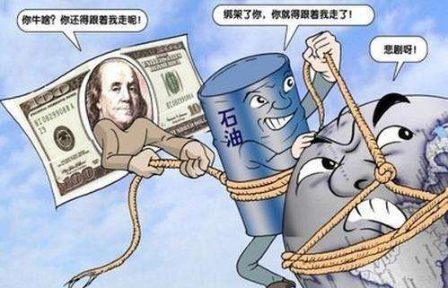

## 什么美元霸权主义

美元霸权主义体现在，在当今国际金融活动和经济贸易中，美元作为计价工具、支付手段、储藏财富的手段，都处于绝对的统治地位。简单的说，商品用美元标价，交易需要用美元进行，储藏的货币也是美元。

<!-- more -->

在全球，最主要的大宗商品和服务是用美元标价的，如原油、铁矿石、天然气；全球大部分的金融资产和金融产品也是用美元标价的，如各国的外汇；在国际市场上，黄金也是用美元标价的，这充分体现出美元在全球市场中作为计价工具的影响力。

作为支付手段，进出口贸易中，绝大部分商家要求使用美元进行交易。如中国需要向沙特阿拉伯购买石油，用的不是人民币或者沙特阿拉伯本国货币，用的是美元，因为石油是用美元标价的，沙特阿拉伯得到美元，才能进口其他的商品。就这样，美元在全球范围内就流通起来了。

作为财富贮藏手段，绝大部分国家都选择美元来储藏财富，其中外汇储备就是其中一种体现，每个国家或者地区都要储藏一部分外汇，因为进口别的国家的商品和服务时就有外汇进行支付，而美元在各个国家的外汇储备中，占据绝对的垄断地位。

## 美国借助美元掠夺世界财富

美元确定了世界霸主的地位后，美国就利用美元在全世界进行财富的掠夺、资源的索取。最直接的体现就是，美国利用美元在全世界进口实体的财富和服务，如制造业商品，或者发行国债，别的国家获得美元进行其他的交易活动。

按道理，别的国家拿一美元到美国，就能换取一美元价值的财富，但是由于美元大量输出、美国人热衷消费的习惯，使得别的国家手中持有的美元越来越多，美国债务问题开始显现。于是，美国开始发动钞票印刷机，大量印刷美元，解决债务的同时，引起通货膨胀，美元贬值，这样，别的国家还是拿着一美元，但是只能换取价值小于一美元的商品。

最著名的事件莫过于1971年布雷顿森林体系瓦解。

因此，只要美国拥有美元霸权，美国就可以随时开动印刷机，印刷美元，换取别的国家的商品满足国内的消费需求；只要美国拥有美元霸权，只要石油、矿山、玉米大豆是以美元标价的，那么其他国家的石油、矿山、玉米大豆等所有财富都是属于美国的，美国随时可以占为己有；只要美国拥有美元霸权，老百姓们可以大胆消费，超前消费，政府不用担心贸易逆差与财政赤字；

## 美元霸权主义给别国带来的影响

首先，美国滥发美元、并将美元大量输出国外，容易引起全球性通货膨胀，美国却控制住通货膨胀的影响。通过疯狂地进口外国商品，美国老百姓的消费需求得到满足，而多印发的美元却没有留在美国本土，流进了别的国家，抬升了该国的物价水平，削减了该国生产的效益。也就是GDP上升了，物价也上升了，人民生活水平却没有上升。

在全球其他国家人民不得不忍受通货膨胀、石油等主要商品价格上涨之苦时，美国却能在全球通货膨胀中获益。随着全球越来越多大宗商品价格上升，各国不得不向美国出口更多的物资，获取美元来购买这些大宗商品，这样进一步巩固了美元的霸权。虽说出售大宗商品的国家获得了巨额的美元，但是在这个时候美国就会通过一系列的财政政策，使美元贬值，或者发行过债，吸引这些外国的美元投资在美国，重而使得资金回流美国，为美国发展服务。

## 美国巩固美元的霸权地位

美元如此横行霸道，自然引起各国的不满，挑战美元霸权地位的声音时有出现，但是美国总是依靠其自身强大的政治经济军事实力，进一步巩固自己的霸权。

上世界80年代，日本经济高速发展，正逐步追赶美国，经济实力的增强也让日本想当一次金融大国，制定了日元国际化的方案。美国感觉到自身的利益受到威胁，制定了狙击日本的阴谋，联合日本等国签署《广场协议》，同意将日元升值。随后，日本股市、房地产泡沫破裂，经济发展陷入泥潭。

2000年，萨达姆宣布，伊拉克的石油不再以美元标价，而是用欧元。3年后，美国以伊拉克拥有大规模杀伤性武器为由，发动伊拉克战争，结果大家也都知道。所以说，伊拉克战争是美国为了维护美元霸权的战争，对于石油这种大宗商品，占据重要的资源地位，美国自然不会允许自己丧失定价权。

在维护美元霸权的行动中，华尔街、美国政府、美联储、世界银行、国际货币基金组织等形成利益共同体，在金融领域一次次地发动战争，引发其他国家的金融危机，阻碍其经济发展，增强人民对美元的信心，保持美元的强势地位。

自第二次世界大战以来，美国就保持了超级强国的地位，美元霸主地位的背后是美国强大的政治经济军事文化实力。拥有货币霸权的国家，必定会利用其权利，掠夺全球的资源财富、掌握别国的经济命脉。因此美国拥有全球货币金融霸主的地位，疯狂地进口外国商品，大量的消费，在全球驻扎军队，甚至有意无意地旨在金融危机。

当然，有无数人想看到美元的崩溃，但在很长的时间里，美元的霸权地位难以动摇，各国只有提高综合国力，增强自身政治、经济、文化等实力，健全法制、管理，才能实现摆脱受美元控制的现实。

## 美元霸权如何打击

当前美国三大霸权里：科技霸权、军事霸权、美元霸权，其中美元霸权是当前美国最薄弱的环节。

### 科技霸权

在二战之前，德国才是世界科学中心，当时德国集中了世界一大堆最优秀的科学家。不过二战爆发后，德国的科学中心地位荡然无存，同时由于常年战乱，导致整个欧洲最优秀的科学家为了避难，纷纷都跑去美国。而这些科学家大都在战争结束后，选择了定居美国。这就使得，美国通过二战，不但收刮走了欧洲绝大部分黄金储备，而且同时还把欧洲大量的人才给网罗走。这使得二战之后，美国这个“孤岛”迅速成为了世界经济中心、科学中心。如此得天独厚的地理优势，再加上时代所带来的的机遇，让美国由此奠定了这70多年的全球霸权统治地位。

科学最重要的就是人才，而二战后全世界大多数优秀科学家全都跑去美国，自然而然就使得美国成为了世界科学中心。而通常这些科学家都会成为大学的教授，这使得美国的大学也迅速成为了世界最优秀的大学，进而进一步吸引全世界各地的有志青年前往美国留学，去在科学领域进修。如此良性循环，最终奠定了美国“科技霸权”的基础。可以说，目前美国三大霸权里 ，科技霸权的地位是最难撼动的，因为这不是一朝一夕之功，也很难一下子摧毁，这是日积月累的积累，是需要岁月的沉淀。而我们一向被视为“科学的荒漠”，使得我们想要再科学领域去追赶美国就更难了。

不过好在，科学和科技，并不完全等同。科技实际上是科学的应用。虽然我们在基础科学理论上并不行，但在科技应用上，我们并不落后于人，甚至我们是一个极其善于将理论转化为实际应用的民族。而恰好，最近几十年，世界最前沿的科学基础理论陷入了一个长期的瓶颈期。我们现在虽然科技水平仍然还在高速发展，但实际上我们当前的科技水平大都还在消化一百年前的一些科学理论，说白了就还在吃老本。这使得，我们虽然前言科学基础理论不行，但实际上国外的基础科学理论同样也陷入了瓶颈。而科学是真正的无国界，所有论文都是公开的，我们虽然还没有能力去推动基础科学理论出现突破，但国外那些最优秀的科学家也卡在瓶颈里。这实际上就留给我们充足的时间去发展和突破。也算是我们一个契机。

因此，在科技霸权上，虽然现阶段我们很难撼动美国，但同样的我们也不会落后美国太多。诸如石墨烯材料、量子计算机、人工智能等最前沿的科技应用上，我们并不落后于美国，甚至在某些具体方面还领先于美国。不过想要从科技霸权去打击美国，现阶段是还不大现实的，因为科技霸权最重要的基础在于人才，进而在于教育。而我们的高校教育，距离美国的差距那不是一星半点，我们自身的学术圈混乱问题，实际上一直长期制约我国在科学领域的发展，就更别说去赶超美国了。这不是妄自菲薄，而是必须客观正视的自身问题。

### 军事霸权

虽然从2015年开始，我们就开始下饺子一样造军舰，包括J20也正式列装，一系列新装备不断提升我们的国防实力。但必须客观正视的问题是，我国当前的军事实力距离美国还有着较大差距。美国一年的军费支出达到7000亿美元，超过后面其他9个国家总和。所以我们如果想要在军事霸权上，去做文章，也是不太现实的。

不过幸好，我们的国防水平虽然进攻不足，但至少防守有余。从我们的地缘战略看，我们主要的防守压力也来自于东线，来自于美国的三大岛链的封锁。以我国当前的军事实力来说，突破第一岛链是已经足够了，但想要进而突破第二岛链、第三岛链，甚至打到对方本土去，则还是比较不现实的。所以，从军事霸权来说，美国当前地位还是比较稳固的。不过，美国的军事霸权有一个最致命的问题，那就是“钱”。

美国如此庞大的军队，是要耗费庞大的军费。而这些钱，大都通过“美元霸权”赚来的。如果美元霸权垮了，美国的军事霸权也会自然而然垮掉，因为美国无力再去支撑如此庞大的军事开支。而一旦美国军事霸权垮掉，就会加速美元霸权的落幕。因为美元霸权完全要依靠于军事霸权去支撑，不然全世界人民又有谁心甘情愿时不时就被美国收割呢？这是一个连锁反应。因此，很明显，我们的破局点，就在于“美元霸权”上。只要能够打击到美元霸权，美国的一切威胁就会不攻自破，美国这个纸老虎就会被马上戳破。到时候，美国虽然科技霸权依然无可撼动，但至少在经济和军事上的没落会是一个必然的趋势。而只要一个几十年的漫长周期冲刷之下，美国的科技霸权动摇也就是自然而然的事情。所以，这个破局点，还得看如何打击“美元霸权”。

### 打击美元霸权

首先，如果是在美国经济繁荣，金融强盛的时期，比如十几年前，甚至二十几年前。那个时候谁想去打击美元霸权，只能是痴人说梦。当时美国美元霸权的地位几乎是无可撼动的，全世界都得心不甘情不愿，但又趋之若鹜的继续使用着美元来做世界贸易，谁敢不用美元，分分钟就被美国金融战打垮，动辄汇率暴跌。

不过，2008年的次贷危机，给美元霸权带来了第一次冲击。如果说美元霸权是一根擎天柱，那么2008年次贷危机的猛烈冲击，让这根擎天柱被撞击得充满了裂纹，虽然摇摇欲坠，但也仍然屹立不倒。不过，2008年次贷危机后，美联储为了强行解决次贷危机，开始走上了疯狂量化宽松的举债扩张不归路。这使得，美国负债从2008年开始，就以滚雪球的速度，持续快速增长了整整12年了。2008年之前，美国的国债还只有9万亿美元，2019年已经达到了23万亿美元。而2020年，由于这场突如其来的疫情，美国被迫进一步疯狂举债。仅3月份~4月份，这两个月的时间，美国就增加了2万亿美元的负债，目前美国的国债已经超过了25万亿美元。美国债务的快速增加，是建立在美国长期财政赤字化，而不得不靠美联储无限印钞基础上，而进行的。这意味着，在世界经济进入衰退后，美国实际上并没有能力偿还这么多债务，美国的财政收入无法支撑如此庞大的债务。

美国偿还这么多债务，只有唯一的选项——“印钞”。那么问题来了，印钞可以解决问题吗？很显然是不行的。如果印钞可以没有副作用的解决问题，那么美联储只要开足马力印钞，难道就可以把财富凭空生出来吗？那些鼓吹现代货币理论MMT，认为可以无限制举债来扩张经济维持财政赤字货币化的观点，只能建立在经济繁荣周期。而一旦经济进入衰退周期，这类现代货币理论只能像是皇帝的新衣一样，变得不堪一击。这就跟中世纪的时候欧洲炼金术一样，认为可以凭空炼出黄金。现代货币理论MMT，其实也是跟炼金术一样，认为无限制印钞，可以维持债务不违约，从而将财政赤字货币化。然而，财富是不可能凭空被“印”出来的。不管金融领域如何被炒作鼓吹，不管如何印钞，整个世界经济的基础，还在于“生产力和生产关系”上。没有实体经济支撑的金融资产，那就是镜中花水中月。

如果说2008年次贷危机还只是冲击美元霸权，那么本次新冠疫情所带来的的世界经济危机，可以说是动摇美元霸权的一记核弹。是真正动摇美元霸权的根本。本来如果没有疫情，美元霸权也同样会落幕，这是美联储自己不争气所导致的。只不过要是没有疫情，美元霸权的落幕可能会再拖上个两三年。但因为疫情爆发，导致美联储为了避免美国经济骤然崩溃，而不得不疯狂开动印钞机，这实际上是在透支美国的国家信用，透支美元霸权的基础，从而必然会加速美元霸权的落幕。也正因为如此，美国才更加迫切需要在这场经济危机中，通过收割其他国家，来帮助自己度过危机。这是为什么美国在疫情还没有好转的情况下，就迫不及待的不断甩锅中国、来进行舆论动员，来在明明已经签了1月份合同的情况下，还要这样极限威胁恐吓华为。而当前世界上，有这个体量能被美国收割，帮助美国度过危机的，只有中国。包括欧洲，实际上都不行。所以，近期美国之所以如此狗急跳墙，因为他确实很急。我们首先需要搞清楚这一点，就不至于被美国这样咄咄逼人的态势给吓倒。在今年3月份，曾经爆发全球范围内的美元流动性危机。这导致在3月中旬，全球资产全线暴跌，股市暴跌、石油暴跌、大宗商品、黄金暴跌，就连比特币也暴跌。

这实际上就是因为美元霸权长期积累下来的问题，集中爆发后的结果。首先，从2008年之后，全球央行都进入了印钞时代，印了N多钞票。这其中包括美联储也印了超过3万亿美元的钞票。结果印了那么多钞票，为什么在今年3月份，还会出现全球范围内的美元荒，还会因为美元荒导致全球资产暴跌呢？这首先需要了解清楚“美元都去哪儿了”。

首先，货币是需要流通的，为什么流通中的货币会不够，出现美元荒，这只能说明在今年3月份，“资产变卖”的速度远超过市面上流通的货币总量。比如说，你手上持有100亿美元的股票，你因为出了事情，急需用钱，所以你想把这100亿美元股票卖掉。但这个时候市面上只有10亿美元的流动性资金，去接你这100亿美元股票，那么你就不得不不停降低你售卖股票的价格，这样才有可能把股票卖出去。这就是为啥美元荒，会导致资产价格暴跌。而从中我们可以看出一个问题，那就是过去这十几年来的“全球资产泡沫化”问题。从2008年次贷危机之后，全球股市大都走了一波长达11年的大牛市，其中以美股最为疯狂。除了股市，还有房地产等其他各类资产，也大都是随着货币超发，而价格水涨船高。这些全球资产在过去十几年的价格疯涨，实际上把大部分超发的货币都吸纳进去。于是超发的货币，推升全球资产泡沫化，而全球资产泡沫化一旦被戳破，就会必然导致美元荒的出现。因为一个很现实的问题，就是当前美元的流通总量，并不足以支撑当前的全球资产价格。泡沫之所以为泡沫，就是指价格远超过实际正常水平。

在泡沫推升炒作阶段，实际上并不需要太多钱，就可以把价格炒上去。举个很简单的例子。一只股票流通市值100亿美元的话，在炒作阶段，庄家可以只通过几亿美金就把这个股票价格从10美元，炒到几十美元，甚至上百美元。因为大部分持股的人都不会卖股票，少部分人可以通过对倒的形势把股票价格炒上去。但价格炒上去，就会出现泡沫化，当场内持股的人，觉得泡沫化很严重，开始准备大量卖的时候，结果发现市场并没有那么多人愿意以这个价格来接盘。本来流通市值100亿美元，结果被炒到上千亿美元，这时候场内持股超过500亿美元的人开始集中卖出的话，股价就会暴跌，泡沫就会被戳破。这使得之前炒作阶段，股价的推升，只是泡沫化的美梦，当场内资金真正大规模出货的时候，就是戳破泡沫的时候，股价就会现回原形。这意味着，能有多少接盘的资金，才是真正衡量这只股票合理价格的时候。

所以，我们从中需要明白一个问题：那就是资产泡沫化的炒作阶段，并不需要太多流动性资金。而一旦资产泡沫化被戳破，就需要大量流动性资金来接盘。一旦没有这么多流动性资金来接盘，就会导致资产价格暴跌。所以，过去11年，实际上全球金融资产都在进行这样一个泡沫化过程，用一个相对比较少的流动性美元，去炒作推升，全球更庞大的金融资产。虽然在这11年里，全球超发了很多货币，美联储也多印了3万亿美元的货币，但相比这11年拉升的全球资产价格来说，还是相差甚远。就单单说美股把，2008年的时候美股总市值还只有11万亿美元。但今年2月份最高点的时候，美股总市值一度突破了40万亿美元。光光美股就增加了近30万亿美元的总市值。这使得当这些美股的持有者还是集中出货的时候，股市很容易因为流动性不足，而出现暴跌。正常来说，这种流动性危机还不太容易出现。因为在经济繁荣周期，投资者的持股信心很强，基于对未来还能继续上涨的预期，会让绝大部分投资者持股不动，少部分投机者去参与价格投机，进而炒作推高股价。再加上美股过去十几年，都通过企业举债资金来回购自家股票的形式，来推升股市泡沫。这使得当前美股的泡沫，远超过实体经济支撑，也超过当前美元流动性所能承受的极限。在危机爆发前，这还不会有太大问题。但当危机爆发后，投资者的信心下降，还是集中抛售股票。这样的集中抛售，会消耗很大一部分的美元流动性。再加上今年3月份因为疫情在全球集中爆发，大大打击了全球投资者的信心。于是在2月底美股开始下跌之后，进而出现连锁反应，基于对世界经济衰退的预期，让全球投资者大量抛售手里的泡沫化资产，这就使得把原本宽裕的美元流动性，给一下子耗尽，进而引发美元流动性危机，进而导致全球资产暴跌。这就是发生在3月份的故事。从中我们可以发现一个问题，那就是当前世界经济的矛盾，主要集中在“泡沫化的资产价格”和“超发的美元”之间的不对称性矛盾。这也是美联储之所以在3月底来开始无限印钞的模式。因为这是挽救全球资产价格崩溃的唯一救急方式。那么美联储这种无限印钞会不会有代价呢？这个自然是有的。其实本来美联储也可以不无限印钞。那么会发生什么事情呢？大概就是美股会直接一次性跌到1.5万点，甚至跌回1万点。这样一来，原本泡沫化的资产价格就会被挤出水分，而且因为价格大幅度下降，接盘所需要的资金会越来越少，最终可以达到目前美元流动性所能支撑的区间。这本来是借助危机挤出泡沫的一个方式。但这样一来，损失最大的是谁呢？就是之前泡沫化的时候，还没来得及逃出来的大资本。这些大资本手里的财富就会在这样的暴跌中灰飞烟灭。所以实际上，美联储为了避免这种情况出现，来这样无限印钞，实际上救的不是美国的实体经济和穷人，救的是美国的那些金融大鳄和华尔街大资本。结果，美联储这样一来个无限印钞，把股市拉回去不少，这些大资本就可以趁机拉高出逃。然而资产泡沫仍然还在，反而美元越印越多，负债也越来越多，危机反而越来越大。

这样的危机并没有因为美联储无限印钞和消失。经济的基础在于社会生产力，也就是实体经济的繁荣程度，这是真正的造血机制。金融资产只是对于实体经济的一个杠杆放大器。所以，在实体经济的问题不解决之前，整个社会都赚不到那么多钱，那么美联储无限印钞，并不能解决危机，只能导致危机被转移。那么这个危机转移到哪里呢？实际上就是通过无限印钞，转移到了美国身上，或者说转移到了美国的国家信用上。美联储在3-4月份，两个月的时间就印了2万亿美元的钞票。我们可以对比一下。1970~2007年，这长达37年的时间里，美联储总共也就印了1万多亿美元的钞票。2008年次贷危机后，在2008年~2016年，美联储一共印了3万亿美元的钞票。2019年9月~2019年12月，由于爆发钱荒，3个月的时间里，美联储一共印了1万亿美元的钞票。2020年3月~2020年4月，2个月的时间里，美联储印了2万亿美元的钞票。也就是说，在2019年9月开始，到现在，这半年的时间里，美联储印了3万亿美元的钞票，超过了次贷危机爆发后8年印钞总额，也超过了过去几十年美联储的印钞总额。以前几十年才会印的钞票，现在直接2个月就印完了。更恐怖的是，这还不够，美联储接下来预计还要印超过3万亿美元的钞票，才能满足美国的财政赤字问题。这意味着恐怕到今年年底，美联储的资产负债表就会达到惊人的10万亿美元。这实际上意味着，美国过去70多年才好不容易积累下来的财富，几乎要被这样的无限印钞给透支得一干二净。在一个经济衰退周期，这样无限印钞，实际上是极其不负责任的行为。美联储这样做，救走了华尔街大资本，但实际上却掏空了美国的国家信用。谁都知道这样无限印钞会有问题。但美联储和美国却依然穿上了MMT现代货币理论的皇帝新衣，来十分镇定的跟市场说，这绝不会有问题，我们的债务绝对不会违约。确实，按照美联储这样无限印钞，美国国债是肯定不会违约，因为不管欠多少钱，美联储都可以通过印钞来接盘。但这样一来，全世界经济经济却绝对会崩掉。因为这实际上是把“资产泡沫化”的风险，转嫁到了“货币泡沫化”。这实际上也就意味着，美元霸权接下来是必然会陨落。这就跟1971年发生的事情一样。1971年，由于深陷越战，严重透支美国的国力。这使得当时美国同样也偷偷摸摸的印了很多美元。当时美元还处于二战后建立布雷顿森林体系里，是金本位。各国当时察觉到美国在偷偷印了很多美元之后，开始纷纷抛售自己手里的美元，去从美联储手里换回黄金。这使得1971年美联储的黄金储备骤降。于是当时美国总统不得不突然宣布不再强制以固定比例来兑换黄金，而改为了浮动比率，一时间美元价格暴跌，布雷顿森林体系骤然崩塌。其实当时美国总统突然宣布不再以固定比例来兑换黄金的行为，跟现在突然宣布债务违约性质是一样的。都直接导致当时美元信用崩塌，所以在1971年布雷顿森林体系后的两年时间里，美元一度失去了世界货币的地位，导致当时国际贸易秩序彻底紊乱。1971年距离现在也不长，也就是49年的时间。这使得很多人认为美元不可能崩塌的信仰实际上并不牢固，因为历史上美元也曾经崩塌过，而且还就在不太久远的过去。

布雷顿森林体系崩塌后，美国当时摸索出一套信用货币体系，也就是当前现代货币体系。这套现代货币体系，是基于信用基础，所以称之为信用货币。信用货币不再基于金本位这样的固定兑换，而是直接关联的是国家信用。而国家信用最直接体现就是国债。于是在1973年构建石油美元体系之后，为了展示信用，从那以后美联储每要印1美元的钞票，就需要购买相应等额的美国国债。这实际上就是在基于美国国家信用基础上，去发行货币。因为大家都相信美国的收入是可以偿还这些债务，这种信任才使得美元的货币具备价值。实际上现代经济都是建立在信用基础上。包括上面提到过的流行性危机，实际上也是信用危机。在经济危机爆发之前，只要经济持续繁荣，那么投资者就会有信心，这种信心会使得市面上可以用远比资产整体价格少很多的美元流动性，就可以让整个资产价格疯涨。这种信心，就是一种信用体现。这也是为啥说“信心比黄金贵”的缘故。但突如其来的疫情，再加上持续疯涨的美国债务，却极大摧毁了投资者的信心。这种信心缺失，导致投资者纷纷抛售手里的资产，进而造成流动性危机，进而造成信用危机。而美联储为了解决这种危机，来进行无限印钞。结果资产泡沫还没被完全戳破，美元自己就又多印了2万亿美元，还准备再印3万亿美元。这实际上就严重透支了美国的国家信用。因为实际上已经没有人相信，美国能够在不通过印钞的手段情况下，去偿还这些债务。而不断印钞，又只会不断透支美国国家信用，这就形成一个恶性循环。这种恶性循环，当达到一个临界点，量变引发质变的时候，美元霸权就会骤然崩塌，就跟1971年发生的事情一样。然而，美联储肯定不会坐着等死，肯定会进行自救。而美联储自救的方式，就是把危机转嫁出去，通过美元目前还处于世界货币的地位，把美元洒向全世界，让全世界承担未来美元崩盘所可能带来的巨大损失。实际上，在今年3月份美元流动性危机爆发的时候，美联储曾经宣布跟14个国家央行进行货币互换机制。这实际上就是把这14个国家绑到了美元战车上。这14个国家为什么要心甘情愿被绑到美元战车上呢？原因是当时美元荒，各国手里美元吃紧，这使得各国不得不通过这样的货币互换机制，来紧急跟美联储借调一部分美元出来。这就使得美联储印的那么多钞票，有一部分可以通过货币互换机制撒到全世界。这14个国家分别是：加拿大央行、英国央行、日本央行、欧洲央行、瑞士央行、澳大利亚联储、巴西央行、丹麦央行、韩国央行、墨西哥央行、挪威央行、新西兰央行、新加坡货币当局、瑞典央行。这其中沙特、科威特、科特尔等石油输出国、南非、印尼、印度、俄罗斯、还有中国，都不在这个货币互换体系里。这实际上可以泾渭分明的看出，究竟哪些是美国的忠实盟友和小弟，哪些国家还有一些最基本的独立自主意识。除了通过货币互换机制，把美元洒向全世界。美联储在4月份，还推出了一个“国债抵押贷款”机制。

这个机制实际上是为了避免各国因为缺钱，而集中抛售美国国债。大概意思是说，如果你缺钱，你可以把你手里的国债抵押，然后我给你一个几乎0利率的美元贷款，最终你同样可以获得美元来解决燃眉之急。美联储推出这个国债抵押贷款业务，实际上传递一个信号就是，美国国债并非绝对安全。正因为各国有可能集中抛售美元的风险，美联储才被迫推出这样一个国债抵押贷款政策。实际上，过去一年多的时间里，全球央行都在持续净减持美国国债。因为实际上大家都不傻，明知道美元这样无限印钞最后肯定会出大问题，还傻乎乎拿着美国国债不动。也许你会问，即使卖了美国国债，那么手里拿着美元，一旦未来美元崩盘，那么拿着美元不也一样会大幅度贬值？这就涉及到一个取舍的问题。实际上抛售美国国债，不是为了避免美元贬值的损失，在当前美元作为世界货币深入到全世界各个角落的情况下，一旦美元霸权陨落，全世界没有哪个国家能够独善其身，都会受到连锁影响。抛售美国国债，实际上更多主要是为了拿到宝贵的美元流动性。这是为了避免像3月份这样的美元流动性危机爆发的时候，各国不至于因为手里没有美元，而被发生挤兑的风险。这个挤兑的风险在于，各国都需要有足够多的外汇储备，来应对资金的外流。否则很容易发生韩国在1997年因为外汇储备耗尽，国家差点一度破产的困境。另外，因为全世界有很多国家，包括我们的央行，有很大一部分货币发行是锚定美元。比如我们每增加1美元外汇储备，就会在国内市场投放相对应汇率的人民币。这使得我们央行的资产负债表里，很大一部分是来自于“外汇占款”，这个外汇占款可以是美元，也可以是美债。这个外汇占款是维持国内货币不发生大规模贬值的底气来源。这使得，一旦美元崩盘，基本上全世界没有哪个国家能够幸免。到时候，会出现货币“竞争性贬值”的一幕。但是，一旦手里有足够多的美元，而非美债的话，至少当出现这样的“竞争性贬值”一幕的时候，手里有大量美元，至少可以避免挤兑危机的出现。说白了，只是多亏还是少亏的问题，想要不亏，是不可能的。其实各国应该是早就意识到这一点，所以在今年3月份，全球央行抛售美国国债再创历史新高。整个3月份，全球央行共抛售高达2993亿美元的美国国债。这其中沙特在3月单月就抛售了200亿美元的国债，印度和德国甚至一次性减持了自己手里10%的美债。而中国也不再增持美债，同样也在3月份坚持了107亿美元的国债，改变今年1月和2月增持美债的趋势。同时截止3月的18个月内，中国共累计净减持了约1256亿美债，成为过去这18个月里，最大美债减持国。这实际上已经是美元危机的一个比较明显的信号了。

未雨绸缪上面整体是在分析，美元霸权当前存在的危机。这使得，美元霸权是当前美国三大霸权最薄弱的环节。同时美元霸权是构建美国金融体系，乃至维持军事霸权的重要基础。在正常情况下，美元霸权的落幕还不会那么快，因为美联储还可以通过货币互换机制，还有诸如国债抵押贷款，这样种种手段来试图自救，并延缓危机到来。但这种自救和延缓是很脆弱的，因为要建立在人们脆弱的信心上。所以，一旦我们跟美国全面撕破脸皮的话，攻击美元霸权，就是我们最好的反击手段，攻敌最弱。

我们攻击美元霸权有几种手段：
1、抛售美债，这个是最直接的
2、攻击SWIFT美元结算体系，这属于釜底抽薪。
攻击SWIFT美元结算体系，这个还比较少有人提及，我就多分析一下这个。我们都知道，美元当前作为世界货币，在国际支付结算里，基本都是通过SWIFT美元结算体系来进行的。比如说，我们如果要给美国的客户转账，首先需要在我们自己银行进行转汇，把人民币换成美元，然后再把美元通过SWIFT转给美国客户所在的银行。SWIFT实际上就是美元霸权的产物，是国际支付绕不开的高墙。所以虽然SWIFT结算体系有诸多被人广为诟病的问题，比如电报费太高，结算流程冗余漫长。但人们仍然只能捏着鼻子继续用这个冗余的结算体系。并且美国还可以通过SWIFT结算体系来对一些国家进行制裁。比如，美国之前就把伊朗排除出SWIFT结算体系，这使得伊朗甚至都没办法使用美元进行国际转账。中国在2015年建立了CIPS跨境支付体系，实际上就是在尝试绕开SWIFT，不过目前来说，成效还比较有限。不过最近一个新闻倒是让人眼前一亮。就是中国宝武跟澳大利亚铁矿石供应商实现利用区块链技术的人民币跨境结算。

因为SWIFT虽然是美国霸权的产物，但同样也是美元霸权的基石。如果说有另外一套更成熟的体系，能够替代SWIFT，那么美元霸权会立刻荡然无存。因为，当前美联储引发的庞大美元里，有很大一部分是在国际间流通的。也就是国际间的贸易和支付所流通的美元，极大消耗了一部分美元的流动性，从而避免大量美元在美国国内积压，从而造成严重的通货膨胀。如果说国际间的贸易和支付不再使用美元进行结算，而直接通过区块链技术的全新体系去做“点对点”交易和结算的话，那么就会造成美元过剩。而美联储在3月份为了解决美元荒的流动性危机，超发那么多的美元，再加上这些因为国际支付结算冗余的美元，一起倒灌回美国的话，就会形成真正意义上的恶性通货膨胀。这是美国绝不愿意看到的一幕。所以一旦有哪个国家敢建立一套新的结算体系，去绕开SWIFT的话，美绝对会狗急跳墙把航母开过去。我们之前恐怕也是为了避免进一步刺激到美国，所以才会选择通过渣打银行的康拓平台，去做一个尝试。但如果，美国这样全面断供华为，甚至还要跟我们全面脱钩的话，如果双方真正撕破脸皮，那也没啥在意需要不去刺激美国。到时候，我们需要做的就是尽快推进我们的央行数字货币（DCEP），现阶段的DCEP还只是一个试用，而且还没有集中应用在国际支付结算上。如果我们能把2015年就建立的CIPS跨境支付体系，跟央行数字货币（DCEP）相结合，建立一个全新的国际支付结算体系，再利用我们作为当前全世界最大的消费市场优势，去推动人民币国际化。这才是真正对美元霸权造成釜底抽薪效果的致命一击。这实际上是中国一直在布局和推进的事情，只是之前为了避免刺激到美国，一直是处于一个比较循序渐进的缓慢过程。而一旦中美冲突加剧的话，那么这个推进过程估计就要大大加快。

总体来说，虽然当前美国在科技领域的优势十分明显，在其他很多领域也是如此。但美国也并非最强盛时候的美国。正因为现阶段的美国存在许多问题，自身已经到难以为继的地步，美国才会这样完全不要脸的去撕破脸皮，近乎狗急跳墙。正因为美国现在确实很着急。这种时候，我们绝对不能怕了美国。就像我昨天说的：退，就是万丈深渊。进，还有一线生机。我们面对美国，也并非完全没有机会。面对这样一个摇摇欲坠的美国霸权来说，实际上我认为我们的胜算甚至还蛮高的。要是我们这时候被美国诈唬给吓到了，那才是真正血亏。只要继续拖下去，随着时间推移，胜利的天枰会越来越倾向于我们这边，因为时间站在我们这一边。在这样的大国博弈里，发生什么事情都有可能。
