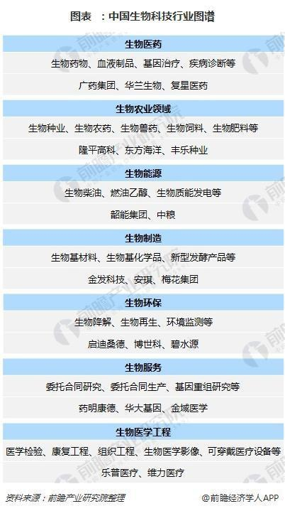
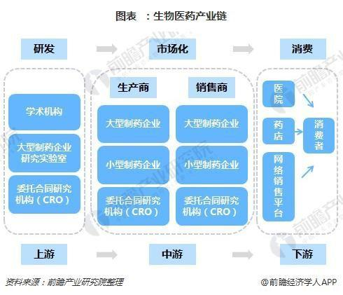

## 生物医药行业

近年来随着生物医药技术的不断发展，作为国家战略新型产业，我国生物医药产业得到飞速发展，各项生物医学技术不断突破，产业规模持续增长，其产值在医药产业中的比重也在不断攀升，生物医药为广大人民群众的健康、促进行业的繁荣与发展作出了重要贡献。生物技术与人工智能、量子信息和移动互联网被认为是当今世界的颠覆性技术，生物科技在引领未来经济社会发展中的战略地位日益凸显，生物产业正加速成为继信息产业之后新的主导产业。目前基因编辑技术、合成生物学和细胞免疫治疗在农业育种、工业微生物生产和疾病治疗等方面都呈现出颠覆性影响

<!-- more -->

生物医药行业在全球来看都属于朝阳行业，随着基因、免疫等等基础学科的快速进展，应该是有着广阔的前景的。
国家整体经济不断发展，人民花在整个医疗行业上的钱的总数是必然增加的。并且中国预计在未来二十年，将会进入到快速老龄化的通道，这样医疗行业整体的规模可能会有飞快的增长。
国家在生物、化学、医学等相关的基础学科有大量的投入，有一个不小的人才资源库。并且随着NIH资金缩紧，有不少在美工作多年、经验丰富的人回流国内。这几年国外大药企合并频繁，研发部门的裁撤很多，造成一大批懂学术、了解行业的人归国。这些人或者创业、或者加入国内公司，快速的增强了国内企业的研发能力。
国内这两年的融资环境较好，很多投资人也对医药行业长线看好。这使得目前医药及相关的行业融资环境比较宽松，给整个行业的大爆发奠定了一个不错的基础。

### 生物科学技术的内涵

生物科学技术是指利用动物、植物、微生物等生物体来生产有用的物质、改进与改良生物特性，实现创新物种、降低成本等效果的科学技术。生物科学技术在医学医药领域中具有应用的可行性，并得到了广泛的应用，主要包含在医疗领域中的应用及制药领域中的应用两大方面。


## 中国生物医药产业现状

中国的生物医药企业起步晚于发达国家，与发达国家在全球市场占有率、产品竞争力等方面的差距依然很大。

随着我国经济的发展、生活环境的变化、人们健康观念的转变以及人口老龄化进程的加快等因素影响，与人类生活质量密切相关的生物医药行业近年来一直保持了持续增长的趋势。

在《十三五生物产业发展规划》中，生物产业的重点领域分为七类：生物医药产业、生物医学工程、生物农业、生物制造产业、生物能源产业、生物环保产业以及生物服务产业。这七类生物产业细分市场中，均有头部竞争者脱颖而出。



生物医药即是生物技术在各种制药产业内的应用，目前形成了研发——市场化——消费完整的产业链条。



### 生物医药产业特点

1.产品回报率高
生物工程药物的利润回报率很高。一种新生物药品一般上市后2-3年即可收回所有投资，尤其是拥有新产品、专利产品的企业，一旦开发成功便会形成技术垄断优势，利润回报能高达10倍以上。

2.产业技术含量高
生物医药行业同时也是知识密集型产业，高技术含量对于企业的创新能力提出了高的要求。

3.产品开发周期长
生物药品从开始研制到最终转化为产品要经过很多环节，而且产品培养和市场开发较难，所以开发一种新药周期较长，一般需要8-10年、甚至10年以上的时间。

4.产业风险高
生物医药产品的开发孕育着较大的不确定风险，新药的投资从生物筛选、药理、毒理等临床前实验、制剂处方及稳定性实验、生物利用度测试直到用于人体的临床实验以及注册上市和售后监督一系列步骤，可谓是耗资巨大的系统工程。

5.产业投入大
生物制药是一个投入相当大的产业，主要用于新产品的研究开发及医药厂房的建造和设备仪器的配置方面。

## 未来5年至10年最看好的医药龙头股

恒瑞医药：
公司是国内最大的抗肿瘤药、手术用药和造影剂的研究和生产基地之一。报告期内，公司作为国内医药创新和高质量发展的代表企业，荣获“全国五一劳动奖状”，并在中国化学制药行业年度峰会中荣获“2019中国化学制药行业工业企业综合实力百强”、“2019中国化学制药行业创新型优秀企业品牌”等众多荣誉。

迈瑞医疗：
国内医疗器械龙头,中国收入体量最大的医疗器械上市公司,多条产线市占率位于国内TOP3;主营分为生命信息与支持、体外诊断和医学影像系统三大类,监护仪设备、超声影像类设备在国内市占率保持第一位(65%),麻醉类市占率11%

爱尔眼科：
我国规模最大的眼科医疗机构之一,国内发展速度最快的眼科医疗机构之一.连续两年入选"清科--中国最具投资价值企业50强". 中国最大规模的眼科医疗连锁机构,也是全球最大眼科医疗集团,体内外有近250家眼科医院在运营(体内82家,体外177家),公司营收、医院数、门诊量和手术量均全球第一,并遥遥领先。中国最大规模眼科医疗机构之一

长春高新：
水痘疫苗龙头;子公司长春百克拥有水痘疫苗-预防水痘,市占率第一;孙公司吉林迈丰生物主要产品人用狂犬病疫苗处于Ⅲ期临床试验;子公司百克药业主要研究中国流行株预防用艾滋病疫苗。公司控股子公司长春金赛药业(控股70%)是全国制药企业中唯一的国家级基因工程制药孵化基地，其生长激素系列产品已经在全国乃至亚太居第一位，成为儿童生长发育治疗领域的领导者，在烧烫伤、辅助生殖、抗衰老、肿瘤等多个领域也正在建立具有核心竞争优势的领先地位。金赛药业继续保持生长素市场占有率全国第一。

康泰生物：
A股疫苗标的中在研产品管线最为丰富的公司之一,多个项目对标海外重磅产品;全资子公司民海生物主营疫苗研发生产等,目前有4类产品在售,分别为重组乙型肝炎疫苗预防乙肝,市占率58.19%,行业第一;b型流感嗜血杄菌结合疫苗-预防b型流感嗜血杄菌引起脑膜炎、肺炎等,市占率31.58%;麻风二联苗-预防麻疹和风疹,市占率32.94%;四联苗预防百日咳杆菌、白喉杆菌引起的疾病等,市占率100%;自巴斯德引进冻干人用狂犬病疫苗,23价肺炎球菌多糖疫苗获得药品注册批件。

华兰生物：
流感疫苗龙头,独家供应国内四价流感疫苗,拥有国内最大的流感疫苗生产基地;拥有流感病毒裂解疫苗预防流感、甲型HIN1流感病毒裂解疫苗预防甲型H1N流感病毒、ACYW135群脑膜炎球菌多糖疫苗-预防脑膜炎和重组乙型肝炎疫苗-预防乙肝四大上市品种公司冻干人用狂犬病疫苗已进入申报文号阶段;18年5月,子公司取得吸附手足口病EV71型灭活疫苗药物临床试验批件,12月儿童四价流感疫苗获批。公司是国内首家通过GMP认证的血液制品企业，国内行业中产品品种最多、血浆综合利用率最高的企业之一。

智飞生物：
我国综合实力最强的上市民营生物疫苗供应和服务商之一;目前有5类自主产品在售,包括 AC-hib疫苗(19年4月子公司暂停该疫苗生产)、ACYW135流脑多糖疫苗、Hib疫苗AC流脑多糖结合疫苗、微卡,其中三联疫苗( AC-Hib)市占率100%,ACYW135流脑多糖疫苗市占率26.4%;代理默沙东四价HPV、23价肺炎、灭活甲肝等疫苗;拥有大陆代理权的九价HPV疫苗获得批签发证明;7月与默沙东签署五价轮状疫苗补充协议,冻干人用狂犬病疫苗获得临床试验批件;受让中东呼吸综合征疫苗，最近三年公司疫苗产品销售量分别占据我国二类疫苗市场10.99%、11.13%和10.78%的份额，市场占有率稳居国内民营疫苗企业排名第一。

云南白药：
公司是我国知名中成药生产企业之一,是云南大型工商医药企业之一，是中国中成药五十强之一。1997年被确定为云南省首批重点培育的四十家大企业大集团之一。2010中药行业品牌峰会品牌评选活动首次发布的中药行业各领域十强企业品牌榜单上，云南白药在中药企业传统品牌榜单十强中排名第一。

健帆生物:
血液净化领域国内第一名，自主研发的一次性使用血液灌流器、一次性使用血浆胆红素吸附器、DNA免疫吸附柱及血液净化设备等产品广泛应用于尿毒症、中毒、重型肝病、自身免疫性疾病、多器官功能衰竭等领域的治疗。
公司首创了新型人工肝治疗模式双重血浆分子吸附系统（DPMAS），先后被写入中华医学会《非生物型人工肝治疗肝衰竭指南》、《肝衰竭诊治指南》和《肝硬化肝性脑病诊治指南》，在新冠肺炎重症救治方面，DPMAS技术也发挥着积极作用，应用空间广阔。

通策医疗:
国内口腔连锁第一股。公司目前已在全国各地开设32家口腔医院，采取“区域总院+分院”的发展模式，以浙江省内为例，以杭州口腔医院平海院区、城西院区和宁波口腔医院三家总院为中心，加上各自具有管理关系的分院，构成3个“总院+分院”的区域医院集群。
未来3-5年，公司在浙江将通过“蒲公英计划”进一步渗透下沉到主要县（市、区），布局 100 家口腔医院。浙江省外，公司通过口腔医疗基金在武汉、西安、重庆、成都等投资新建大型口腔医院，每家体量相当于杭州口腔医院中心医院，体现出逐步面向全国战略布局的野心。
除了口腔，公司还在辅助生殖和眼科领域有所布局，辅助生殖领域主要是昆明市妇幼保健院波恩生殖中心，眼科领域则是通过通策眼科投资公司参与投资的浙江广济眼科医院，作为浙二医院眼科中心，加挂“浙江大学眼科医院”


## 新药从研发到上市必经流程

10 年时间，花费 10 亿美元，研发一款新药，无论是利益的驱动，还是拯救万千患者的成就感，药企的这一行为都值得我们尊敬。
一款新药从研发到上市都需要经过哪些流程？每一步又有哪些经验可以借鉴？本文以小分子药物为例，试着做了一个梳理，希望能对您有所帮助。

### 临床前研究

1.研究开发（一般 2-3年）

实验室研究，寻找治疗特定疾病的具有潜力的新化合物
（1） 药物靶点的发现及确认
这是所有工作的起点，只有确定了靶点，后续所有的工作才有展开的依据。
（2）化合物的筛选与合成
根据靶点的空间结构，从虚拟化合物库中筛选一系列可匹配的分子结构，合成这些化合物，它们被称为先导化合物。
（3）活性化合物的验证与优化
不是所有先导化合物都能符合要求，在这个阶段需要通过体外细胞试验验证，初步筛选出活性高、毒性低的化合物，并根据构效关系进行结构优化，这些化合物称为药物候选物。

同时也存在一个化合物对目标 A 靶点没有作用，却有可能对其他的 B 靶点、C 靶点有非常好活性的情况，暂且不表。

2.临床前实验（一般 2-4年）

这一阶段目的，一是评估药物的药理和毒理作用，药物的吸收、分布、代谢和排泄情况（ADME）。二是进行生产工艺、质量控制、稳定性等研究（CMC）。

第一部分的实验需要在动物层面展开，细胞实验的结果和活体动物实验的结果有时候会有很大的差异。这一步的目的是确定药物的有效性与安全性。第二部分需要在符合GMP要求的车间完成。

（1）药理学研究
包括：药效学、药动学

（2）毒理学研究
急毒、长毒、生殖毒性，致癌、致畸、致突变情况

（3）制剂的开发
总不能弄点化合物就直接往嘴里倒吧，制剂开发是药物应用的一个重要环节。比如有的药口服吸收很差，就需要开发为注射剂。有的药在胃酸里面会失去活性，就需要开发为肠溶制剂。有的化合物溶解性不好，这也可以通过制剂来部分解决这个问题。还有的需要局部给药，就需要通过制剂开发成雾化剂、膏剂等。

### 临床试验审批 Investigational New Drug（IND）

### 临床试验（一般3-7年）

人体试验共分三期：

• Ⅰ期临床 20-100例，正常人，主要进行安全性评价。
• Ⅱ期临床 100-300例，病人，主要进行有效性评价 。
• Ⅲ期临床 300-5000例，病人，扩大样本量，进一步评价。

### 新药上市审批 New DrugApplication

NDA申报资料 — CTD(CommonTechnical Document)

CTD主要由五大模块组成：

```
行政和法规信息 
概述:药物质量、非临床、临床试验的高度概括
药品质量详述
非临床研究报告
临床研究报告
```

### 上市后研究

临床监测期：IV期临床
受试者要大于 2000 例，同时要进行社会性考察

### 上市后再审批（一般上市后4-10年）

目的：重新审核 NDA 中的有效性和安全性。