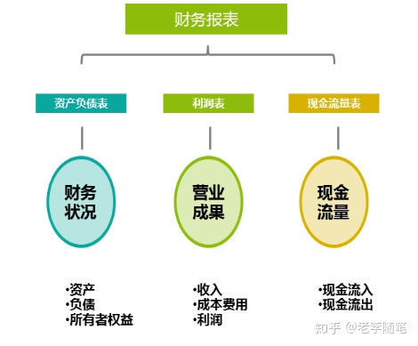

## 收入

年报上的财务报告主要看三大表分别指资产负债表（最重要的一张表）、现金流量表、利润表。

<!-- more -->

1.利润表查看指标：毛利率、净利率、ROE、三费占比。

利润表的话又叫损益表，主要体现公司在一段时间内是赚钱还是亏钱。通过查看公司的净利润，我们就知道这段时间是赚了还是亏了。

毛利润 = 营业收入-营业成本，毛利率=毛利润 / 营业收入

净利润=营业收入-营业成本-所得税，净利率 = 净利润 / 营业总收入

通常情况下通过利润表中的四个数据来判断他的盈利能力。分别是：毛利率、净利率、净资产收益率ROE、三费占比。

一切不以收入增长的成长都是耍流氓。

一家公司收入增长停滞，往往意味着产品不能满足市场需求或者被市场淘汰，也可能是行业在走下坡路，这是时候千万要小心，不管估值多么便宜都可以多等等。

与之对应，一些互联网公司虽然连年亏损，但是收入增长稳定，而且都是高速增长，这样的话也不影响市场对他中长期看好。

最典型的就是亚马逊，公司连续亏损20年，市值飙升至万亿，稳居世界前十。公司老板贝佐斯即使被前妻分走了2500亿，依然还是世界首富！为什么呢？净利润只是一种会计意见，是一个计算结果。利润可以简单的理解为收入-成本。可能一开始成本比收入高很多，但随着收入高速增长，平均成本稳定下行（规模效应），那么未来盈利就是可预期的。

前几年那些资本补贴用户烧钱大战的底层逻辑就是如此，只要收入和增速持续跟近，盈利基本上是迟早的事。亏损20年的亚马逊在2015年开始盈利，2019年盈利130亿美元。同样亏损10年之后的京东2019年最新业绩是盈利122亿。在2010年开始的互联网中“百团大战”胜出的美团2019年二季度也开始盈利，并且最近几个季度收入增速都在50%以上。收入持续稳定增长，是决定一家公司是否值得长期持有重要因素。

## 变化

一家公司每年经营成果，会有哪些变化体现在年报中？收入变化。已经重点说过，基本上可以有“一票否决权”，也就是对于非周期行业的公司，收入持续下降，这种公司基本上可以不用看。

对于行业龙头公司，如果遇到黑天鹅事件，导致收入（利润）大幅下降，股价大跌的，可能是一个重大买入机会。资产变化。最直观的是净资产，但净资产=资产-负债，负债是一般是确定值，但资产有很多估算部分，所以导致净资产也是一个计算值，仅供参考。所以，那些说市净率低的股票值得投资是值得商榷的。

资产变化中最有价值的部分是什么呢？流动资产，主要包括货币资金、短期投资、应收票据、应收账款和存货等，这些都是与公司经营直接相关。所以从中长期看，只有流动资产不断增加的公司才谈得上成长性。在流动资产增长前提下，要警惕应收票据、应收账款和存货大幅增加，这都是给“资产质量”打折扣的重点项，甚至是负分项。人才变化。很少有人会关注年报中公司的人才变化。但是一家公司核心竞争力除了产品，就是人才和组织架构，其中人才是核心。人才通过组织架构不断参与和完善公司产品，获得市场认可，才能体现公司的价值。人才和公司之间又是相互的。优秀人才更愿意选择优秀公司，优秀公司也会想方设法吸引和留住优秀人才。

看现金流要想彻底的了解一家公司，只要清楚知道“一块钱”在公司是如何流动的。钱进入公司的方式主要收入和融资。收入是关键，融资是辅助，一般只有初创型或者快速成长（烧钱）公司才会依赖融资。对于上市公司而言，我非常不喜欢那些总是向股东伸手要钱发展的公司，就好比一个成年人总是找父母要钱一个道理。反复再融资，不管以什么名目，很可能是为了掩盖公司入不敷出或者其他问题。历史上那些长期大牛股都很少反复融资的，因为自己能赚钱！！钱流出公司方式主要是 成本 和 投资。成本和收入是相对应，一旦成本持续大于收入，公司就会入不敷出，可能就需要借钱度日，借不到钱现金流就断了，要么变卖资产，要么破产。所以，控制成本是管理层和股东必须考虑的问题。
