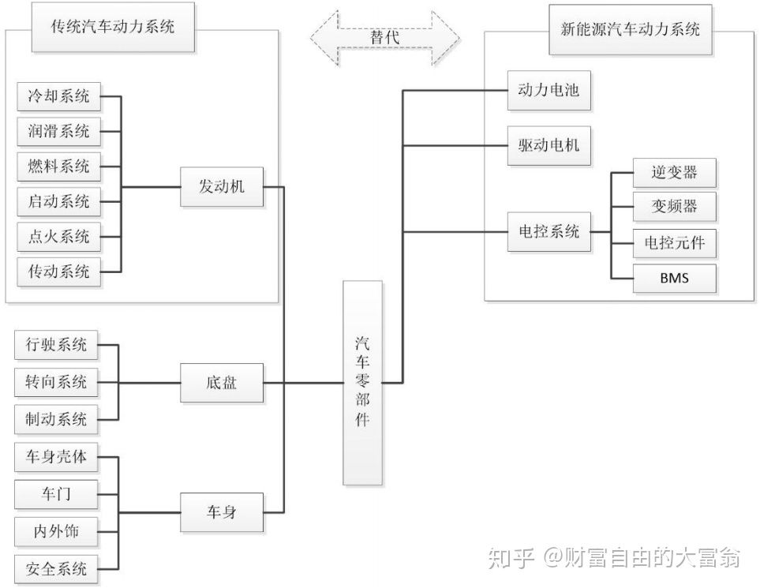
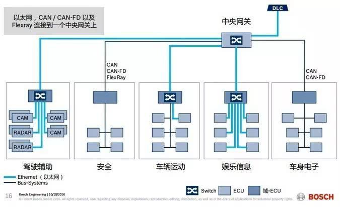
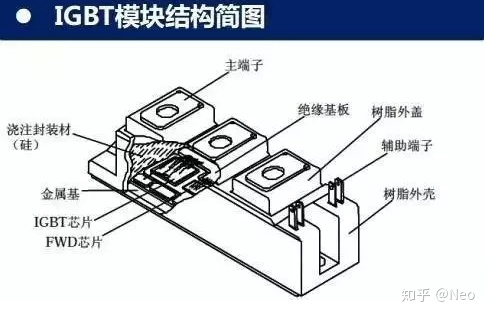
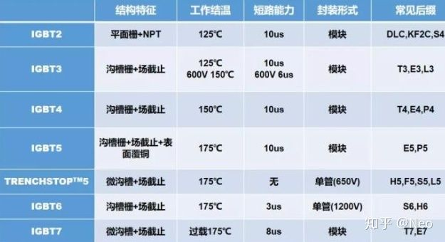
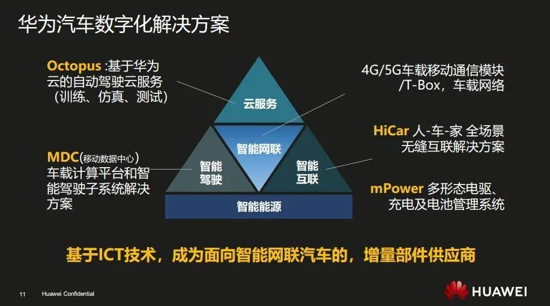
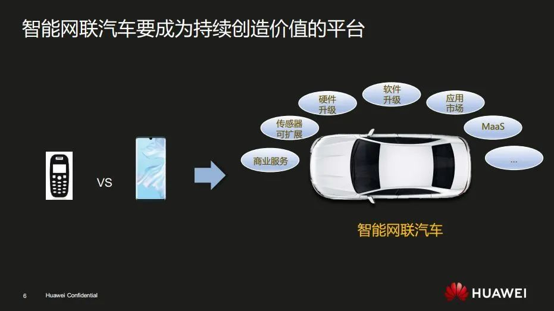
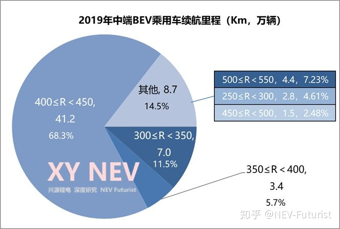

## 新能源汽车

新能源汽车是指采用非常规的车用燃料作为动力来源，综合车辆的动力控制和驱动方面的先进技术，形成的技术原理先进、具有新技术、新结构的汽车。新能源汽车包括纯电动汽车、增程式电动汽车、混合动力汽车、燃料电池电动汽车、氢发动机汽车、其他新能源汽车等。
<!-- more -->

纯电动汽车：纯电动汽车(Blade Electric Vehicles，BEV)是一种采用单一蓄电池作为储能动力源的汽车，它利用蓄电池作为储能动力源，通过电池向电动机提供电能，驱动电动机运转，从而推动汽车行驶。

混合动力汽车：混合动力汽车(Hybrid Electric Vehicle，HEV)是指驱动系统由两个或多个能同时运转的单个驱动系联合组成的车辆，车辆的行驶功率依据实际的车辆行驶状态由单个驱动系单独或多个驱动系共同提供。因各个组成部件、布置方式和控制策略的不同，混合动力汽车有多种形式。

燃料电池电动汽车：燃料电池电动汽车(Fuel Cell Electric Vehicle，FCEV)是利用氢气和空气中的氧在催化剂的作用下．在燃料电池中经电化学反应产生的电能作为主要动力源驱动的汽车。燃料电池电动汽车实质上是纯电动汽车的一种，主要区别在于动力电池的工作原理不同。

一般来说，燃料电池是通过电化学反应将化学能转化为电能，电化学反应所需的还原剂一般采用氢气，氧化剂则采用氧气，因此最早开发的燃料电池电动汽车多是直接采用氢燃料，氢气的储存可采用液化氢、压缩氢气或金属氢化物储氢等形式。氢发动机汽车：氢发动机汽车是以氢发动机为动力源的汽车。一般发动机使用的燃料是柴油或汽油，氢发动机使用的燃料是气体氢。氢发动机汽车是一种真正实现零排放的交通工具，排放出的是纯净水，其具有无污染、零排放、储量丰富等优势。其他新能源汽车：其他新能源汽车包括使用超级电容器、飞轮等高效储能器的汽车。

电动车的三电是指电池、电驱和电控技术。“三电系统”占据了纯电动汽车成本的一半，也就是说，缺少核心技术的企业，势必会在发展之路上受制于第三方。”， “三智”是指智能网关、智能座舱和自动辅助驾驶系统。

新能源汽车和锂电池的发展前景，即产业成熟之后其单车造价和后续用车消耗、用车体验、环保性能都会好于燃油车，成为社会主流的选择；


## 电动化

目前电驱动汽车在全球已基本形成共识，几乎所有的传统车企都纷纷转型，抛出了各自的未来战略。未来究竟是纯电动汽车（BEV）还是燃料电池汽车（FCV）？B与F之争，不仅仅是未来汽车产业格局之争，背后还有国家之间的豪赌。2008年，特斯拉第一批量产车Roadster正式下线交付，2012年豪华跑车Model S亮相，到Model X再到平民车型Model 3，可以说随着特斯拉的成功，纯电动驱动策略几乎燃动了整个世界的新能源汽车产业。之所以说几乎，是因为日本那“骄傲的坚持”，Mirai（FCV）和ENE-FARM（家用燃料电池系统）的成功给了岛国人打造“氢能社会”的信心，当然也体现了岛国人燃料电池技术及整个产业链的全面领先。不过，情况或许正在发生一些有趣的变化，在全球汽车产业电动化、智能化不可逆转的大趋势面前，岛国对氢能社会的信心似乎已出现了焦虑。

三元正极材料作为动力电池（锂电池）的主流已经趋于明朗，其单体电池容量从“十二五”的180 Wh/kg达到了现在的260Wh/kg，距离“十三五”新能源汽车专项提出的300Wh/kg已经不远，说明BEV的“里程焦虑”问题已不再棘手（轻量化也有助于提升续驶里程）。

## 电动车和传统燃油车的区别




## 动力系统

首先对于动力系统而言，分为内燃机驱动，电机驱动，和电机内燃机协同驱动三个种类。
在动力系统这一点上我认为电气化的趋势是十分明朗的，电机作为动力输出单元，相对内燃机有如下几个优势：

```
1. 成本优势：同一最大输出功率水平下，电机本身的成本非常低，这也是特斯拉性能爆棚但售价相对于性能车较低的原因。
2. 效率优势：电机在输出过程中，单在这个过程中效率变化不大并且非常高（90%左右），非常适合频繁启停的任务要求。
3. 保养、寿命优势：优质电机的保养间隔时间在30,000小时左右，与内燃机有数量级上的差别
4. 结构、体积优势：这个有点玄乎，同样输出功率下，电机体积非常小，并且可以实现轮毂附近布局的形式，将整个传动系统极度简化，换句话说，奥迪花了几十年引以为傲的quattro四驱系统，在电机车中可能是一个程序升级就能解决的问题。
5. 控制、安全优势：首先电机的反应速度极快，电信号能够直接转化到机械信号，而传统汽车的启动加速停止每一环都有一个控制误差的Loop，紧急情况下反应就慢了。还有就是，自动驾驶或者程序辅助驾驶难度更大，在电机动力系统的控制与反馈就非常灵敏
```

## 电气架构（EEA）

电子电气架构（EEA），以划分不同功能域的方式来集中控制不同ECU，这就是我们现在常说的车身与便利系统(Body&Convenience)、车用资讯娱乐系统(Infotainment)、底盘与安全系统(chassis and safety)、动力系统(powertrain)，以及高级辅助驾驶系统(ADAS)等五个大域，当然还包括下面的各种子域。这其中，每个域或子域都有对应的域控制器DCU和各种ECU，所有这些构成了汽车电子电气架构的网络拓扑。


自动驾驶要求更高的算力和更多传感器件，ECU的增长终将迎来爆发，这种分布式的ECU架构如果无限制扩张，势必面临着巨大挑战：

1. ECU的算力不能协同，并相互冗余，产生极大浪费。
2. 大量分离的嵌入式OS和应用程序Firmware，由不同Tier1提供，语言和编程风格迥异，导致没法统一维护和OTA升级
3. 这种分布式的架构需要大量的内部通信，客观上导致线束成本大幅增加，同时装配难度也加大
4. 最后，第三方应用开发者无法与这些硬件进行便捷的编程，成为制约软件定义的瓶颈。

以太网新型总线技术和5G无线技术的引入，已使这一融合变为部分现实。如果网络带宽足够宽，延迟足够低，这一趋势将会更加明显：算力向中央集中，向云端集中，汽车电子架构(EEA)的演进也正朝着这个方向前行。


## 电动汽车之IGBT

IGBT是由 BJT(双极结型晶体三极管) 和 MOS(绝缘栅型场效应管) 组成的复合全控型-电压驱动式-功率半导体器件，也可简单理解其为电子控制开关,当能量从电动机中以直流电形态输出时，需要通过IGBT功率模块完成从直流（DC）到交流（AC）的转换，才能够在磁场作用下转化为机械力驱动车辆，因此在整个过程中，作为电流转换器的IGBT就变得至关重要。



第一：除了比亚迪、中车等部分可独立研发制造乘用车车规级IGBT，其余都不行。
第二：国外XxxIGBT模块在国内装机数达58.7%。而大部分IGBT厂家中，去年比亚迪份额最大18%，而且基本上自产自销，对外销售只有4万套。比亚迪汉已经使用自己的碳化硅IGBT。



## 智能化

指搭载先进的车载传感器、控制器、执行器等装置，并融合现代通信与网络技术，实现车与X（车、路、人、云端等）智能信息交换、共享，具备复杂环境感知、智能决策、协同控制等功能，可实现“安全、高效、舒适、节能”行驶，并最终可实现替代人来操作的新一代汽车。
人们对智能汽车的定义中，无人驾驶与可提供丰富体验的智能座舱就紧紧绑在了一起。智能汽车不再是一个交通载具，而成为了一个可移动的智能空间。百年一脉，智能网联汽车发展仍要看车、网、路协同破局综上，通过搭载先进传感器等装置，运用人工智能等新技术，具有自动驾驶功能，并逐步成为智能移动空间和应用终端的新一代汽车，就是智能网联汽车。





## 挑战和机遇

既然电动汽车既有高性能和低噪音，又可以经济实惠，绿色环保，那为什么目前电动车的推广还没有获得成功呢？这就要说到电动汽车的『四大硬伤』了，即『充电慢』，『里程短』，『电池贵』，和『寿命短』。

首先是充电速度问题。燃油和混合动力汽车只要花几分钟的时间，就可以达到上千公里的续航里程。对于成本较低的220V家用充电，选用80安培的双充电器以后，充电速度也只有每小时100公里，如果是常见的15-20安培的适配器，充电速度则最多为每小时25公里。如果是110伏电压的地区，比如美国，日本，充电的速度则会更低，只有每小时6.5公里左右。



## 新能源汽车产业链

### 动力电池

按不同材料，目前市场中现有的动力电池主要分为磷酸铁锂电池、三元锂电池（包括NCA和NCM）、锰酸锂池、钴酸锂池、镍氢电池、钛酸锂池等。其中，磷酸铁锂电池是目前中国电动汽车市场中的主流电池类型，但近年来市场增速明显逊色于三元锂电池。

三元材料电池由于具有电压平台高、能量密度高、振实密度高、电化学稳定、循环性能好等特性，在提升新能源汽车的续航里程、减轻用户续航里程忧虑方面具有明显优势，同时还具有放电电压高，输出功率比较大、低温性能好、可适应全天候气温等优点，因此正逐渐受到汽车生产厂商和用户的青睐。

分车型来看，在纯电动乘用车领域三元电池的比重越来越大，从14年的16%到16年的71%；在混动乘用车领域，三元的占比还有很大的提升空间；在纯电动客车领域，目前来看依然是磷酸铁锂的市场；在混动客车领域锰酸锂是主流；在纯电动专用车领域，目前来看三元电池依然是未来的趋势。

### 产业链

锂电池、正极材料、负极材料、电解液、隔膜、充电桩、电池、电机、电控、整车。

首先是从最上游锂辉石、锂精矿/卤水中提取碳酸锂，碳酸锂按级别分为工业级碳酸锂和电池级碳酸锂，能用来做锂电池的是电池级碳酸锂，纯度要求更高，价格也更高，电池级碳酸锂是锂电池正极材料不可缺少的原料，有了正极材料，还需要负极材料+电解液+隔膜，总共这四块才组成锂电池整个电池组，大概流程如下：
锂辉石、锂精矿/卤水→工业级碳酸锂、电池级碳酸锂→锂电池正极材料（核心原材料碳酸锂）+负极材料（主要是碳）+电解液（核心材料六氟磷酸锂）+隔膜→锂电池。然后才是电池管理系统、电机、电控、电动车及配套设施充电桩。

```
动力电池制造：宁德时代、国轩高科、鹏辉能源
正级材料：当升科技、杉杉股份、容百科技、德方纳米、格林美、道氏技术
负极材料：璞泰来、嘉元科技、晶瑞股份
电解液：新宙邦、天赐材料、石大胜华、多氟多
隔膜：恩捷股份、星源材质、长园集团（湖南中锂）
结构件：科达利
锂：天齐锂业、赣锋锂业、雅化集团
钴：华友钴业、寒锐钴业、洛阳钼业
锂电设备：先导智能、赢合科技、杭可科技、华自科技
```

## 宁德时代(CATL)

在一辆新能源汽车成本中，电池的成本要占到30%~40%, 作为国内动力电池的龙头，宁德时代，2011年成立，专注于新能源汽车动力电池系统、储能系统的研发生产；2013年收购广东邦普，进入锂电池回收利用以及正极材料领域；2018年控股NAL（北美锂业）布局锂矿资源。目前，宁德时代已成为动力电池领域的全球龙头。宁德在第一个十年完成原始积累，国内一超地位稳固，执产业链牛耳；第二个十年，维持超高强度研发投入加速赶超，借力产业集群优势进击全球霸主。国内：市占率持续提升，与主流车企深度绑定，一超地位稳固。目前宁德在国内市占率持续提升，2019 年达51.8%，产业链垂直深度布局，从最上游的资源到正极材料布局均通过股权方式深度介入，并主导四大材料。与国内主要自主品牌成立合资公司，深度绑定，一超地位稳固。创新推出CTP方案，可有效降本增效，深入车企研发体系，强化议价能力。海外：超高强度研发投入，借力产业集群优势，进击全球霸主。

宁德从2016年研发投入并且超过LG化学动力电池业务， 2018年更是超过LG 化学整个电池业务部门，凭借中国工程师红利，实际投入远强于日韩竞争对手，加速赶超。目前公司国际车企在手订单仅次于LG 化学，凭借产业集群优势，公司营业利润率远高于日韩竞争对手，进击全球霸主。

## 比亚迪

比亚迪新能源汽车的销量连续4年全球第一，连续5年国内销量第一。

作为全球新能源汽车产业的领跑者之一，比亚迪拥有庞大的技术研发团队和强大的科技创新能力，已相继开发出一系列
全球领先的前瞻性技术，建立起于新能源汽车领域的全球领先优势。比亚迪作为一家横跨汽车、电池、IT、半导体等多个领
域的企业集团，拥有全球领先的电池、电机、电控及整车核心技术，以及全球首创的双模技术和双向逆变技术，实现汽车在
动力性能、安全保护和能源消费等方面的多重跨越，为全球汽车产业开拓出崭新的发展路径。
在动力电池领域，集团开发了高度安全的磷酸铁锂电池和高能量密度的三元电池，应用于电动商用车和电动乘用车领域，
解决了电动汽车电池在安全性、循环寿命和续航里程等方面的全球性难题。目前，集团已在动力电池领域建立起全球领先的
技术优势和成本优势，并通过动力电池产能的快速扩张建立起领先的规模优势。此外，积极布局研发SiC MOSFET，未来，比
亚迪旗下的新能源汽车将逐步搭载SiC电控，使整车性能在现有基础上实现显著提升。