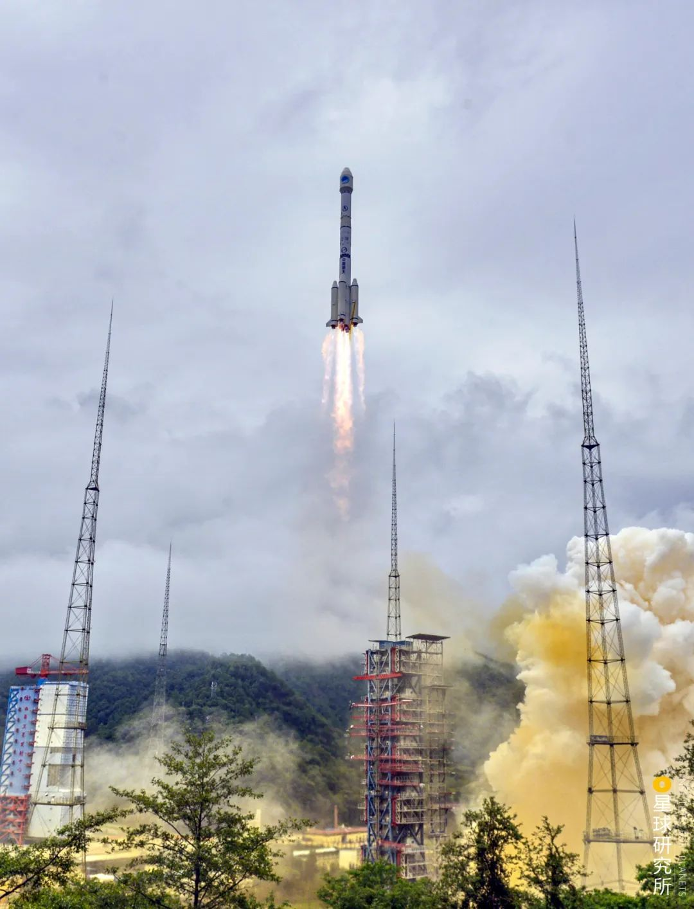
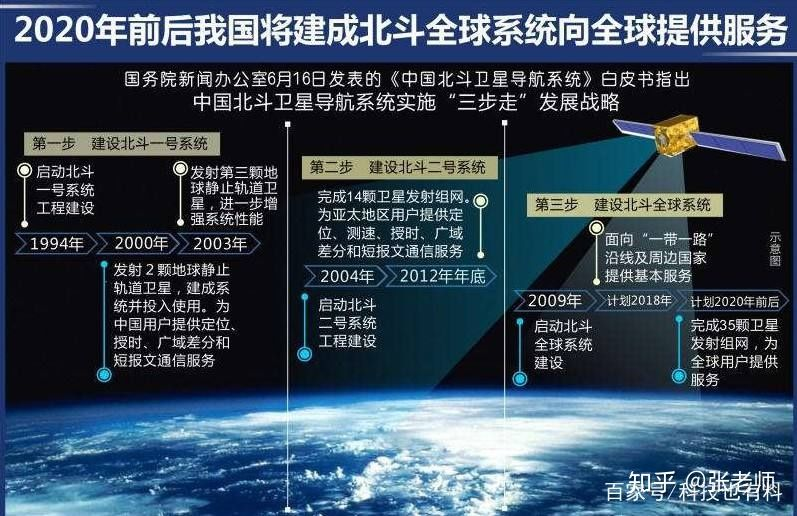
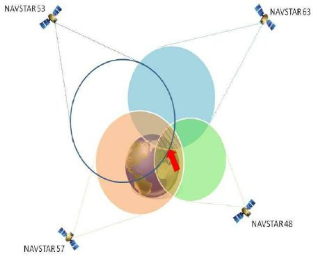

## 北斗20年

中国北斗卫星导航系统（英文名称：BeiDou Navigation Satellite System，简称BDS）是中国自行研制的全球卫星导航系统，也是继GPS、GLONASS之后的第三个成熟的卫星导航系统。北斗卫星导航系统（BDS）和美国GPS、俄罗斯GLONASS、欧盟GALILEO，是联合国卫星导航委员会已认定的供应商。

<!-- more -->

北斗卫星导航系统由空间段、地面段和用户段三部分组成，可在全球范围内全天候、全天时为各类用户提供高精度、高可靠定位、导航、授时服务，并具短报文通信能力，已经初步具备区域导航、定位和授时能力，定位精度10米，测速精度0.2米/秒，授时精度10纳秒。

2020年6月23日，北斗三号最后一颗全球组网卫星在西昌卫星发射中心点火升空。

北斗系统由空间段、地面段和用户段三部分组成。
空间段由若干地球静止轨道卫星、倾斜地球同步轨道卫星和中圆地球轨道卫星组成。
地面段包括主控站、时间同步/注入站和监测站等若干地面站，以及星间链路运行管理设施。
用户段包括北斗及兼容其他卫星导航系统的芯片、模块、天线等基础产品，以及终端设备、应用系统与应用服务等。

```
第一步，建设北斗一号系统。1994年，启动北斗一号系统工程建设；2000年，发射2颗地球静止轨道卫星，建成系统并投入使用，采用有源定位体制，为中国用户提供定位、授时、广域差分和短报文通信服务；2003年，发射第3颗地球静止轨道卫星，进一步增强系统性能。
第二步，建设北斗二号系统。2004年，启动北斗二号系统工程建设；2012年年底，完成14颗卫星（5颗地球静止轨道卫星、5颗倾斜地球同步轨道卫星和4颗中圆地球轨道卫星）发射组网。北斗二号系统在兼容北斗一号系统技术体制基础上，增加无源定位体制，为亚太地区用户提供定位、测速、授时和短报文通信服务。
第三步，建设北斗三号系统。2009年，启动北斗三号系统建设；2018年年底，完成19颗卫星发射组网，完成基本系统建设，向全球提供服务；计划2020年年底前，完成30颗卫星发射组网，全面建成北斗三号系统。北斗三号系统继承北斗有源服务和无源服务两种技术体制，能够为全球用户提供基本导航（定位、测速、授时）、全球短报文通信、国际搜救服务，中国及周边地区用户还可享有区域短报文通信、星基增强、精密单点定位等服务。
截至2019年9月，北斗卫星导航系统是在轨卫星已达39颗。从2017年底开始，北斗三号系统建设进入了超高密度发射。北斗系统正式向全球提供RNSS服务，在轨卫星共39颗。
2020年6月16日，北斗三号最后一颗全球组网卫星发射任务因故推迟。
2020年6月23日，北斗三号最后一颗全球组网卫星在西昌卫星发射中心点火升空。
```





现代人离开了导航，恐怕生活起来会很不方便，手机里的导航、开车时的导航，再到渔民在海上，都离开不卫星导航。
未来，卫星导航再结合5G技术、人工智能技术，让你可以不必自己亲自开车就能穿梭在城市各个角落（自动驾驶）；当你拉开窗帘，无人机就能把货物送到你家里，

北斗圆梦，星耀苍穹。

## 为什么北斗能服务无限个用户

北斗三号是一种无源定位系统，每一颗导航卫星的本质就是告诉你这么一个事情：现在几点了（时间ts），我在哪里（xs，ys，zs）。当你（接收机）收到信号时，可以通过比对，得到接收机上时间与接收到的卫星信息显示时间之间的差值，这个差值乘以光速就是你和卫星之间的距离。还有一个方法是数中间隔了多少个信号波长。
观测到四个卫星，就可以构建四个方程，解出四个未知数。

所以，对卫星而言，永远只做一件事情：往地面发信号，一直在说我在哪儿，几点了，卫星不需要做任何辅助你的计算。用户只要能收到信号进行解算即可,理论上用户量是无限的。



## 北斗背后的故事

1993年我国银河号货船被美军怀疑向运送化学武器。美军为了拦下这艘货船关掉GPS。
1996年李登辉抛出两国轮。台海危机爆发。第一发命中。后两发“失踪”。大大偏离目标。美国人关停了GPS系统。
2007年，北斗正式被踢出了伽利略计划。
2016年，南海对峙。冷战之后世界上最大规模的军事对峙，两个航母战斗群海，与中国海军摆开阵型，战争一触即发。如果我们还在用GPS定位，恐怕我们根本没有资格对峙。美军航母编队暴露，我们登报暗示美军航母的坐标，美军依“发现即摧毁”的原则撤了兵。


