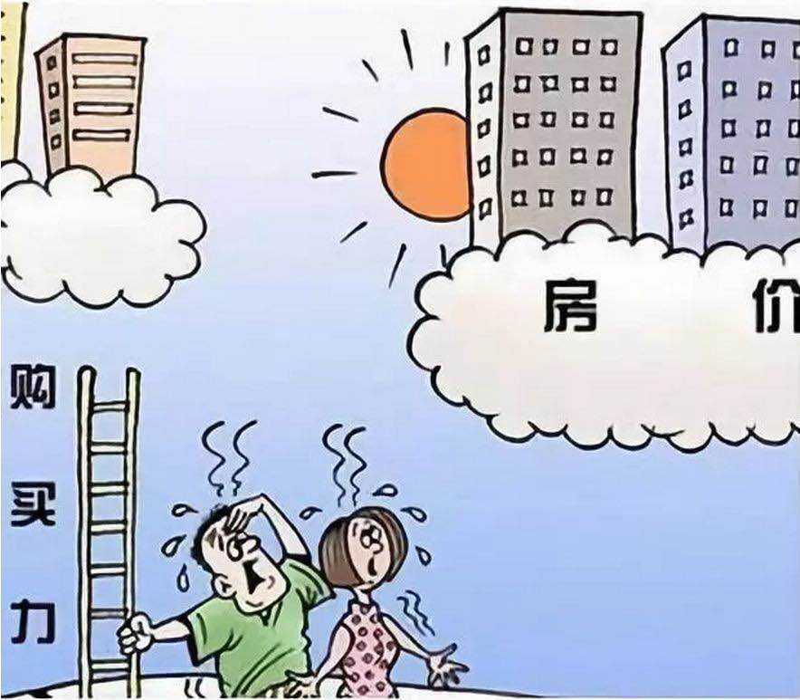

## 时代背景

1990年开始有商品房，之前都是分房，以前的房都是单位分房，有工作或者工作到一定职位才会分房。90年以后才有了商品房制度，房地产开始从无到有，也就短短20年达到了年销售额15万亿的规模。占整个上下游GDP 30%多左右的一个产业，有着深刻的背景和原因。房地产得以发展的原因:
1、房地产顺应中国加入WTO进入世界舞台的大浪潮。
2、中国拥有14亿人口，拥有海量的需求。
3、中国的文化观念以及社会风俗，房产已经和婚姻这种头等大事以及子女教育，乃至一个人的社会地位会不会受到尊重，看不看的起相挂钩。
4、产生泡沫的根本原因，就是普通人认为房价永远上涨的信仰。中国长期处于顺周期的发展过程，中国人产生了这种房价永远上涨的信仰，房地产可以可以说没有真正的大幅下跌过，每一次的小周期下跌，都会给刺激起来，例如08年，14年，都有中国的刺激经济政策。这都出现了报复性上涨，强化了人们的价格永远上涨的预期，政府不让跌的信仰，使得人们心中有预期上涨的心态。越涨越买，越相信越涨接着继续买。达成了信心，预期，资金的正反馈。

<!-- more -->

## 房地产行业相关领域

1、经济层面-实体产业层面
开发商-实体产业层面房地产业是国民经济最大的细分行业，是最大的国民建设。经济权重是最大的，会拉动整个经济领域除了农业以外的所有产业，达到同步扩张。比如：上游：钢铁，水泥，煤炭，建筑。中游：装饰、工程机械下游：买房后的装修，家用电器，汽车等房地产可以影响经济使得其他方方面面得到拉动。
2、金融层面-银行体系
银行体系-金融体系层面房地产是中国金融体系的核心抵押物，大多数金融小白是蓄水池，其实是信用放大器，平时说的放水，放水是需要载体的，房地产就是放水的载体。所以房地产作为核心抵押物，房地产的量和价同步上涨才能带来银行资产负债的大扩张，也就是货币的大扩张，可以说每一次房地产的大涨，都是货币宽松的盛宴。例如09-10年，15-16年，利率环境下行，货币宽松，降准，企业获取资金成本很低，目前房贷占比银行信贷总额的51%，还没算信用贷款，这样的贷款结构让房地产深深的和银行捆绑在了一起，很多人说房价不能跌，其实背后说的就是国家不会让银行体系崩溃。
3、地方政府-土地财政
土地层面-土地财政先说地方政府主要收入来源，主要分为两块，一是卖地，二是发债。地方政府卖地一年是7万多亿，地方债能卖出去的原因是投资人相信政府手里有地，不行了就卖几块还债。房地产就是地方政府的钱袋子。房地产行业牵连之广，影响之深，不光是实体产业，还牵动了金融和土地财政，

只有把这三个看透了，才会对房地产有一个正确的三观，其实不难发现你把他们连起来，它们也就是利益共同体。开发商连着实体银行连着金融体系地方政府连着土地财政开发商，银行，地方政府，一荣俱荣，一损俱损。广大的购买者也就是交易对手方，大家也可以知道会是谁。很多地产商都是国资背景，拿地非常积极，其实它们三个坐下来一谈，就可以确定土地卖不卖以及多少价格，根本不是招拍挂的决定的。我们看到地王的出现，经济这么差，还能出现地王，就是给普通人看看，告诉你面粉还是很贵，不要指望房价会跌，强化你永远上涨的预期。

房地产是一个重量级产业，大而深，和中国人的利益息息相关。老百姓的资产70-80%（或者低估60%）都是房地产，这个行业分析起开相当复杂，对经济，ZZ，社会制度影响相当大的一个行业。

## 一般视角的中国房地产本质

国家利用房地产作为工具去剥削我们的剩余价值，可以简单理解成房地产本来就是一种税收，政府希望用这些东西去逼你奋斗，去迫使你进取。
改革开放这几十年的快速发展根本原因是全体人民群众的共同努力，但另一方面也牺牲了全体人民群众的财富。

我们确实享受到改革开放的红利，但我们又把我们挣来的财富大部分扔到了房产上面，对于国家来说，房产本身是无成本，但国家在这个过程中通过卖地把居民好不容易累积的财富拿来再发展，这也就是一个我国这些年改革开放经济其中的一个来源。

所以每次房子涨价的背后，谁的获益最大？并不是那些花了天价买地的房地厂商们，而是各地政府，这些地对于各地政府来说基本是没有成本的，只要上面允许，随便卖，这也就是为什么当地疯狂卖地的原因，一本万利的买卖谁不想做。

在政府眼里，房地产涨价是必须的，国家必须时不时通过房地产收割一波居民的财富。因为对居民来说房地产是财富，可对于国家来说那什么也不是。而为了让这些房地产更有吸引力，更能鼓励所有创造财富的人把财富投进去。

国家做了这些事情：把房子和户籍联系在一起，把户籍和教育、医疗、养老联系在一起，这还不算完，国家又把产业只放在几个特定的城市，让其他城市所有获取财富的年轻人用他们积累的财富或者用他们的未来去换这些东西。

民众在这一刻发现：似乎只有这些地方才能让我们实现价值，我们别无选择，我们必须买这些区域的房子，而这就意味着我们的财富必须被聚到房子里。

## 更高视角的中国房地产

一个人的高度越高，视野越宽，智慧也就越高，看问题也将更长远更全面。这句话很容易理解，不识庐山真面目，只缘身在此山中。当我们看一个复杂事物的时候，为什么很难看懂呢？那就是因为你站的不够高，看的不够远。要能看明白整个庐山的面貌，站在半山腰树林子里肯定是看不清的，要爬到山顶，才能看明白。

很多人动不动就拿中国来跟美国比跟欧洲比，这种人脑子就是浆糊。西方发达国家，人家都发展了一百多年甚至两百年了，咱们满打满算也就二三十年，如何比？况且我们的发展是建立在人口众多且普遍教育程度偏低的基础上，并且有影响深重的千年传统思想影响，如何比？且西方的那些发达国家，上百年的发展大都建立在殖民地掠夺基础上，或者金融霸权基础上，这如何比？因此，不同的国情环境不能简单地类比，这是认识论的基本常识。因此，无论从任何角度来讲，像中国这样的极其复杂的大国治理比任何一个西方国家都难上千倍万倍。

做股票的人，绝大部分都盯着每天的K线图，以这样的视野高度如何能看懂未来的走势呢？根本不可能，这种人不是笨就是傻，被当成韭菜来剁也无可厚非了。做股票，不能盯K线图，要把格局提高些，有人说看周线月线行不行。只能说比那些人好多了，但还是太低。股票的走势由整体市场的估值和个股的现在估值及潜在估值决定，有些人希望我谈下股票，我就说这一句话。当然这还不算最高的高度，最高的高度是东西时代发展和社会演变的趋势，以五到十年为单位去观察。但这个要求就更高了，就上面那句话，就足够一些人受益终生了。聪明的人一看，就会里面转变思维，知道这是一句价值连城的话。愚笨的人，再怎么说也不懂，一辈子淹没在K线图中出不来，重复着套牢-割肉-套牢-解套-套牢-割肉-套牢的悲惨人生。

中国有句话，叫“读史可以明智”。为什么读历史让人聪明呢，就是眼光看得远。看得远有两个途径：一是提高空间高度，就是上面说的站的高。比如很多人看房地产，觉得它就是钢筋混凝土，觉得它就是用来住的，就是土地，就是金融化商品等等，这都是站的不够高，看不懂。你站在治国利器的角度，站在治国安邦的角度就看明白了。它不是钢筋水泥，不是土地，不是金融商品，它是国民经济之纲，是治国安邦之大利器。第二个途径，就是拉长时间长度。中国的经济发展才几年，说到底才三十年左右，房地产更是只有二十年不到，这跟西方发达国际比时间太短了。时间短，就无法看清楚这个脉络。我们不说拉长一百年，拉长五十年吧，到2040年。用这个时间段去观察中国的经济发展和房地产的地位，你也许就看的更明白了。

举个不是太恰当的栗子。中国的经济发展好比飞机起飞，那么这二三十年只是在地上跑，还没起来呢。房地产是什么？它就相当于飞机的两个轮子，在起飞前的时候，主要靠这两个轮子助飞，没这两个轮子，飞机是飞不起来。你说，这两个轮子重不重要？其他再重要，但没有两个轮子做基础，你就是起不来。所以，这就决定了房地产的地位和使命，在没有起飞前，它就是支柱，是利器，起决定作用。那飞起来之后呢？当然就把轮子收起来了。这个时候不仅没作用，还会起副作用。飞机飞在空中，必须要把轮子收起来，不收起来就会机毁人亡。那是不是轮子就没用了？当然也不是，你落地时不还是要用么？不用轮子你下不来。因此，这就不同的阶段就决定了房地产不同的地位。眼下看似重要，但拉长时间，就会明白，往后面它的作用就慢慢下降了，下降到可有可无的地步。如果咱这是航天飞机，用太阳能提供动力，也许一辈子不用落下来，也就用不上这个轮子了。但是，在用不上，你也得准备着，万一要下来呢？我想这个比喻基本上把房地产的问题说的很清楚了。

那么，现在的这个历史阶段，处在什么位置呢？就是飞机已经靠轮子助飞了很长时间了，速度也上来了，但轮子还没离地，还需要它支撑一段时间的关键时刻。

之前说过了房地产是中国的治国利器，但光靠这一个是不够的，毕竟一个大国光靠房地产是不行的，国家的富强，民族的进步，最终还要依靠工业化。所以，在大力发展房地产的同时，工业化这条大腿也在快速壮大。房地产与工业化，在不同的历史阶段，有不同的地位和使命。从根本来讲，房地产是服务于工业化的，也就是说房地产作为治国利器最终要让位于工业化。当然，我这里说的工业化并不是简单指的制造业，更主要是后工业化，亦即以互联网为基础的信息化以及更远的智能化，也包括依附于此的其他一切产业。或者可以概括为，非地产实业

## 中国目前的困境

什么是核心技术？就是能够卡脖子的技术。很多人还不清楚什么叫做卡脖子技术，所谓卡脖子技术，就是不可替代的技术，就比如一条大峡谷，而卡脖子技术就是这个峡谷上唯一的桥梁，你如果想绕过去，那就会付出百倍千倍的代价，这种代价是不可承受的。

对应到企业就是没有这个技术，企业就无法正常生产产品，也就可以关门倒闭了。对应到国家就是会给整个国家造成整体后退的风险；因为国家的正常高效地运行是在那些核心技术的基础上建立的，比如高铁的核心部件、CPU芯片、操作系统、高性能材料等等。不是说没他们不行，而是没他们之后会给生活带来极大的不变，社会运行的效率会大大降低，最终的结果很可能就是社会后退。

国与国之间的竞争靠什么？毫无疑问靠科学与技术，而且是核心科学技术。这一点在“中兴事件”和“华为事件”已经被淋漓尽致的展现出来了。谁掌握了核心科技，谁就有主动权。我们当前面临的危机是：世界工厂的地位可能会被取代，而我们在核心科技领域却还没有形成集群竞争力。

因此，接下来我们国家必须加速发展高科技高技术，尽快让中国的高端制造业、高端装备以及先进材料等高附加值产品在国际市场形成集群竞争力。这样才会在国家竞争对抗过程中占据主动权和控制权。而且应该加速，时间上并不允许慢悠悠的追赶，因为后面的以越南和印度为代表的新兴国家也会大力发展高科技。

在前有堵截，后有追兵的当前，时间是极其宝贵的，留给房地产的时间多了，留给未来的时间就少了。

## 房地产泡沫

其实房地产的泡沫并不是中国特色。历史上房地产泡沫破裂的例子非常多，例如泰国，台湾，香港都不说了。我说说经济体量比较大的日本和美国来说：他们基本上都是主动加息，把泡沫拉爆。了解的人都知道日本房地产当年的东京可以买下整个美国，当时的日本央行连续加息抑制投机。美国的次贷也是一样的，在次贷前房地产的泡沫巨大，也非常的膨胀，有部电影叫大空头，美联储主席格林斯潘当时是一顿操作猛如虎，从2004年开始加了17次息，把泡沫拉爆。那么这个两个国家都是主动把房地产泡沫刺破，没有让它发展到大而不能倒，甚至影响国运的这种情况。最关键的是他们保护了实体经济，保护实体企业的根基。做到比较好的是日本，当时日本的泡沫非常大，东京可以买下整个美国，拉爆之后没有发生大的经济危机和社会动荡，而且还保护了制造业，生生的把杠杆给扛了下来。

- 一线城市已经全部进入二手房市场为主了，而二手房交易并不拉动gdp。
- 全国将近450万亿的二手房存量，超过美日欧。
- 房产税必定出台，逻辑就是二手房总市值来到了450万亿，这部分增值不拉动gdp，也对zf没好处，反而对外汇出逃造成了威胁，基于这个逻辑，房地产税必将出台。降低甚至除去房地产的增值属性，会逼迫一些囤房（炒房）的人主动卖房，会极大增加市场房屋供应量,降低地方政府对卖地的依赖，彻底解决土地财政尾大不掉的问题。
- 城市化率是个伪命题，城市化率达到80%，一定不是14亿人的80%到城市，而是在农村的老龄人口自然老去，分母减少而不是分子变大。
- 出生人口、结婚人数都呈现下降趋势。
- 放水就一定是拉动房价？未必！货币政策有失效的时候，流动性陷阱了解一下。另外过去货币政策的大背景和现在完全不同。货币到投资消费领域，经过四个主体，央行-商业银行-居民（企业）-投资消费。
  - 以前外汇流入，央行不需要担心汇率，而且外汇流入对于货币起推动左右。现在？外汇开始流出，少了1万多亿美元，基础货币要响应减少，重拾货币刺激，有汇率不保风险，尤其在my卡住外汇收入情况下。
  - 以前居民和企业杠杆多低，现在多高？
  - 以前经济好，居民有稳定收入来源，现在大环境不好，随时裁员。
  - 银行风控更加严格基于以上原因，即使央行放水，货币就能进入楼市？lpr降息，为何央行特意规定房贷利率不降低？原因就是降息是给实体企业续命的，而不是给房地产行业吃肉！另外还有重要一点，现在买房绝大部分都要银行贷款，这就取决于银行的贷款额度了，假设银行额度只有700亿，30%首付，最后也只能有1000亿的购买力，还要一手和二手抢市场。

- my打醒了高层，虚胖没有软用。一年石油、芯片需要4000亿美元，房子能买石油、芯片吗？另外从全球战略角度来看，中国人口老龄化，未来需要采购更多的劳务、商品满足需求，这一块就要靠高附加值的经济产业链来完成。
- 横向对比日本东京、韩国首尔的房价，东京23区得房率100%的房子，相当于上海外环面积的23区，有几个区房价也就2万人民币。再对比交通、经济、收入各方面，时间拉长就会体会到价格围绕价值波动，终有一天会回归价值。
- 房地产的“吸虹效应”房地产对社会资金的吸洪效应，大部分的社会资金全部都去到它那里去，而且资金的成本还非常便宜。
- 上车比较晚，背负的压力比较大，年龄主要分布在八五年到九二年，也就是第二波婴儿潮他们到2015年的时候正是23到30岁之间是谈婚论嫁成立家庭的阶段，当未来也就是经济下行时候，失业蔓延，杠杆最大，负债最多的这批人承受的压力最大，现金流断裂的时候，不得以会被银行处置资产。

## 怎么解决

- 时间换空间，过GDP的增长，通过劳动生产率的提高，通过居民收入的增长来缓解和消化泡沫，让房地产软着陆，坚持房子是用来住的、不是用来炒的定位，因城施策，促进房地产市场平稳健康发展。
- 等待国际地缘政治局势的巨变（MD衰退）
- 一带一路，输出产能
- 人民币国际化，拥有铸币权，收割全世界。
