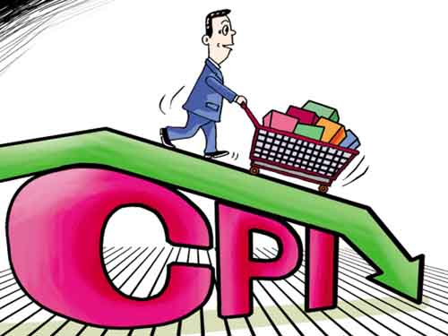

## 通胀、通缩、滞胀

通胀起初，市场上100块肉，货币100元，1块肉1元。
期间，央行增发100元，充足流动性有助于生产力提高，市场增加60块肉。
最后，市场上160块肉，货币200元，1块肉1.25元，通胀率25%。

通缩起初，市场上100块肉，货币100元，1块肉1元。
期间，需求降低，人们只愿意拿出80元消费。
后来，市场上100块肉，货币80元，1块肉0.8元，通缩率20%。
再后来，人们看到肉价下跌，期望能在将来以更低的价格买肉，消费意愿继续降低，形成循环。市场流动性逐渐降低，经济会因此而萧条崩溃。

滞胀起初，市场上100块肉，货币100元，1块肉1元。
期间，央行增发100元，经济增长周期性停滞，生产力没有提高。
后来，市场上100块肉，货币200元，1块肉2元，通胀率100%。

<!-- more -->

这三种情况，只有通胀是比较正面的。虽然物价上涨25%，但是经济得到了发展，生产力有所提高。通缩环境下，大家消费需求形成恶性循环逐渐下降，经济增长也随之陷入停滞萧条。而经济不增长导致大量企业倒闭，失业率上升，民众收入减少，需求进一步降低，恶性循环下最终会走向崩溃。
滞胀往往发生在长期通胀后，经济增长也周期性停滞。如果继续增发货币，会导致通胀加剧；如果加息收缩货币，长期处于货币宽松环境下的企业很可能会大规模崩溃。真是进退两难！此时只能靠财政政策刺激来走出困境。综上，长期温和的通胀是比较适宜的经济环境。现实中，经济不可能处于长期稳定的状态，也就有了货币宽松、紧缩的周期。而从局部来看，也可能出现结构性通缩、结构性通胀的情况。而真实的经济环境是通缩、通胀还是滞胀，其实并不能纯看统计数据。只有深处生活中的我们才会有更直观的体会。

## 经济危机

自2001科技股泡沫，2008次贷危机，2011-13欧债危机，直到2020新冠肺炎危机，在21世纪的前20年，我们已经（或正在）经历了4场经济危机。

通缩一般伴随的是经济衰退，有效需求不足导致物价下跌。这种情况下，企业盈利下滑甚至亏损，公司发不起工资、员工下岗、积累到一定程度破产银行形成坏账，甚至有发生系统性风险的可能。
在传统框架下，凯恩斯主义可以解决短期经济增长困境，即你说的印钱。在经济衰退周期，消费需求和投资需求不足，可通过货币政策宽松/财政政策宽松来刺激实体经济需求，从而帮助经济走出困境。然而在长期停滞理论下，凯恩斯主义是失效的。核心原因凯恩斯主义下，需求不足只是一种短期、周期性失衡，而在长期停滞理论下，需求不足是一种近似于永久性损害。这种需求不足是来自于长周期因素如人口增长率下降，结构性因素如劳动参与率下降，收入分配不均等。另一方面，供给直接受损主要表现为技术进步率下降。

这种情形下的通缩是无解的，因为形成通缩的根本原因是长期有效需求不足，而凯恩斯主义解决的是短期需求问题。所以看上去，一开始凯恩斯主义是有效的（09年四万亿），因为它提振了短期需求；但是凯恩斯过后，长期需求依然不足导致经济重回低增长，但是留下了高企的杠杆。这个死循环在于，长期需求不足导致的通缩使得均衡利率为负，从而导致货币政策工具失灵，有效需求再也无法通过降息、宽松来刺激。在实体有效需求不足的前提下，宽松一不能刺激消费，二不能刺激实体经济投资。那钱去哪里了？资本市场。你以为房地产市场、股票市场、债券市场的泡沫是怎么来的。

有人会说，通缩有什么不好，老百姓还能买到便宜的东西。但是通缩意味着经济收缩，生产者和服务商更难赚到利润，减少投资，减少生产，最终降薪裁员，波及的是更多人的饭碗。从理论上来说，货币增加，更多的货币追逐于有限的商品，必然导致物价上涨。而一边是货币的超发，一边是通货紧缩，这完全解释不通啊。美国在过去三个月内，让美联储的资产负债表从3万亿美元扩大到7.03万亿美元，美元的规模在两三个月扩大了一倍多，但美国CPI却持续下跌至0.8%，时间再往前推，自2008年次贷危机以来，美、中、日、欧等经济体都进行了不同程度的货币宽松，但都并没有推高通货膨胀。

日本自上世纪90年代泡沫破灭，就开始了非常规的货币政策。2008年次贷危机以来，日本通过量化宽松、负利率等方式，向市场注入了大量流动性，日本央行资产负债表超过570万亿日元，是2000年的6倍，而日本十年的平均通货膨胀率只有0.1%，经济衰退的危险非常大。美国2008年次贷危机以来，用了6年时间将美联储资产负债表规模扩张到4.54万亿美元，是危机爆发前的5倍，而后近9年的时间，美国的平均通货膨胀率也仅有1.4%。

这又该怎么解释？从理论上来说，货币增发导致通货膨胀，需要满足两个假设条件，一是市场是平面的，不存在资金流通的障碍。资金会根据利率水平的高低自由流动，当一个地方资金过多时，利率就会下降，自动流向其他地方，这样市场最终会形成资金均衡的状态，每个市场主体手里的资金都增加了；二是居民手里资金增加了会变成消费能力。多余的资金追逐有限的商品，才会推高物价上涨。而打破这一资金运行规律的原因就是贫富差距的扩大。贫富差距是市场经济运行的自然结果，由于能力禀赋和资源禀赋的不同，形成了不同的竞争能力，在市场经济自由竞争的条件下，就会形成资本的聚集和社会的分化，资本拥有方越来越富有，主导了社会的生产供给，大部分老百姓成为市场经济中劳动力的提供者，依靠劳动取得收入。资本方希望继续获得收益，扩大投资生产，而劳动者收入增长有限，消费成本不断提高，最终的结果就是产能过剩，社会内需不足。投资者只能减少投资，降价销售，降薪裁员，经济陷入通货紧缩的恶性循环，这就是经济危机的根源。

在社会贫富悬殊的情况下，社会阶层分裂，富人更倾向于投资，穷人更倾向于消费和储蓄。当向市场投放更多的资金时，富人拥有更多资产和信用，能获得更多和成本更低的资金，但他们会选择投资，社会消费需求没有增加。实体经济由于需求不足，投资收益率有限，富人会将这些多余的资金投入资产中，流入到股市的，推高了股价，流入到债市，扩张了债市，流入到房地产的，推高了房价。在社会贫富扩大的情况下，增加货币供给并没有导致通货膨胀，而是造成了资产价格上涨，消费品价格下跌，富人更富，穷人更穷，进一步扩大了社会的分裂和贫富悬殊。经济危机的表象是内需不足，通货紧缩，看起来增加货币对冲是有效措施，实际治标不治本，在贫富悬殊的情况下，实际效果更差。经济危机的根源是收入分配的不合理，资金的投资收益要大于劳动的收益。为了抑制经济危机的爆发，典型的资本主义国家在战后都进行了社会福利制度改革，通过税收矫正分配的悬殊，向穷人提供更多社会福利。因此全世界经济经过很长一段时间的繁荣。

2008年次贷危机以后，全球各主要经济体都通过超发货币的方式刺激经济，进一步加剧了全球的贫富分化。长达十年的货币刺激，没有造成全球范围的通货膨胀，全球经济依然站在衰退的边缘，却推高了美国股价，膨胀了日本债市，推高了中国房价。而与此同时，美国、日本的国债和我国地方政府债务却在不断攀升。既然，经济层面的深层问题是贫富悬殊和由此造成的社会分裂，那么各国为什么不采取进一步的矫正措施呢？例如加大财产税的征收调节力度。不是不想做，而是做不到。一方面，资本的流动是全球的，如果继续加大财产税收调节力度，会迫使富人资本流出，掏空本国经济资本，这是哪一个国家都不愿意看到的；另一方面，现在的各种避税手段已经非常发达，富人都在全球范围内配置资产，调节的难度非常之大。

既然货币放水不是有效措施，但各国依然不遗余力在放水。资金不流向实体，就必然流向其他资产，推高资产价格。资产泡沫累积的越高，破裂的风险就越大，造成的危害也就越难估计。资本要如何流向，就看国家如何引导，是流入股市还是流入房地产。

## 债务经济

目前世界经济处于一个全新的时代，债务货币、债务经济，债务成了一个国家经济的核心，尤其是08年经济危机以后，全球集体的量化宽松，本质也就是债务激增。债务成了大家的头号问题，债务的规模和质量直接决定了一国经济的生死。债务就是现代经济的核心秘密。对未来经济的展望就是对债务的未来展望，对债务的分析就可以知道一个国家未来的经济发展方向。

当今经济发展本质靠科技、资源、人口红利，然而这一切的最终集合表现就是债务，你的上述能力越强你的债务质量就越高，债务规模就得以扩张，且可持续。反过来如果你上述条件不具备又同时过分扩张你的债务，纯粹用债务去拉经济，那么你的债务质量就会严重的下降，出现很多不良债务和旁氏债务，债务自身就带有很强烈的收缩性和不可持续性，这是当代经济的一个最重要的特色。现代经济通过债务的自我出清来推动经济的新陈代谢，淘汰垃圾债务，产生高质量债务，用债务来反向清洗因为政客和民众短视推动的货币过度扩张。现代经济在货币超发的同时，必然意味着债务规模超常规增加，这些债务的质量就成了很大的问题，如果债务质量不佳就必然会产生无法还债导致债务崩盘，从而出清债务，债务出清，货币同时就消失了，这就是当代经济制度设计的最大的一个特点，一个对人性的约束机制，不会因为政客的短视而破坏整个货币信用。

债务对货币超发的反作用力。在金属本位货币时代，债务和货币是分家的，政府为了拉动经济就必然大量超发货币，货币的锚必然稀释，货币自身贬值，大家对货币失去信心，抢购各种商品，大规模通胀几乎是以前经济的必然结局，就像中国的金圆券。在70年以后全球进入了新的货币时代，债务货币成了每个国家的选择，摆脱了金属本位货币的束缚，看起来债务发行自由了很多，全球经济迎来了高速发展的四十年。直到08年以后，大家慢慢认识到了一个问题，现代经济的最大问题出现了，就是债务出清的问题，如果大家不超常增加货币，拉高债务规模，就不能刺激经济，一旦刺激了就会出现代价，这个代价就是债务规模扩张，债务质量下降，这也是凯恩斯主义的核心，但是凯恩斯也提醒了一旦经济危机过去，必须及时的纠偏，一个是纠正产业扭曲，一个就是赶紧解决当时危机的债务问题。但是借债一时爽，还债火葬场啊，因为你货币政策本身不解决经济的问题，只是刺激，所以经济短期解决了心理恐慌了，但是经济本质的问题并没有消失，这问题可能是贫富分化问题、养老金窟窿问题、社会福利问题、制度落后问题等等，这些问题不但得不到解决反而可能因为货币政策的实施加重了。所以事后债务出清问题就变得很难，债务就开始不断的积累，尤其是到了后来民主国家实在没办法了，资本家不敢得罪，选民也不敢得罪，只能用国债来拉动经济，保障底层福利，现在典型的就是日本和欧洲，国债不断增加，所有债务里国债是最刚性的债务，其它债务都可以通过破产来进行出清，国债是不可以的，国债是国家的信用，国家无法破产，除非整个国家推倒重来。日本欧洲目前已经走到了不归路，国债越来越多，且无法通过税收来出清。

在目前各国的经济可以有以下几个分类：
1、国债不断增加，且无力更改；叠加老龄化（日、欧、台湾等）日欧这些发达民主国家。目前都是经济自身的产生债务的能力严重不足，只能靠国家发债来进行对冲经济的通缩，从某种角度来看这些经济体都是在通缩的格局，且因为老龄化导致的需求萎缩、经济规模萎缩，债务规模也必然萎缩，国家无计可施束手无策，用国债来拖延死亡时间。因为发达国家的技术目前都到了一个瓶颈期，短时间还看不到科技浪潮到来的可能，因此没有技术迭代产生的高质量债务。除非到了某一天无法持续的时候，进行福利削减或者对资本家也动刀。进行债务的出清，重新债务健康化。效率提升的瓶颈也导致了这些国家的国民收入最近几十年并未有多大的提升，基本停滞不前。上述国家个人统一归类到通缩国家。
2、委内瑞拉这些外债很多、外汇储备很少的国家这些国家因为外债的问题，且外汇储备很少，导致因外债破产产生货币的大幅贬值，这些国内产业又几乎没有，只能靠大量进口各种产品，因此国内产生严重的大通胀，这个通胀倒并非是因为国内债务引发的，很大程度是因为外债引爆的。当然这些国家内部的债务也并不会多健康，因为整个国家产业链都被冲击，债务质量也是很不健康的。即使没有外债问题内部也会有，债务爆炸的危险。这些国家从表面上看都算是大通胀的国家。
3、最强大的美国。美国全世界的年轻精英涌入缓解了他的老龄化，人的素质提高，科技的不断提高，债务质量也提高，目前能做到的也就是美国。且美国还有一个国际货币地位来进行缓冲。其他国家都无法做到，即使牺牲了国债也是能维持个表面不严重通缩，但是国债越来越多，政府也疲于应付，唯一能做的就是拼命压低利率防止债务爆炸，这也是为何这次货币收缩只有美国在做，其他国家货币政策已经完全丧失弹性了。美国算是保持稳定，房地产等基本上处于勉强保值的资产，长时间看也仅仅能跑赢通胀。
4、中国经济府有几个特点和其它国家不同：
1、外债不算多基本可控、外汇储备多，资本进出有管制，这三条基本上可以保住中国的汇率不会发生崩盘，汇率不崩盘，国内也就不会出现大通胀。
2、中国的国债不多，中国的债务基本上都被国家推给了地方政府、国企、地方融资平台等，这些债务都是可以出清的，尽管会对经济有巨大冲击，但是对政府影响并不大。倒霉的是地方银行和某些理财产品和基金产品。
3、中国国家掌握的资源特别多，这是全世界任何国家都无法比拟的，目前国企和地方债务是很多，但是最坏的结果国家还可以通过出售资源来对冲。
4、国家对整个金融系统的强大的控制力。政府可以强压着债务不许出清，中国政府的这个金融控制力世界第一，

这四个算是中国的优点吧。然后说说缺点：
1、债务规模中国用二十年的时间爆炸增加了别人几十年走过的债务积累的道路，尤其是08年以后整个经济几乎全是靠债务拉动。最严重的就是最近三年棚改的货币化，极度快速的提高了居民的债务，透支了居民的未来消费力。居民债务都是长期债务，短期无法出清，且严重影响未来的消费，就是把未来的消费前移的短视行为，整个国家的信贷一半多都靠居民，这实在是有点奇葩。目前政府、企业、居民都加了一轮债务了，表面唯一健康的就是国债了，国家把很多债务都推给了地方、融资平台、国企，所以中央自身的债务不算高，还有一定的加债空间，其它部门已经基本上债务饱和了，18年也就是认识到了债务太高进行了本来预期三年的清债计划，实行了三个月就无法推动全部去杠杆已经取得效果。但是整个经济的债务规模并不会因为不说就不存在，它还是在那里，不动如山。中央愿意不愿意承担国债来拉动经济目前还看不到。
2、债务质量越急剧增加的债务，质量就越差，回抽力就越强，就像四万亿那一年。中国靠强大的政府控制力，当然中国这种掩盖问题的能力天下第一，但是毕竟不是解决问题，不是提高债务质量，不是缩减债务规模，只能不断的借新还旧，问题积累越来越多，结局可能是一次性的集体共振出清，大通缩。中国债务质量确实是绝密，谁也无法清晰的指导到底如何。
3、其它不利因素中国城镇化结束，老龄化，生育率断崖，结婚率断崖。目前中国幻想通过城市群来进行新一轮的城镇化，但是从农村到城市这是一个巨大的飞跃，广大农民也愿意付出那么多的代价，但是从三四线去二线，这个代价值得不值得就很难说了，个人感觉也就每年新毕业的年轻人或许有这种需求吧，具体需要看以后的各城市的经济发展，和对年轻人的吸引，目前各种吸引年轻的政策都在落地，以后落户的门槛也都会消失，本质还是看哪个城市经济发展更好，能够提供更多的岗位，同时房价不上天。中国现在什么城市一旦有未来发展的潜力，第一就是房价一步到位，这就大大透支了整个城市的经济发展，非常的短视。至于老龄化、生育率、结婚率基本无救。综上所述，中国目前汇率问题不大，不会出现因为汇率导致的大通胀。内部债务规模大，且质量很差，有内部出清的压力，但是政府压制力又很大，对此进行拉锯，但是内部债务继续大幅扩张的可能不大，收缩的概率很大。即使进行了真正的深化，债务出清依旧绕不过去，最多是能产生点新的健康债务。

## 央行大放水

市场上流通中的资金流向，可以分为两个大类，一个是商品市场，另一个是投资品市场，如果资金流入商品市场，则会引起通货膨胀，如果流入投资品市场，例如资本市场，那就会带动股市上涨，如果流入房地产市场，就会带动房价上涨。

那么，央行大放水，资金会流入商品市场吗？资金想要大量流入商品市场，首先应该要流入到消费者手里，消费者手里有钱才会增加消费，资金才会流入到商品市场，如果消费者手里都没有钱，没钱消费，物价自然涨不起来。现实中的情形是大家工资还在减少，收入大幅下降，各国央行大放水流出来的资金其实并没有流入到消费者手里，大家根本没钱消费，所以并不会引起商品价格的上涨，反而下跌预期会更加强烈。所以，央行超发，并不会引起商品市场的大通胀，现在反而还处在通缩的过程。只有经济好转，居民收入提高，消费回升，才有可能会发生通胀的情况。实际上，现在各国央行最担忧的问题是通缩，并不是通胀，如果他们担忧的是通胀，就不是降息和放水，而是加息和紧缩货币。那么，央行放水，资金会流入房地产市场或者是资本市场吗？
这个问题相对会复杂一些，因为现在社会上整体贫富差距很大，有钱人对商品的消费有一定的上限，并不会随着财富增长而大幅增加商品消费。例如马云就不会因为今年少赚了几百个亿而减少消费，也不会因为今年多挣几百个亿而去增加消费，但他可能会多买一些资产，从而推高资产价格。所以，资金在富人手里流转，只会推高资本市场或者楼市价格，并不会推高商品价格。也可以简单归纳如下：资产价格由富人决定，商品价格由穷人决定。

现在央行释放出来的货币，大部分就是落入了富人手里，所以推高资产价格确实是有可能会发生的事情。但这问题还要继续细化下去，富人拿到了央行的钱，他们会拿去干什么？他们可以有许多用途，例如可以拿去干实业办工厂，也可以拿去买房子买土地炒股票，也可以拿去还债。拿去干实业办工厂是否可行？很显然不可行，因为现在消费不足，经济低迷，很多企业都倒闭了，现在借债去干实业只会赔钱，根本不能挣钱。那么拿去买房子买土地买股票是否可行？国内有一部分人就是这样做的，美国则是拿去炒股票，所以中楼和美股还在上涨。但这其实也只不过是资本在空转而已，并不会流入实体经济，也不会流入到商品市场，实体经济没有利润，也就没有支撑起股票价格和房地产价格的基础，最终只是把泡沫吹的更大而已。而泡沫最终一定是会破的，因为泡沫没有实体经济利润的支撑，只能长期依靠央行放水支撑，而央行的资产负债表根本没办法无限扩张下去。讲到这里，基本就触及问题的核心了，那就是债务问题。现代信用货币，也称为债务货币，央行投放多少货币，就会对应着多少的负债，而债务都有期限，有利息的，到期是要还的。支撑债务和货币投放量能够不断增长下去的动力就是实体经济的利润必须高于债务所产生的利息，债务货币化的资本游戏才能够一直玩下去。

如果实体经济所产生的利润低于负债的成本，那么企业就会产生亏损，就会导致债务越来越多，而资产越来越少的情况。一旦利润收入低于利息支出，那么企业的债务就会越滚越大，而净资产越来越少，最终就会因为还不起负债而产生债务危机。所以，实体经济的利润才是维持资产泡沫的底层逻辑。现在很多欧美企业如果没有美联储的救助，实际上已经破产了，因为他们由于利润恶化，甚至产生了大量的亏损，而过去的负债太多，根本还不起债务。但即使美联储不断救助，让他们借新债还旧债，也只是不断把危机往后延续而已。负债是有利息的，到期还是要还的，负债越多只会导致亏损越来越多，因为现在的实体经济根本不赚钱，甚至还在产生巨额的亏损。所以，美联储大放水，一方面是在给企业续命，另一方面也是在加大企业的负担，导致企业亏损的数额更大。事实上，现在企业借来的钱基本都用来还债了，甚至还不够还债，还需要通过不断的裁员，降低员工工资，缩减开支等方式去还债。这样就会形成了一个恶性循环，央行越放水，整体债务越多，流动性就会越紧张。由此可见，央行放水太多，并不一定会发生通胀，反而有可能是导致通缩的原因。

货币和债务就是一体两面的现象，货币投放的太多容易引起通胀，而债务过多容易导致通缩。通胀和通缩也是对立统一的辩证关系，货币投放的太多，是产生通胀的原因，但同时也有可能是产生通缩的原因。如果还想不明白，你们想想现金贷，以贷养贷的那些套路就知道了，原理其实差不多。那些以贷养贷的人，看起来手里的钱多了，但其实债务增长的更快，借来的钱用来还债还远远不够，所以才需要借更多的债。还是那句话，如果用钱就能够解决一切问题，那还要辛苦劳动来干什么？有一个现实的例子就能够很好的说明这个问题，那就是日本。日本在这三十几年来不断放水刺激经济增长，现在公共债务应该已经超过300%了，但经济就是一直不增长，也没有通胀，反而一直处于通缩的状态。如果大放水一定会引起大通胀，那么日本早就发生大通胀了，实际上日本每年都在担忧通缩的问题。现在的欧洲也在逐渐日本化，欧洲放水一点不比美国少，但也通胀不起来。未来美国也一定会受到大放水的诅咒，逐渐走向欧洲化和日本化的道路，大通胀很可能是不存在的。如果美联储继续这样无限量放水下去，未来怕只会陷入无休止的通缩循环。不过如果美联储不这样放水下去，立刻就要倒下一大批企业。

帝国的黄昏，总有一些事情并不是人力能够扭转的，只能通过一些极端的手段去缓解帝国的衰落。我们要庆幸中国央行并没有像欧美那样无底线的放水，那些鼓吹继续继续大放水，同时放开楼市的人坏的很，他们只是一心维护他们自己的资产价值而已。楼市是不能再放开了，未来资本市场倒是可以炒一炒，把社会存量资金带动起来，让资本市场服务于实体经济，以此来度过一段时间的困难时期，毕竟A股还处在历史估值低位。

## 最终的归宿

通胀，是过去几十年的主旋律，很多老百姓想当然的认为，世界会永远通胀下去，钱会变的越来越不值钱。但实际上，通缩才是世界的最终归宿，因为大家都采用市场经济体制。

市场经济体制有一个重大特征，生产者会无穷无尽的提升自己的生产能力，直到其达到整个社会的资源承载极限（土地、人口、能源）为止。但大多数时候，我们很难触碰到资源极限，社会的生产扩张就被迫停止，因为东西卖不出去了。没有利润，企业主当然就会停止扩张。但卖不出去并不是因为没有需求，而是我们的分配机制出现了问题。人类的需求是无止尽的，我不仅需要喝牛奶，我还需要用牛奶泡澡，我永远有需求。但是在美国大萧条期间，农场主宁愿把牛奶倒进河里，也不愿意把牛奶免费送人。但如果资本家有利润，工人（消费者）手里持有的货币，就一定不足以购买所有的商品，这是一个死结。当商品卖不出去时，资本家就会被迫降价，从而影响利润，当利润降低到一定程度时，他们就会关闭工厂，解散工人。失业的工人没有收入，消费能力进一步降低，然后带来了更恶性的循环。《资本论》据此得出结论，经济危机是资本主义国家不可避免的宿命，每隔一段时间就一定会发作一次，必须先摧毁社会的生产能力，国家才拥有重新增长的能力，如此反复循环。所以马克思认为，资本主义国家表面上看是在发展，实际是在原地踏步。社会主义国家看到了资本论，资本主义国家也看到了。政府完全不参与的，纯粹的市场经济是不可取的，这一点已经在全世界所有国家里得到了共识。于是，凯恩斯为市场经济打了一个补丁，那就是用通胀来解决这个货币不足的问题。

凯恩斯认为，当整个社会的生产扩张到极限时，政府不应该对商品价格下跌袖手旁观，而应该主动干涉，来让这些商品获得销量。毕竟，经济的本质是人类生产出牛奶供人类自己消费，而不是倒入河流。刺激经济需要钱，政府没钱怎么办？很简单，印钞票呀，适当的通胀是有助于经济的。但事实证明，印钞票是会上瘾的，一旦开始，就会像吸毒一样根本停不下来，只会越印越多。而印钞票，会立刻引发真通胀，甚至是恶性通胀。美国大萧条期间，日本曾经通过大规模印钞来刺激经济，但马上就上瘾了，1936年日元和美元的兑换比例是1:1等值，但现在1美元可以换100多日元，追根溯源，就是当初大量印钞带来的恶果。而且事实证明，印钞带来的通胀并不能带来经济太多的实质性增长，日本的经济辉煌也不是靠印钞得来的。倒是国民政府，学着日本去印钞，结果把自己给印死了。如果印钞票就能刺激经济，那管理国家就太简单了，在钞票后面直接加一个零，国家的GDP就能翻10倍？如果这种办法真的有效的话，那大家直接用笔在自家钞票后面加0就可以了，加的0越多国家越富强。但实际上，津巴布韦加了那么多零，国家也没强盛起来，反而濒临崩溃。印钞后患无穷，且效果不大，所以后来世界各国政府，就给凯恩斯经济学再打了一个补丁，那就是允许刺激经济，但不准印钞。

债务，是支撑新一代凯恩斯主义的主要支柱，有新债务才有新货币。2018年，美国国债的数额已经达到了23万亿美元，而当年的GDP总量才20.5万亿美元。把美国全年的GDP拿出来，还不够还清债务的。每年，美国仅支付的国债利息，就高达6000亿美元。美国政府在2019年的财政预算收入是3.462万亿美元，支出预算为4.447万亿美元，不仅不还钱，反而又借债了1万亿美元当赤字。因为这个债务是不能还的，它不仅是债务，还代表了美元的供应量。历史上，美国经济形势好的时候，政府有了财政盈余，选择的并不是还钱，而是减税。手头有了钱，宁可减税也不还钱，因为没办法还。如果把债务全部还清，那世界上流通的美元也会瞬间消失，经济会直接崩盘。2017年，美联储曾试图缩表，降低国债规模，减少美元的供应量，刚开个头，美国经济就开始跳水，被迫中止。政府债务、企业债务、居民债务，注定越滚越大，是不能减少的。发了那么多钞票，世界通胀了么？没有通胀！没有通胀！没有通胀！除了中国之外，全世界都是在通缩，日本陷入经济萎靡后甚至已经通缩了接近30年。即便是中国，之所以还有适度通胀，那也是因为这些年经济发展的太好了，人民的收入水平提升了。你会发现，在中国所有日用品里，价格节节上涨的，都是和人力高度相关的。凡是工厂里出来的，和人力挂钩很低的，价格都在通缩。方便面、彩电、冰箱、电脑、空调、汽车，都多少年没涨了，甚至价格还在下跌。倒是门口的早点和理发店，价格年年攀升，因为对人力的依赖太大。去掉房子，去掉人力工资，这十年来能涨的东西，真的太少了。因为在市场经济体制下，资本家会无穷无尽的提供产品，一直到彻底没利润的那一天。这种供应过剩，导致价格始终上不去，只有偶尔的意外才能把价格炒起来，比如2018年的非洲猪瘟。只有科技，才是提升生产力的唯一途径，各种经济手段，都只是勉力维持社会生产秩序而已，不可能化腐朽为神奇。但是问题来了，债务雪球的滚动是有极限的，如果科技始终不升级，会出大问题。你借钱不还可以，但至少要还利息吧，如果你连利息都不还，那和凭空印钱有什么区别，整个社会秩序会立刻崩溃，引发真正的恶性通胀。长期的零利率和通货紧缩，让日本经济成为了一潭死水，日本年青一代成为了低欲望的一代。为啥低欲望，因为明天的商品会比今天更便宜，我投资东西也不会怎么涨价，那我干嘛急吼吼的买东西，要那么高欲望干嘛，留点货币应急避险不好么？降低利率可以刺激消费、刺激经济，但利率降低到一定程度，会出现反效果。如今，日本政府已经用出吃奶的力气去刺激经济了，依然卵用都没有。日本的案例告诉我们，深陷经济危机后，靠举债印货币刺激经济，是有其极限的，这个极限就是零利率甚至负利率。日本是第一个进入零利率时代的，但他并不孤独，因为现在欧美大量国家，也纷纷进入了这一时代。印了那么多货币，全球都在通货紧缩。之所以会出现这种现象，那是因为如果不印这些货币，我们看到的就不是通货紧缩了，而是价格崩盘，生产秩序彻底毁灭。大量商品低价甩卖，大量工厂破产倒闭，大量工人失业回家，这种末日景象，你想看到么？如今只是通货紧缩，价格微弱下跌，已经很不错了，说明社会秩序维持的还不错。利率越低，经济越差，或者说经济越差，利率越低。中国这么多年一直维持高利率，说明中国的经济增速远远超过其他国家。改革开放以来，中国百姓已经习惯了经济高速增长，也习惯了资产价格和工资一直上涨，毕竟40年来一直如此。但是你不能想当然的认为，未来也一定会如此。毕竟全球都已经进入了零利率甚至负利率时代，大家都在通货紧缩，中国可以一枝独秀，但不可能秀的太久，早晚要被欧美主要经济体给一起拖进水里。很明显，现在全球是在进入衰退阶段，而通胀下行会伴随衰退和复苏两个阶段。所以未来的全球经济，可能会看到很久很久的低利率和低通胀。中国也进入零利率甚至负利率时代，并伴随通货紧缩，这是早晚的事，无非就是需要花多久而已。进入的越晚，代表中国的经济越强，前景越光明。我不希望中国进入低利率时代，但我们要做好这个准备，以防万一。

## 普通人怎么应对

危机中对大家最大的影响就是失业，收入降低，人民币流动过缓。
这些都会有国家来调控，有非常专业的非所谓专家来制定计划。我以前不成熟的时候，对待国家政策也是愤青，现在呢，看到国家强大，也能看到国家的努力成效卓著。包括对外基建投资，包括国家实力，包括此次疫情管控，包括国家对各种行业的合规化处理政策，都是拭目以待，而不是再让忧郁充满自己的双眼。一个人能做出的最好的投资就是投资自己，让自己处于不败之地。通过简单地提高自己的交流能力和增强自己的才能，你的潜力会呈指数式增长。而且，这样的投资，税收机关无法对你征税，甚至连通货膨胀也对其无可奈何。

比方说你有吃有喝，你就该吃吃该喝喝，该睡觉睡觉，该上班上班，努力提高自己，过几年经济危机就过去了。等过去几年，你会发现，卧槽，我已经NB了这么多，优秀了这么多，你将会更认可自己。
