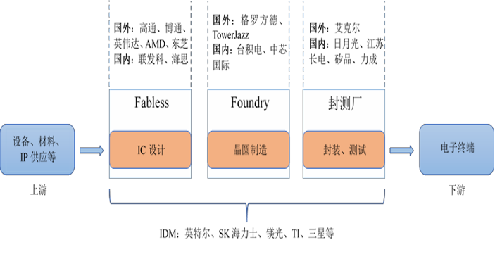
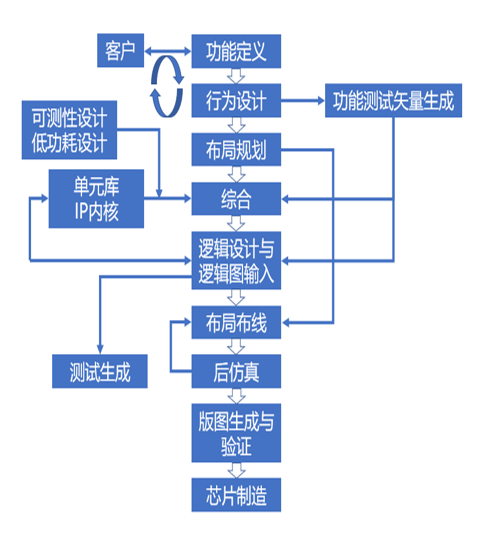
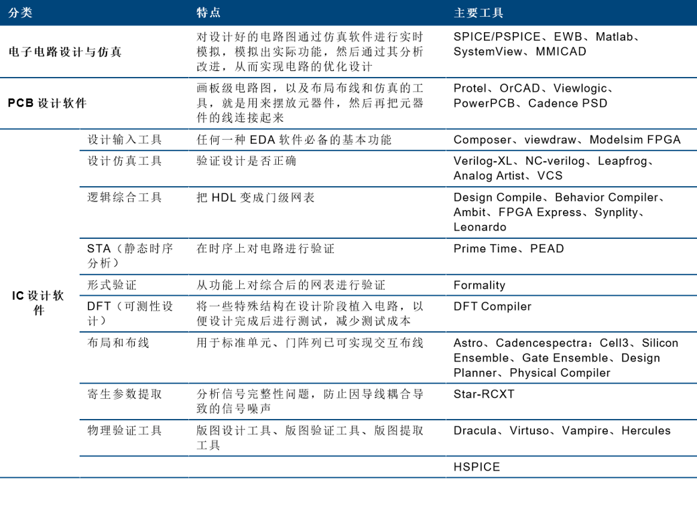
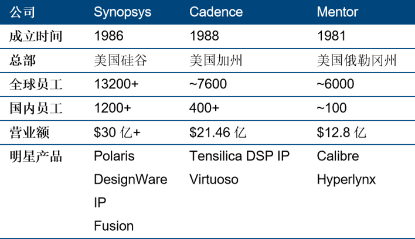
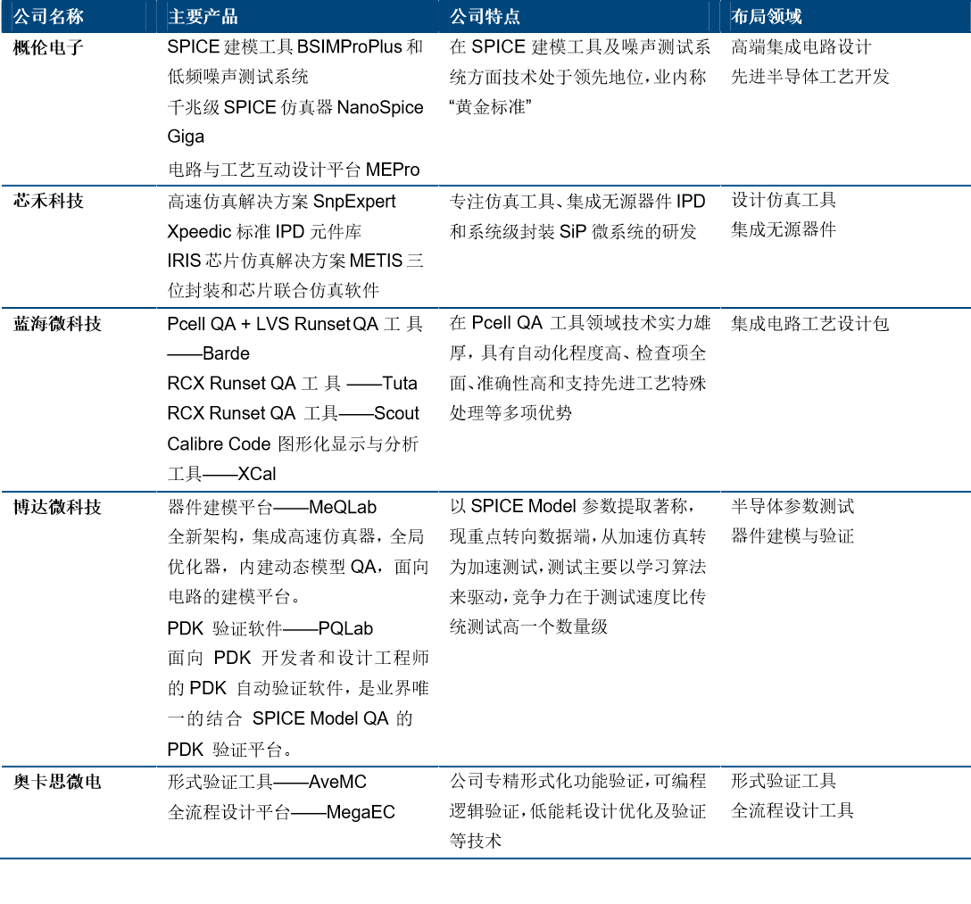
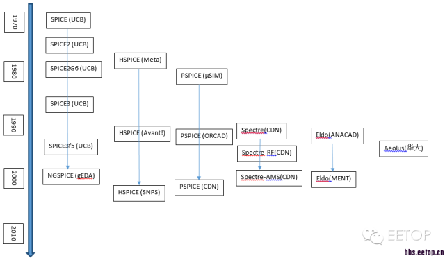

作为一名目前还在EDA行业的开发者，了解国内了EDA过去30年发展路程，在当前中美大国博弈和中国科技发展的大背景下，以美国打压华为为契机，展望未来，无论对基础科学，教育，资金，政策以及产业发展还是充满了期待，但道路是曲折的，前途是光明的。正视差距，找准不足，抓住机会，迎头赶上。未来国产EDA会迎来黄金三十年。

<!-- more -->

## EDA现状

EDA是电子设计自动化（Electronic Design Automation）的简称，是从计算机辅助设计（CAD）、计算机辅助制造（CAM）、计算机辅助测试（CAT）和计算机辅助工程（CAE）概念发展而来。EDA是广义CAD的一种，是细分的行业软件。利用EDA工具，电子设计师可以从概念、算法、协议等开始设 计电子系统，完成电子产品从电路设计、性能分析到设计出IC版图或PCB版图的整个过程。

IC产业链：芯片产业链包括设计、制造、封装、测试、销售，芯片核心实力重心在芯片设计，而芯片设计离不开芯片设计软件EDA，EDA可谓是芯片产业链“任督二脉”。




EDA产业投资周期比较长，见效比较慢。算法密集型大型软件系统，需要长期的技术积累；EDA研发周期长、产业化周期长，需要持续不断的资金投入。今天大家都在谈坚持，EDA领域更需要坚持。基本上开发一个EDA工具需要6年左右的时间，才能真正做成被市场接受的、能够在市场应用的产品。

EDA三巨头：EDA市场份额占据前三位的Synopsys、Cadence和被西门子收购的Mentor Graphics。三大EDA企业占全球市场的份额超过60%。其中，Synopsys是全球最大的EDA企业，2018年的市场份额已 达到32.1%；Cadence仅次于Synopsys，2018年市场占有率为22.0%；Mentor Graphics在被收购之前也 能保持超过10%的市场占有率。在2017年中国工业软件企业排行榜中，Synopsys排名35位，Cadence和 Mentor Graphics分列第47、48位。
Synopsys最全面，它的优势在于数字前端、数字后端和PT signoff。模拟前端的XA，数字前端的VCS，  后端的sign-off tool，还有口碑极好的PT、DC和ICC功能都很强大。Synopsys有垄断市场90%的TCAD器 件仿真和垄断50%的DFM工艺仿真，这是其在EDA产业竞争中的一把利器。
Cadence的强项在于模拟或混合信号的定制化电路和版图设计，功能很强大，PCB相对也较强，但是Sign
off的工具偏弱。
Mentor Graphic在后端布局布线这块比较强，在PCB上也很有优势，它的优势是Calibre signoff和DFT，  但Mentor Graphic在集成度上难以与前两家抗衡。



## 华大九天

上世纪八十年代中后期，国内开始投入EDA产业研发。1993年国产首套EDA熊猫系统问世。之后的国内EDA发 展曲折而缓慢。多个EDA厂商萌芽，因各种因素影响，国产EDA产业没有取得实质性成功北京华大九天软件有限公司成立于2009年6月，具有三十年的技术积累，前身是华大集团EDA部门，专注于提供 专业的EDA软件、IP产品及相关解决方案，是国内规模最大、技术最强的EDA企业，是大规模集成电路CAD国家工程研究中心依托单位，承担着国产EDA软件研发与推广的重任，并在2012年推出硅知识产权（IP）和设计 服务业务。受制于国内行业大环境。公司体量依旧较小。2019年年报显示，公司雇员175人。华大九天的技术团队约为150人，研发团队硕博士比例 超过80%，拥有三名国家“千人计划”专家。2019年8月，董事长刘伟平曾披露，公司正式员工加上其他实现人 员总计400多人，预计2019年底能扩大到500人。

华大九天承载了熊猫系统的技术，在EDA和IP方面拥有多年的积累，现在的他们能够提供数模混合/全定制IC设 计、平板（FPD）全流程设计及高端SoC数字后端优化方向的EDA解决方案，拥有多项全球独创的领先技术。尤 其是在FPD领域，华大九天更是成为全球唯一的能够提供全流程FPD设计解决方案的供应商，获得了大部分知名 面板厂的市场份额。其他围绕EDA提供的相关服务包括IP设计服务及晶圆制造工程服务。

目前，华大九天提供四大板块的服务：全流程数模混合信号芯片设计系统、SoC后端设计分析及优化解决方案、
FPD全流程设计系统、IP以及面向晶圆制造企业的相关服务以及液晶平板显示。
公司客户覆盖国内集成电路细分领域的众多企业，如晶圆制造领域的中芯国际、华力微电子、华虹宏力等，IC设 计领域的华为海思、中兴微电子、紫光展锐等，国内主要的CPU设计企业飞腾、兆芯、龙芯、华芯通等，以及液 晶平板显示领域的京东方、华星光电、维信诺、咸阳彩虹、熊猫电子、重庆惠科等。

## 国内EDA的不足

一是缺乏数字芯片设计核心工具模块，无法支撑数字芯片全流程设计；
二是对先进工艺支撑还不够，除了个别两三个工具能支持14纳米、7纳米、5纳米外，其它很多工具都做不到；
三是缺乏制造及封测EDA系统，无法支撑芯片封测厂商的应用需求。

一个是国内的EDA工具不全，前面说了EDA软件要覆盖 IC 设计、布线、验证和仿真等所有方面，而国产EDA很多只涉及到其中的一部分环节
另外就是国产EDA软件和先进工艺的结合不好，对先进工艺的芯片支持不够，毕竟国内制造水平不强，还在28nm，像华为都在设计7nm甚至5nm的芯片了，自然国产EDA在先进工艺方面是差于国外软件的。





## EDA工具的研究难在哪里

如前所述，芯片设计环节繁多、精细且复杂，EDA工具在其中承载了极为重要作用：①

```
1.将复杂物理问题用数学模型高度精确化表述，在虚拟软件中重现芯片制造过程中的各种物理效应和问题；
2.在确保逻辑功能正确的前提下，利用数学工具解决多目标多约束的最优化问题，
求得特定半导体工艺条件下，性能、功耗、面积、电气特性、成本等的最优解；
3.验证模型一致性问题，确保芯片在多个设计环节的迭代中逻辑功能一致。
4.先进工艺节点，无一不是由拥有最先进工艺制造条件的晶圆厂、顶尖EDA团队和设计经验丰富的Fabless公司三者协力共同推进的成果，
这也是为什么三大EDA巨头始终把控细分市场的一个重要的原因。
```

## 电路仿真之SPICE模型

### SPICE简史

如今，每一天都有不知其数的半导体芯片设计公司与设计验证工程师，在用着电路仿真软件SPICE。SPICE广泛应用在仿真模拟电路（例如运放OpAmp，能隙基准稳压电源BandgapReference，数模/模数转换AD/DA等），混合信号电路（例如锁相环PLL，存储器SRAM/dRAM，高速输入/输出接口high-speedI/O），精确数字电路（例如延时，时序，功耗，漏电流等），建立SoC的时序及功耗单元库，分析系统级的信号完整性，等等。作为最早的电子设计自动化软件，它今天仍然是最重要的软件之一。可以说，没有SPICE，就没有电子设计自动化这个产业，也就没有今天的半导体工业。它的市场超过上亿美元。所有这一切，都是从1970年加州大学伯克利分校电机工程系的一堂课开始的。

时间回到1970年，在加州大学伯克利分校电机工程与计算机科学系（UCBerkeley , Dept. EECS），Ron Rohrer教授给七个研究生上“电路综合”课。Rohrer教授那时刚刚从仙童半导体公司（Fairchild Semiconductor）返回伯克利，没有时间准备教材。所以，在第一堂课，他就宣布：学生们一起写一个电路仿真程序。他跟系里的管教学的主任DonPeterson教授达成一个协议：只要Peterson教授认可学生们写的仿真程序，他们就全部通过。否则的话，他们就全部不及格。Nagel就是他们的杰出代表，1975年Nagel从伯克利博士毕业。他的论文“SPICE2:A COMPUTER PROGRAM TO SIMULATE SEMICONDUCTOR CIRCUITS”, 成为了EDA行业被引用最多的文章。SPICE2这个版本基本上奠定了今天电路仿真程序的基石，其中包括：改进的节点分析法（ModifiedNodal Analysis），稀疏矩阵解法（Sparse Matrix Solver），牛顿-拉夫逊迭代（Newton-RaphsonIteration），隐性数值积分（ImplicitNumerical Integration），动态步长的瞬态分析（Dynamic Time Step Control），局部截断误差（LocalTruncation Error）
到了八十年代，SPICE2已经遍及了各个大学。但它的问题也显现出来：FORTRAN代码太难维护，加新的器件模型需要改动的地方太多，等等。在此同时，C作为一种新的程序语言正方兴未艾。于是，用C语言重新写SPICE就被提到了议事日程上来。这个任务被伯克利的ThomasQuarles在89年的时候完成了。比起SPICE2来，SPICE3增加了用户界面，你可以使用命令，甚至命令串来控制程序。另外，还增加了图形界面看波形。更重要的是，SPICE3的程序构架更加清晰，更加模块化。维护及修改起来更加容易。八十年代也是计算机硬件突飞猛进的时代：大型机（mainframe）被工作站（workstation）取代。UNIX及架构在它上面的C-shell和X-window成为软件开发及应用的基本框架。另外，个人电脑（PC）也越来越普及。这些都为SPICE的广泛应用打下了坚实的基础。自从上世纪九十年代后，学术界SPICE的发展基本就停止在SPICE3f5这个版本了这是不是意味着SPICE停滞不前了呢？非也。至少在两个方向上SPICE还在一直发展：一个是器件模型（特别是MOSFET模型），另一个是商业SPICE程序。

### SPICE中器件模型的演变

SPICE里面自带了很多模型。像无源元件电阻，电容，电感等等，以及有源器件二极管，双极管等。但花样最多的，变化最频繁的，复杂度最高的，当属MOSFET的模型了。这主要是因为从七八十年代以后，MOSFET的工艺因它的低功耗，高集成度而变成了主流。那时候还是个半导体工业百花争鸣的年代。很多半导体公司如雨后春笋般的冒出来（就像现在的社交媒体公司一样）。几乎每一家公司都在工艺及器件上有点自己的绝活，所以集成电路公司大多是个独立器件制造商（IDM）。这就造成了MOSFET的模型也层出不穷。谁家的SPICE支持的MOSFET模型越多，谁的SPICE用户群就越大。SPICE2中加上了MOSFET Level1的模型。等到SPICE3出来的时候，里面已经加入了Level2及Level3模型。到了九十年代，又加入了著名的BSIM（BerkeleyShort-channel IGFET Model）模型。可以这样说，现在所有的foundry用的模型都来自于BSIM家族。为什么在那么多MOSFET模型中，BSIM胜出了呢？我们知道，SPICE是用来解含有非线性器件的电路方程的。解非线性方程的一个有效方法就是牛顿迭代–把非线性方程在某个点给它线性化，然后逐次逼近最终解。这个过程有点像俩个宇航飞船对接–如果对方的接口在你的左边，你就往左偏一下。如果你偏多了，对方的接口在你的右边了，你就再稍往右偏点，直到最后俩个接口对准锁定。但这里面有个要求：就是非线性曲线的一阶导数要连续。如果不连续的话，就好像喝醉酒的人来控制飞船对接，忽左忽右，或者根本就掉过头来，不知东西南北，上下左右了，如何能对接上呢？不幸的是，很多早期的MOSFET模型（包括Level1，2，3）都有这个问题–模型的电流曲线的一阶导在工作区域内不连续。这是因为人为的把器件分成了不同的工作区域（呵呵，如果你是学器件的，你应该知道截止区，线性区，饱和区）。不同区之间能保证电流连续已经不错了，哪还去管它的导数呢!这样做的后果就像管对接的人喝醉了酒（呵呵），没法瞄准目标，最后导致SPICE不收敛（non-convergence），或时间步长太小（TimeStep Too Small – 这有很大可能也是不收敛造成的）。早期的BSIM模型还保留了工作区域的观念。但在不同的区域之间加入了平滑过渡曲线，以保证电流曲线及其一阶导的连续性。在它后来的版本中，就彻底抛弃了工作区域的观念–干脆只用一个(连续且可导的)曲线来代表整个工作区域里的特性。这样就从根本上解决了不连续的问题。BSIM家族中最成功的代表是BSIM3v3（HSPICE中的Level49）和BSIM4v5（HSPICE中的Level54）。从此以后，再也没有其他的模型能出其右。它们俩也是工业界的MOSFET器件模型标准。BSIM3v3跨越了亚微米的工艺（0.3微米至0.13微米，大致从1993年到2000年），BSIM4v5跨越了深亚微米到纳米的工艺（90纳米至20纳米，大致从2002年到2012年）。最新工艺不是已经到了16纳米，14纳米，以至10纳米，那这些工艺的器件结构与模型又是什么呢？答案已经有了：还是胡教授的小组开发的FinFET（也叫3维MOSFET）模型。

### SPICE的变异与进化

SPICE最初是用来做小型电路仿真的。电路中的元器件数也就几十最多到几百个。随着电路规模越做越大，电路种类越来越多，人们会问：SPICE能不能跑得更快一些，能运行的电路更大一些？自然而然的，SPICE的变种就出现了。我们在这儿讲三个方面：第一是快速仿真，第二是数模混合仿真，第三是扩展应用。

先说说快速仿真（fastSPICE）。这也是市场最大，发展最多的一块儿。因为SPICE是把整个电路放到一个矩阵中来解。人们就想能不能把电路分成小块单独解，然后再把各块之间联接起来，这样不就快了吗？的确，对数字电路，确实可以用分割的方法。因为数字电路的信号是有方向的，我们可以在没有直流通路的地方把它分开（例如在两个串联的反相器中间）。另外就是数字信号是离散的，我们可以把它分成几段。分的段越大，时间步长也就能越大，需要解的次数就少了（当然结果也就没那么精确了）。还有就是器件模型。我们前面讲过如今的mosfet模型非常复杂，要花很多时间去算，那能不能把它简化呢？可以。事实证明对数字电路以及数模混合电路（像PLL，memory，serdes）来说，用表格模型（tablemodel）来代替复杂的方程模型是个不错的选择。通过这些简化，快速仿真可以比原来的SPICE快几十到上百倍，而精度是在SPICE的5-10%之内。像EPIC的PowerMill（后来成为Synopsys的Nanosim），Anagram的ADM（后来成为Avant!的StarSim），Celestry（后来成为Cadence）的Ultrasim，Nassda（后来成为Synopsys）的HSIM，等等。最近比较流行的是Magma（现在是Synopsys）的Finesim，BDA（现在是Mentor）的AFS，Proplus的Nanospice。

其次来说说数模混合仿真。当一个系统中既有模拟电路，又有数字电路，人们自然就会想到把SPICE和数字仿真器（如Synopsys的VerilogVCS，Cadence的NC，Mentor的Modelsim）联在一起运行。SPICE去算模拟电路部分，数字仿真器去算数字电路部分，它们之间用数模／模数转换器（AD/DA）连接。注意这种运行方式跟上面的快速仿真不同。这样的混合仿真需要两个仿真器。但这样的构架有缺点。主要的问题是数模转换没有一个标准。市面上有很多SPICE以及Verilog仿真工具，每一个工具的转换界面都不一样，这就造成混合仿真的界面非常复杂。因此，最近发展的混合仿真都采用数模一体化的构架，大大简化了转换界面，而且用户只需在一个环境下就可进行混合仿真。这样的工具有Cadence的Virtuoso-AMS，Synopsys的HSIM-plusHDL，Silvaco的Harmony，华大的Aeolus-ADS等。

SPICE的扩展应用。虽说SPICE是针对集成电路（IC）开发的，但它的应用已扩展到系统级（systemlevel），主要是电路板（PCB）级的仿真。那系统级仿真与集成电路仿真有何区别呢？它们不都是电路吗？呵呵，没错，它们都是电路，但区别还是蛮大的。主要是它们的规模与尺寸的不同。我们知道，集成电路是集成在芯片上的。其器件尺寸现在已做到纳米级。而系统级的尺寸还在毫米，厘米，甚至米的数量级。学过电磁的同学都知道，当器件的尺寸大于信号波长的时候，就要考虑分布的场效应了。拿一段导线做例子。一段在芯片上的导线，你可以把它看作一个电阻。而一段电路板上的导线，你就必须用传输线(transmission line)来代表它，否则误差就太大了。如果信号的频率再高，那就要用S参数了（S-parameter）。由此，电路仿真发展出一大分支，这就是所谓的“信号完整性”工具。像Agilent的ADS，Mentor的HyperLynx，以及 Cadence的OrCAD和Allegro。

