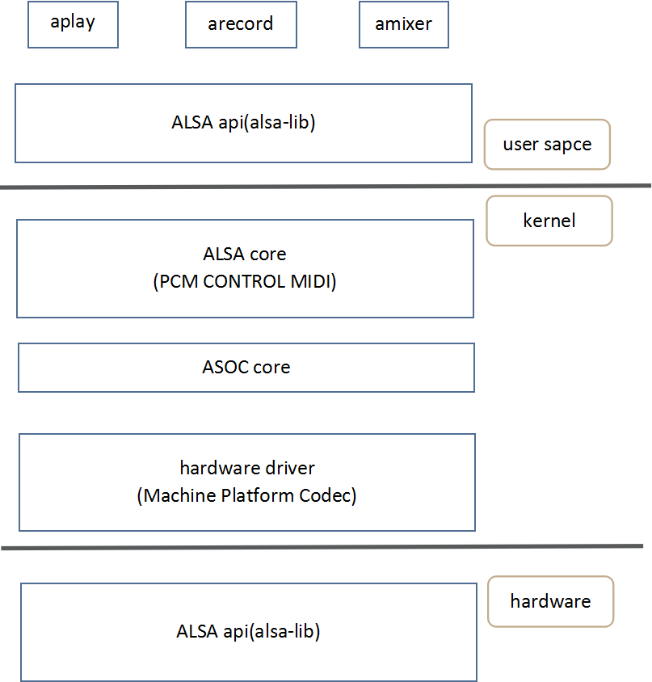
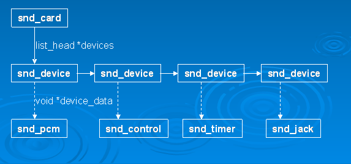
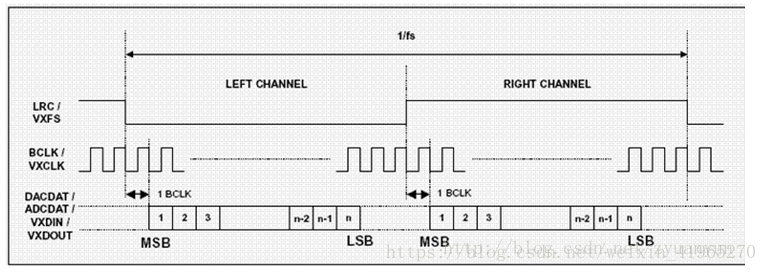
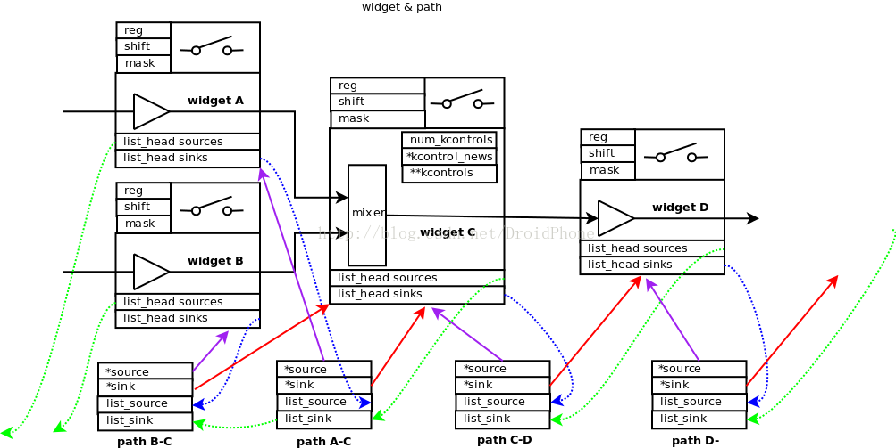

## 1. ALSA简介

ALSA是Advanced Linux Sound Architecture 的缩写，目前已经成为了linux的主流音频体系结构。
在内核设备驱动层，ALSA提供了alsa-driver，同时在应用层，ALSA为我们提供了alsa-lib，应用程序只要调用alsa-lib提供的API，即可以完成对底层音频硬件的控制。

<!-- more -->

- alsa application:aplay，arecord，amixer，是alsa-tools中提供的上层调试工具，用户可以直接将其移植到自己所需要的平台，这些应用可以用来实现playback，capture，controls等。
- alsa API:alsa 用户库接口，常见有alsa-lib。(alsa-tools中的应用程序基于alsa-lib提供的api来实现)。
- alsa core:alsa　核心层，向上提供逻辑设备(pcm/ctl/midi/timer/。。)系统调用，向下驱动硬件设备(Machine/i2s/dma/codec)。
- asoc core:asoc是建立在标准alsa core基础上，为了更好支持嵌入式系统和应用于移动设备的音频codec的一套软件体系。
- hardware driver:音频硬件设备驱动，由三大部分组成，分别是machine，platform，codec。





## 2. ALSA设备文件结构

alsa驱动的设备文件结构: 

```
cd /dev/snd
ls -l
```

| 设备          | 说明 |
| ------------- |:-------------:|
| controlC0     | 用于声卡的控制|
| midiC0D0      | 用于播放midi音频|
| pcmC0D0c      | 用于录音的pcm设备|
| pcmC0D0p      | 用于播放的pcm设备|
| seq           | 音序器|
| timer         | 定时器|

device种类：

```
 SNDRV_DEV_LOWLEVEL
 SNDRV_DEV_INFO
 SNDRV_DEV_BUS，
 SNDRV_DEV_CODEC
 SNDRV_DEV_PCM
 SNDRV_DEV_COMPRESS
 SNDRV_DEV_RAWMIDI
 SNDRV_DEV_TIMER
 SNDRV_DEV_SEQUENCER
 SNDRV_DEV_HWDEP
 SNDRV_DEV_JACK
 SNDRV_DEV_CONTROL

```

驱动加载后，card和devices关系结构，pcm和control是最重要的两个device，并在dev，sys class下构建了各种设备节点。



## 3. ASOC

ALSA System on Chip，是建立在标准的ALSA驱动之上，为了更好支持嵌入式系统和应用于移动设备的音频codec的一套软件体系，它依赖与标准ALSA驱动框架。内核文档Documentation/alsa/soc/overview。txt中详细介绍了ASoC的设计初衷，这里不一一引用，简单陈述如下：

- 独立的codec驱动，标准的ALSA驱动框架里面codec驱动往往与SoC/CPU耦合过于紧密，不利于在多样化的平台/机器上移植复用。
- 方便codec与Soc通过PCM/I2S总线建立连接
- 动态音频电源管理DAPM，使得codec任何时候都工作在最低功耗状态，同时负责音频路由的创建
- POPs和click音频抑制弱化处理，在ASoC中通过正确的音频部件上下电次序来实现
- Machine驱动的特定控制，比如耳机，麦克风的插拔检测，外放功放的开关


## 4. I2S协议



CLK:位时钟，对应数字音频的每一位数据；BCKL = 声道数*采样频率*采样位数；
LRCLK:帧时钟，构成一个完整的声音单元；双声道的情况下，LRCKL=0时表示是左声道的数据，＝１时表示是右声道的数据；LRCLK=采样频率；
DACDAT:下行数据；
ADCDAT:上行数据；
数据的最高位总是出现在LRCKL跳变后的第２个BCLK脉冲处；

## 5. platform codec和machine驱动

### Platform

cpu dai:在嵌入式系统里面通常指soc的i2s，pcm总线控制器，负责把音频数据通过I2S tx FIFO传输到codec(playback，capture则相反)。cpu_dai:通过 snd_soc_register_dai()来注册。注：DAI是Digital Audio Interface的简称，分为cpu_dai和codec_dai，这两者通过I2S/PCM总线连接；AIF是Audio Interface母的简称，嵌入式系统中一般是I2S和PCM接口。

PCM DMA:负责把dma buffer中的音频数据搬运到i2s tx fifo。在某些情形下是不需要dma介入，比如modem和codec直连，因为modem本身已经把数据送到fifo了，这时只需要启动codec_dai接收数据即可；该情形下，machine驱动dai_link中需要设定。platform_name = "snd_soc_dummy"，这是虚拟dma驱动，实现见sound/soc/soc-utils。c。 音频dma驱动通过 snd_soc_register_platform()来注册，故也常用platform来指代音频dma驱动(这里的platform需要与soc platfrom区分开）。

### Codec

对于playback来说，userspace送过来的音频数据是经过采样量化的数字信号，在codec经过DAC转换成模拟信号然后输出到外放或耳机，这样我么你就可以听到声音了。codec字面意思是编解码器，但芯片(codec)里面的功能部件很多，常见的有AIF，DAC，ADC，Mixer，PGA，line-in，line-out。有些高端的codec芯片还有EQ，DSP，SRC，DRC，AGC，Echo-Canceller，Noise-Suppression等部件。

### Machine

通过配置dai_link把cpu_dai，codec_dai，modem_dai各个音频接口给链结成音频链路，然后注册snd_soc_card。和上面两个不一样，platform和codec驱动一般是可以重用的，而machine有它特定的硬件特性，几乎是不可重用的。所谓的硬件特性指：Soc Platform与Codec的差异；DAIs之间的链结方式；通过某个GPIO打开Amplifier；通过某个GPIO检测耳机插拔；使用某个时钟如MCLK/External-OSC作为i2s，CODEC的时钟源等。
dai_link:machine驱动中定义的音频数据链路，它指定链路用到的codec，codec_dai，cpu_dai，platform，一个系统可能有多个音频数据链路，比如media和voice，因此可以定义多个dai_link。如wm8994的典型设计，有三个dai_link，分别是API<>AIF1的"HIFI"(多媒体声音链路)，BP<>AIF2的“voice”（通话语音链路），以及BT<>AIF3(蓝牙sco语音链路)。

### dai时钟设置

对于dai(codec_dai和cpu_dai)，都要非常留意时钟设置，它很关键又复杂，设置错误将会导致很多问题，典型如下：

- 系统无声：检查codec系统时钟，codec_dai位时钟和帧时钟是否使能；
- 声音失真：检查音频数据的采样率是否和codec_dai帧时钟一致；
- 断续破音：检查codec系统时钟和位时钟，帧时钟是否同步，出现这种情况，可能是因为sysclk和BCKL/LRCLK不是由同一个时钟源分频出来的。
- i2s通信不成功：若codec做从，MCLK有soc这边提供，在i2s通信之前，一定要确保mclk已经提供给codec。

### DAPM(动态音频管理)

为移动linux设备设计，使得音频系统任何时候都工作在最低功耗状态。当音频路劲发生改变(比如上层使用amxier工具设置音频通路)时，或发生数据流事件(比如启动或停止播放)时，都会触发dapm去遍历所有邻近的音频部件，检查是否存在完整的音频路径(complete path:满足条件的音频路径，该路径上任意一个部件往前遍历能到达输入端点如DAC/MiC/Linein，往后遍历能到达输出端点如ADC/HP/SPK)，如果存在完整的音频路径，则该路劲上面的所有部件都是需要上电的，其他部件则下电。
部件上下电都是dapm根据策略自主控制的，外部无法干预，可以说dapm是一个专门为音频系统设计的自成体系的电源管理模块，独立于linux电源管理之外。即使soc休眠了，codec仍可以在正常工作，试想下这个情景：语音通话，modem_dai连接到codec_dai，语音数据不经过soc，因此这种情形下soc可以进入睡眠以降低功耗，只保持codec正常工作就行了。
而音频部件由于上下点瞬间的瞬态冲击会产生爆破音，我们称之为POPs。POPs是电气特性，我们无法彻底消除，只能硬件软件上优化消弱到人耳辨识不出的程度。DAPM中，部件的上下电有严格的顺序以抑制爆破音，总的来说：上电次序是从输入端点到输出端点，下电次序是从输出端点到输入端点。

widget指音频系统中的某个部件，比如mixer，mux，输入输出引脚，电源供应器等等，甚至，我们可以定义虚拟的widget，例如playback stream widget。widget把kcontrol和动态电源管理进行了有机的结合，同时还具备音频路径的连结功能，一个widget可以与它相邻的widget有某种动态的连结关系。

| dapm widget          | 说明                 |
| ------------- |:-------------:      |
| snd_soc_dapm_input     | 输入引脚       |
| snd_soc_dapm_output     | 输出引脚       |
| snd_soc_dapm_mux     | mux控件       |
| snd_soc_dapm_mixer     | mixer控件       |
| snd_soc_dapm_pga     | 可编程增益控件       |
| snd_soc_dapm_adc      | ADC控件       |
| snd_soc_dapm_dac      | DAC控件       |
| snd_soc_dapm_micbias     |   麦克风偏置电压控件     |
| snd_soc_dapm_mic     | mic       |
| snd_soc_dapm_hp     | 耳机       |
| snd_soc_dapm_spk     | 扬声器       |
| snd_soc_dapm_aif_in      | 数字音频输入接口       |
| snd_soc_dapm_aif_out      | 数字音频输出接口       |
| snd_soc_dapm_dai_in      | 输入DAI       |
| snd_soc_dapm_dai_out     | 输出DAI       |
| snd_soc_dapm_dai_link     | DAI link      |

widget之间的连接器：path
之前已经提到，一个widget是有输入和输出的，而且widget之间是可以动态地进行连接的，那它们是用什么来连接两个widget的呢？DAPM为我们提出了path这一概念，path相当于电路中的一根跳线，它把一个widget的输出端和另一个widget的输入端连接在一起。




### PCM DMA

pcm数据管理可以说是alsa系统中最核心的部分，这部分的工作有两个(回放情形)：

copy_from_user把用户态的音频数据拷贝到dma buffer中，启动dma设备把音频数据从dma buffer传送到i2s tx FIFO。
当数据送到i2s tx FIFO后，剩下的是启动i2s控制器把数据传送到codec，然后DAC把音频数字信号转换成模拟信号，在输出到SPK/HP。

为什么要使用dma传输？

- 首先在数据传输过程中，不需要cpu的参与，节省cpu的开销
- 传输速度快，提高硬件设备的吞吐量。

## 6.典型嵌入式音频通路

```
+------------+        +---------------------+        +------------+
|            |        |                     |        |            |
|            |        +        CODEC        +        |            |
|     AP     +------>AIF1                 AIF3+------>     PA     +->SPK
|            |        +   +-----+ +-----+   +        |            |
|            |        |   | DSP | | DAC |   |        |            |
+------------+        |   +-----+ +-----+   |        +------------+
                      |   +-----+ +-----+   |
                      |   | DSP | | DAC |   |
                      |   +-----+ +-----+   |
+------------+        |   +-----+ +-----+   |        +------------+
|            |        |   | DSP | | ADC |   |        |            |
|            |        +   +-----+ +-----+   +        |            |
|     BB     +------>AIF2 +-----+ +-----+ AIF4+------>    BTSCO   |
|            |        +   | DSP | | ADC |   +        |            |
|            |        |   +-----+ +-----+   |        |            |
+------------+        +----------+----------+        +------------+
                          |      |     |
                          +MIC   +HP   +EARP
```
组成了４个音频链路(dai_link):

AP<->AIF1:AP(应用处理器)与codec之间的链路，多媒体声音
BB<->AIF2:BB(基带处理器)与codec之间的链路，通话语音
PA<->AIF3:PA(智能功率放大器)与codec之间的链路，外放输出
BTSCO<->AIF4:BTSCO(蓝牙)与codec之间的链路，蓝牙耳机输出

### linux kernel alsa dpcm document

```

手机Audio System with SoC based DSP
-------------------------------------

::

  | Front End PCMs    |  SoC DSP  | Back End DAIs | Audio devices |
  
                      *************
  PCM0 <------------> *           * <----DAI0-----> Codec Headset
                      *           *
  PCM1 <------------> *           * <----DAI1-----> Codec Speakers
                      *   DSP     *
  PCM2 <------------> *           * <----DAI2-----> MODEM
                      *           *
  PCM3 <------------> *           * <----DAI3-----> BT
                      *           *
                      *           * <----DAI4-----> DMIC
                      *           *
                      *           * <----DAI5-----> FM
                      *************


此图显示了一个简单的智能手机音频子系统。它支持蓝牙、调频数字收音机、扬声器、耳机、麦克，modem。
此声卡公开了4个DSP前端（FE）ALSA PCM设备和支持6个后端（BE）DAIs。每个FE-PCM可以将音频数据以数字方式路由到任何
FE-PCM设备还可以将音频路由到1个以上的BE-DAI


DPCM 从DAI0切换DAI1
---------------------------------------------------
考虑如下场景，正在向耳机播放音频。过一段时间后，用户将耳机取出扬声器上继续播放音频。

PCM0的通路link链接如下所示 :
::

                      *************
  PCM0 <============> *           * <====DAI0=====> Codec Headset
                      *           *
  PCM1 <------------> *           * <----DAI1-----> Codec Speakers
                      *   DSP     *
  PCM2 <------------> *           * <----DAI2-----> MODEM
                      *           *
  PCM3 <------------> *           * <----DAI3-----> BT
                      *           *
                      *           * <----DAI4-----> DMIC
                      *           *
                      *           * <----DAI5-----> FM
                      *************

耳机从jack移除之后的通路：
::

                      *************
  PCM0 <============> *           * <----DAI0-----> Codec Headset
                      *           *
  PCM1 <------------> *           * <====DAI1=====> Codec Speakers
                      *   DSP     *
  PCM2 <------------> *           * <----DAI2-----> MODEM
                      *           *
  PCM3 <------------> *           * <----DAI3-----> BT
                      *           *
                      *           * <----DAI4-----> DMIC
                      *           *
                      *           * <----DAI5-----> FM
                      *************

驱动处理过程如下：

1. Machine driver收到Jack移除事件。
2. Machine driver或者audio HAL禁用耳机路径。
3. DPCM在DAI0上运行PCM触发器（停止），hw_free（），shutdown（）操作耳机，因为该路径现在已禁用。
4. Machine driver或者audio HAL启用扬声器路径。
5。DPCM运行PCM ops进行startup（），hw_params（），prepare（）和
    由于启用了路径，因此DAI1扬声器的触发（启动）。

在此示例中，Machine driver或audio HAL可以更改路由，然后DPCM将负责管理DAI PCM操作，
以使link向上或向下。在此过渡期间，音频播放不会停止。


Hostless PCM streams
====================

hostless PCM stream 是未通过主机CPU路由的stream。例如，从手机到调制解调器的电话
::

                      *************
  PCM0 <------------> *           * <----DAI0-----> Codec Headset
                      *           *
  PCM1 <------------> *           * <====DAI1=====> Codec Speakers/Mic
                      *   DSP     *
  PCM2 <------------> *           * <====DAI2=====> MODEM
                      *           *
  PCM3 <------------> *           * <----DAI3-----> BT
                      *           *
                      *           * <----DAI4-----> DMIC
                      *           *
                      *           * <----DAI5-----> FM
                      *************

In this case the PCM data is routed via the DSP。 The host CPU in this use case
is only used for control and can sleep during the runtime of the stream。

The host can control the hostless link either by :-

 1。 Configuring the link as a CODEC <-> CODEC style link。 In this case the link
    is enabled or disabled by the state of the DAPM graph。 This usually means
    there is a mixer control that can be used to connect or disconnect the path
    between both DAIs。

 2。 Hostless FE。 This FE has a virtual connection to the BE DAI links on the DAPM
    graph。 Control is then carried out by the FE as regular PCM operations。
    This method gives more control over the DAI links， but requires much more
    userspace code to control the link。 Its recommended to use CODEC<->CODEC
    unless your HW needs more fine grained sequencing of the PCM ops。
在这种情况下，PCM数据通过DSP进行路由。主机CPU仅用于控制，可以在流运行时休眠。

主机可以通过以下方式控制无主机链接：

  1. 将链接配置为CODEC <-> CODEC样式链接。在这种情况下，链接由DAPM图形的状态启用或禁用。这通常意味着
     有一个混音器控件，可用于连接或断开路径两个DAI之间。

  2. HostlessFE。此FE与DAPM上的BE DAI链接具有虚拟连接。
     然后，由FE作为常规PCM操作进行控制。这种方法可以更好地控制DAI链接，但需要更多功能
     用户空间代码来控制链接。建议使用CODEC <-> CODEC除非您的硬件需要对PCM ops进行更细粒度的排序。


```