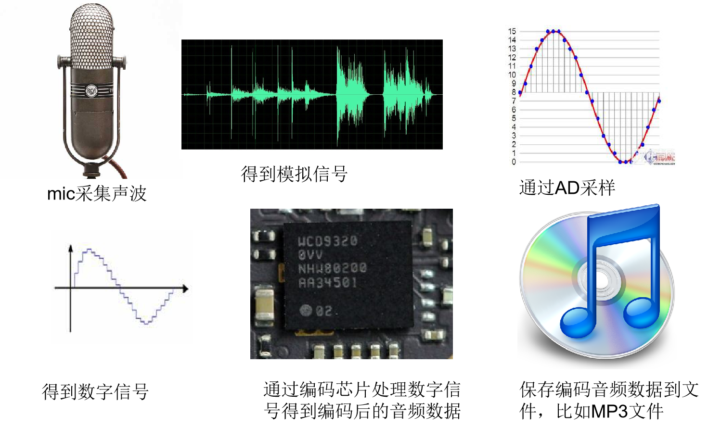
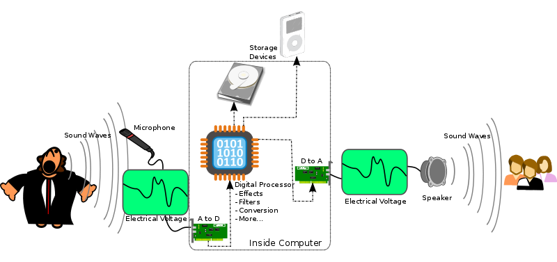

声音（sound)是由物体振动产生的声波。声音作为一种机械波，频率在20 Hz~20 kHz之间的声音是可以被人耳识别的。

<!-- more -->

## 1. 音频基础知识

### 声音的生成和使用场景

### 声音三要素：

- 响度(Loudness)
  响度就是人类可以感知到的各种声音的大小，也就是音量。响度与声波的振幅有直接关系。

- 音调(Pitch)
  音调与声音的频率有关系，当声音的频率越大时，人耳所感知到的音调就越高，否则就越低。

- 音色(Quality)
  同一种乐器，使用不同的材质来制作，所表现出来的音色效果是不一样的，这是由物体本身的结构特性所决定的。

### 采样(Audio Sampling)

将声波波形信号通过ADC转换成计算机支持的二进制的过程叫做音频采样(Audio Sampling)。采样(Sampling)的核心是把连续的模拟信号转换成离散的数字信号。

### 量化(Quantization)

采样后的值还需要通过量化，也就是将连续值近似为某个范围内有限多个离散值的处理过程。因为原始数据是模拟的连续信号，而数字信号则是离散的，它的表达范围是有限的，所以量化是必不可少的一个步骤， 量化精度可以是：4bit、8bit、16bit、32bit等等，位数越多，表示得就越精细，声音质量自然就越好，当然，数据量也会成倍增大。

### 编码(Coding)

计算机的世界里，所有数值都是用二进制表示的，因而我们还需要把量化值进行二进制编码。这一步通常与量化同时进行。

### 奈奎斯特理论

采样频率只要不低于音频信号最高频率的两倍，就可以无损失地还原原始的声音。
通常人耳能听到频率范围大约在20Hz～20kHz之间的声音，为了保证声音不失真，采样频率应在40kHz以上。常用的音频采样频率有：8kHz、11.025kHz、22.05kHz、16kHz、37.8kHz、44.1kHz、48kHz、96kHz、192kHz等。

### 声道数（channels）

由于音频的采集和播放是可以叠加的，因此，可以同时从多个音频源采集声音，并分别输出到不同的扬声器，故声道数一般表示声音录制时的音源数量或回放时相应的扬声器数量。单声道（Mono）和双声道（Stereo） 5.1 和 7.1声道

### PCM(Pulse-code modulation)

俗称脉冲编码调制，是将模拟信号数字化的一种经典方式，得到了非常广泛的应用。比如数字音频在计算机、DVD以及数字电话等系统中的标准格式采用的就是PCM。它的基本原理就是我们上面的几个流程，即对原始模拟信号进行抽样、量化和编码，从而产生PCM流。另外，我们可以调整PCM的以下属性来达到不同的采样需求：

### audio 播放

## 2. codec

- 频谱掩蔽效应： 人耳所能察觉的声音信号的频率范围为20Hz～20KHz，在这个频率范围以外的音频信号属于冗余信号。
- 时域掩蔽效应： 当强音信号和弱音信号同时出现时，弱信号会听不到，因此，弱音信号也属于冗余信号。

### Audio codec

- Loss
  - MP3（MPEG1 audio layer I/II/III）
  - AAC/AAC+(AAC Plus V1)/AAC++(eAAC+, AAC Plus V2)
       AAC+ = AAC + SBR 
      AAC++ = AAC + SBR + PS
  - WMA（std/pro/lossless)
  - Vorbis
  - RealAudio
  - OGG
- Lossless
  - APE
  - FLAC
  - WAV

### Voice/Speech codec

- AMR
- EVRC
- QCELP
- G.7xx（G.711/G.721/G.722,G.723/G.726/G.729…）

## 系统中audio

首先要了解音频领域中，帧（frame）的概念：帧表示一个完整的声音单元，所谓的声音单元是指一个采样样本；
如果是双声道，那么一个完整的声音单元就是 2 个样本，如果是 5.1 声道，那么一个完整的声音单元就是 6 个样本了。
帧的大小（一个完整的声音单元的数据量）等于声道数乘以采样深度，即 frameSize = channelCount * bytesPerSample。
帧的概念非常重要，无论是框架层还是内核层，都是以帧为单位去管理音频数据缓冲区的。
其次还得了解音频领域中，传输延迟（latency）的概念：传输延迟表示一个周期的音频数据的传输时间。
声音周期（period）的概念指Linux ALSA中把数据缓冲区划分为若干个块，dma每传输完一个块上的数据即发出一个硬件中断，cpu 收到中断信号后，再配置 dma 去传输下一个块上的数据；一个块即是一个周期，周期大小（periodSize)即是一个数据块的帧数。
再回到传输延迟（latency），传输延迟等于周期大小除以采样率，即 latency = periodSize / sampleRate。

音频重采样：音频重采样是指这样的一个过程——把一个采样率的数据转换为另一个采样率的数据。
Android 原生系统上，音频硬件设备一般都工作在一个固定的采样率上（如 48 KHz），因此所有音轨数据都需要重采样
到这个固定的采样率上，然后再输出。为什么这么做？系统中可能存在多个音轨同时播放，而每个音轨的采样率可能是不一致的；
比如在播放音乐的过程中，来了一个提示音，这时需要把音乐和提示音混音并输出到硬件设备，而音乐的采样率和提示音的
采样率不一致，问题来了，如果硬件设备工作的采样率设置为音乐的采样率的话，那么提示音就会失真；
因此最简单见效的解决方法是：硬件设备工作的采样率固定一个值，所有音轨在 AudioFlinger 都重采样到这个采样率上，
混音后输出到硬件设备，保证所有音轨听起来都不失真。

## 分贝(dB)

 分贝（decibel）是量度两个相同单位之数量比例的计量单位，主要用于度量声音强度，常用dB表示。
 1、表示功率量之比的一种单位，等于功率强度之比的常用对数的10倍。
 2、表示场量之比的一种单位，等于场强幅值之比的常用对数的20倍

N(db)=10×lg(P1/P0) = 20lg(v1/v0)

- 60分贝	正常交谈的声音
- 70分贝	相当于走在闹市区
- 85分贝	汽车穿梭的马路上
- 95分贝	摩托车启动声音

## 音效

- BassBoost重低音
- Equalizer均衡器
- Virtualizer虚拟器
- PresetReverb预置混响
- EnvirenmentReverb环境音混响
- downmix(向下缩混)
- upmix(向上缩混)
- AGC(增益)
- AEC（回声消除）
- NS（噪声抑制）
