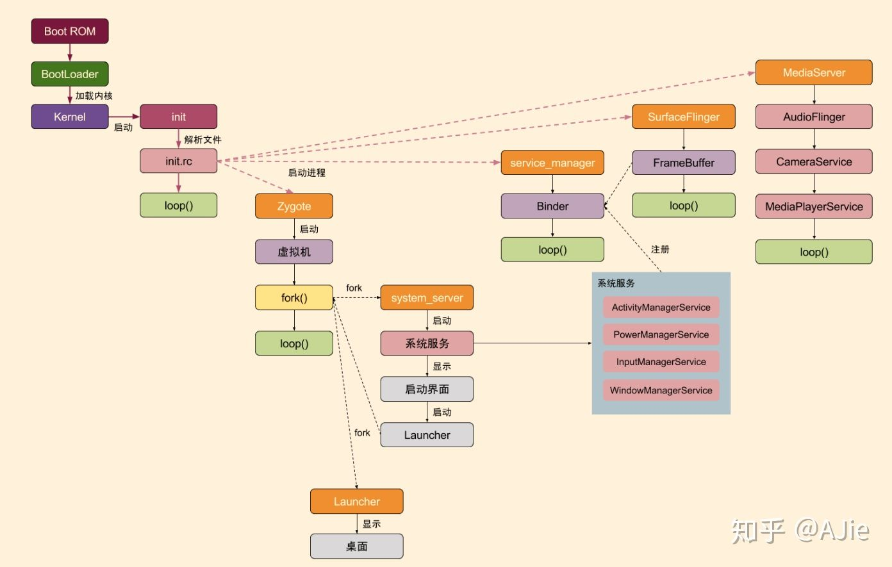
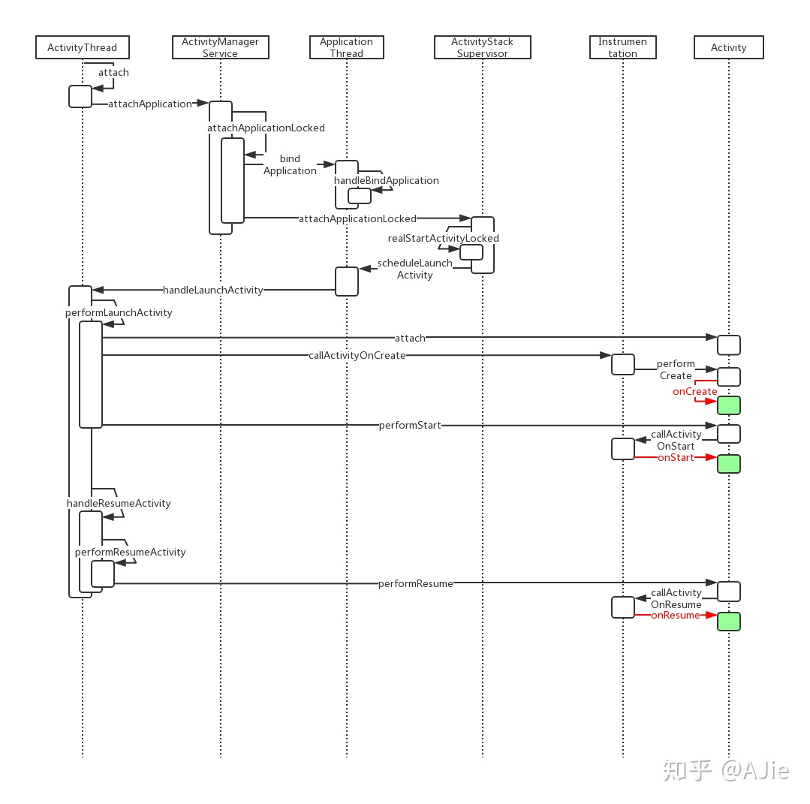
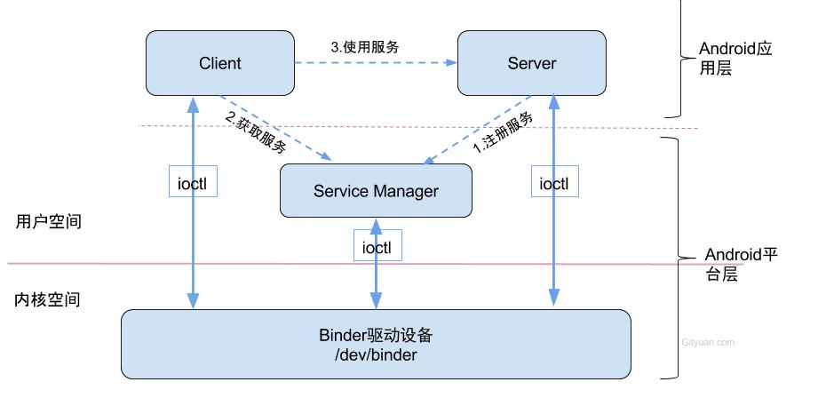
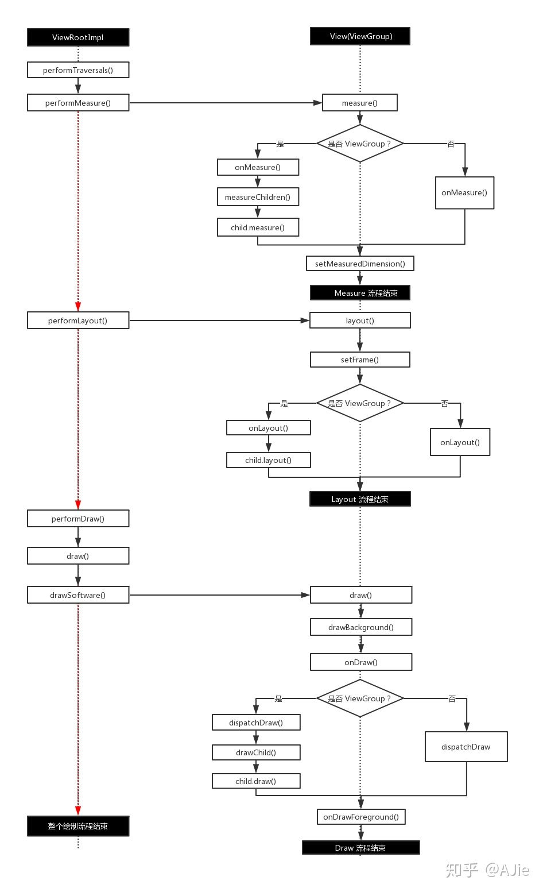
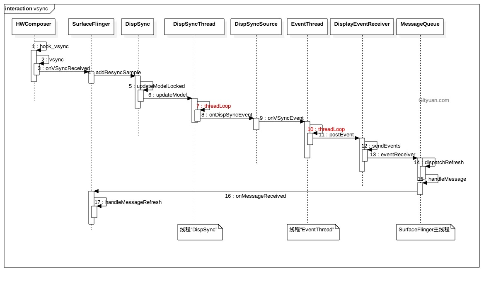

Android是一种基于Linux的自由及开放源代码的操作系统，主要使用于移动设备，如智能手机和平板电脑，由Google公司和开放手机联盟领导及开发。尚未有统一中文名称，中国大陆地区较多人使用“安卓”或“安致”。Android操作系统最初由Andy Rubin开发，主要支持手机。2005年8月由Google收购注资。2007年11月，Google与84家硬件制造商、软件开发商及电信营运商组建开放手机联盟共同研发改良Android系统。随后Google以Apache开源许可证的授权方式，发布了Android的源代码。

<!-- more -->

## Android启动

## Activity

## Binder

## Window draw

## surfaceflinger

