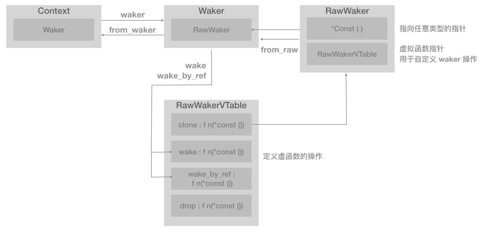
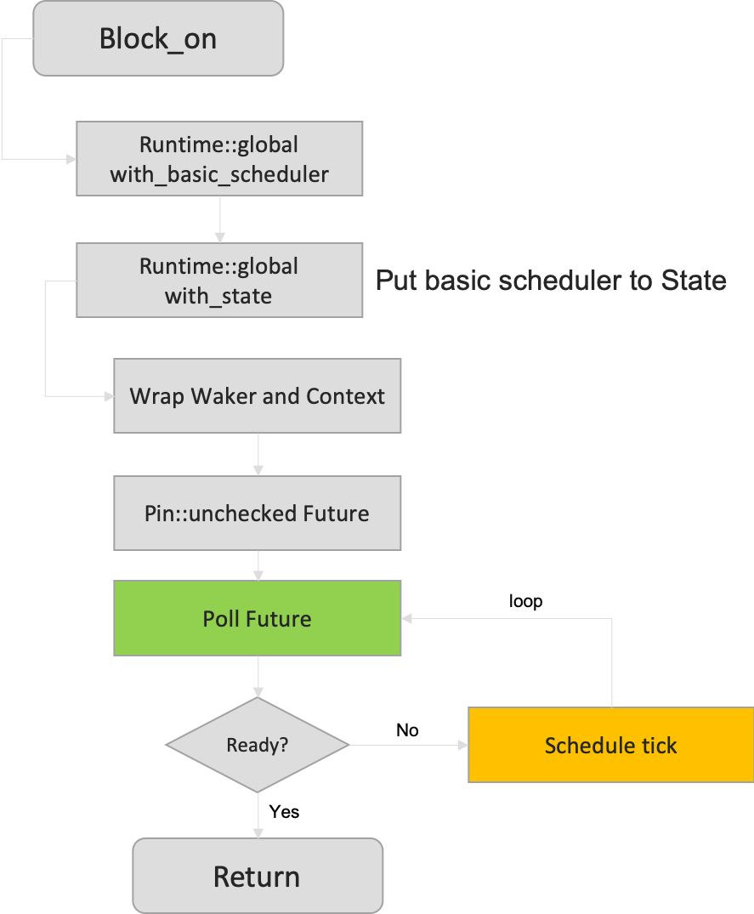

## Rust简介

```
一门赋予每个人构建可靠且高效软件能力的语言。
```

<!-- more -->

编程很难，不是因为我们人体本身构造复杂，而是因为我们都只是人类。我们的注意力持续时间有限，记忆也不是永久的——换句话说，我们往往会犯错。电脑和软件无处不在：在太空中，天上，地面，佩戴在身上，甚至在我们的身体里。每天都有越来越多的系统实现自动化，越来越多的生命依赖于软件及其质量，航空电子设备，自动驾驶汽车，核电站，交通控制系统，植入式心脏起搏器。这些系统中的bug几乎总是危及人类的生命。
“程序正确性是通过测试来检验的”和“程序正确性是经过逻辑验证的”之间存在着巨大的差异。不幸的是，即使我们对代码的每一行都进行了测试，我们仍然不能确保它是正确的。然而，拥有一个形式系统来证明我们的代码是正确的(至少在某些方面是正确的)则是另一回事了。

### Rust的方式

「Rust作为一种编程语言」的不同之处，不是因为它的花哨语法或受欢迎的社区，而是因为人们在使用它编写程序时能获得信心。Rust非常严格并且追究细节的编译器会检查你使用的每个变量和引用的每个内存地址。它可能看起来会妨碍你编写高效且富有表现力的代码，但令人惊讶的是，恰恰相反：编写一个有效且地道的Rust程序实际上比编写一个有潜在危险的程序更容易。在后一种情况下，你将与编译器发生冲突，因为你尝试的几乎所有操作都会导致内存安全问题。


Rust语言是一种高效、可靠的通用高级语言。其高效不仅限于开发效率，它的执行效率也是令人称赞的，是一种少有的兼顾开发效率和执行效率的语言。

高性能 - Rust 速度惊人且内存利用率极高。由于没有运行时和垃圾回收，它能够胜任对性能要求特别高的服务，可以在嵌入式设备上运行，还能轻松和其他语言集成。
可靠性 - Rust 丰富的类型系统和所有权模型保证了内存安全和线程安全，让您在编译期就能够消除各种各样的错误。
生产力 - Rust 拥有出色的文档、友好的编译器和清晰的错误提示信息， 还集成了一流的工具 —— 包管理器和构建工具， 智能地自动补全和类型检验的多编辑器支持， 以及自动格式化代码等等。


## Rust和go

go定位是云计算时代的C语言，主要是面向云计算领域。而rust是系统级语言，更Low level一些都是强类型语言，go有GC而rust没有 go目前没有模板，rust有，换言之，rust的编程范式更丰富一些go简单，上手快，rust因为有变量的lifetime概念和内存的borrow概念，上手难一些go对于程序员来说，内存管理部分完全交给go了，自己不可控。rust最大优势是内存管理方面，并且GC是可选的，但相对学习成本也高很多。
使用 Rust更适用于对时间/空间要求苛刻的场景，比如微控制器，另一个重要场景就是 Web Assembly， Rust独特的内存模型等特点，Rust的学习曲线更陡峭，更难上手。

## 高级语言特性

### 所有权

计算机程序必须在运行时管理它们所使用的内存资源。大多数的编程语言都有管理内存的功能。
C/C++ 这样的语言主要通过手动方式管理内存，开发者需要手动的申请和释放内存资源。但为了提高开发效率，只要不影响程序功能的实现，许多开发者没有及时释放内存的习惯。所以手动管理内存的方式常常造成资源浪费。
Java 语言编写的程序在虚拟机（JVM）中运行，JVM 具备自动回收内存资源的功能。但这种方式常常会降低运行时效率，所以 JVM 会尽可能少的回收资源，这样也会使程序占用较大的内存资源。
所有权对大多数开发者而言是一个新颖的概念，它是 Rust 语言为高效使用内存而设计的语法机制。所有权概念是为了让 Rust 在编译阶段更有效地分析内存资源的有用性以实现内存管理而诞生的概念。

所有权有以下三条规则：

```
Rust 中的每个值都有一个变量，称为其所有者。
一次只能有一个所有者。
当所有者不在程序运行范围时，该值将被删除。
```

## Rust异步

### 最简单的异步

使用async 来修饰一个方法, 表示此方法是一个异步任务, 然后在主线程里使用一个执行器宏 block_on 来等待运行结果

```
use futures::executor::block_on;

async fn say_hi() {
    println!("nice");
}

fn main() {
    let future = say_hi();
    // block the current thread until provided future
    block_on(future);
}
```

### 关键字 await

```
use futures::executor::block_on;

async fn lear_song() {
    println!("learn song");
}

async fn sing_song() {
    println!("sing song");
}

async fn dance() {
    println!("learn dance");
}

async fn learn_and_sing() {
    // study song, and wait
    let song = lear_song().await;
    // then sing song
    sing_song().await;
}

async fn async_main(){
    let f1 = learn_and_sing();
    let f2 = dance();
    futures::join!(f1,f2);
}

fn main() {
    block_on(async_main());
    
```


### Tokio异步原理初探

Tokio 设计一个高效完整的异步框架。主要有Future和Waker概念：

Waker 包含以下几个内容：
Context : 上下文，在这里，就是包装 Waker 的入口
RawWaker : 生成 Waker
RawWakerVTable : 是一个虚函数指针表(Virtual Function Pointer Table, vtable)，指向 RawWaker 对象的指针的列表
Waker : 通知任务准备启动的入口


Future 意思就是未来要执行的动作。，future 本质上表达一个还没有准备好的值。通常，future 的完成(值准备好了)取决于事件在某处完成了某个事件。

除了Future和Waker之后，还有：

executor ： 执行任务的基础。线程、协程、进程或者其他计算运行时
scheduler：调度方式，针对不同的计算调度不同的 executor 来运行
park : 对线程进行管理，满足 scheduler 的调度要求
task ：Future 是小片的执行操作，要完整一个完整的任务，需要更强大的方式，就是task

```

use tokio::net::TcpListener;
use tokio::prelude::*;
​
#[tokio::main]
async fn main() -> Result<(), Box<dyn std::error::Error>> {
    let mut listener = TcpListener::bind("127.0.0.1:8080").await?;
    loop {
        let (mut socket, _) = listener.accept().await?;
        tokio::spawn(async move {
            loop {
                // ... do somethings ...
            }
        });
    }
}
```

