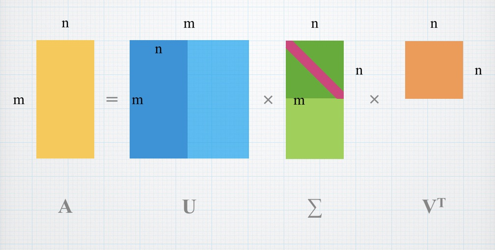
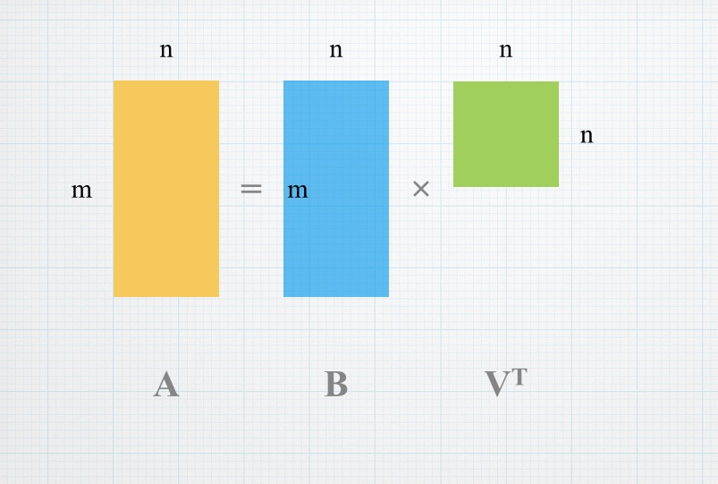

## 线性变换是运动

```
1. 首先有空间，空间可以容纳对象运动的。一种空间对应一类对象。
2. 有一种空间叫线性空间，线性空间是容纳向量对象运动的。 
3. 运动是瞬时的，因此也被称为变换。(跃迁)
4. 矩阵是线性空间中运动（变换）的描述。
5. 矩阵与向量相乘，就是实施运动（变换）的过程。
6. 同一个变换，在不同的坐标系下表现为不同的矩阵，但是它们的本质是一样的，所以本征值相同。
7.固定坐标系下一个对象的变换等价于固定对象所处的坐标系变换。
```
<!-- more -->

线性空间中的任何一个对象，通过选取基和坐标的办法，都可以表达为向量的形式。在线性空间中，当你选定一组基之后，不仅可以用一个向量来描述空间中的任何一个对象，而且可以用矩阵来描述该空间中的任何一个运动（变换）。而使某个对象发生对应运动的方法，就是用代表那个运动的矩阵，乘以代表那个对象的向量。

简而言之，在线性空间中选定基之后，向量刻画对象，矩阵刻画对象的运动，用矩阵与向量的乘法施加运动。
所谓变换，其实就是空间里从一个点（元素/对象）到另一个点（元素/对象）的跃迁。对于一个线性变换，只要你选定一组基，那么就可以找到一个矩阵来描述这个线性变换。换一组基，就得到一个不同的矩阵。所有这些矩阵都是这同一个线性变换的描述，但又都不是线性变换本身。所谓相似矩阵，就是同一个线性变换的不同的描述矩阵。
矩阵不仅可以作为线性变换的描述，而且可以作为一组基的描述。而作为变换的矩阵，不但可以把线性空间中的一个点给变换到另一个点去，而且也能够把线性空间中的一个坐标系（基）表换到另一个坐标系（基）去。而且，变换点与变换坐标系，具有异曲同工的效果。线性代数里最有趣的奥妙，就蕴含在其中。理解了这些内容，线性代数里很多定理和规则会变得更加清晰、直觉。


## 线性变换的几何直观

```
变换前是直线的，变换后依然是直线
直线比例保持不变
变换前是原点的，变换后依然是原点
```

## 行列式本质

行列式的几何性质（本质），是描述n维线性空间中线性变换“大小”的量,2维矩阵其实描述了矩阵平行四边形的面积，3维矩阵确定的平行六面体的体积。
当矩阵行列式为0，说明它将原空间线性变换后压缩为一条线或一个点（二维情况下），即使原空间维度降低。这也解释了为何矩阵列向量线性相关时，经过它的线性变换后，原空间发生维度衰减。它的行列式为0。

当行列式为负数，表示矩阵的线性变换将原空间的定向发生了改变，如平面翻转。更为直观的就是变换后坐标轴的相对位置发生了变换。（三维空间下，一般情况下建系是符合右手定则的，若线性变换后，任然满足右手定则，则行列式一定为正，若不能满足右手定则，即变成了左手定则，则称空间发生了定向改变，行列式为负）。但行列式的绝对值任然表示面积的缩放比例。


## 特征向量和特征值

一个矩阵A的特征向量，在经过这个矩阵所代表的线性变换之后，没有偏离其所张成的直线，经线性变换后依然保留在原张成空间中的向量，而只是发生了伸缩或方向改变，特征值表示伸缩大小。

## 使用场景

- 在微积分中，线性代数可以帮助定义 Jacobi 式，解决极值问题(Jacobi矩阵是局部线性化，就像一维导数一样)。
- 在解析几何中，线性代数更好的抽象二次曲线、二次曲面，给出能描述它们本质的不变量、半不变量等等。
- 平面直角坐标系下，给定三个不共线的点，行列式可以优雅的表示它们组成的三角形的面积。
- 特征值及其推广概念可以用于统计模式识别。
- 矩阵变换如果加入齐次坐标的概念就可以很好的用于 GPU 中的图形运算，N维空间中的仿射变换可以转换成N+1维空间中的线性变换来实现。
- 矩阵可以帮助抽象和表示电路中的二端口网络。

## SVD分解

SVD也是对矩阵进行分解，但是和特征分解不同，SVD并不要求要分解的矩阵为方阵。假设我们的矩阵A是一个m×n的矩阵，那么我们定义矩阵A的SVD为：A=UΣVT
其中，U是一个m×m矩阵，矩阵U中的正交向量为左奇异向量；V是一个n×n矩阵，矩阵V中的正交向量为右奇异向量，U和V都是酉矩阵，满足UTU=I,VTV=I, Σ是一个m×n矩阵，除了对角线元素以外都为0，对角线上的元素为奇异值。
ATA的特征值矩阵是奇异值矩阵的平方。



- 降维
矩阵A的特征有n维，经过SVD分解之后，完全可以用前r个非零奇异值对应的奇异向量表示矩阵A的主要特征。这样，就起到了降维的作用。

- 压缩
经过SVD分解之后，表示原来的矩阵A，只需要存U,Σ,V三个较小的矩阵即可。而这三个小矩阵的规模加起来也远远小于原始矩阵A。这样，就达到压缩的作用。
- PCA
PCA降维需要找到样本协方差矩阵XTX的最大d个特征向量，然后用这些特征向量张成的矩阵来做低维投影降维。这个过程中，需要先求出协方差矩阵XTX，但是，当样本数和特征数很多的时候，计算量是相当大的。SVD可以应用于PCA降维。注意到SVD可得到协方差矩阵XTX最大的d个特征向量张成的矩阵，但SVD有一个好处是先不求协方差矩阵XTX，也能求解出右奇异矩阵V。也就是说，PCA算法可以不用做特征分解，而是做SVD来完成。这个方法在样本量很大的时候很有效。

