## 计算机图形学

什么是计算机图形学？计算机图形学(Computer Graphics，简称CG)的内容比较丰富，与很多学科都有交叉。
在“Wiki百科”和“百度百科”上，对“计算机图形学”的解释为：计算机图形学是一种使用数学算法将二维或三维图形转化为计算机显示器的栅格形式的科学。简单地说，计算机图形学的主要研究内容就是研究如何在计算机中表示图形、以及利用计算机进行图形的计算、处理和显示的相关原理与算法。虽然通常认为CG是指三维图形的处理，事实上也包括了二维图形及图像的处理，计算机图形学, 用计算的方法，将物理世界映射到虚拟数字世界（即，对物体的几何与物理属性与规律进行建模与动画，并进行呈现与交互），再通过虚拟世界的计算最终反向作用于现实世界。

<!-- more -->

狭义上，计算机图形学是数字图象处理或计算机视觉的逆过程：计算机图形学是用计算机来画图像的学科，数字图象处理是把外界获得的图象用计算机进行处理的学科，计算机视觉是根据获取的图像来理解和识别其中的物体的三维信息及其他信息。实际上，计算机图形学、数字图象处理和计算机视觉在很多地方的区别不是非常清晰，很多概念是相通的，而且随着研究的深入，这些学科方向不断的交叉融入，形成一个更大的学科方向，可称之为“可视计算”(Visual Computing)。

1962年，麻省理工学院，Ivan Sutherland博士论文“Sketchpad：一个人机交互通信的图形系统”, 提出“计算机图形学”的概念。


### 计算机图形学的研究问题

计算机图形显示设备是由像素构成的矩阵：连续空间的离散采样
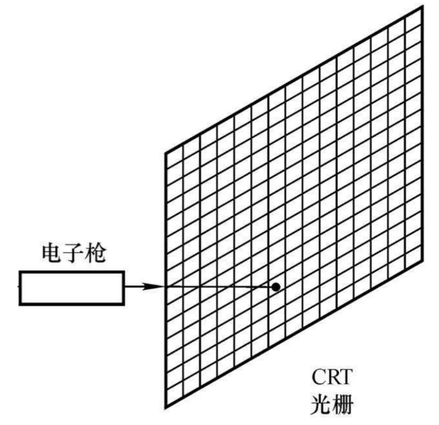

2D图形利用数学表达的几何对象（点、线、面）
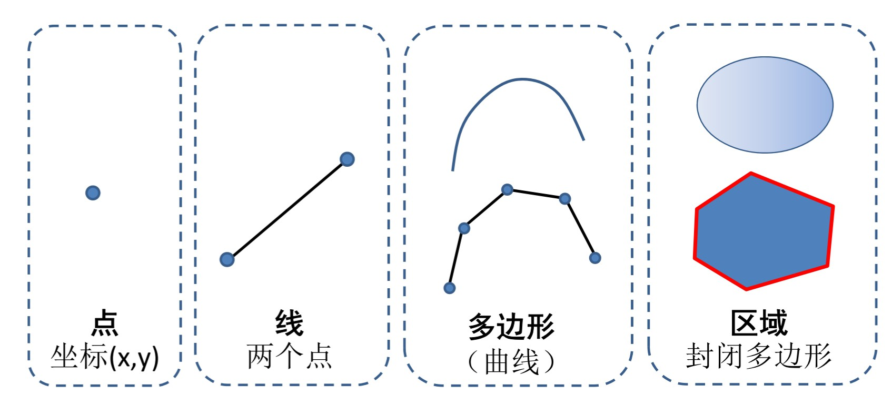

2D图形的渲染, 将几何对象转化为栅格图像
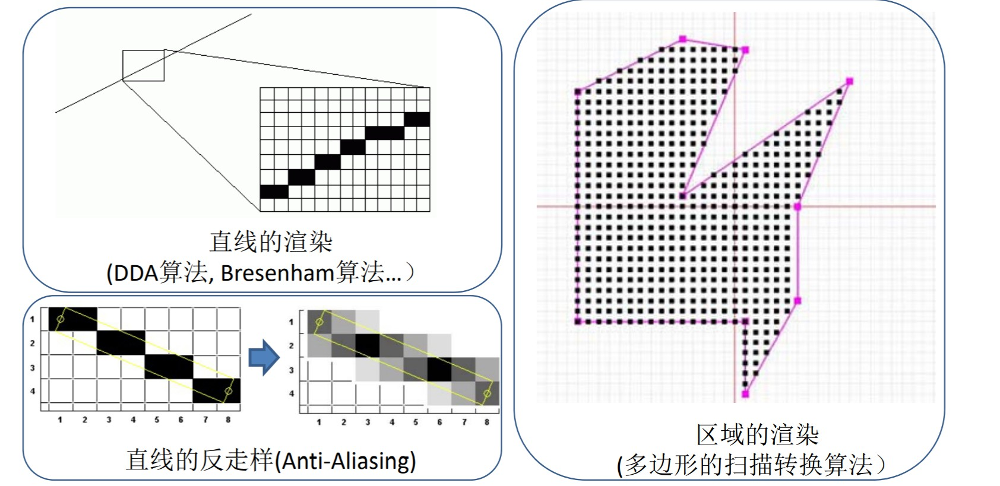

3D实体表面的数学表达

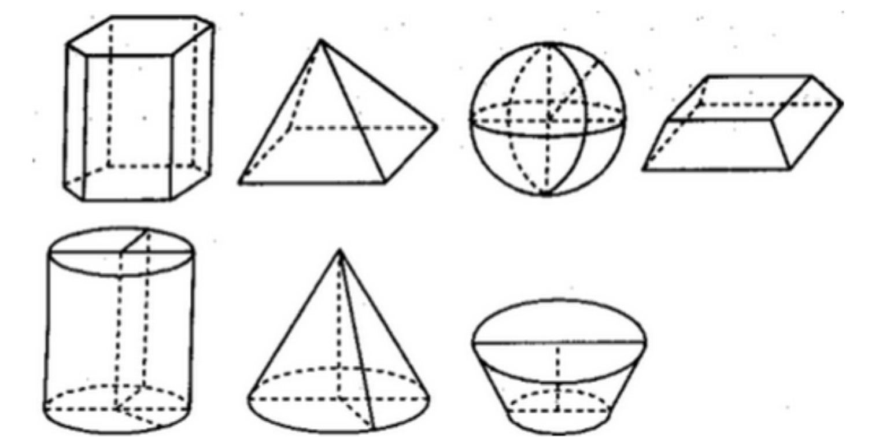

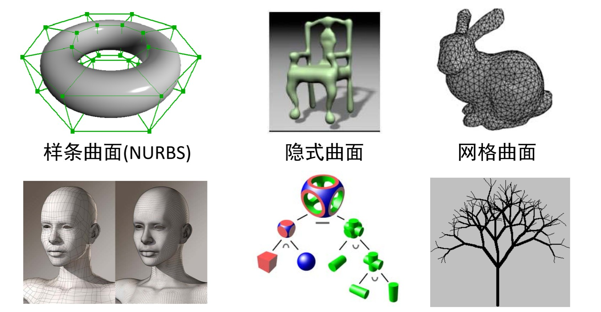

3D图形的渲染, 转化为栅格图像（光栅化）

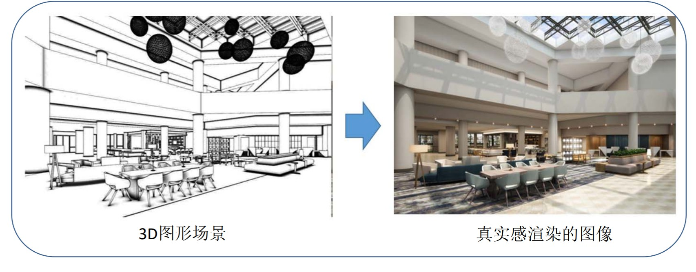

3D渲染的几何计算
将3D矢量转化为2D矢量,投影变换、裁剪、消隐

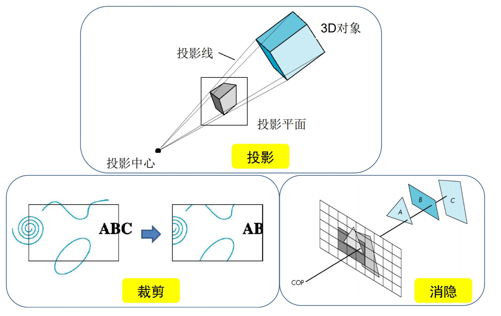

3D渲染的主要过程：像素计算，将每个像素赋予颜色 光照、阴影、纹理、环境映射、材质

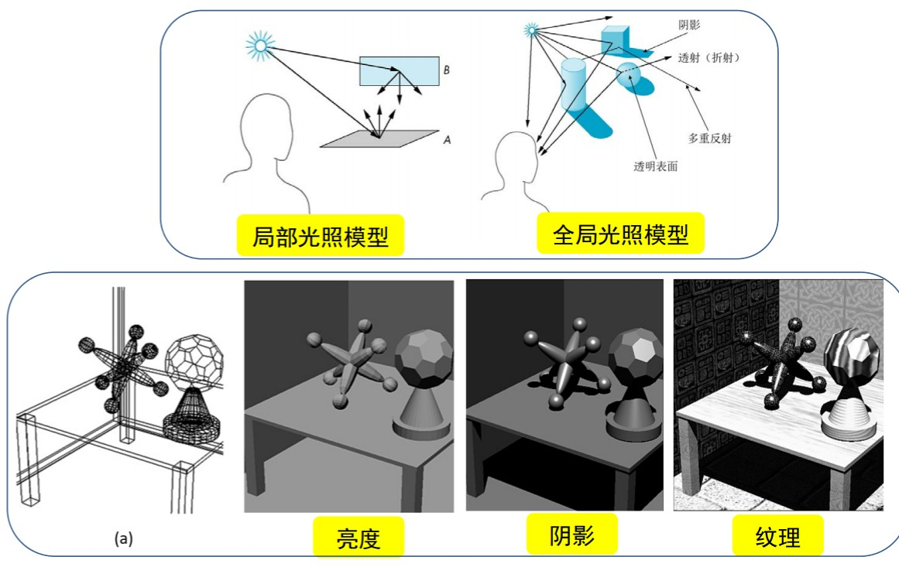


## 应用

- 计算机游戏
- 电影、动画
- 工业产品设计
- 计算机仿真
- 虚拟现实与混合现实
- 数字地球与数字城市
- 可视化
- 医学
- 建筑与艺术


## 问题和挑战
 
 3D建模软件：国外为主

 ```
 动画建模软件
– Autodesk (3DS Max, Maya), Rhino
– Zbrush, MudBox, MeshMixer
• CAD/CAE/CAM工业软件
– AutoCAD, EDA
– CATIA, SolidWorks, UG NX, Pro/E
• 倾斜摄影软件
– Smart3D ‐‐ ContextCapture (CC)
– Altizure （香港/深圳）
 ```

 3D渲染引擎：国外为主

```
电影渲染引擎
– RenderMan, Mental Ray, Maxwell Render
– VRay, POV Ray
• 游戏渲染引擎
– Unity3D (U3D), UnReal (UE), CryEngine (CE), Frostbite 
Engine, Unigine
– 腾讯QuickSilverX, 网易NeoX, Messiah
• 城市渲染引擎
– Google Earth, Skyline, ESRI ArcGIS, Cesium
– 超图SuperMap，科澜CooRun，伟景行CityMaker
```

## 未来发展和机遇

### 对世界的多模态数据感知

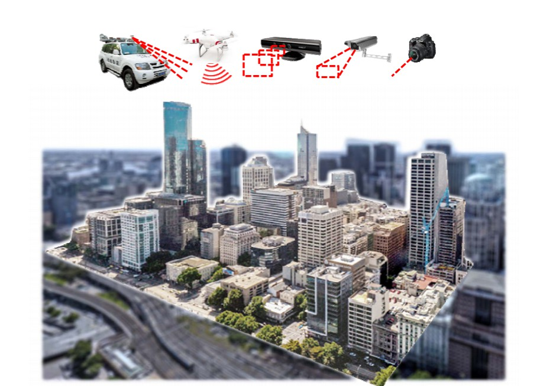

### 三维数据

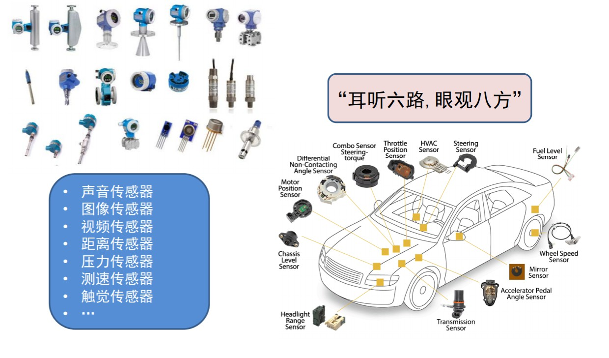

### 物联网感知

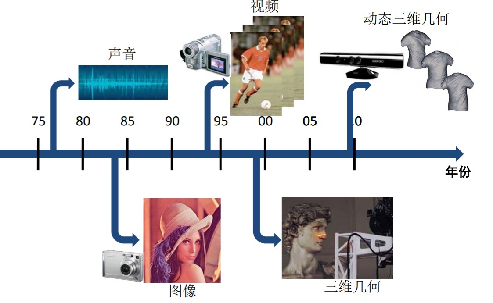

### CAD/CAE/CAM一体化

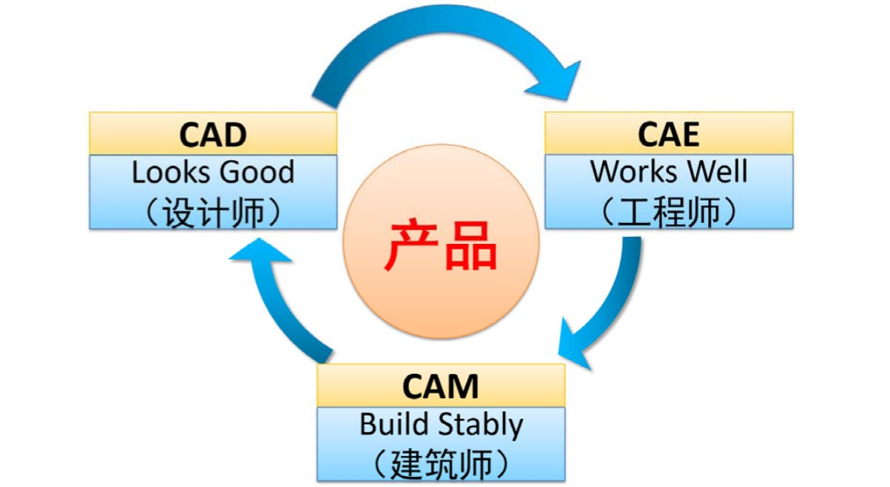

### 5G机遇

能够实时传输大量的3D数据
催生潜在应用
 VR/AR
– Holoportation
– Telepresence（远程呈现）
– 无人驾驶/机器人
– 物联网

### 智慧城市

3D数字城市是基础承载平台及可视化平台

### 混合现实

• 狭义的虚拟现实：视觉呈现
• 广义的虚拟现实：与其他物联网数据（传感数据、
信息数据、业务数据等）的深度融合与耦合

## OpenGL坐标系统

OpenGL在每次顶点着色器运行后，我们可见的所有顶点都为标准化设备坐标(Normalized Device Coordinate, NDC)。也就是说，每个顶点的x，y，z坐标都应该在-1.0到1.0之间，超出这个坐标范围的顶点都将不可见。我们通常会自己设定一个坐标的范围，之后再在顶点着色器中将这些坐标变换为标准化设备坐标。然后将这些标准化设备坐标传入光栅器(Rasterizer)，将它们变换为屏幕上的二维坐标或像素。

将坐标变换为标准化设备坐标，接着再转化为屏幕坐标的过程通常是分步进行的，也就是类似于流水线那样子。在流水线中，物体的顶点在最终转化为屏幕坐标之前还会被变换到多个坐标系统(Coordinate System)。将物体的坐标变换到几个过渡坐标系(Intermediate Coordinate System)的优点在于，在这些特定的坐标系统中，一些操作或运算更加方便和容易，这一点很快就会变得很明显。对我们来说比较重要的总共有5个不同的坐标系统：

局部空间(Local Space，或者称为物体空间(Object Space))
世界空间(World Space)
观察空间(View Space，或者称为视觉空间(Eye Space))
裁剪空间(Clip Space)
屏幕空间(Screen Space)
这就是一个顶点在最终被转化为片段之前需要经历的所有不同状态。

为了将坐标从一个坐标系变换到另一个坐标系，我们需要用到几个变换矩阵，最重要的几个分别是模型(Model)、观察(View)、投影(Projection)三个矩阵。我们的顶点坐标起始于局部空间(Local Space)，在这里它称为局部坐标(Local Coordinate)，它在之后会变为世界坐标(World Coordinate)，观察坐标(View Coordinate)，裁剪坐标(Clip Coordinate)，并最后以屏幕坐标(Screen Coordinate)的形式结束。下面的这张图展示了整个流程以及各个变换过程做了什么：


### 透视投影


```
局部坐标是对象相对于局部原点的坐标，也是物体起始的坐标。
下一步是将局部坐标变换为世界空间坐标，世界空间坐标是处于一个更大的空间范围的。这些坐标相对于世界的全局原点，它们会和其它物体一起相对于世界的原点进行摆放。
接下来我们将世界坐标变换为观察空间坐标，使得每个坐标都是从摄像机或者说观察者的角度进行观察的。
坐标到达观察空间之后，我们需要将其投影到裁剪坐标。裁剪坐标会被处理至-1.0到1.0的范围内，并判断哪些顶点将会出现在屏幕上。
最后，我们将裁剪坐标变换为屏幕坐标，我们将使用一个叫做视口变换(Viewport Transform)的过程。视口变换将位于-1.0到1.0范围的坐标变换到由glViewport函数所定义的坐标范围内。最后变换出来的坐标将会送到光栅器，将其转化为片段。
```

## 齐次坐标

```
"齐次坐标表示是计算机图形学的重要手段之一，它既能够用来明确区分向量和点，
同时也更易用于进行仿射（线性）几何变换。" —— F.S. Hill, JR。
```

重要性，主要有二：其一，是区分向量和点；其二，是易于进行 仿射变化（Affine Transformation）

齐次坐标在电脑图形内无处不在，因为该坐标允许平移、旋转、缩放及透视投影等可表示为矩阵与向量相乘的一般向量运算。依据链式法则，任何此类运算的序列均可相乘为单一个矩阵，从而实现简单且有效之处理。与此相反，若使用笛卡儿坐标，平移及透视投影不能表示成矩阵相乘，虽然其他的运算可以。现在的OpenGL及Direct3D图形卡均利用齐次坐标的优点，以具4个暂存器的向量处理器来实作顶点着色引擎。

### 有何优点

许多图形应用涉及到几何变换，主要包括平移、旋转、缩放。以矩阵表达式来计算这些变换时，平移是矩阵相加，旋转和缩放则是矩阵相乘，综合起来可以表示为p' = m1*p+ m2。引入齐次坐标的目的主要是合并矩阵运算中的乘法和加法，表示为p' = p*M的形式。即它提供了用矩阵运算把二维、三维甚至高维空间中的一个点集从一个坐标系变换到另一个坐标系的有效方法。
其次，它可以表示无穷远的点。

## 四元数

四元数最早于1843年由Sir William Rowan Hamilton发明，作为复数(complex numbers)的扩展。直到1985年才由Shoemake把四元数引入到计算机图形学中。四元数在一些方面优于Euler angles(欧拉角)和matrices。任意一个三维空间中的定向(orientation，即调置朝向)都可以被表示为一个绕某个特定轴的旋转。给定旋转轴及旋转角度，很容易把其它形式的旋转表示转化为四元数或者从四元数转化为其它形式。四元数可以用于稳定的、经常性的(constant)的orientations(即旋转)插值，而这些在欧拉角中是很难实现的。
一个复数具有实部和虚部，每一部分由两个实数表示，其中第一个实数要乘以 。相似地，四元数由四部分组成，一个实部，三个虚部。三个虚部与旋转轴密切相关，而旋转角度影响四个部分。

### 四元数引出

四元数的一个最主要的应用就是表示旋转，它既是紧凑的，也没有奇异性。而旋转的其他表示方法各有优劣：

旋转矩阵：用九个数来表示三个自由度，矩阵中的每一列表示旋转后的单位向量方向，缺点是有冗余性，不紧凑。

旋转向量：用一个旋转轴和一个旋转角来表示旋转，但是因为周期性，任何2nπ的旋转等价于没有旋转，具有奇异性。

欧拉角：将旋转分解为三个分离的转角，常用在飞行器上，但因为万向锁问题（Gimbal Lock) 而同样具有奇异性。

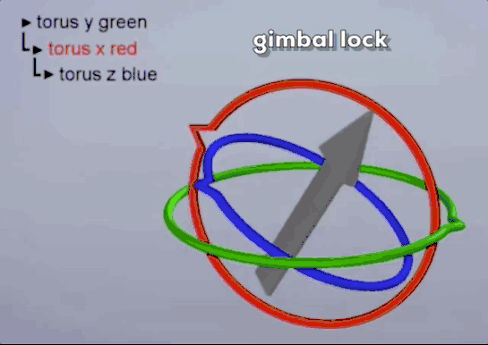

四元数之所以难以理解，是因为它是一个四维的表示。不过也不是没有办法，因为我们通常用单位四元数来表示旋转，所以我们只需要关注四维中的单位超球面（unit hypersphere)，然后就可以较为轻松地获得它在三维的球极平面投影（stereographic projection).

### 四元数公式

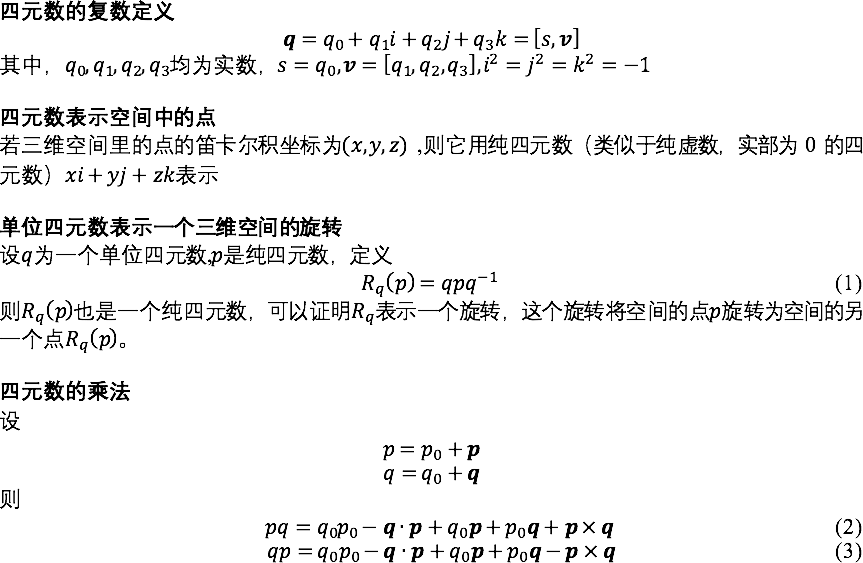

### 单位圆在一维空间的投影

为了更好地理解四维单位超球面在三维空间的投影， 我们先来看一看二维单位圆是怎么投影到一维空间的。

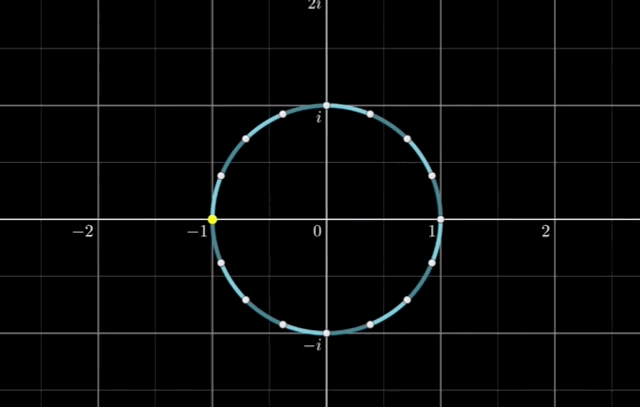


在复数平面内，对于每一个在单位圆上的点，画一条线将 -1 点与这个点相连。连线将与虚数轴交于一点，此交点就是投影点。从上图中可以看到，1 投影在一维 0 处，i 和 -i 投影后不发生变化， 而 -1 投影到了正负无穷远处。这里需要注意的是，此处的投影仅仅只是二维空间中单位圆的一个投影，二维空间中的其他点是没有办法用一维来表示的。

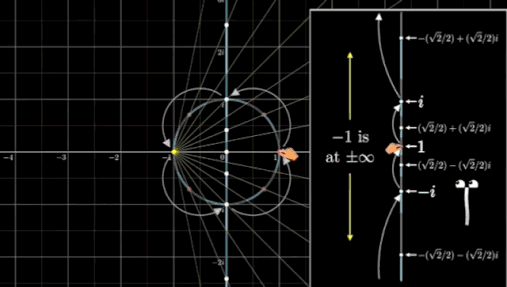

我们可以在左边的单位圆中清楚地观察到乘以 i 对应着一个90度的旋转，与之对应的，投影在一维坐标轴上的点也在进行着移动，1 变成 i，i 变成 -1，-1 变成 -i，-i 变成 1， 这与复数的乘法定义相吻合。就这样，二维空间中单位圆的纯旋转由一个维度表示清楚.

### 单位球面在二维空间的投影

现在想象我们如何将三维空间的纯旋转解释给二维的生物。首先我们需要构建一个新的坐标系，在这个坐标系中，i 轴和 j 轴形成一个平面，而实数轴与z轴对齐。

需要注意的是，这里的坐标系仅仅只是为了让概念可视化，i 和 j 并不像复数和四元数那样有良好的乘法定义。和之前的二维投影相似，我们可以用球极平面投影来描述三维的旋转。对于每一个单位球面上的点，我们都把它与 -1 点相连，这条线与 ij 平面的交点即是二维的投影点。

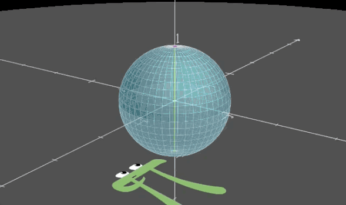

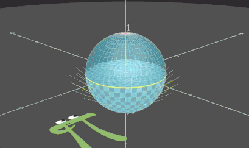

如上图所示，实数轴上的 1 会投影在平面的原点，北半球上的点会投影在 ij 平面的单位圆内，而南半球上的点会投影在单位圆之外，且任意方向的无穷远处都会是-1的投影。这里的单位圆是投影之后唯一不被扭曲的，位于单位球上的点。

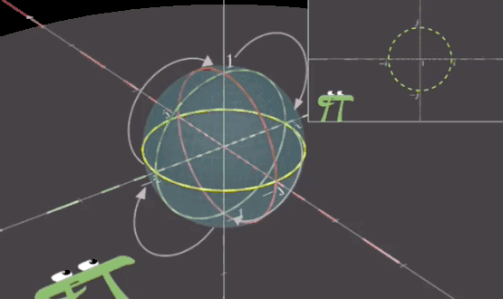

### 单位超球面在三维空间的投影

如同复数的定义，四元数由一个实数项和三个虚数项构成。对 q2 左乘一个四元数 q1，其作用是将 q2 拉伸 q1 的模长，再作用一个特殊的四维旋转。因为我们用单位四元数来表示三维空间中的旋转，所以在这里不再考虑拉伸。

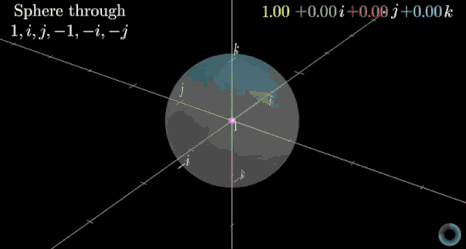

对四维空间中的单位球面进行球极平面投影，实数轴的 1 投影到 ijk 坐标系的原点。如同一维中的 i， j 点，二维中的单位圆，当四维超球面投影到三维空间时，与三维空间交于一个位置不变的三维单位球面，而这个球面对应纯四元数，也就是实数部分为零。实数部分介于 0 到 1 之间的投影在了这个三维球面的里面，而实数部分小于 0 的投影在了三维球面以外，-1 投影在了各个方向的无穷远处。

正如同三维中的圆投影到二维平面中是一条线一样，四维中的球（不是超球）投影在三维是一个平面，事实上，三维投影中的平面都是四维超球中过 -1 的球面在三维的投影

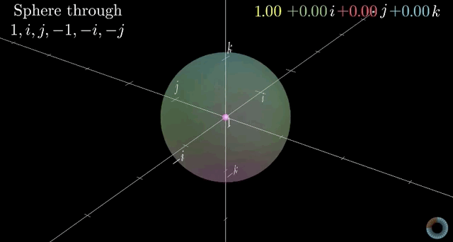

画一些参考线并观察，我们得出了整篇文章一个非常重要的结论：乘上一个单位四元数可以看成是三维空间内两个垂直且同步的二维旋转。

### 单位四元数乘法的可视化

讲了这么多，我们终于可以用单位四元数在三维的投影来理解四元数啦！首先是四元数的乘法。什么叫做两个垂直且同步的二维旋转呢？如下图所示，正在变化的 i 轴描述了一个二维的旋转，而 jk 平面里的圆同样描述了一个二维的旋转。对于四维空间的生物来说，他们观察到的是一个四维刚体的纯旋转，但在我们看来，只能把它分解为两个二维的旋转，它们因基坐标的定义而互相垂直，因描述同一个四维旋转而同步。

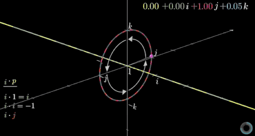


于是乎，我们可以观察到几乎所有的四元数乘法定则。左乘一个 i 相当于两个圆都转了90度，1 变成 i，i 变成 -1， j 变成 k， k 变成 -j， -j 变成 -k， -k 变成 j。

四元数并不关心四维单位超球面的旋转，而是拿它来描述三维空间的旋转，于是我们必须要找到一种不带拉伸效果的四元数运算。人们发现，当右乘 q 的逆时，同方向的旋转会继续进行，而拉伸的效果互相抵消，于是就有了 qpq’ 的表示方法。如果表示一个绕 u 轴 θ 度角的旋转， q 则表示为 [cos(θ/2), sin(θ/2)u].

四元数并不关心四维单位超球面的旋转，而是拿它来描述三维空间的旋转，于是我们必须要找到一种不带拉伸效果的四元数运算。人们发现，当右乘 q 的逆时，同方向的旋转会继续进行，而拉伸的效果互相抵消，于是就有了 qpq’ 的表示方法。如果表示一个绕 u 轴 θ 度角的旋转， q 则表示为 [cos(θ/2), sin(θ/2)u].

对于详细的 qpq’ 的推导，请参考 krasjet 编写的一篇文章 [四元数与三维旋转](052701.mdhttps://krasjet.github.io/quaternion/quaternion.pdf)
