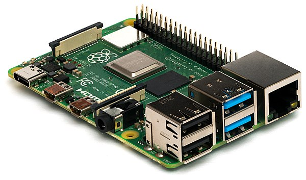
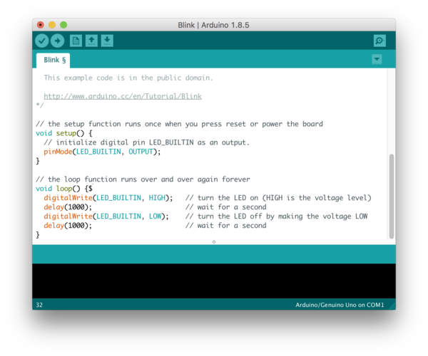
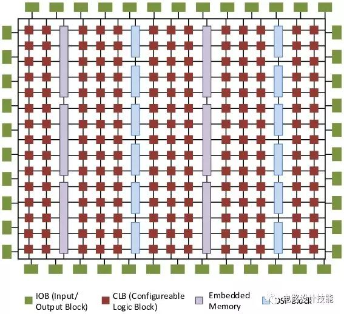

## RaspberryPi

Raspberry Pi(中文名为 “树莓派”, 简写为 RPi，或者 RasPi/RPi) 是为学生计算机编程教育而设计，只有信用卡大小的卡片式电脑，其系统基于Linux。

<!-- more -->

树莓派由注册于英国的慈善组织 “Raspberry Pi 基金会” 开发，Eben·Upton为项目带头人。2012 年 3 月，英国剑桥大学Eben Epto正式发售世界上最小的台式机，又称卡片式电脑，外形只有信用卡大小，却具有电脑的所有基本功能，这就是 Raspberry Pi 电脑板，中文译名 "树莓派"！这一基金会以提升学校计算机科学及相关学科的教育，让计算机变得有趣为宗旨。基金会期望这 一款电脑无论是在发展中国家还是在发达国家，会有更多的其它应用不断被开发出来，并应用到更多领域。

一句话：树莓派是一个卡片大小的开发板，上面可以运行 Linux 系统，同时它提供了很多可编程的GPIO用于扩展硬件。

树莓派到如今已经发布了4代，性能自然是越来越强了，每一代都分为A、B型（刚发布的4代暂时还没有A型），也有比较特殊的型号比如去掉大部分接口很小巧的树莓派Zero、去掉所有接口的树莓派计算型CM（Compute Module）、B型的增强型B+等。其中B型是最常用的，而A、B型区别也只在于尺寸和接口不同，SoC基本都是一致的。

Raspberry Pi是功能齐全的单板计算机家族，具有CPU，MMU和所有必要的组件，以运行具有硬件抽象层，虚拟内存抽象等的完整操作系统，例如Archlinux或Raspbian。因此，相对而言，RPi SBC最适合用于需要大量计算能力的任务。尽管Raspberry Pi板有相当一部分GPIO引脚，但它们使用3.3V逻辑电平，因此，它们与使用5V逻辑电平的传感器，伺服电机和其他外设不兼容。当然，你可以通过3.3V→5V逻辑转换器解决这个问题，但这是不必要的复杂，我们大多数项目可能不需要Raspberry Pi的处理能力。这就是Arduino的用武之地。尽管其规格比RPi系列低得多，处理能力也比RPi系列低得多，但它们却以通过廉价和可抛弃性来弥补。最便宜的第三方arduino的价格不到10元。总之，如果您的项目需要大量的处理能力，那么Raspberry Pi会更好。基于AVR的Arduino更适合要求不高的应用，或需要使用5V逻辑电平和/或可靠的低功耗操作的外设的任务。

## Arduino

Arduino是一家制作开源硬件和开源软件的公司，同时兼有项目和用户社区，该公司负责设计和制造单板微控制器和微控制器包，用于构建数字设备和交互式对象，以便在物理和数字世界中感知和控制对象。该项目的产品是按照GNU宽通用公共许可证（LGPL）或GNU通用公共许可证（GPL）许可的开源硬件和软件分发的，Arduino允许任何人制造Arduino板和软件分发。 Arduino板可以以预装的形式商业销售，也可以作为DIY包购买。

Arduino英文的定义是 Micro controller。所谓控制器，接到输入，进行处理，再进行输出， 通常来说是单线程的。 所以适合做一些不复杂的项目。这里的输入可以是按键，传感器，数据等等， 输出可以是数据，声光，电机等等。 树莓派是一台电脑， 一台超小型的功能没那么强大的电脑。多线程，可以安装操作系统，有多样接口等等等等。

当然也有相对弱于Arduino的（功能方面），比如运算实时性不高不适合精确的时间控制。有很多项目也是通过树莓派控制Arduino来各取所长。我自己喜欢把两者的关系比作人脑，树莓派就像大脑一样负责观察体验（机器视觉），思考（AI），做出决定（指令传送到底层）；底层的功能如呼吸消化（系统自检，电源），本能应激反应（自动避障，陀螺仪），姿态控制（电机）等交给Arduino来更快速的解决。

树莓派做上层交互算法（处理视频流、音频流），单片机驱动全部硬件，二者通过总线连接交互（uart、i2c、spi、usb等

## STM32

stm32是由ST Micro electronic公司开发的32位微处理器集成电路。其内核是Arm的Cortex架构，I/O口众多，没有一个飞控系统是不可以用一个stm32解决的, stm32面向工控领域，主频高性能好，外设丰富，比较稳定，库函数ide都比较稳定，能够运行多款轻量级操作系统，适合产品开发

1. 技术的更替，这个是最主要的原因；
2. 市场的需求，传统的8/16位的微控制器，久经岁月的洗礼，如今虽有余辉，当面对这些需求时更显得捉襟见肘；
3. ST的努力，让STM32在众多基于Cortex-M内核的微控制器中脱颖而出，成为最璀璨的新星。

## FPGA

FPGA（Field Programmable Gate Array）是在PAL、GAL等可编程器件的基础上进一步发展的产物。它是作为专用集成电路（ASIC）领域中的一种半定制电路而出现的，既解决了定制电路的不足，又克服了原有可编程器件门电路数有限的缺点。

四个字母Field（现场） Programmable（可编程） Gate（逻辑门） Array（阵列）凸显了大量的逻辑门单元，这些逻辑单元是可以在任何地方随时进行组装的，这是不是跟乐高玩具一样？逻辑门单元是构成一切数字逻辑器件的基本单元，在数字世界里你想做任何事情、实现任何功能，都可以通过逻辑门的堆砌来实现，也就是说FPGA在数字领域里几乎无所不能，因此n年前我国的某一个FPGA公司在向国务院领导描述其产品的时候称他们做的是“万能芯片”（用这种通俗易懂的说法忽悠国家的经费）。万能有些夸张，但FPGA高度灵活，理论上来讲，只要有足够的资源（积木数量足够多）几乎可以实现数字域的任何功能，受限的是速度、功耗以及系统的成本。

