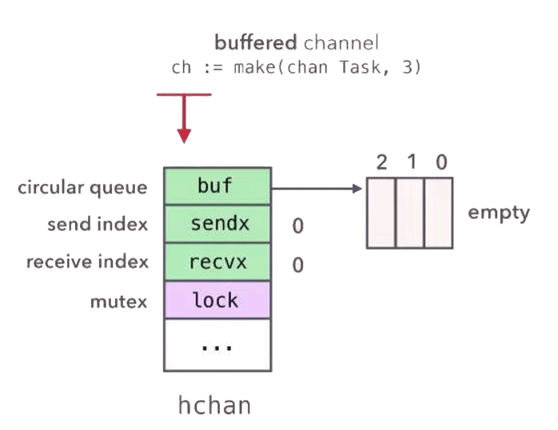
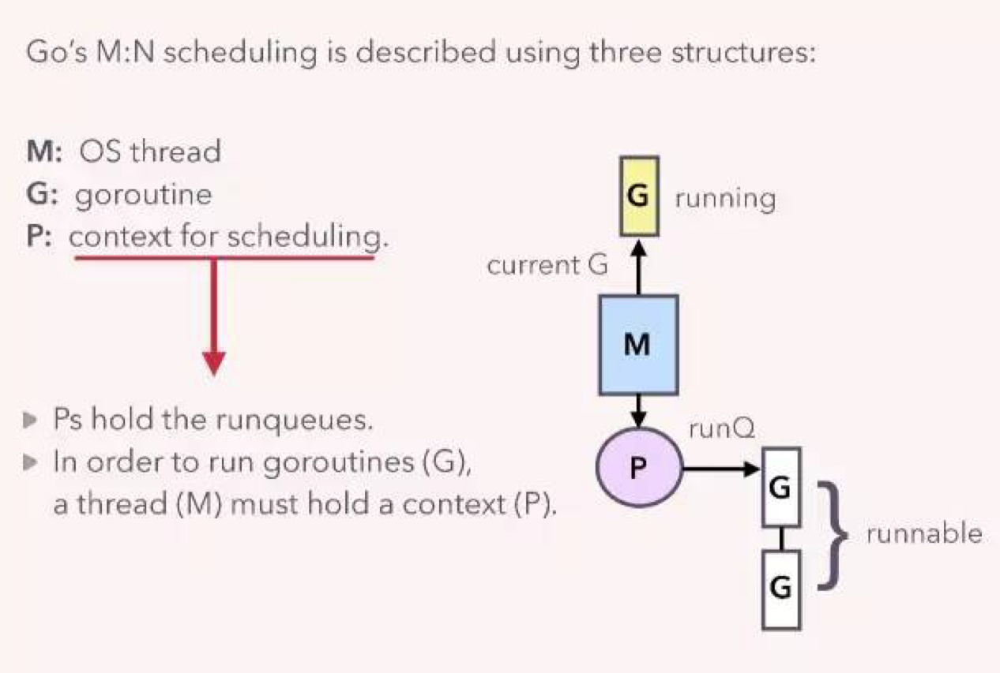

## 简介

Go is an open source programming language that makes it easy to build simple, reliable, and efficient software.

<!-- more -->


Go语言是谷歌推出的一种全新的编程语言，可以在不损失应用程序性能的情况下降低代码的复杂性。和今天的C++或C一样，Go是一种系统语言。使用它可以进行快速开发，同时它还是一个真正的编译语言。Rob Pike，Go 语言的开创者，被誉为“Go 语言之父”，Unix 的先驱，UTF-8 的设计人。

go语言目标：

```
a）Go必须能大规模的使用，用于多人的大组，并且适用于有大量依赖程序的项目。
b）Go的语法必须是让人熟悉的，大致类C。 谷歌需要在Go中快速提高程序员的效率，这意味着语言的语法的变化不能太激进。
c）Go必须是现代的。 它应该具有像并发这样的功能，以便程序可以高效地使用多核机器。 它应该有内置的网络和Web服务器库，以便它有助于现代化的发展。
```

## 为什么是Go


大规模服务器是互联网行业发展的必然结果；分布式系统是大规模服务器的最优解；而 k8s 和容器是分布式系统的最优解；go 是 k8s 的最优解。Google拥有全世界最大、最复杂的服务器包括软件和硬件。这些软件和硬件有两个需求：开发迭代的需求，和维护的需求。
所谓开发的需求，就是要满足迭代快的特点，比如最基本的，你不能说你发布一个新版本，所有服务器就需要停机维护，这不扯淡呢？
而维护的需求，就是要用尽量少的人力，最大化的保障服务器的稳定，简单粗暴的说，能让机器自动做的事情，就不要用人来搞了，比如流量高峰时候扩容，等等。
基于这两个大需求，Google 最终拿出的最佳实践是分布式架构的容器调度系统 kubernetes 。如果你稍微关心过 web 后台开发，当下你基本上都会听说过这个词，或者它的缩写：k8s。如果说把 k8s 的特性都用大部分人能听懂的语言在这里列出来，那我今天就不用干别的了。简而言之，你知道 k8s 是当下管理大规模集群的最优解就可以了。而能实现这个最优解的最优解，不是 java/cpp/python/php，而是 go。
因为不管是什么功能，go 能实现的，其他语言也都能实现，为什么只能是 go ？这是因为，服务器并不只有开发的角度，还有维护的角度。k8s 如果是用 java 写的，那意味着每个服务器需要维护一套 jre；这还不算，k8s 的组件有些是以容器形式启动的，这意味着除了服务器本身要有 jre，k8s 组件容器里也要有套完整的 jre，而是 java 写的 k8s，不好维护。所以，最终从开发和维护角度权衡，go 是 k8s 的最优解；而 k8s 和容器是分布式系统的最优解；分布式系统是大规模服务器的最优解；大规模服务器是互联网行业发展的必然结果。就这么简单。事实上，容器云在可预见的未来会是主流，容器云的技术核心就是 k8s；而当下最适合以容器形式部署在容器云上的语言。

优点：
a）静态类型： Go 是静态类型的。 这意味着您需要在编译时为所有变量和函数参数（以及返回变量）声明类型。 虽然这听起来不方便，但这有一个很大的优势，因为在编译时本身会发现很多错误。 当你的团队规模增加时，这个因素起着非常重要的作用，因为声明的类型使得函数和库更易读，更容易理解。

b）编译速度：Go 代码编译速度非常快，因此您无需继续等待代码编译。 实际上，go run 命令会很快启动你的Go程序，所以你甚至不会觉得你的代码是先编译好的。 这感觉就像一种解释性语言。

c）执行速度： 根据操作系统（Linux/Windows/Mac）和代码正在编译的机器的 CPU 指令集体系结构（x86，x86-64，arm等），Go 代码直接编译为机器代码。 所以，它运行速度非常快。

d）便携式： 由于代码直接编译为机器码，因此，二进制文件变得便携。 这里的可移植性意味着你可以从你的机器（比如 Linux，x86-64）获取二进制文件并直接在你的服务器上运行（如果你的服务器也在 x86-64 架构上运行 Linux）。

由于 Go 二进制文件是静态链接的，这意味着您的程序需要的任何共享操作系统库都将在编译时包含在二进制文件中。它们在运行程序时不会动态链接。
这对于在数据中心的多台机器上部署程序具有巨大的好处。如果您的数据中心中有 100 台机器，只要将二进制文件编译为您的机器所运行的相同操作系统和指令集体系结构，就可以简单地将您的程序二进制文件 “scp” 到所有这些机器。 你不需要关心他们正在运行的 Linux 版本。 不需要检查/管理依赖关系。 二进制文件运行的过程中，所有的程序都跑起来了。

e）并发性： Go 对并发有一流的支持。 并发是 Go 的主要卖点之一。 语言设计师围绕托尼霍尔的“Communicating Sequential Processes”论文设计了并发模型。

## Goroutine

在介绍协程之前，我们应该先知道线程、进程以及并行、并发：

```
进程是指一段程序在一定的数据集合上的一次动态执行，进程是运行在自己内存地址空间独立执行体，即内存分配的基本单位
进程内的线程共享同一个内存地址空间，是cpu调度的基本单位。
并发是指基于CPU调度算法，多个线程轮流使用CPU时间片来执行任务，由于CPU速度非常快，就像有多个任务在后台执行一样
并行通常是指多个线程(任务)，在多核(多处理器)上并行执行，这才是真正的有多个任务同时运行
```

前面介绍了一些跟CPU执行的基本概念，我们来首先了解为什么要有goroutine这个概念。通常内核线程与用户态线程的比例模型有1:1，1:N，以及M:N，接下来我们简单的介绍一下这三种模型的优缺点：

1:1 即一个用户态线程对应着一个内核线程，优点是能够利用多核的特性，缺点是线程切换的开销比较大，每次线程的切换都要经历用户态和内核态的转换。
1:N 即多个用户态线程对应着一个内核线程，优点是线程切换的开销很小，缺点是无法利用CPU多核
M:N 即Go中的goroutine采用的形式，结合1:1和1:N模型的优点，能够充分利用多核，切换的开销又很小。当然，为了实现M:N的模型，Go在背后做了很多的事情，比如线程调度器，同时，为了了解协程的底层实现，还需要去了解MPG这三个分别代表着什么含义。


Goroutine是Go语言特有的名词。区别于进程Process，线程Thread，协程Coroutine，因为Go语言的创造者们觉得和他们是有所区别的，所以专门创造了Goroutine。Goroutine是与其他函数或方法同时运行的函数或方法。Goroutines可以被认为是轻量级的线程。与线程相比，创建Goroutine的成本很小，它就是一段代码，一个函数入口。以及在堆上为其分配的一个堆栈（初始大小为4K，会随着程序的执行自动增长删除）。因此它非常廉价，Go应用程序可以并发运行数千个Goroutines。

Go并发调度: G-P-M模型

在操作系统提供的内核线程之上，Go搭建了一个特有的两级线程模型。goroutine机制实现了M : N的线程模型，goroutine机制是协程（coroutine）的一种实现，golang内置的调度器，可以让多核CPU中每个CPU执行一个协程。
Go语言中支撑整个scheduler实现的主要有4个重要结构，分别是M、G、P、Sched,
Sched结构就是调度器，它维护有存储M和G的队列以及调度器的一些状态信息等。
M结构是Machine，系统线程，它由操作系统管理的，goroutine就是跑在M之上的；M是一个很大的结构，里面维护小对象内存cache（mcache）、当前执行的goroutine、随机数发生器等等非常多的信息。
P结构是Processor，处理器，它的主要用途就是用来执行goroutine的，它维护了一个goroutine队列，即runqueue。Processor是让我们从N:1调度到M:N调度的重要部分。
G是goroutine实现的核心结构，它包含了栈，指令指针，以及其他对调度goroutine很重要的信息，例如其阻塞的channel。


## channel

channel 在 golang 中是一个非常重要的特性，它为我们提供了一个并发模型。对比锁，通过 chan 在多个 goroutine 之间完成数据交互，可以让代码更简洁、更容易实现、更不容易出错。golang 的 channel 设计模型遵循 CSP（Communicating Sequential Processes，序列通信处理） 的设计理念。

一个channel可以理解为一个先进先出的消息队列。channel用来在协程[goroutine]之前传递数据，准确的说，是用来传递数据的所有权。一个设计良好的程序应该确保同一时刻channel里面的数据只会被同一个协程拥有，这样就可以避免并发带来的数据不安全问题。




