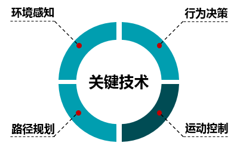
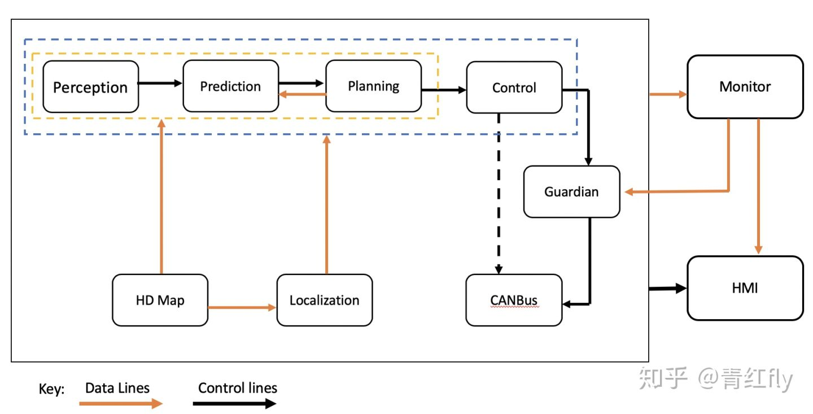
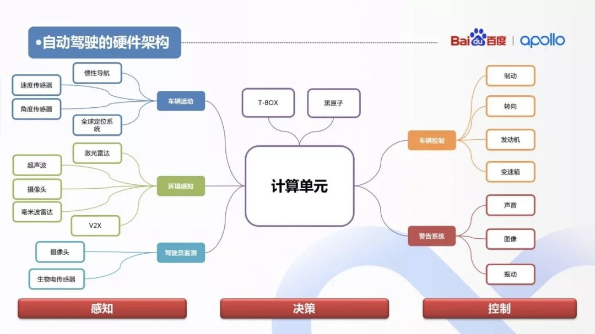
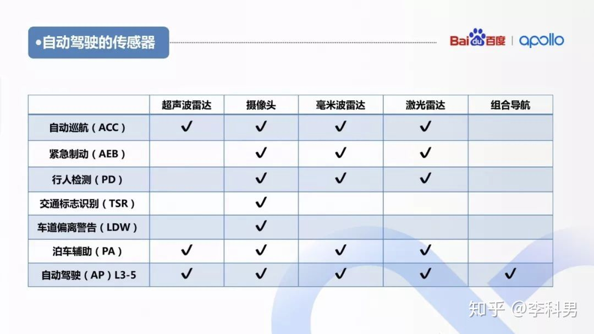
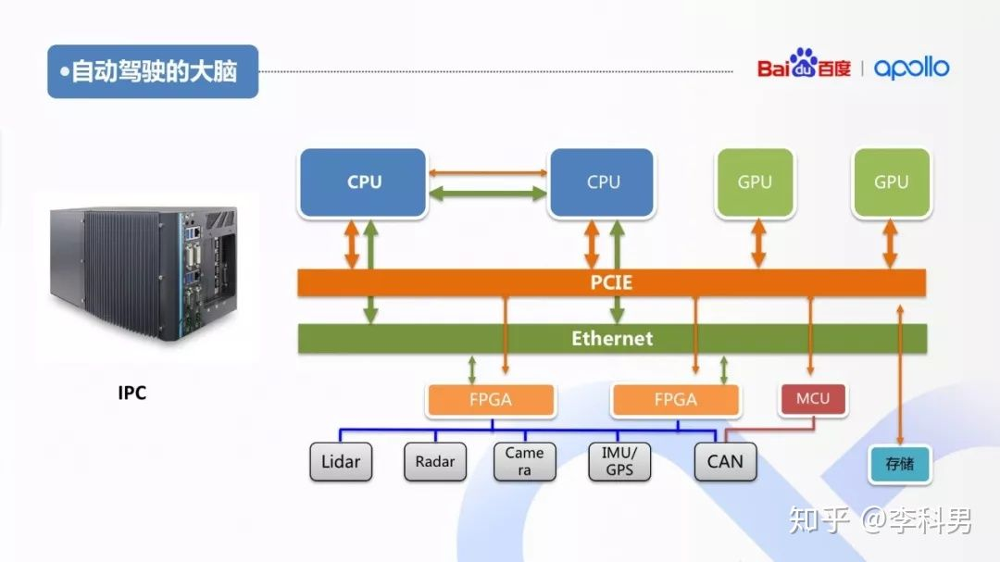
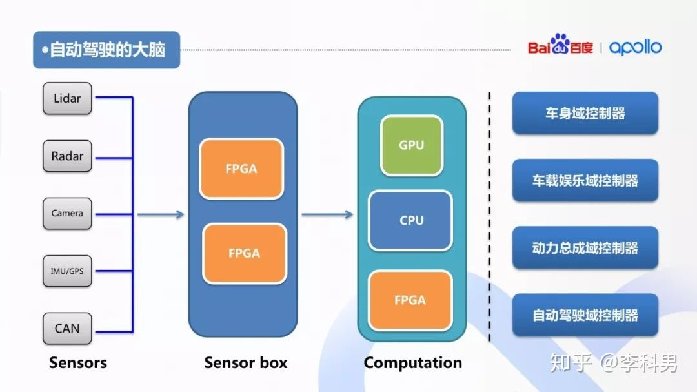
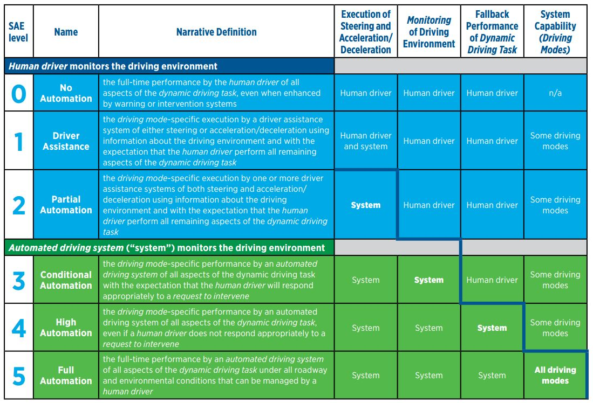

## 简介

智能车(Intelligent vehicle)是一个集环境感知、规划决策、多等级辅助驾驶等功能于一体的综合系统，集中运用了计算机、现代传感、信息融合、通讯、人工智能及自动控制等技术，是典型的高新技术综合体。

<!-- more -->

### 感知

自动驾驶的第一步就是环境信息和车内信息的采集与处理，是智能车辆自主行驶的基础和前提。获取周围的环境信息。这方面涉及到道路边界检测、车辆检测、行人检测等技术，所用到的传感器一般都会有激光测距仪、视频摄像头、车载雷达、速度和加速度传感器……由于各个传感器在设计的时候有各自的局限性，单个传感器满足不了各种工况下的精确感知，想要车辆在各种环境下平稳运行，就需要运用到多传感器融合技术，该技术也是环境感知这一大类技术的关键技术所在，目前国内这方面和国外的主要差距也集中在多传感器融合方面。

## 决策

在辅助驾驶或者自动驾驶技术中，完成了感知部分，接下来需要做的是，依据上一步感知系统获取的信息来进行决策判断，确定适当工作模型,制定相应控制策略。这部分的功能类似于给车辆下达相应的任务。例如在车道保持、车道偏离预警、车距保持，障碍物警告等系统中，需要预测本车与其他车辆、车道、行人等在未来一段时间内的状态，先进的决策理论包括模糊推理、强化学习、神经网络和贝叶斯网络技术等。

### 路径规划

智能车辆的路径规划就是在进行环境信息感知并确定车辆在环境中位置的基础上，按照一定的搜索算法，找出一条可通行的路径，进而实现智能车辆的自主导航。路径规划的方法根据智能车辆工作环境信息的完整程度，可分为两大类：基于完整环境信息的全局路径规划方法；例如，从上海到北京有很多条路，规划处一条作为行驶路线即为全局规划。如栅格法、可视图法、拓扑法、自由空间法、神经网络法等静态路径规划算法。基于传感器实时获取环境信息的局部路径规划方法；例如，在全局规划好的上海到北京的那条路线上会有其他车辆或者障碍物，想要避过这些障碍物或者车辆，需要转向调整车道，这就是局部路径规划。局部路径规划的方法包括：人工势场法、矢量域直方图法、虚拟力场法、遗传算法等动态路径规划算法等。
运动控制规划好了行驶路径，接下来就需要控制车辆沿着期望的轨迹行驶，这就是运动控制部分需要完成的内容。运动控制包括横向控制和纵向控制，简单来说横向控制就是转向控制，纵向控制就是速度控制， 现在研究比较多的是横向控制，所运用的方法主要包括滑膜控制、模糊控制、神经网络控制、最优控制、自适应控制和纯跟踪控制等。通俗的讲就是，横向控制为给定一个速度，通过控制转向达到车辆沿着预定轨迹行驶的目的；而纵向控制目的是为了满足车辆行驶过程中的速度要求，有时候还需要配合横向控制达到满足车辆在轨迹跟踪的同时，还需要满足安全性、稳定性和舒适性的目的。因为车辆是一个特别复杂的系统，横向、纵向和垂向都有耦合关系的存在，因此就需要对智能车辆进行横、纵向，甚至横、纵、垂向的协同控制。由于其耦合关系的复杂性，所以说智能车辆运动控制的协同控制技术，也是该部分的技术难点。




### 自动驾驶系统核心

```
我在哪儿
高精度地图，定位当前我周边环境是怎样的
感知和融合未来我周边环境可能会怎样
预测在以上信息下我应该怎么走
决策，规划，控制
```





感知定位层硬件又分为以下三大类：

车辆运动传感器：速度和角度传感器提供车辆线控系统的相关横向和纵向信息，这些信息主要来自车身底盘。惯性导航+全球定位系统=组合导航，提供全姿态信息参数和高精度定位信息，这些信息主要来自GPS+IMU。

环境感知传感器：负责环境感知的传感器类似于人的视觉和听觉，如果没有环境感知传感器的支撑，将无法实现自动驾驶功能。主要依靠激光雷达、摄像头、毫米波雷达的数据融合提供给计算单元进行算法处理。
V2X就是周围一切能与车辆发生关的事物进行通信，包括V2V车辆通信技术、V2I与基础设施如红绿灯的通信技术、V2P车辆与行人的通信。

驾驶员监测传感器：基于摄像头的非接触式和基于生物电传感器的接触式。通过方向盘和仪表台内集成的传感器，将驾驶员的面部细节以及心脏、脑电等部位的数据进行收集，再根据这些部位数据变化，判断驾驶员是否处于走神和疲劳驾驶状态。同时还可以通过声音、图像、振动提醒司机注意，通过HMI的设计有效减少司机困倦、分心的行为。

感知定位层硬件又分为以下三大类：

计算单元层硬件：各类传感器采集的数据统一到计算单元层处理，为了保证自动驾驶的实时性要求，软件响应最大延迟必须在可接受的范围内，这对计算的要求非常高。目前主流的解决方案有基于GPU、FPGA、ASIC等。

车辆控制层硬件：自动驾驶需要用电子信号控制车辆的转向、制动、油门系统，其中涉及到车辆底盘的线控改装，目前在具备自适应巡航、紧急制动、自动泊车功能的车上可以直接借用原车的系统，通过CAN总线控制而不需要过度改装。

```
摄像头：主要用于车道线、交通标示牌、红绿灯以及车辆、行人检测，有检测信息全面、价格便宜的特定，但会受到雨雪天气和光照的影响。由镜头、镜头模组、滤光片、CMOS／CCD、ISP、数据传输部分组成。光线经过光学镜头和滤光片后聚焦到传感器上，通过CMOS或CCD集成电路将光信号转换成电信号，再经过图像处理器（ISP）转换成标准的RAW，RGB或YUV等格式的数字图像信号，通过数据传输接口传到计算机端。

激光雷达：激光雷达使用的技术是飞行时间法（Time of Flight）根据光线遇到障碍的折返时间计算距离。为了覆盖一定角度范围需要进行角度扫描，从而出现了各种扫描原理。主要分为：同轴旋转、棱镜旋转、MEMS扫描、相位式、闪烁式。激光雷达不光用于感知也应用于高精度地图的测绘和定位是公认L3级以上自动驾驶必不可少的传感器。

毫米波雷达：主要用于交通车辆的检测，检测速度快、准确，不易受到天气影响，对车道线交通标志等无法检测。毫米波雷达由芯片、天线、算法共同组成，基本原理是发射一束电磁波，观察回波与入射波的差异来计算距离、速度等。成像精度的衡量指标为距离探测精度、角分辨率、速度差分辨率。毫米波频率越高，带宽越宽，成像约精细，主要分为77GHz和24GHz两种类型 。

组合导航：GNSS板卡通过天线接收所有可见GPS卫星和RTK的信号后，进行解译和计算得到自身的空间位置。当车辆通过遂道或行驶在高耸的楼群间的街道时，这种信号盲区由于信号受遮挡而不能实施导航的风险。就需要融合INS的信息，INS具有全天候、完全自主、不受外界干扰、可以提供全导航参数（位置、速度、姿态）等优点，组合之后能达到比两个独立运行的最好性能还要好的定位测姿性能。
```




### 计算单元层

计算单元层，可以称之为自动驾驶的大脑，通俗说一般就是一台完整的电脑。

IPC即工业个人计算机（Industrial Personal Computer─IPC）是一种加固的增强型个人计算机，它可以作为一个工业控制器在工业环境中可靠运行。采用符合“EIA”标准的全钢化工业机箱，增强了抗电磁干扰能力，采用总线结构和模块化设计技术。CPU及各功能模块皆使用插板式结构，并带有压杆软锁定，提高了抗冲击、抗振动能力。

整体架构设计需要考虑ISO26262的要求，CPU、GPU、 FPGA以及总线都做冗余设计，防止单点故障。当整体IPC系统失效还有MCU做最后的保证，直接发送指令到车辆Can总线中控制车辆停车。

目前这种集中式的架构，将所有的计算工作统一放到一个工控机中，整体体积较大，功耗高，不适用于未来的量产。但这种架构非常方便，算法迭代不需要过度考虑硬件的整体设计和车规要求。用传统的X86架构就可以非常快捷的搭建出计算平台，卡槽设计也方便硬件的更新。

第二种 域控制器方案 采用工控机集中式运算整体体积和功耗难以满足量产化要求，需要采用域控制器嵌入式的方案。将各个传感器的原始数据接入到Sensor Box中，在Sensor Box中完成数据的融合，再将融合后的数据传输到计算平台上进行自动驾驶算法处理。

自动驾驶汽车功能复杂，保证各个模块和功能间不互相影响和安全性考虑，将大量采用域控制器。根据不同的功能实现分为，车身域控制器、车载娱乐域控制器、动力总成域控制器、自动驾驶域控制器等。以自动驾驶域控制器为例，其承担了自动驾驶所需要的数据处理运算力，包括毫米波雷达、摄像头、激光雷达、组合导航等设备的数据处理，也承担了自动驾驶算法的运算，如下图所求不同的车上不同的域控制器。






### 车辆控制层

线控就是Control by Wire的直译 。简单理解，就是车辆的控制都是由一系列命令而执行的，而不是物理的操作进行执行的。

感知定位如同司机的眼睛，决策规划如同大脑，执行控制就好比手和脚了。做好自动驾驶的决策规划也必须懂得执行控制，为了实现自动驾驶，车辆必须经过线控改装，其中包括线控制动、线控转向、线控油门等。

线控制动：在传统车辆上，制动系统多采用液压或真空伺服机构来控制制动，对自动驾驶而言，线控制动是最终的发展趋势，线控制动是以电子系统取代液压或气压控制单元。

## 自动驾驶SAE

L0：驾驶员完全掌控车辆，无任何自动化能力。

L1：自动系统有时能够辅助驾驶员完成某些驾驶任务。比如高速自动巡航（自动认知所在车道），和一些驾驶辅助功能等等。

L2：自动系统能够完成某些驾驶任务，但驾驶员需要监控驾驶环境，完成剩余部分，同时保证出现问题，随时进行接管。其实在大多数场景下是没有自动驾驶能力的，只有比如高等级的自动泊车、自动跟车等等功能，现在很多高端一些的车辆都有这些能力，但还远远谈不上普及。

L3：自动系统既能完成某些驾驶任务，也能在某些情况下监控驾驶环境，但驾驶员必须准备好重新取得驾驶控制权。这就是今天我要重点讲述的等级。在这个等级下，实际上驾驶员还是必须时刻保持警惕，随时取回车辆控制权的。

L4：自动系统在某些环境和特定条件下，能够完成驾驶任务并监控驾驶环境，这个阶段下，在自动驾驶可以运行的范围内，驾驶相关的所有任务和驾乘人已经没关系了。但似乎驾驶舱还是必不可少的，不能完全取消掉认为控制的操作部件。

L5：自动系统在所有条件下都能完成的所有驾驶任务。顾名思义，就是人可以只当乘客，方向盘、油门刹车等等都取消掉，当然了为了安全和防止紧急情况，应是有紧急停止按钮或者操作的。其他部分都由车辆来完成，人起到的作用就是乘客。



## 发展现状

如今自动驾驶在全球范围内已经进入了快速发展期，但L1级仍是ADAS量产主力，未来2~3年L2将会是量产的主力，现状自动驾驶行业，中国绝对是主力。今年中国L2的搭载量预计突破80万，中国品牌占据绝大部分份额。

而L3-L4级自动驾驶系统还处于研发和小规模测试阶段。

此外，各国正在推动开放测试道路、完善法律法规等政策。市场主体空前丰富，传统主机厂、互联网企业、ICT企业、出行服务企业等纷纷加入。

趋势一：L3/L4级将率先在低速特定场景下量产，自动泊车没有L3形态，会从L2.5跨越到L4。
比如，奥迪在2018年宣布了L3自动驾驶车型A8，实现了低速拥堵场景L3级的自动驾驶。同一年，戴姆勒和博世合作研发的自动代客泊车技术在中国首次亮相。通过APP即可自动完成车位泊车。今年1月份长安联合纵目科技实现了APA6.0代客泊车功能示范应用。

趋势二：基于自动驾驶的“出行服务”将成为下一轮出行革命的竞争起点。

比如国际巨头如福特推出智能驾驶车队；丰田去年发布e-Palette移动平台，能适用多类型的移动需求；还有谷歌的Waymo平台在2017年推出自动驾驶出行服务。

国内企业方面，有长安汽车在2019年7月份在重庆启动L4级自动驾驶车示范运营，手机APP约自动驾驶车出行；百度和一汽红旗共同打造的L4级自动驾驶出租车Robotaxi红旗E界，亮相长沙展开测试。

趋势三：自动驾驶的5G/V2X及云计算应用时代即将带来，聪明车+智慧路将是主要形态。

其中如华为、大唐等厂商已经推出了 各自的LTE-V2X商用通信芯片或模组，同时支持PC5抠和Uu口双模通信；星云互联、东软、千方等终端厂商推出各自终端设备，支持多种品牌LTE-V2X通信芯片。

而LTE-V2X也将快速过渡到5G-V2X。随着5G牌照发放，标志着中国进入了5G时代。此外，5G R16标准将支持V2X场景。

不得不承认，5G将会成为L4自动驾驶的关键备份。今年7月份，国内收割5G自动驾驶公共服务平台暨5G自动驾驶开放道路场景示范运营基地在重庆正式启用。北京亦庄在8月份宣布在年底开放40平方公里自动驾驶测试区域，全域覆盖5G网络。

趋势四，自动驾驶“软”安全重要性凸显

“软”安全可分为：1，功能安全：减少失效引起的危害；2，预期功能安全：减少感知或决策控制不合符（功能或设计）预期引起的危害；3，信息安全：建设网联安全防护体系，抵御和减轻网络攻击引起的危害。

趋势五：业内合作、跨界协同是必然趋势

其中包括：车企间合作，如宝马与奔驰将共同研发L3和L4级别的自动驾驶技术，并计划在2025年推出搭载双方合作成功的应用；本田也通过投资通用Cruise与之形成合作。

另外还有跨界合作，案例就是华为与长安、奥迪、上汽等国内外多家汽车企业开展深度合作，发挥其在5G、IoT、云计算、人工智能等领域的优势，帮助企业造好车。

从2019年起，日本国家自动驾驶研发计划进入2.0阶段，2014年启动的SIP-adus，取得了多项领先成果，成立了日本自动驾驶基础地图平台公司（DMP）。