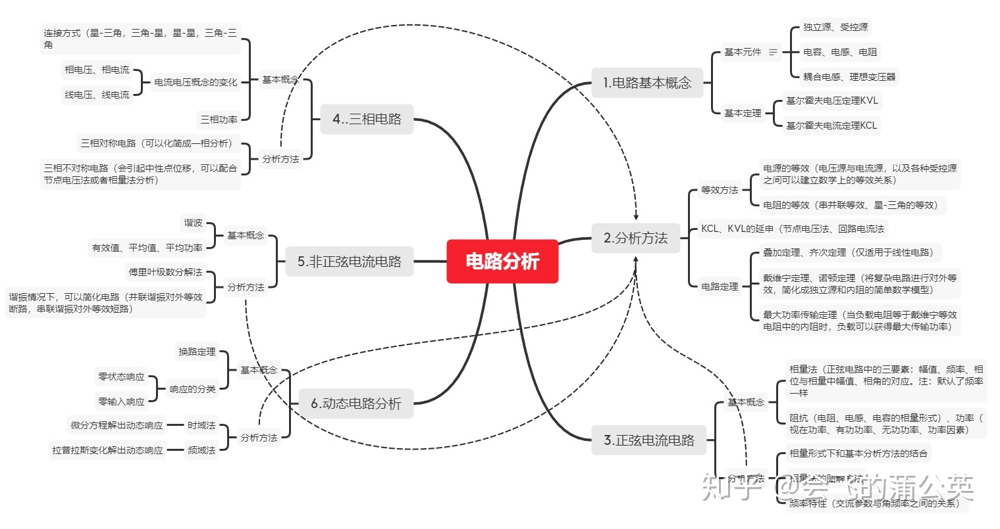
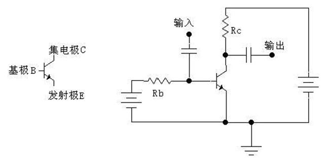
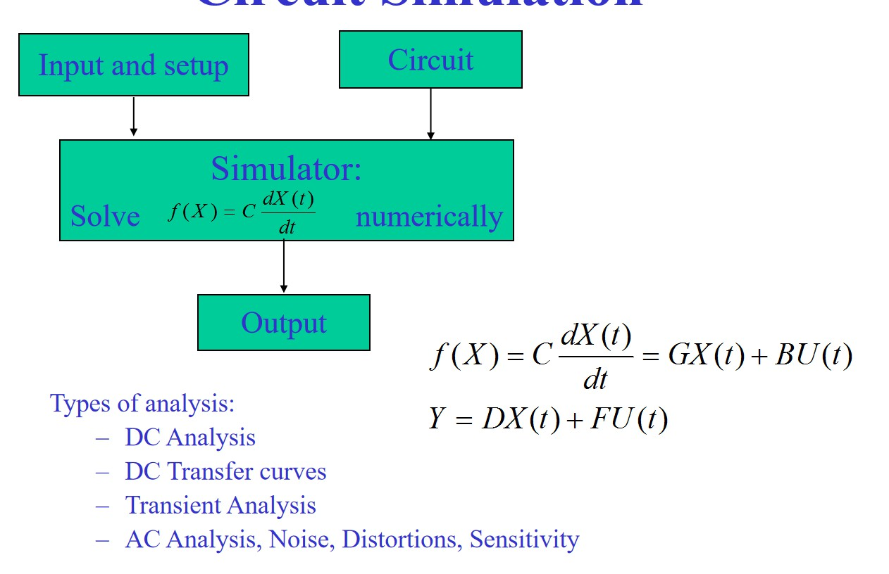
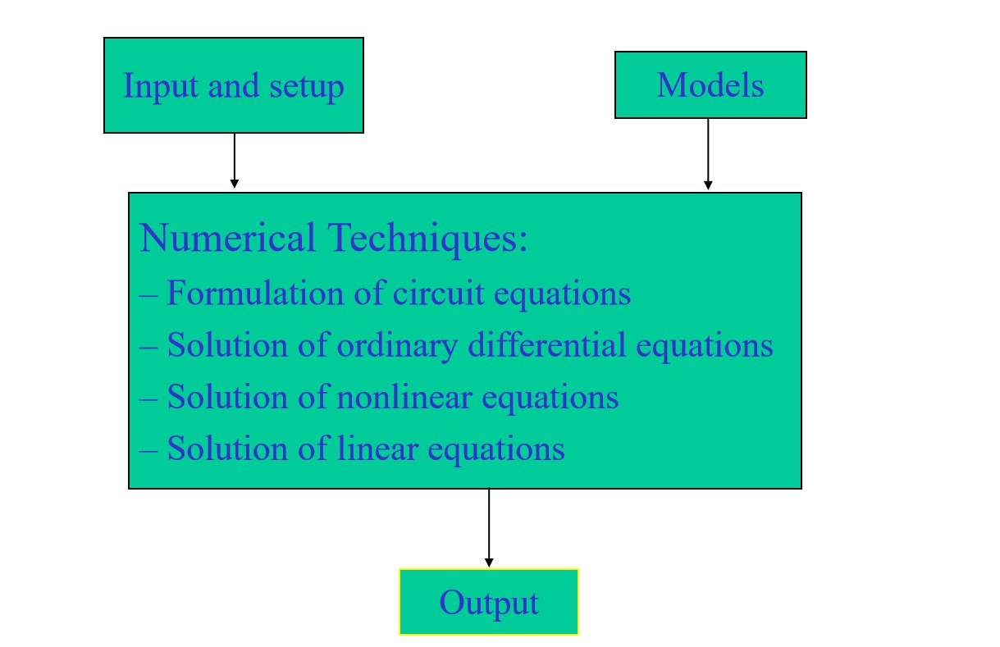
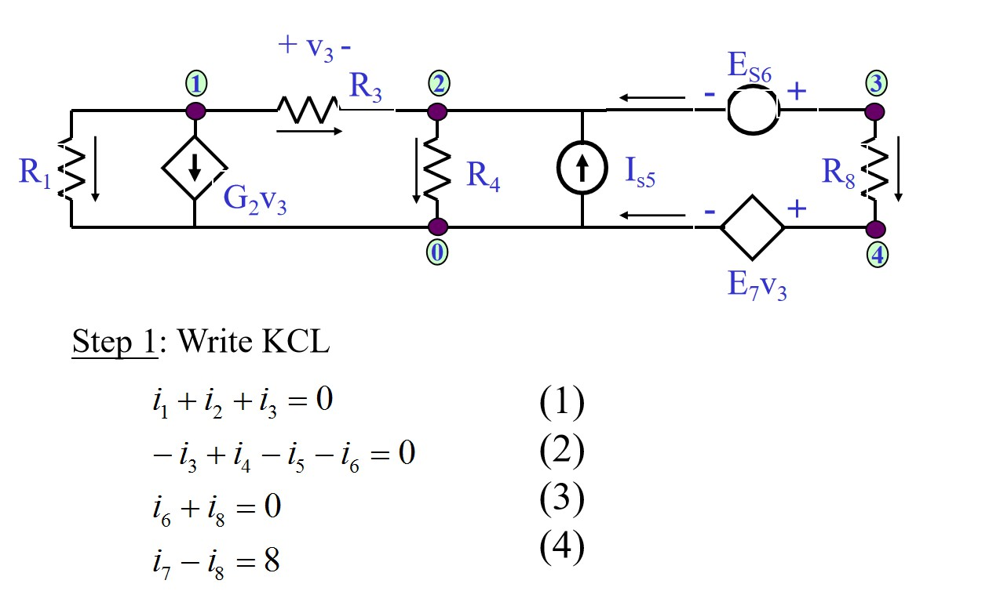
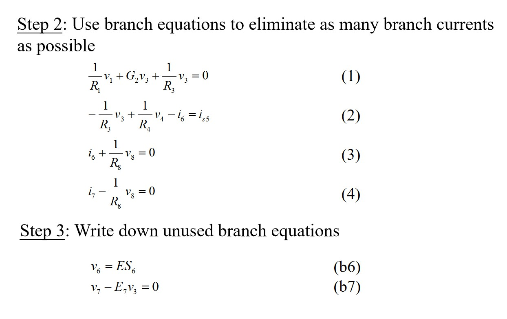
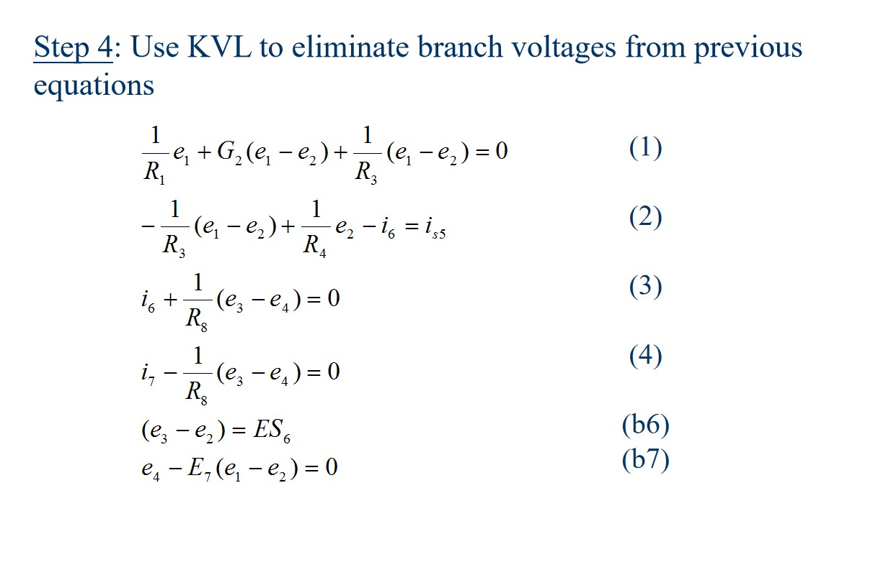
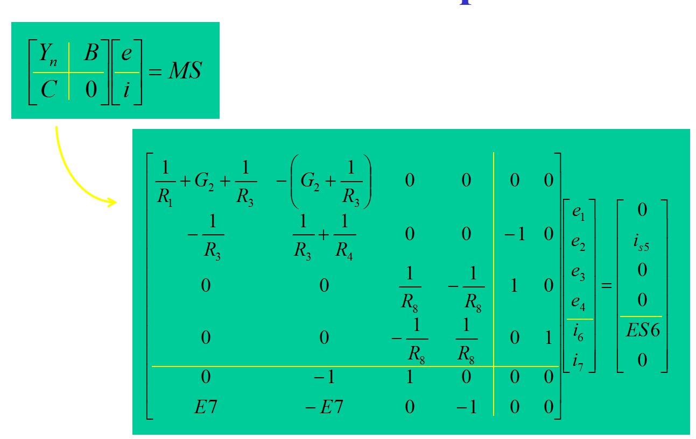
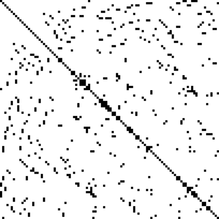

## 电路知识导图

### 基尔霍夫定理

基尔霍夫定理分为基尔霍夫电压定理（KVL）和基尔霍夫电流定理（KCL）。

KCL的专业描述为：对于集中参数电路，任意时刻，连接在任一节点的各支路电流的代数和恒为零。

<!-- more -->

```
导线这端的电压上升到规定电压时，若电流早都到达了导线另外一端，我们就称为集中参数电路。导线这端的电压上升到规定电压时，电流还未到达导线的另外一端，我们就称为分布参数电路。
分布参数电路就衍生出了3个领域，远距离电能传输，高频信号（射频）和高速信号。
```

KVL的专业描述为：对于集中参数电路，任意时刻，任一回路的各支路电压的代数和恒为零。

### 电路知识导图



### 叠加定理

叠加定理的专业描述为：线性电路中，任一支路的响应（电压或电流）都等于电路中独立电源单独作用时，该支路所产生响应的代数和。

（1）保持电路结构及元件参数不变。当一个独立源单独作用时，其他独立源都应取零值，独立电压源短路，独立电流源开路，但均应保留其内阻。
（2）和其他定理一样，电流和电压要提前标好方向，同向叠加，异向相减。


```
（1）受控源不是激励，只能当成一般元件将其保留。如MOS管和三极管的等效模型。
（2）叠加定理只能适用于线性电路，对非线性电路不适用。在线性电路中，叠加定理也只能用于计算电压或电流，不能用来计算功率，因为功率与电流、电压的关系不是线性关系，而是平方关系。
```

### 齐次定理

齐次定理的专业描述为：当线性电路中只有一个激励，响应与激励成正比。


## 三极管工作原理


对三极管放大作用的理解，切记一点：能量不会无缘无故的产生，所以，三极管一定不会产生能量，但三极管厉害的地方在于：它可以通过小电流控制大电流。放大的原理就在于：通过小的交流输入，控制大的静态直流。

假设三极管是个大坝，这个大坝奇怪的地方是，有两个阀门，一个大阀门，一个小阀门。小阀门可以用人力打开，大阀门很重，人力是打不开的，只能通过小阀门的水力打开。所以，平常的工作流程便是，每当放水的时候，人们就打开小阀门，很小的水流涓涓流出，这涓涓细流冲击大阀门的开关，大阀门随之打开，汹涌的江水滔滔流下。如果不停地改变小阀门开启的大小，那么大阀门也相应地不停改变，假若能严格地按比例改变，那么，完美的控制就完成了。

在这里，Ube 就是小水流，Uce 就是大水流，人就是输入信号。当然，如果把水流比为电流的话，会更确切，因为三极管毕竟是一个电流控制元件。

如果某一天，天气很旱，江水没有了，也就是大的水流那边是空的。管理员这时候打开了小阀门，尽管小阀门还是一如既往地冲击大阀门，并使之开启，但因为没有水流的存在，所以，并没有水流出来。这就是三极管中的截止区。饱和区是一样的，因为此时江水达到了很大很大的程度，管理员开的阀门大小已经没用了。如果不开阀门江水就自己冲开了，这就是二极管的击穿。

在模拟电路中，一般阀门是半开的，通过控制其开启大小来决定输出水流的大小。没有信号的时候，水流也会流，所以，不工作的时候，也会有功耗。而在数字电路中，阀门则处于开或是关两个状态。当不工作的时候，阀门是完全关闭的，没有功耗。

晶体三极管是一种电流控制元件。发射区与基区之间形成的 PN 结称为发射结，而集电区与基区形成的 PN 结称为集电结。晶体三极管按材料分常见的有两种：锗管和硅管。而每一种又有 NPN 和 PNP 两种结构形式，使用最多的是硅 NPN 和 PNP 两种，两者除了电源极性不同外，其工作原理都是相同的，三极管工作在放大区时，三极管发射结处于正偏而集电结处于反偏，集电极电流 Ic 受基极电流 Ib 的控制，Ic 的变化量与 Ib 变化量之比称作三极管的交流电流放大倍数 β（β=∆Ic/∆Ib，∆ 表示变化量。）在实际使用中常常利用三极管的电流放大作用，通过电阻转变为电压放大作用。

要判断三极管的工作状态必须了解三极管的输出特性曲线，输出特性曲线表示 Ic 随 Uce 的变化关系（以 Ib 为参数），从输出特性曲线可见，它分为三个区域：截止区、放大区和饱和区。

根据三极管发射结和集电结偏置情况，可以判别其工作状态：


```
1.对于 NPN 三极管，当 Ube≤0 时，三极管发射结处于反偏工作，则 Ib≈0，三极管工作在截止区；
2.当晶体三极管发射结处于正偏而集电结处于反偏工作时，三极管工作在放大区，Ic 随 Ib 近似作线性变化；
3.当发射结和集电结均处于正偏状态时，三极管工作在饱和区，Ic 基本上不随 Ib 而变化，失去了放大功能。
```

截止区和饱和区是三极管工作在开关状态的区域。那么各种状态 Ube Ubc Uce 有没有个固定的电压值呢？不同的材料，PN 结的势垒电压不一样，锗管约 0.3V，硅管约 0.7V，不同的制造工艺，不同的型号也有少量差别，但是基本是这个量级。要知道准确值，必须查看输入特性曲线（类似于二极管正向特性曲线）。三极管是电流放大器件，有三个极，分别叫做集电极 C，基极 B，发射极E。分成 NPN 和 PNP 两种。我们仅以 NPN 三极管的共发射极放大电路为例来说明一下三极管放大电路的基本原理。



下面的分析仅对于 NPN 型硅三极管。如上图所示，我们把从基极 B 流至发射极 E 的电流叫做基极电流 Ib；把从集电极 C 流至发射极 E 的电流叫做集电极电流 Ic。这两个电流的方向都是流出发射极的，所以发射极 E 上就用了一个箭头来表示电流的方向。三极管的放大作用就是：集电极电流受基极电流的控制（假设电源能够提供给集电极足够大的电流的话），并且基极电流很小的变化，会引起集电极电流很大的变化，且变化满足一定的比例关系：集电极电流的变化量是基极电流变化量的 β 倍，即电流变化被放大了 β 倍，所以我们把 β 叫做三极管的放大倍数（β 一般远大于 1，例如几十，几百）。如果我们将一个变化的小信号加到基极跟发射极之间，这就会引起基极电流 Ib 的变化，Ib 的变化被放大后，导致了 Ic 很大的变化。如果集电极电流 Ic 是流过一个电阻 R 的，那么根据电压计算公式 U=R*I 可以算得，这电阻上电压就会发生很大的变化。我们将这个电阻上的电压取出来，就得到了放大后的电压信号了。三极管在实际的放大电路中使用时，还需要加合适的偏置电路。这有几个原因。首先是由于三极管 BE 结的非线性（相当于一个二极管），基极电流必须在输入电压大到一定程度后才能产生（对于硅管，常取 0.7V）。当基极与发射极之间的电压小于 0.7V 时，基极电流就可以认为是 0。但实际中要放大的信号往往远比 0.7V 要小，如果不加偏置的话，这么小的信号就不足以引起基极电流的改变（因为小于 0.7V 时，基极电流都是 0）。

如果我们事先在三极管的基极上加上一个合适的电流（叫做偏置电流，上图中那个电阻 Rb 就是用来提供这个电流的，所以它被叫做基极偏置电阻），那么当一个小信号跟这个偏置电流叠加在一起时，小信号就会导致基极电流的变化，而基极电流的变化，就会被放大并在集电极上输出。另一个原因就是输出信号范围的要求，如果没有加偏置，那么只有对那些增加的信号放大，而对减小的信号无效（因为没有偏置时集电极电流为 0，不能再减小了）。而加上偏置，事先让集电极有一定的电流，当输入的基极电流变小时，集电极电流就可以减小；当输入的基极电流增大时，集电极电流就增大。这样减小的信号和增大的信号都可以被放大了。

下面说说三极管的饱和情况。像上面那样的图，因为受到电阻 Rc 的限制（Rc 是固定值，那么最大电流为 U/Rc，其中 U 为电源电压），集电极电流是不能无限增加下去的。当基极电流的增大，不能使集电极电流继续增大时，三极管就进入了饱和状态。一般判断三极管是否饱和的准则是：Ib*β〉Ic。进入饱和状态之后，三极管的集电极跟发射极之间的电压将很小，可以理解为一个开关闭合了。这样我们就可以拿三极管来当作开关使用：当基极电流为 0 时，三极管集电极电流为 0（这叫做三极管截止），相当于开关断开；当基极电流很大，以至于三极管饱和时，相当于开关闭合。如果三极管主要工作在截止和饱和状态，那么这样的三极管我们一般把它叫做开关管

## SPICE





### Modified Nodal Analysis (MNA)










## Sparse Matrix

稀疏矩阵（英语：sparse matrix），在数值分析中，是其元素大部分为零的矩阵。反之，如果大部分元素都非零，则这个矩阵是稠密的。在科学与工程领域中求解线性模型时经常出现大型的稀疏矩阵。

在使用计算机存储和操作稀疏矩阵时，经常需要修改标准算法以利用矩阵的稀疏结构。由于其自身的稀疏特性，通过压缩可以大大节省稀疏矩阵的内存代价。更为重要的是，由于过大的尺寸，标准的算法经常无法操作这些稀疏矩阵。

### 大量的问题可以用稀疏矩阵表示

为什么呢？我有一个非常合适的解释。这些所谓的矩阵的稀疏性，反应的是人的局限性。因为人还是太笨，太差，所以导致稀疏矩阵大量存在。
比如说，物理上，稀疏矩阵来源一个普遍而又基本的信念，那就是物理问题多半是具有空间和时间上的局域性的。也就是我们不会相信离得太远的两件事之间有什么关系，或者具有明显的相互影响。例如，这个世界有七十亿人口，而我认识的只是其中的非常小的一部分。那么如果用矩阵表示我和其它人的关系的话，这个关系矩阵必然是稀疏的。而物理问题也由于这么一个原因，导致了矩阵的稀疏性。


### 稀疏矩阵稀疏性处理

通常，为了处理稀疏性矩阵，我们会构造更为有效的数据结构，压缩稀疏行和列，或者通过PCA、SVD等方法来进行降维。
- 构造更为有效的数据结构

因为零值没有太多的意义，所以我们可以忽略零值，并且仅需要存储或操作稀疏矩阵中数据或非零值。有多种数据结构可用于有效地构造稀疏矩阵，下面列出了三个常见的例子。

● Dictionary of Keys：使用字典，其中行和列索引映射到值。
● List of Lists：矩阵的每一行都存储为一个列表，每个子列表包含列索引和值。
● Coordinate List ：每个元组都存储一个元组列表，其中包含行索引、列索引和值。

- 压缩稀疏行或者列
可以通过对数据的理解来合并或者删除部分列。例如上文提到app数据，我们可以将app根据其所属的类型分为金融、娱乐、音乐或者电影等，之后将其进行合并，即可大大提高运算效率。而对于一些使用频率远低于平均值的列可以酌情删掉。

- 降维
除了传统的PCA、k-SVD、LDA、NNMF等方法。