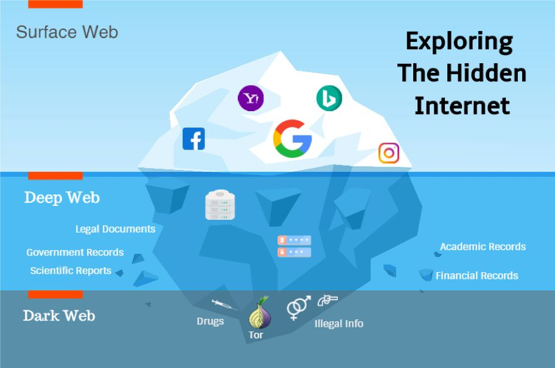
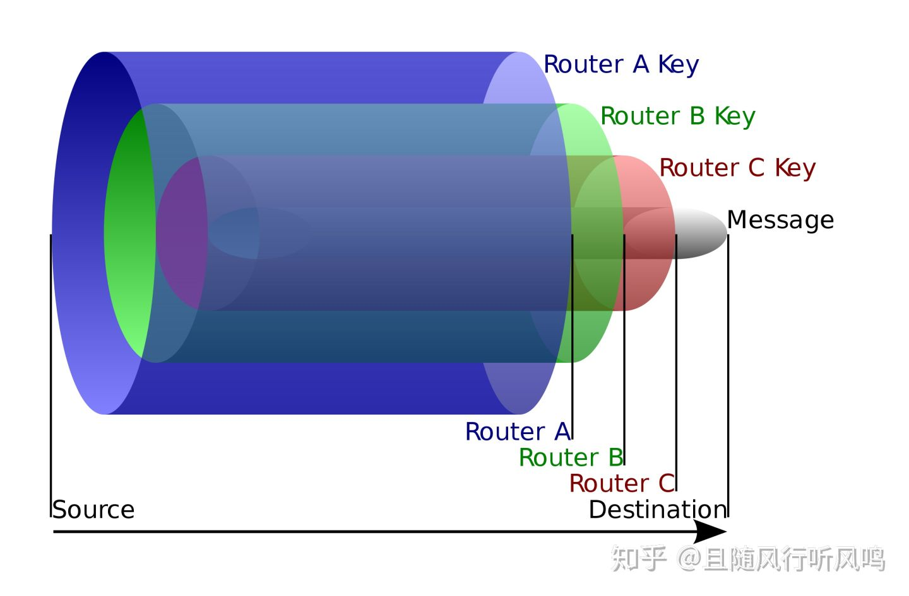
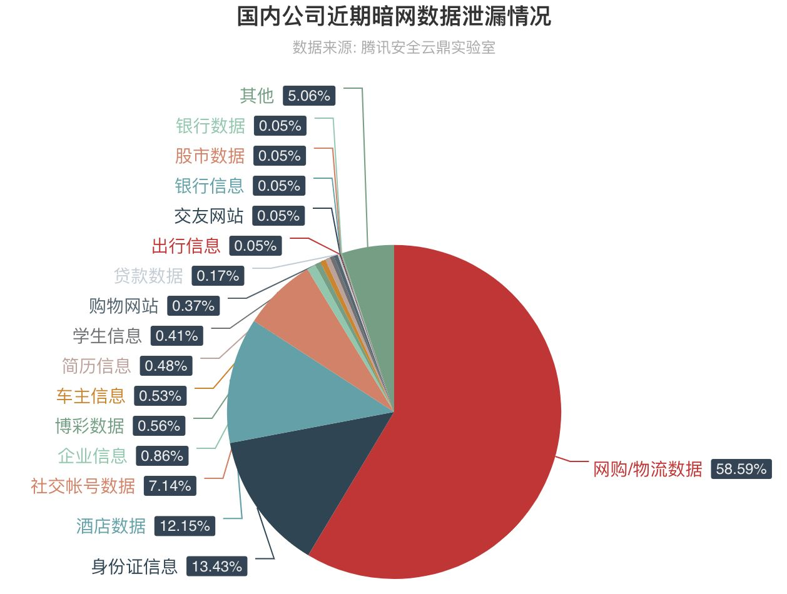

## 软件安全基本常识

软件安全的出发点非常朴素，就是软件系统让想要的人做我们期望他做的事情。从这个观点出发，基本可以衍生出软件安全里所有的概念。

### 认证（authentication）

认证是解决你是谁的问题，是不是”想要的那个人“。两个用户Alice和Bob，这是一个十分熟套的两方关系代称，也可以换做三炮和二丫。他们在互联网上怎么确定是对方？

在互联网上，Bob要证明自己是Bob，大概可可以有几种方式

只有Bob才知道的信息，网站一收到此信息，立即放行。此类“bob才知道的信息“，我们熟知的如passowrd。
只有Bob才能拥有的信息，比如Token，私钥等，这个领域的技术有联合认证，OAuth等。
你是Bob的生物特征信息，这就是生物识别技术，英文叫Biometric。比如现在的人脸识别技术。

<!-- more -->


### 授权（authorization）

在解决了“你是谁”这个问题之后，就是“你能对软件系统做什么”。这个就叫做授权。在实现授权机制的过程中，细化并建模，软件系统分解成一个个资源级别的对象，动作被定义为一组action，常规的是read和write。

### 保密（Confidentiality）

解决了认证和授权还没完，万一Alice和Bob之间的对话被第三者叫Eve的人偷听再篡改了，那就坏了。所以还得对数据进行加密，这个数据加密目前业界正在做扩大解释，传输过程的加密，和存储上的加密等等。

解决的技术手段有：


哈希（hashing）。将一个大的消息文本进行哈希运算得到一个短的可控长度的字符串，然后接收方也进行响应的哈希运算，来验证内容的完整性。
TSL和数字证书。
消息认证代码，在消息文本上加上一个用secret key加密生成的代码，然后解密来验证。

### 审查追踪 ( Accountability)

对所有的访问信息建模，并记录日志。供日后的分析，抓住可疑分子，采取相应的措施，如黑名单，收回授权等等。

能攻进系统的二蛋很多，比如利用一些简单的扫描工具，但是真正能称得上黑客的是，既能攻进，又能擦除痕迹，使得审查追踪失效。

## 程序员和黑客

程序员：学习如何在计算机语言语法给定的框架内更好地做事情，注重语法理解与业务逻辑；
黑客：研究计算机语言对计算机底层逻辑的封装与映射关系，注重背后原理与底层逻辑。


## 暗网

在暗网内网站、用户身份、IP地址均可隐形，而且访问者也不会留下任何访问痕迹。

加密货币匿名交易加密货币以匿名性为其特点备受暗网青睐，比特币（BTC）、门罗币（XMR）、比特币现金（BCH）、以太坊（ETH）、瑞波币（XRP）以及Dash币等加密货币都是暗网常见的流通货币类型。



### 特定浏览器Tor

上世纪90年代中期，美国海军研究实验室为了保护美国在线情报系统开发了洋葱路由Onion Routing；2002年，计算机科学家Roger Dingledine和Nick Mathewson开始开发“洋葱路由项目”——Tor，后来成为规模最大的洋葱路由并广为人知，且衍生出了Tor浏览器，成为了人们敲开暗网大门的钥匙。
暗网之所以能潜伏在互联网世界的最深处，是因为这里的网站不会被搜索引擎发现，使用普通浏览器浏览网页会留下痕迹，但在使用 Tor技术浏览网页的“暗黑”世界，就可以隐藏地址，正是由于这一特性使暗网具有两面性，一方面可以用于正常的保护互联网用户的隐私，另一方面也可以被不法分子隐匿犯罪痕迹或从事其他恶意行为。

网络分为两部分：表层网和深网，表层网是指那些可以被谷歌，百度等爬虫爬到的网络，占所有网络的4%左右，剩余的96%都是深网，也就是无法被搜索引擎索引到的网站。而暗网则是深网中的一部分，也是最黑暗的那部分。

Tor的基本原理是，在一堆志愿的代理服务器里，随机抽取三个可用的，组成一个链条，经过三次加密传输，实现匿名。



### 暗网上的业务

暗网最大的几个市场均在近年被FBI捣毁，如Silk Road、AlphaBay，因此，2017年来暗网黑市有所收敛，并不如前几年火爆。我们统计了目前存在的几大市场商品分类，可以看出，毒品/药物类还是占据了超过50%的份额，海外使用违禁药物的情形非常严峻，其次是数字商品类，并充斥着各种色情、黑客、枪支、护照、假钞等违法内容。




## 安全漏洞

### 缓冲区溢出

缓冲区是c/c++语言的变量，在编译后的内存结构，在高级语言语义层，缓冲区数据并不会改变程序执行的流程。但编译后的数据和程序是处于同一地址空间的，这让他们发生了联系，数据溢出将覆盖影响程序流程的数据，或者在没有内存保护机制的系统中，直接覆盖掉程序。
其结果是程序逻辑被改写，改写后的程序可以做任何事情，在恶意情况下，会执行信息收集，秘钥盗取，留下后门，行为监视等。
缓冲区溢出，造成用户数据被当做程序执行，作为应对，在工具链层面，系统层面，开发层面，引入安全机制使得漏洞利用得到缓解。

### XSS

XSS是跨站脚本攻击(Cross Site Scripting)，为不和层叠样式表(Cascading Style Sheets, CSS)的缩写混淆，故将跨站脚本攻击缩写为XSS。恶意攻击者往Web页面里插入恶意Script代码，当用户浏览该页之时，嵌入其中Web里面的Script代码会被执行，从而达到恶意攻击用户的目的。

反射型XSS只是把用户输入的数据“反射”给浏览器，攻击者往往需要诱使用户操作一个恶意链接，才能攻击成功。反射型XSS也叫做“非持久型XSS”（Non-persistent XSS）

存储型XSS会把用户输入的数据“存储”在服务器端，这种XSS具有很强的稳定性

比较常见的一个场景就是，黑客写下一篇包含有恶意JS代码的博客文章，发表后，所有访问该博客文章的用户都会在他们的浏览器中执行这段恶意的JS代码。黑客把恶意的脚本保存到服务器端，所以这种XSS攻击就叫做“存储型XSS”

存储型XSS通常也叫做“持久型XSS”(Persistent XSS)

DOM型XSS从效果上来说也是反射型XSS，通过修改页面的DOM节点形成XSS，称之为DOM型XSS

实际上，这种类型的XSS并非按照“数据是否保存在服务器端”来划分，单独划分出来，是因为DOM型XSS的形成原因比较特别，发现它的安全专家专门提出了这种类型的XSS。出于历史原因，也就把它单独作为一个分类了。

```
输入输出检查
避免内联事件
富文本类使用标签白名单
增加攻击难度，降低攻击后果
增加验证码，防止脚本冒充用户提交危险操作
通过CSP、输入长度配置、接口安全措施等方法
主动检测发现
```

### CSRF

CSRF（Cross-site request forgery）跨站请求伪造，攻击者盗用受害人身份，以受害人的名义发送恶意请求。 其本质是重要操作的所有参数都是可以被攻击者猜测到的，攻击者只有预测出URL的所有参数与参数值，才能成功地构造一个伪造的请求；反之，攻击者将无法攻击成功。

```
攻击一般发起在第三方网站，被攻击的网站无法防止攻击发生
攻击利用受害者在被攻击网站的登录凭证，冒充受害者提交操作，而不是直接窃取数据
整个过程攻击者并不能获取受害者登录凭证，只是冒用
跨站请求可以是图片URL、超链接、CORS、Form提交等
```

CSRF攻击防御

阻止不明外域的访问
提交时要求附加本域才能获取的信息

- CSRF Token
- 双重Cookie验证

### SQL注入

通过Web应用接口注入SQL语法，破坏原有SQL结构，达到攻击行为。 如果网站存在注入漏洞，相当于将数据库直接暴露在攻击者面前 根据注入位置及方式不同分分为POST注入、GET注入、cookie注入、盲注、延时注入、搜索注入、base64注入等

### 暴力破解

弱密码（Weak Password）被他人猜到或被破解工具暴力破解

## DDoS

分布式拒绝服务攻击(英文意思是Distributed Denial of Service，简称DDoS)是指处于不同位置的多个攻击者同时向一个或数个目标发动攻击，或者一个攻击者控制了位于不同位置的多台机器并利用这些机器对受害者同时实施攻击。由于攻击的发出点是分布在不同地方的，这类攻击称为分布式拒绝服务攻击，其中的攻击者可以有多个

分布式拒绝服务攻击原理分布式拒绝服务攻击DDoS是一种基于DoS的特殊形式的拒绝服务攻击，是一种分布的、协同的大规模攻击方式。单一的DoS攻击一般是采用一对一方式的，它利用网络协议和操作系统的一些缺陷，采用欺骗和伪装的策略来进行网络攻击，使网站服务器充斥大量要求回复的信息，消耗网络带宽或系统资源，导致网络或系统不胜负荷以至于瘫痪而停止提供正常的网络服务。与DoS攻击由单台主机发起攻击相比较，分布式拒绝服务攻击DDoS是借助数百、甚至数千台被入侵后安装了攻击进程的主机同时发起的集团行为。

CC攻击是DDoS攻击的其中一种，是目前应用层攻击的主要手段之一，相比其它的DDoS攻击CC似乎更有技术含量一些。CC攻击借助代理服务器生成指向目标系统的合法请求，实现伪装和DDoS。我们都有这样的体验，访问一个静态页面，即使人多也不需要太长时间，但如果在高峰期访问论坛、贴吧等，那就很慢了，因为服务器系统需要到数据库中判断访问者否有读帖、发言等权限。访问的人越多，论坛的页面越多，数据库压力就越大，被访问的频率也越高，占用的系统资源也就相当可观。

CC攻击就充分利用了这个特点，模拟多个正常用户不停地访问如论坛这些需要大量数据操作的页面，造成服务器资源的浪费，CPU长时间处于100%，永远都有处理不完的请求，网络拥塞，正常访问被中止。这种攻击技术性含量高，见不到真实源IP，见不到特别大的异常流量，但服务器就是无法进行正常连接。

## 开源安全工具

集合github平台上的安全行业从业者自研开源扫描器的仓库，包括子域名枚举，数据库漏洞扫描，弱口令或信息泄漏扫描，端口扫描，指纹识别以及其他大型扫描器或模块化扫描器。

[github开源安全工具](https://github.com/We5ter/Scanners-Box)
