## Linus Torvalds

Linus Torvalds两次改变了技术，第一次是Linux内核，它帮助互联网的发展，第二次是Git，全球开发者使用的源代码管理系统。在一次TED的采访中，Torvalds以极其开放的态度讨论了他独特的工作方式和性格特点。Torvalds说：“我不是一个空想家，我是一名工程师，我非常乐意跟梦想家在一起，他们行走四方，仰望苍穹，看着满天星辰说，“我想到那儿去。”但我是低头看路的那种人，我只想填好眼前这个坑，不让自己掉进去，这就是我。”

<!-- more -->

在线查看源码
[Linux kernel map](https://makelinux.github.io/kernel/map/)

## Linux生态

通常我们说Linux，是说Linux Kernel，在The Linux Kernel Archives这个网站上维护。Linux的版本管理引领了一个时代，称为“分布式版本管理”，区别于传统的“中心式版本管理”，Linus Torvards为此专门写了自己的版本管理软件，也就是现在开源社区广泛使用的git。

这里有很多技术细节，但关键的不同在于，没有人是中心！而Linux的管理措施是，你从某个点上取下一个版本，这个版本就具有所有历史记录，从物理形态上说，它和原始的那个管理中心没有任何区别。所以，今天你从kernel.org上通过git取一个最新版本出来，然后声称，这才是Linux Kernel的开发中心，这没有任何问题。但事实当然不是这样，因为这个中心除了依靠定义，还依靠开发者的认同，你一个人的世界，一个人开发，你说你那个是中心，这没有问题，但Linux是一大群人一起做的开发，你没有办法让所有人都加入这个阵营，你那个就不是中心。它可以是你个人的中心，也可以是你开的那个公司的中心，但它不是行业的中心。这个时候你是否开始明白Linus Torvards的强大了？无论是Intel、Google还是HP、Qualcomm，这些公司多么强大，大家认可的中心是Linus Torvards个人电脑上的那个分支。

Linux走到今天，是一个“人心”模型，Linus Torvards得到所有人的认同，不是因为他个人的开发能力有多强，而是他代表了所有人的利益。他才最大程度地“合道”。理解这一点，你才会明白Linux的维护策略和发展方法。Linus对这个问题是有清晰的认知的，大家可以去看他的自传《Just For Fun》，里面对他的维护哲学有很明白的表述的。

Linux是个Kernel，它只是内核，就相当于Windows的System32目录下的那个ntoskrnl.exe那个文件，沧海一栗，它是一个完整的操作系统中最核心的那部分代码，Linus最初开发Linux的时候，也就是觉得有必要开发一个真正实用的（对比Minix，一个教学用的系统），不需要购买的，可以用于他的PC的一个小系统。他已经有一些基本的外部工具了（当时Unix世界已经有不少人在开发开源的工具了，但大家并没有内核），所以他需要的是一个可以把他的PC驱动起来的内核，于是，他就开始开发了他的内核。

在这个内核发布以后，一直立志推动自由软件运动的GNU项目的领导者Richard Stallman对它发生了兴趣。自由是基于权利的：把软件卖给我了，却不给我源代码，我自己的软件，为什么我不能修改它的行为？——所以，请把源代码一起给我，让我有修改软件的逻辑。为了实现他的理想，Stallman召集了更多的人，要实现一个自由的操作系统，这个操作系统包括所有必须的Unix工具，而且所有代码开源。这个项目就叫GNU，GNU是一个递归的定义，它叫GNU is not Unix。GNU项目开发了很多的工具，看着Linux的发展势头，他就直接去了找Linus，所以就有了GNU/Linux。其实Stallman和Linus是两个很不一样的人，前者更注重理想，后者则更注重解决问题。所以，加入GNU项目后，Linus就更注重让代码和GNU的工具整合，比如很多操作系统自身不好解决的问题，就可以放到GNU的gcc工具链中解决。这种策略迅速让GNU的各种项目之间互相抱团，形成了更大的圈子。

Stallman看起来就更注重让人们注意到Linux和GNU/Linux这两个名字是不同的，前者是操作系统内核，后者才是一个包括所有工具的“操作系统”。通过GNU运动的抱团，GNU/Linux的生态链迅速壮大，让它有了争雄的底子。。在GNU/Linux实力大幅增强的时候，IBM从中看到了机会，当时大型机市场初现萎缩的趋势，在硬件设备的可靠性逐步提高，服务器更大规模使用后，低端的PC服务器给IBM这种传统大型服务器厂家带来很大的挑战，微软的霸主地位又吃掉了这个市场的大部分利润，所以IBM决定扶持Linux。

这是Linux从2.2.x版本升级到2.4.x版本的核心动力，IBM几乎是不计成本地把他在大型服务器上得到的那些商业级的经验大量向Linux灌输，现在Linux用得到处都是的关键无锁技术RCU，就是IBM贡献的结果。这个事情当时是非常震撼的，即使IBM做得非常低调，多家Unix版权的拥有者都跳起来告IBM和Linux，说侵犯了他们的版权。GNU/Linux终于凭着这个机会走到了行业的主流道路上，Linux终于成为行业的中坚力量。一样的故事发生在Win-tel联盟的分裂，Intel也开始大幅提高对Linux设备的支持，这样一步步走来，我们就眼看着大部分外设的驱动，从仅支持Windows，跑到同时支持Windows和Linux，再到首先支持Linux，然后才支持Windows，乃至不支持Windows。这就是抱团的力量。当然，这种情况更多发生在服务器市场，桌面市场找不到好的商业模式，这个问题则不明显。

Google Android中glibc是LGPL版权的。Google不想被这个版权绑定，他们基于BSD的libc重新开发了一个libc，这个libc就叫Bionic，也是apache版权的。操作系统内核是Linux，Android使用Linux内核，提供驱动的支持。所以读者可以明白，你说Android也是一个Linux，这话不对。但你说Android和Linux没有关系，这也不对。实际上，Android的框架设计上，是可以换一个操作系统（内核）的，比如你换成FreeBSD，然后修改HAL和Bionic这两层的实现，你就可以实现一个新的Android平台。但现实是这样做成本很高。因为Android用到的各个SoC厂家的驱动，包括各种屏，Modem，Wifi的驱动，都是为Linux写的，Linux代表一个合作的中心，换掉这个合作的中心，你就放弃到这一个大腿，你就需要自己维护一条更粗的大腿。说这么多，是想让大家都明白，Linux已经超出GNU/Linux的范围，被广泛用户各种新的实践中。Linux的力量，正来自这种“众人之所欲”，大家都靠着Linux的生态圈在讨生活。

一般来说，大部分发行版（包括如Android这样的版本）不会立即使用最新的Linux内核，因为用于商业，频繁的改动既不利于质量的可靠性，也不利于用户接口的稳定性。但大部分的发行版都会在开发新版本的时候，升级到一个较新的Linux内核的版本上。正如我们前面说的，Linux快速的改动，是所有厂商都背离不起的，比如你是做服务器的，你只是做了硬件，最多就写一些驱动，但你是否支持用户使用Xen呢？Xen的新特性是基于最新的Linux内核写的，不升级到最新的内核，怎么保证用户可以用Xen呢？反过来是一样的，你是Xen的供应商，你停留在一个固定的内核版本上，但服务器的供应商都支持最新的内核，那你要支持这些新的硬件吗？这样的互相制约下，大家都要千方百计把代码放到Linux中了，Linux就成为一个标准组织了。这就是Linux的生态，它是一个OS的中心标准，是所有主流厂商合作的平台，它已经吸够了力量，短时间内，如果技术没有巨大的变化，已经没有人可以摧毁它了。

## 任务、进程和线程三者之间的区别

从广义上看，程序「program」指的是编译产生的对象文件「compiled object file」，而进程「process」描述的是等待执行的或正在执行的程序实例「instance」。如果存在两个特定程序的实例，那就意味着系统有两个进程。进程本质上可以看作一种抽象概念，它不仅包含被执行的程序代码「program code」同时还包括其他的内容。此外一个进程还可以包含一个或多个线程。进程主要包含下列内容：

    正在被执行的程序代码「program code」
    正在使用的内存地址空间「memory address sapce」
    使用的各种资源「resource」（打开的文件和目录、信号「signal」等）

从广义上看，程序「program」指的是编译产生的对象文件「compiled object file」，而进程「process」描述的是等待执行的或正在执行的程序实例「instance」。如果存在两个特定程序的实例，那就意味着系统有两个进程。进程本质上可以看作一种抽象概念，它不仅包含被执行的程序代码「program code」同时还包括其他的内容。此外一个进程还可以包含一个或多个线程。进程主要包含下列内容：

    正在被执行的程序代码「program code」
    正在使用的内存地址空间「memory address sapce」
    使用的各种资源「resource」（打开的文件和目录、信号「signal」等）

## 进程调度

Linux内核是一个支持多任务「multitasking」的操作系统，可以同时执行多个任务，但是CPU在某个时刻只能运行一个任务，因此为了使Linux内核真的看起来像多个任务在同时运行，调度器将连续不断地替换当前正在运行的任务，这个替换的过程被称为任务切换「task switch」或者调度「scheduling」。
内核通过处理定时器「timer」中断能够周期循环地检查当前进程的need_resched标志是否设置以及时间片「time slice」是否用尽，若当前进程设置了need_resched标志或者用完了时间片，那么将发生任务切换，这个过程就是利用定时器「timer」中断处理函数实现的周期调度「periodic scheduling 」。除此之外，内核还有很多其他代码会随时检查当前进程的need_resched标志是否设置，若need_resched标志被设置了，则将进行任务切换，这个过程属于非周期调度。在内核中这两种调度能够保证调度器尽可能经常地进行任务切换，以致于所有现存的进程能够尽可能公平地被执行。与周期调度实现方式不同，内核常见的两种非周期调度如下所述：

进程相关事件发生时会调用设置need_resched标志的函数，比如一个进程的状态发生了变化（进程唤醒事件出现、进程优先级改变）或者当前进程主动让出「yield」CPU执行时间，这只是触发了调度请求「scheduling request」，而真正的任务切换却发生于调用schedule()的函数，或检测need_resched标志是否设置的函数。
与前者不同的是有些代码（sleep、blocking API、lock API）会使当前进程进入睡眠状而不能继续执行，则会直接显式调用核心调度函数__schedule()进行任务切换。
下面给出了触发任务切换的调度点「scheduling point」，它们将检查need_resched标志是否被设置，如果设置的话，则会调用核心调度函数进行任务切换。

    在中断处理完成后
    在系统调用处理完成后
    在使能内核抢占后

## 中断

在调用中断处理函数前会禁止中断，如果执行中断处理函数占用的时间越长，那么系统的响应性就越差，也就越有可能丢失更多中断。同时，在禁止中断后调用执行可阻塞函数很可能导致死锁或者增大响应延迟， 比如在中断禁止期间调用sleep函数，系统将会挂死「hang」。为了解决这些问题，一方面确保中断处理函数被隔离在一个安全的执行环境「中断上下文」内运行，另一方面提高中断处理函数的执行速度。

将中断处理函数要完成的任务一分为二，得出上半部分和下半部分，上半部分在执行中断处理函数期间完成，下半部分则推迟到中断处理函数完成之后才开始处理。上半部分在中断上下文「interrupt context」内越快完成越好，而可中断任务或其他费时任务都尽量推迟在下半部分进行。除此之外，上半部分还主要负责为下一个中断的发生做好准备和设置并调度下半部分执行的任务，而下半部分主要负责在进程上下文「process context」或中断上下文「interrupt context」内处理对时间要求较宽松的任务。比如，假设一个设备为了传输数据而产生了一个中断，上半部分负责从设备拷贝数据到内存，而下半部分负责完成较费时的数据处理任务，当然这样的方式不一定是最好的，但如果设备拥有足够大的硬件缓冲区，那么根据设备这个特性将可能通过其他方法完成数据的处理。尽管可以根据下半部分代码的要求选择临时禁用本地中断，但禁止中断的时间越短越好。

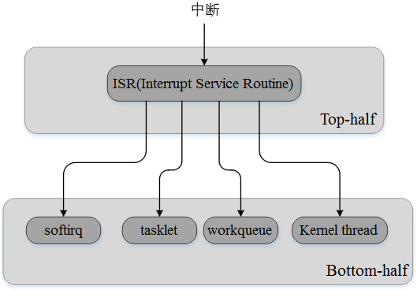
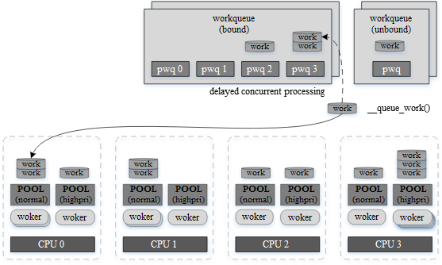

Linux 内核硬件中断业务逻辑下半部分执行有3种方法，分别是: 软中断，tasklet 和 workqueue。软中断由于使用麻烦，原理性比较强 要求高，已经不再建议使用了，用户可以使用它的应用层封装 tasklet （tasklet 就是工作在软中断的应用层），但是 tasklet 经常会拖慢系统的实时响应，且使用限制也不小，所以现在一般建议使用 workqueue。现在来说说优先级，软中断是有优先级的，但是不能实时抢占，即只有当前业务执行完毕，才能执行下一个业务，即使下一个业务优先级更高，因为软中断是串行执行的，每次在执行之前都会从链表中选择优先级最高的处理。tasklet 也有所谓的优先级，这是建立在它有2个工作链表的基础上，分别代表高低优先级，映射到软中断就是工作在2各不同优先级的软中断回调函数上面。对于同一条工作链表上面是没有优先级概念的，所有的待执行业务都会顺序插入链表，一个一个的执行，总体来说支持1层优先级workqueue 和 tasklet 类似，里面有多个工作队列（链表），工作在不同优先级，不同的是在一个工作线队列内部 work 也有不同优先级，由于执行回调函数的实体是线程，所以可以通过设置 nice 值来配置优先级，总的来说就是支持2层优先级。

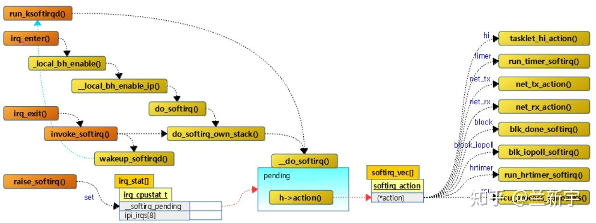

### 中断线程化

Linux 中断处理分为顶半部（top half）和底半部(bottom half)，一般要求在顶半部里处理优先级比较高的事情，处理时间应尽量短，在处理完成后就激活底半部，在底半处部理其余任务。底半部的处理方式主要有soft_irq, tasklet, workqueue三种，它们的使用方式和适用情况各有不同。

soft_irq 用在对执行时间要求比较紧急或者非常重要的场合。 tasklet 和 work queue 在普通的driver里用的较多，主要区别是tasklet是在中断环境中执行，而work queue 则是在进程中执行，因此可以使用sleep()。

Linux 中断的优先级比进程高，一旦中断过来普通进程实时进程通通都要给中断处理程序让路，如果顶半部处理任务较多就会对实时进程造成很大的影响，并且这种影响存在较大的不确定性因此难以准确评估。为了解决这些实时性相关问题，Linux RT_PREEMPT 补丁引入了中断线程化的机制。在新的机制中，中断虽然还会打断实时进程，但中断处理程序所执行的操作仅仅是唤醒中断线程，原本的中断服务程序主体放到一个内核线程中延迟执行，这样中断执行的速度就很快也很确定，实时进程被打断后可以迅速再次运行，而中断服务程序会在实时进程挂起之后被系统调度执行。

Linux 2.6.30里，在ingo molnar的RT tree里存在有一段时间的interrupt thread终于merge到mainline了。此时如果使用request_threaded_irq申请的中断，handler 不是在中断环境里执行，而是在新创建的线程里执行，这样该handler非常像执行workqueue，拥有所有work queue的特性，但是省掉了创建、初始化、调度workqueue的步骤，处理起来非常简单。

request_threaded_irq

## CPU上下文

CPU 寄存器和程序计数器就是 CPU 上下文，因为它们都是 CPU 在运行任何任务前，必须的依赖环境。
CPU 上下文切换就是先把前一个任务的 CPU 上下文（也就是 CPU 寄存器和程序计数器）保存起来，然后加载新任务的上下文到这些寄存器和程序计数器，最后再跳转到程序计数器所指的新位置，运行新任务。而这些保存下来的上下文，会存储在系统内核中，并在任务重新调度执行时再次加载进来。
 
CPU 上下文切换的类型， 进程上下文切换 - 线程上下文切换 - 中断上下文切换。

### 进程上下文切换

进程既可以在用户空间运行，又可以在内核空间中运行。进程在用户空间运行时，被称为进程的用户态，而陷入内核空间的时候，被称为进程的内核态。
内核空间（Ring 0）具有最高权限，可以直接访问所有资源；
用户空间（Ring 3）只能访问受限资源，不能直接访问内存等硬件设备，必须通过系统调用陷入到内核中，才能访问这些特权资源。

进程的上下文切换在保存内核态资源（当前进程的内核状态和 CPU 寄存器）之前，需要先把该进程的用户态资源（虚拟内存、栈等）保存下来；而加载了下一进程的内核态后，还需要刷新进程的虚拟内存和用户栈。

进程的上下文切换就比系统调用时多了一步：在保存内核态资源（当前进程的内核状态和 CPU 寄存器）之前，需要先把该进程的用户态资源（虚拟内存、栈等）保存下来；而加载了下一进程的内核态后，还需要刷新进程的虚拟内存和用户栈。 Linux 通过 TLB（Translation Lookaside Buffer）来管理虚拟内存到物理内存的映射关系。当虚拟内存更新后，TLB 也需要刷新，内存的访问也会随之变慢。特别是在多处理器系统上，缓存是被多个处理器共享的，刷新缓存不仅会影响当前处理器的进程，还会影响共享缓存的其他处理器的进程。

发生进程上下文切换的场景：

    为了保证所有进程可以得到公平调度，CPU 时间被划分为一段段的时间片，这些时间片再被轮流分配给各个进程。这样，当某个进程的时间片耗尽了，就会被系统挂起，切换到其它正在等待 CPU 的进程运行。
    进程在系统资源不足（比如内存不足）时，要等到资源满足后才可以运行，这个时候进程也会被挂起，并由系统调度其他进程运行。
    当进程通过睡眠函数 sleep 这样的方法将自己主动挂起时，自然也会重新调度。
    当有优先级更高的进程运行时，为了保证高优先级进程的运行，当前进程会被挂起，由高优先级进程来运行
    发生硬件中断时，CPU 上的进程会被中断挂起，转而执行内核中的中断服务程序。

### 线程上下文切换

线程与进程最大的区别在于：线程是调度的基本单位，而进程则是资源拥有的基本单位。说白了，所谓内核中的任务调度，实际上的调度对象是线程；而进程只是给线程提供了虚拟内存、全局变量等资源。

所以，对于线程和进程，我们可以这么理解：

    当进程只有一个线程时，可以认为进程就等于线程。
    当进程拥有多个线程时，这些线程会共享相同的虚拟内存和全局变量等资源。这些资源在上下文切换时是不需要修改的。
    线程也有自己的私有数据，比如栈和寄存器等，这些在上下文切换时也是需要保存的。

发生线程上下文切换的场景:

    前后两个线程属于不同进程。此时，因为资源不共享，所以切换过程就跟进程上下文切换是一样。
    前后两个线程属于同一个进程。此时，因为虚拟内存是共享的，所以在切换时，虚拟内存这些资源就保持不动，只需要切换线程的私有数据、寄存器等不共享的数据

### 中断上下文切换

了快速响应硬件的事件，中断处理会打断进程的正常调度和执行，转而调用中断处理程序，响应设备事件。而在打断其他进程时，就需要将进程当前的状态保存下来，这样在中断结束后，进程仍然可以从原来的状态恢复运行。

跟进程上下文不同，中断上下文切换并不涉及到进程的用户态。所以，即便中断过程打断了一个正处在用户态的进程，也不需要保存和恢复这个进程的虚拟内存、全局变量等用户态资源。中断上下文，其实只包括内核态中断服务程序执行所必需的状态，包括 CPU 寄存器、内核堆栈、硬件中断参数等。

对同一个 CPU 来说，中断处理比进程拥有更高的优先级，所以中断上下文切换并不会与进程上下文切换同时发生。同样道理，由于中断会打断正常进程的调度和执行，所以大部分中断处理程序都短小精悍，以便尽可能快的执行结束。

为了避免频繁的上下文切换，还有一种异步非阻塞的开发模型。那就是用一个进程或线程去接收一大堆用户的请求，然后通过IO多路复用的方式来提高性能（进程或线程不阻塞，省去了上下文切换的开销）。Nginx和Node Js就是这种模型的典型代表产品。平心而论，从程序运行效率上来，这种模型最为机器友好，运行效率是最高的（比下面提到的协程开发模型要好）。所以Nginx已经取代了Apache成为了Web Server里的首选。但是这种编程模型的问题在于开发不友好，说白了就是过于机器化，离进程概念被抽象出来的初衷背道而驰。人类正常的线性思维被打乱，应用层开发们被逼得以非人类的思维去编写代码，代码调试也变得异常困难。

于是就有一些聪明的脑袋们继续在应用层又动起了主意，设计出了不需要进程/线程上下文切换的“线程”，协程。用协程去处理高并发的应用场景，既能够符合进程涉及的初衷，让开发者们用人类正常的线性的思维去处理自己的业务，也同样能够省去昂贵的进程/线程上下文切换的开销。因此可以说，协程就是Linux处理海量请求应用场景里的进程模型的一个很好的的补丁。

## 地址空间

所谓进程地址空间（process address space），就是从进程的视角看到的地址空间，是进程运行时所用到的虚拟地址的集合。

以IA-32处理器为例，其虚拟地址为32位，因此其虚拟地址空间的范围为 [公式] ，Linux系统将地址空间按3:1比例划分，其中用户空间（user space）占3GB，内核空间（kernel space）占1GB。

因为内核的虚拟地址空间只有1GB，但它需要访问整个4GB的物理空间，因此从物理地址0~896MB的部分（ZONE_DMA+ZONE_NORMAL），直接加上3GB的偏移（在Linux中用PAGE_OFFSET表示），就得到了对应的虚拟地址，这种映射方式被称为线性/直接映射（Direct Map）。

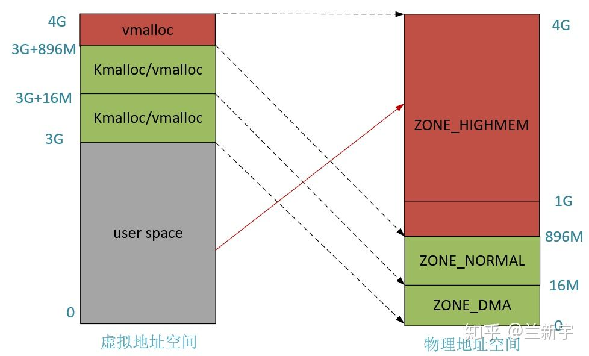

用户空间的进程只能访问整个虚拟地址空间的0~3GB部分，不能直接访问3G~4GB的内核空间部分，但出于对性能方面的考虑，Linux中内核使用的地址也是映射到进程地址空间的（被所有进程共享），因此进程的虚拟地址空间可视为整个4GB（虽然实际只有3GB）。

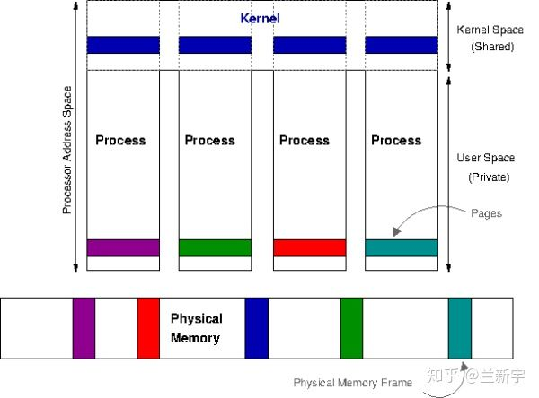

### Linux 进程地址空间布局

在用户空间里，也有许多地址区间有特权的地位，一般来讲，应用程序使用的内存空间里有如下“默认”的区域。

栈区： 栈用于维护函数调用的上下文，离开了栈，函数调用就无法实现，栈通常在用户空间的最高地址处分配，通常有数兆字节的大小。

堆区： 堆是用来容纳应用程序动态分配的内存区域，当程序使用 malloc 或者 new 分配内存的时候，得到的内存会来自堆里。
堆通常存在栈的下方（低地址方向），在某些时候，堆也可能没有固定统一的存储区域。堆一般比栈大很多，可以有几十至数百兆字节的容量。

可执行文件映像： 存储着可执行文件在内存里的映像，由装载器在装载时将可执行文件的内存读取或映射到这里。

保留区： 保留区并不是一个单一的内存区域，而是对内存中受到保护而禁止访问的内存区域的总称：例如大多数操作系统中，极小的地址通常都是不允许访问的，如 NULL，C 语言将无效指针赋值为 0 也是这个考虑。
动态链接库映射区： 这个区域用于映射装载的动态链接库。在 Linux 下，如果可执行文件依赖其它共享库，那么系统就会为它在从 0x40000000 开始的地址分配相应的空间，并将共享库载入该空间。

代码段:
代码段中存放可执行的指令，在内存中，为了保证不会因为堆栈溢出被覆盖，将其放在了堆栈段下面（从上图可以看出）。
通常来讲代码段是共享的，这样多次反复执行的指令只需要在内存中驻留一个副本即可，比如 C 编译器，文本编辑器等。
代码段一般是只读的，这样程序执行时不能随意更改指令，也是为了进行隔离保护。

初始化数据段（数据段）:
初始化数据段有时就称之为数据段。数据段是一个程序虚拟地址空间的一部分，包括一全局变量和静态变量，这些变量在编程时就已经被初始化。数据段是可以修改的，不然程序运行时变量就无法改变了，这一点和代码段不同。
数据段可以细分为初始化只读区和初始化读写区。这一点和编程中的一些特殊变量吻合。比如全局变量 int global n = 1就被放在了初始化读写区，因为 global 是可以修改的。而 const int m = 2 就会被放在只读区，很明显，m 是不能修改的。

未初始化数据段（BSS 段）

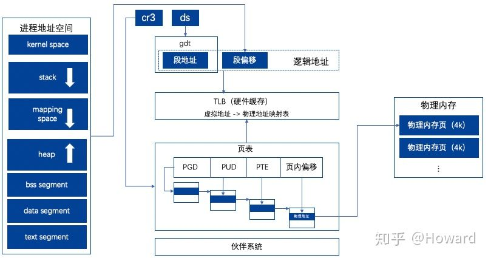

### 内核内存管理

1）管理的粒度：linux将内存分页，每页默认大小为4k。这里有个trade off的问题，如果粒度小，比如1 byte，则可以提升空间利用率，但是管理的meta信息就会很多，如果分配较大空间时，耗时就会更长；如果粒度大，则meta信息少，分配大内存时耗时少，但分配小块内存时会有浪费。所以一般在线系统或者mysql库，使用默认页大小（此处不是只mysql的页，而是mysql使用的linux的页），olap系统或者离线存储系统一般使用大页，linux提供配置参数可以配置大页。

2）进程地址空间：每个进程独有的，用字段task_struct -> mm_struct表示，其也叫线性地址，其转换关系：线性地址 -> 逻辑地址 -> 物理地址。

解耦：因为刚才提到的都是x86支持的方式，还是arm等体系结果需要支持，所以linux通过进程地址空间这个entity进行解耦，所以内存的操作都在用户态完成，真正分配内存时，通过缺页异常搞定。
隔离：由于进程地址空间按进程单位进行隔离，保证进程访问时相互隔离。同时空间内部也分为kernel space和user space，保证用户态和内核态的访问的内存相互隔离。同时采用分段机制，将指令、不同类型的数据分开存储，以支持进程运行模型。
text segment：存储代码指令的区域
data segment：存储已初始化的全局或静态变量
bss segment：存储未初始化的全局或静态变量
heap：堆，用于动态开辟内存空间，brk或malloc开辟的空间
memory mapping space：mmap系统调用使用的空间，通常用于文件映射到内存或匿名映射（开辟大块空间），当malloc大于128k时（此处依赖于glibc的配置），也使用该区域。在进程创建时，会将程序用到的平台、动态链接库加载到该区域
stack：进程运行的栈
空间利用率： 由于32位只支持4G物理内存寻址，一种方式N个进程平分4G内存，这是最简单的方式，但有个问题，有些进程占用内存，但一直在sleep，相当于很浪费。另一种方式就是把内存空间给最需要的进程，把sleep进程的内存swap到硬盘，需要的时候再swap进内存。此时就有一种极端情况，就是一个进程需要独占4G内存，linux显然选择第二种利用率更高的方式，所以进程地址空间能映射4G的物理内存。

3）逻辑地址：逻辑地址 = 段地址 + 段偏移，段地址和段偏移的值由linux进行提供。

4）页表：保存逻辑地址到物理地址的映射，其数据由linux初始化，并将热页表项加载TLB快表进行缓存，加快转换速度。然后x86体系的硬件依赖页表做逻辑地址 -> 物理地址的转换。

5）伙伴系统：管理物理内存的分配，其在缺页中断中被调用，仅负责更改页表和meta（strcut page）。当逻辑地址和物理地址映射上后，指令使用物理地址写入内存设备。

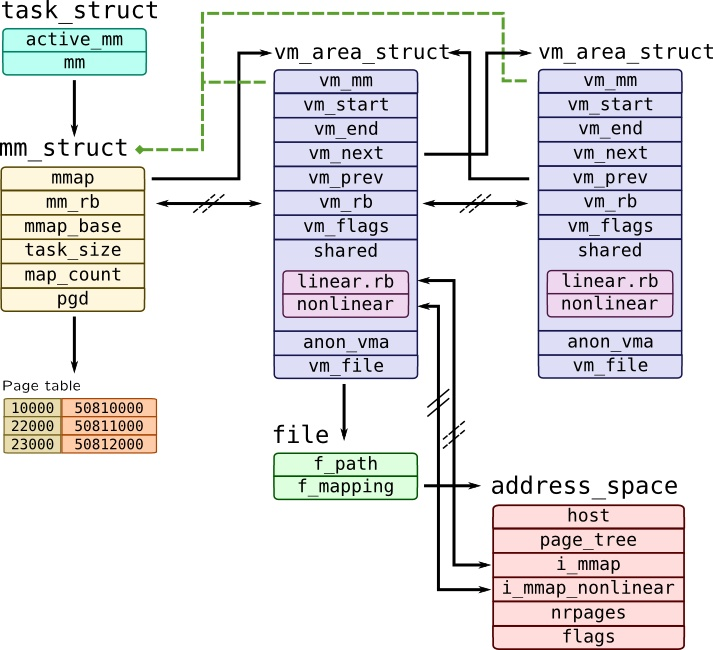

### 物理内存管理（页管理）

Linux内核管理物理内存是通过分页机制实现的，它将整个内存划分成无数个4k（在i386体系结构中）大小的页，从而分配和回收内存的基本单位便是内存页了。利用分页管理有助于灵活分配内存地址，因为分配时不必要求必须有大块的连续内存[3]，系统可以东一页、西一页的凑出所需要的内存供进程使用。虽然如此，但是实际上系统使用内存时还是倾向于分配连续的内存块，因为分配连续内存时，页表不需要更改，因此能降低TLB的刷新率（频繁刷新会在很大程度上降低访问速度）。

鉴于上述需求，内核分配物理页面时为了尽量减少不连续情况，采用了“伙伴”关系来管理空闲页面。伙伴关系分配算法大家应该不陌生——几乎所有操作系统方面的书都会提到,我们不去详细说它了，如果不明白可以参看有关资料。这里只需要大家明白Linux中空闲页面的组织和管理利用了伙伴关系，因此空闲页面分配时也需要遵循伙伴关系，最小单位只能是2的幂倍页面大小。内核中分配空闲页面的基本函数是get_free_page/get_free_pages，它们或是分配单页或是分配指定的页面（2、4、8…512页）。

注意：get_free_page是在内核中分配内存，不同于malloc在用户空间中分配，malloc利用堆动态分配，实际上是调用brk()系统调用，该调用的作用是扩大或缩小进程堆空间（它会修改进程的brk域）。如果现有的内存区域不够容纳堆空间，则会以页面大小的倍数为单位，扩张或收缩对应的内存区域，但brk值并非以页面大小为倍数修改，而是按实际请求修改。因此Malloc在用户空间分配内存可以以字节为单位分配,但内核在内部仍然会是以页为单位分配的。

另外,需要提及的是，物理页在系统中由页结构struct page描述，系统中所有的页面都存储在数组mem_map中，可以通过该数组找到系统中的每一页（空闲或非空闲）。而其中的空闲页面则可由上述提到的以伙伴关系组织的空闲页链表来索引。

Slab 内核内存使用
谓尺有所长，寸有所短。以页为最小单位分配内存对于内核管理系统中的物理内存来说的确比较方便，但内核自身最常使用的内存却往往是很小（远远小于一页）的内存块——比如存放文件描述符、进程描述符、虚拟内存区域描述符等行为所需的内存都不足一页。这些用来存放描述符的内存相比页面而言，就好比是面包屑与面包。一个整页中可以聚集多个这些小块内存；而且这些小块内存块也和面包屑一样频繁地生成/销毁。

为了满足内核对这种小内存块的需要，Linux系统采用了一种被称为slab分配器的技术。Slab分配器的实现相当复杂，但原理不难，其核心思想就是“储池的运用。内存片段（小块内存）被看作对象，当被使用完后，并不直接释放而是被缓存到“存储池”里，留做下次使用，这无疑避免了频繁创建与销毁对象所带来的额外负载。

Slab技术不但避免了内存内部分片带来的不便（引入Slab分配器的主要目的是为了减少对伙伴系统分配算法的调用次数——频繁分配和回收必然会导致内存碎片——难以找到大块连续的可用内存），而且可以很好地利用硬件缓存提高访问速度。

Slab并非是脱离伙伴关系而独立存在的一种内存分配方式，slab仍然是建立在页面基础之上，换句话说，Slab将页面（来自于伙伴关系管理的空闲页面链表）撕碎成众多小内存块以供分配，slab中的对象分配和销毁使用kmem_cache_alloc与kmem_cache_free。

Slab分配器不仅仅只用来存放内核专用的结构体，它还被用来处理内核对小块内存的请求。当然鉴于Slab分配器的特点，一般来说内核程序中对小于一页的小块内存的请求才通过Slab分配器提供的接口Kmalloc来完成（虽然它可分配32 到131072字节的内存）。从内核内存分配的角度来讲，kmalloc可被看成是get_free_page（s）的一个有效补充，内存分配粒度更灵活了。
vmalloc函数分配内核虚拟内存，该函数不同于kmalloc，它可以分配较Kmalloc大得多的内存空间（可远大于128K，但必须是页大小的倍数），但相比Kmalloc来说,Vmalloc需要对内核虚拟地址进行重映射，必须更新内核页表，因此分配效率上要低一些,vmalloc分配的内核虚拟内存与kmalloc/get_free_page分配的内核虚拟内存位于不同的区间，不会重叠。因为内核虚拟空间被分区管理，各司其职。

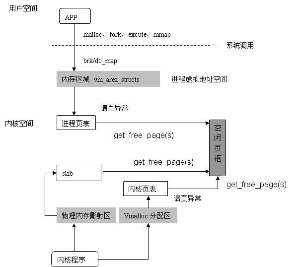

## VFS

Linux操作系统对各种文件系统的支持是通过名为VFS的组件实现的，也就是虚拟文件系统（Virtual File System）VFS作为一个抽象层，为用户提供统一的接口，屏蔽了其它具体文件系统（例如Ext4和Btrfs等）的实现。VFS为用户提供了open、close、read和write等接口。VFS使“一切皆是文件的口号”才能够得以实现。

VFS中挂在的文件系统类别：

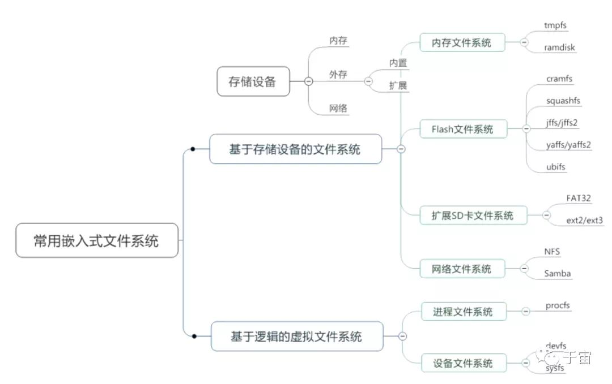

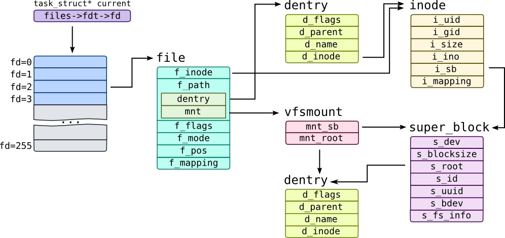

## 网络

OSI 模型中将网络划分为七层，但在目前实际广泛使用的 TCP/IP 协议框架体系内，我们一般将网络划分为五层，从下到上依次为物理层，链路层，网络层，传输层以及应用层。两者的区别在于 OSI 模型在应用层对数据包做了更细致的划分。两者的关系如下图所示：

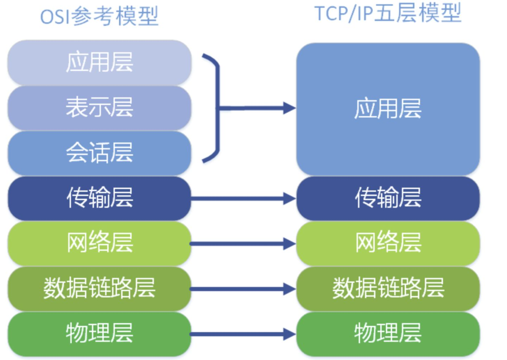

在 TCP/IP 协议框架体系的五层网络模型中，每一层负责处理的数据包协议或类型均存在差异，物理层主要负责在物理载体上的数据包传输，如 WiFi，以太网，光纤，电话线等；数据链路层主要负责链路层协议解析（主要为以太网帧，其他类型此处暂不考虑），网络层主要负责 IP 协议（包括 IPv4 和 IPv6）解析，传输层负责传输层协议解析（主要为 TCP，UDP 等），而传输层以上我们均归类为应用层，主要包括各类应用层协议，如我们常用的 HTTP，FTP，SMTP，DNS，DHCP 等。

在 TCP/IP 协议框架体系内，下层协议对上层协议透明，即上层协议无需关注下层协议的实现逻辑和机制。

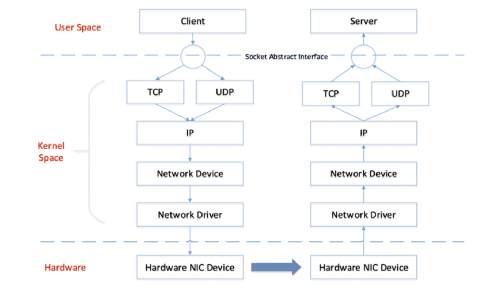

用户态（User Space）程序 Client 向另一台主机上的 Server 发送数据，需要通过调用内核态（Kernel Space）提供给用户态的 Socket 抽象层接口发送数据；
Socket 抽象层接口收到用户态数据后，向下交给传输层接口（TCP 或 UDP）；
传输层负责创建 sk_buff，并将用户数据（应用层数据）填充到缓冲区，做合法性检查后，添加传输层头部，并通过网络层注册的接口将数据包交给网络层处理；
网络层收到传输层数据包后，会查询路由表，决定数据包去向，如果是需要发出的数据包，会填充网络层头部，并交到内核虚拟网络接口设备的发送队列中；
虚拟网络接口从发送队列获取数据，调用对应网卡驱动发送数据；

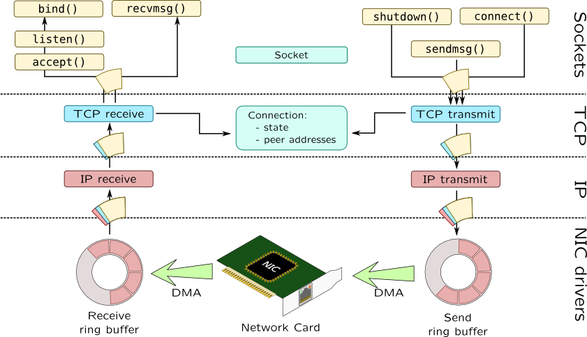

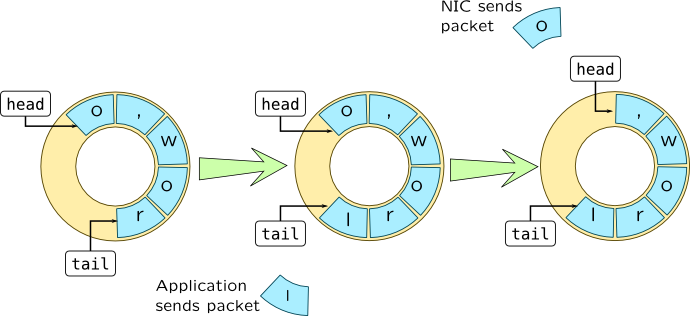

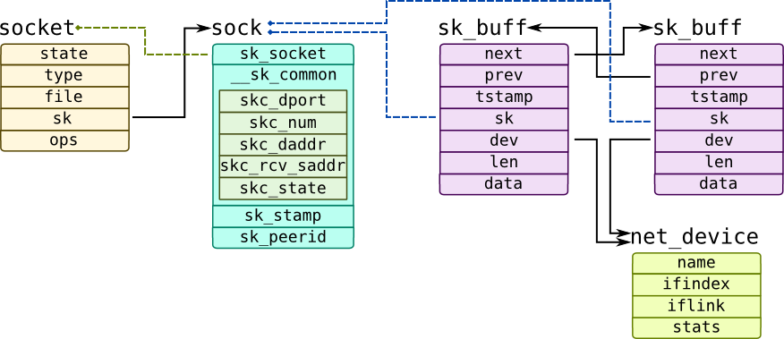

## 内核启动

启动过程分为三个部分

    计算机硬件启动部分（BIOS）
    引导加载程序启动部分（GRUB等）
    内核启动部分（linux内核）

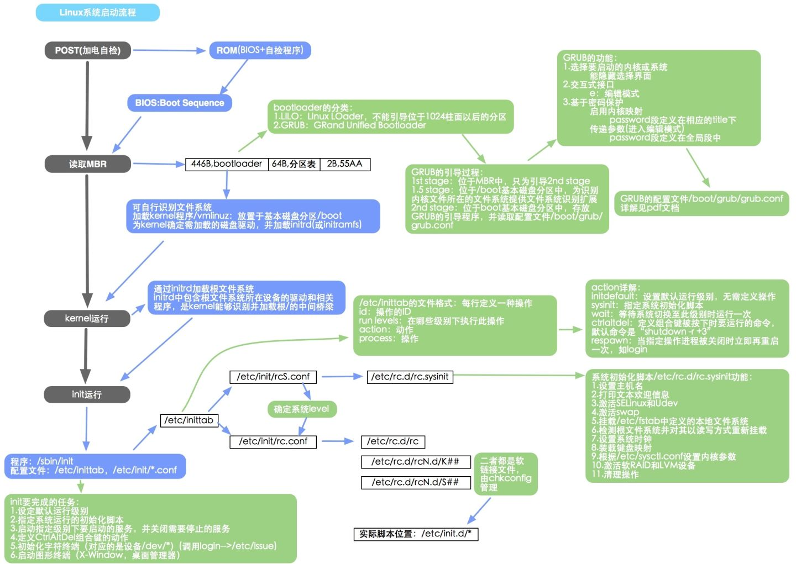

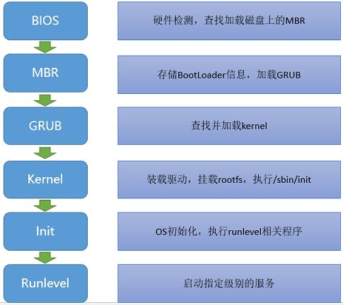

## 内核同步

### 并发与竞态概念

什么是并发： 并发是指多个执行任务同时、并行被执行。
什么是竞态： 字面意思是竞争，并发的执行单元对共享资源（硬件资源和软件上的全局变量，静态变量等）的访问容易发生竞态。

举例一个字符设备的缺陷： 对于一个虚拟的字符设备驱动，假设一个执行单元A对其写入300个字符‘a’，而另一个执行单元B对其写入300个字符‘b’，第三个执行单元读取所有字符。如果A、B被顺序串行执行那么C读出的则不会出错，但如果A、B并发执行，那结果则是我们不可料想的。
竞态发生的情况
对称多处理器（SMP）的多个CPU： SMP是一种紧耦合、共享存储的系统模型，它的特点是多个CPU使用共同的系统总线，因此可以访问共同的外设和存储器。

单CPU内进程与抢占它的进程： Linux 2.6的内核支持抢占调度，一个进程在内核执行的时候可能被另一高优先级进程打断。

中断（硬中断、软中断、tasklet、底半部）与进程之间：中断可以打断正在执行的进程，处理中断的程序和被打断的进程间也可能发生竞态。

解决竞态问题的途径是保证对共享资源的互斥访问。访问共享资源的代码区域称为临界区，临界区要互斥机制保护。Linux设备驱动中常见的互斥机制有以下方式：中断屏蔽、原子操作、自旋锁和信号量等。

### 原子操作

原子操作是由编译器来保证的，保证一个线程对数据的操作不会被其他线程打断。 

### 自旋锁

原子操作只能用于临界区只有一个变量的情况，实际应用中，临界区的情况要复杂的多。对于复杂的临界区，Linux 内核提供了多种方法，自旋锁就是其一。

自旋锁的特点就是当一个线程获取了锁之后，其他试图获取这个锁的线程一直在循环等待获取这个锁，直至锁重新可用。由于线程一直在循环获取这个锁，所以会造成 CPU 处理时间的浪费，因此最好将自旋锁用于很快能处理完的临界区。

自旋锁使用时两点注意：

- 自旋锁是不可递归的，以为自选锁内部关了抢占，递归的话最深层级的函数调用尝试获取自旋锁但是由于第一层级函数调用还没释放，所以会一直死自旋下去。
- 线程获取自旋锁之前，要禁止当前处理器上的中断。（事实上，spin_lock() 函数内部会自己做这个）。

### 读写自旋锁

读写自旋锁除了和普通自选锁一样有自旋特性外，还有以下特点，读锁之间是共享的，即一个线程持有了读锁之后，其他线程也可以以读的方式持有这个锁。
写锁之间是互斥的，即一个县城持有了写锁之后，其他线程不能以读或者写的方式持有这个锁。
读写锁之间是互斥的，即一个县城持有了读锁之后，其他线程不能以写的方式持有这个锁。

### 信号量

信号量也是一种锁，和自旋锁不同的是，线程获取不到信号量的时候，不会像自旋锁一样循环区试图获取锁，而是进入睡眠，直至有信号量释放出来时，才会唤醒睡眠的线程，进入临界区执行。

由于使用信号量时，线程会睡眠，所以等待的过程不会占用 CPU 时间。所以信号量适用于等待时间较长的临界区。 
信号量消耗 CPU 时间的地方在于使线程睡眠和唤醒线程。 
如果（使线程睡眠 + 唤醒线程）的 CPU 时间 > 线程自旋等待 CPU 时间，那么可以考虑使用自旋锁。 
信号量睡眠一般会进入 TASK_INTERRUPTIBLE 状态，因为另一个无法被信号唤醒。 

二值信号量和 mutex 的区别，区别在于 mutex 只能被同一线程加锁解锁，二值信号量可以被不同线程加锁解锁。

### 互斥量

mutex 计数值只能为 1，也就是说最多允许一个线程访问临界区。
必须在同一个上下文问加锁和解锁。
不能递归的上锁和解锁。
持有 mutex 时，进程不能退出。
mutex 不能在中断或者下半部使用，也就是 mutex 只能在进程上下文中使用。

### 顺序锁

顺序锁在我的理解是一个部分优化的读写锁。它的特点是，读锁被获取的情况下，写锁仍然可以被获取。

使用顺序锁的读操作在读之前和读之后都会检查顺序锁的序列值。如果前后值不服，这说明在读的过程中有写的操作发生。那么该操作会重新执行一次，直至读前后的序列值是一样的。

### 顺序和屏障

防止编译器优化我们的代码，让我们代码的执行顺序与我们所写的不同，就需要顺序和屏障。

