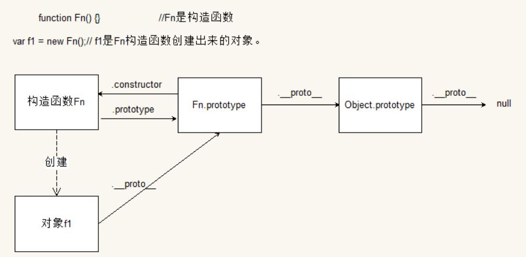
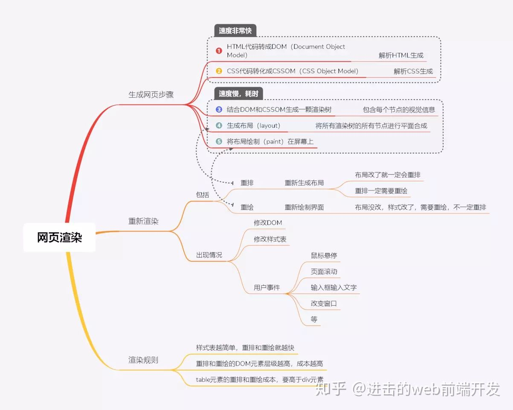
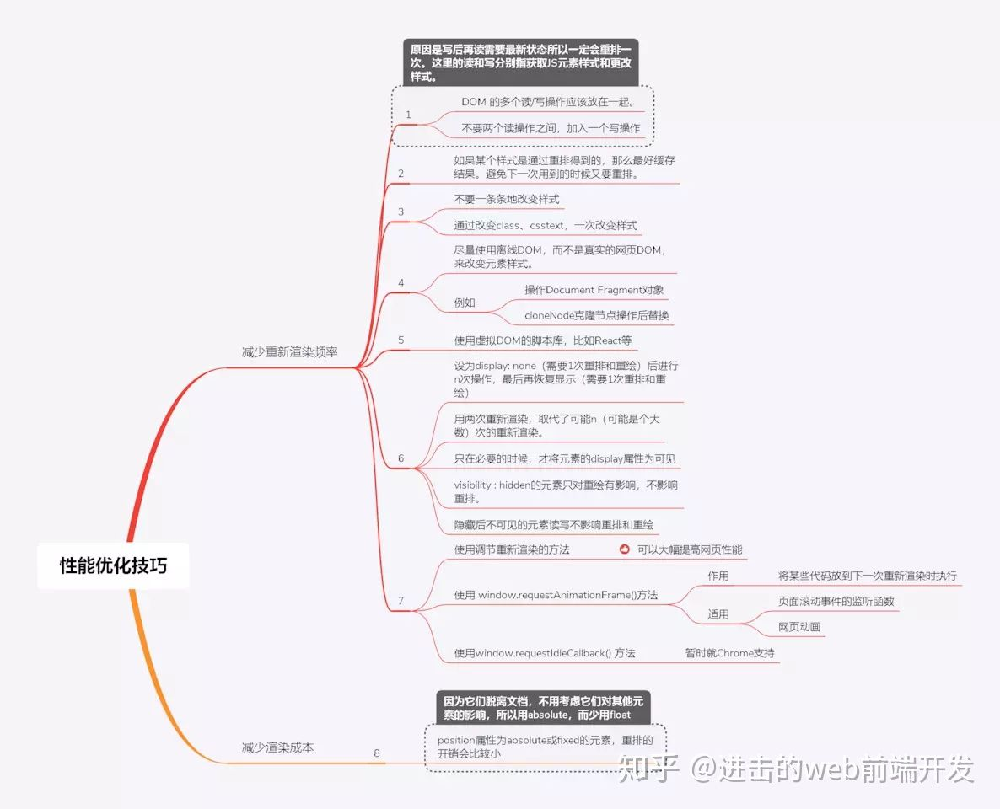
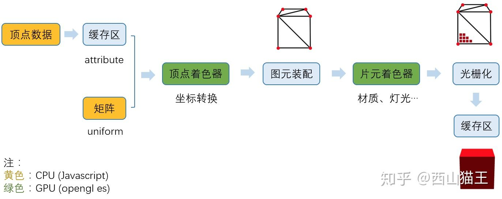
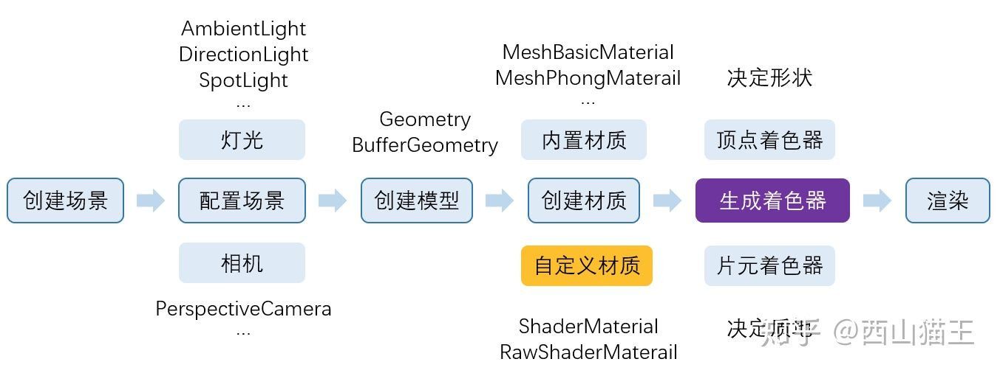
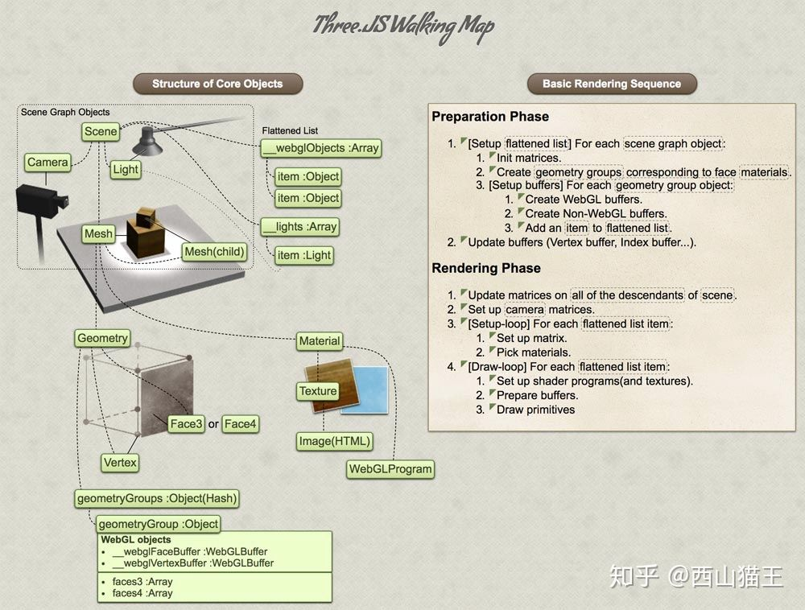
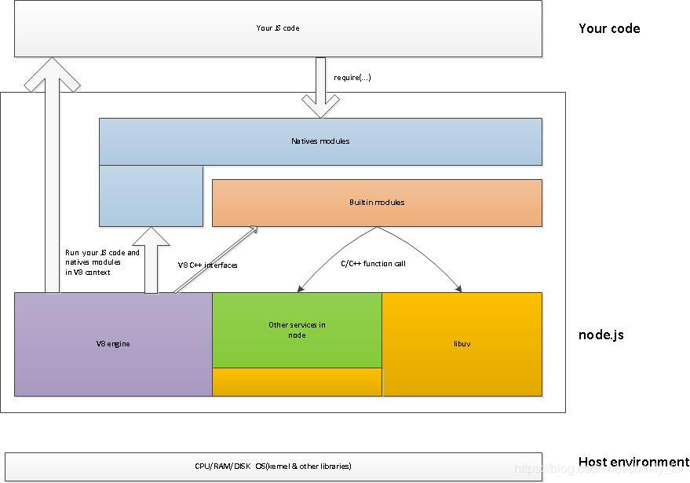
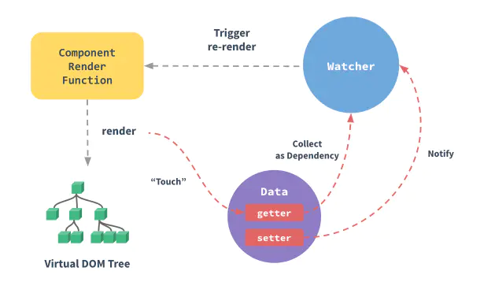
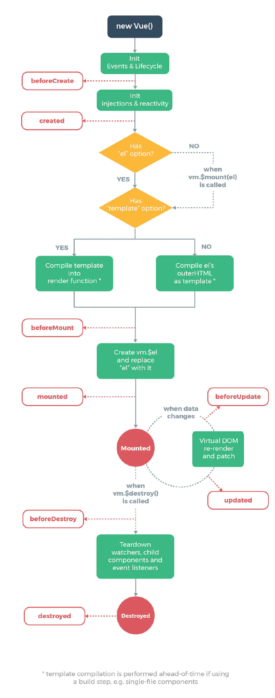
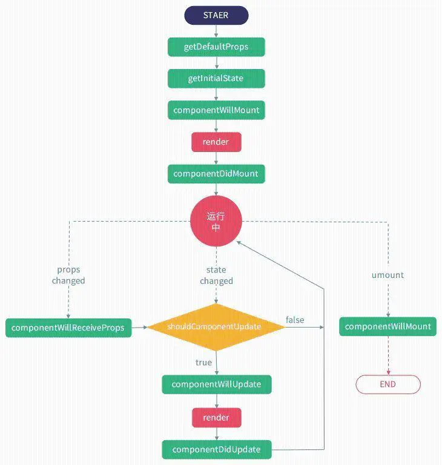

## javascript

### V8

V8引擎是一个JavaScript引擎实现，最初由一些语言方面专家设计，后被谷歌收购，随后谷歌对其进行了开源。V8使用C++开发，，在运行JavaScript之前，相比其它的JavaScript的引擎转换成字节码或解释执行，V8将其编译成原生机器码（IA-32, x86-64, ARM, or MIPS CPUs），并且使用了如内联缓存（inline caching）等方法来提高性能。有了这些功能，JavaScript程序在V8引擎下的运行速度媲美二进制程序。V8支持众多操作系统，如windows、linux、android等，也支持其他硬件架构，如IA32,X64,ARM等，具有很好的可移植和跨平台特性。

V8引擎在执行JavaScript的过程中，主要有两个阶段：编译和运行，与C++的执行前完全编译不同的是，JavaScript需要在用户使用时完成编译和执行。在V8中，JavaScript相关代码并非一下完成编译的，而是在某些代码需要执行时，才会进行编译，这就提高了响应时间，减少了时间开销。在V8引擎中，源代码先被解析器转变为抽象语法树(AST)，然后使用JIT编译器的全代码生成器从AST直接生成本地可执行代码。这个过程不同于JAVA先生成字节码或中间表示，减少了AST到字节码的转换时间，提高了代码的执行速度。但由于缺少了转换为字节码这一中间过程，也就减少了优化代码的机会。

<!-- more -->

### JavaScript 执行机制

javascript是一门单线程语言，所谓异步，其实都是用同步的方法去模拟的， 既然js是单线程，那就像只有一个窗口的银行，客户需要排队一个一个办理业务，同理js任务也要一个一个顺序执行。如果一个任务耗时过长，那么后一个任务也必须等着。那么问题来了，假如我们想浏览新闻，但是新闻包含的超清图片加载很慢，难道我们的网页要一直卡着直到图片完全显示出来？javascipt任务分为同步任务和异步任务, 所谓异步，其实都是用同步的方法去模拟的。

同步和异步任务分别进入不同的执行"场所"，同步的进入主线程，异步的进入Event Table并注册函数。
当指定的事情完成时，Event Table会将这个函数移入Event Queue。
主线程内的任务执行完毕为空，会去Event Queue读取对应的函数，进入主线程执行。
上述过程会不断重复，也就是常说的Event Loop(事件循环)。


同步和异步任务分别进入不同的执行"场所"，同步的进入主线程，异步的进入Event Table并注册函数。
当指定的事情完成时，Event Table会将这个函数移入Event Queue。
主线程内的任务执行完毕为空，会去Event Queue读取对应的函数，进入主线程执行。
上述过程会不断重复，也就是常说的Event Loop(事件循环)。

异步任务又可分为：

macro-task(宏任务)：包括整体代码script，setTimeout，setInterval
micro-task(微任务)：Promise，process.nextTick

不同类型的任务会进入对应的Event Queue，比如setTimeout和setInterval会进入相同的Event Queue。
事件循环的顺序，决定js代码的执行顺序。进入整体代码(宏任务)后，开始第一次循环。接着执行所有的微任务。然后再次从宏任务开始，找到其中一个任务队列执行完毕，再执行所有的微任务。


### javascript闭包

词法作用域就是在你写代码时将变量和块作用域写在哪里来决定，也就是词法作用域是静态的作用域，在你书写代码时就确定了。词法作用域是作用域的一种工作模型，作用域就是一套规则，用于确定在何处以及如何查找变量（标识符）的规则,

闭包是一种将数据与处理数据的代码相关联的自然方式，它使用 continuation passing（后继传递）作为主要的语义风格。使用闭包时，您在一个封闭范围内定义的数据源可供该范围内创建的函数访问，甚至在已经从逻辑上退出这个封闭范围时也是如此。在函数是一等 (first-class) 变量的语言中（比如 JavaScript），此行为非常重要，因为函数的生命周期决定了函数可以看到的数据元素的生命周期。在此环境中，很容易由于疏忽而在内存中保留比期望的多得多的数据，这样做很危险。

当函数调用的时候，会创建一个称为运行期上下文(execution context)的内部对象，z这个对象定义了函数执行时的环境。它也有自己的作用域链，用于标识符解析，而它的作用域链初始化为当前运行函数的[[Scope]]所包含的对象。在函数执行过程中，每遇到一个变量，都会经历一次标识符解析过程以决定从哪里获取和存储数据。该过程从作用域链头部，也就是从活动对象开始搜索，查找同名的标识符，如果找到了就使用这个标识符对应的变量，如果没找到继续搜索作用域链中的下一个对象，如果搜索完所有对象（最后一个为全局对象）都未找到，则认为该标识符未定义。

闭包可以用在许多地方。它的最大用处有两个，一个是前面提到的可以读取函数内部的变量，另一个就是让这些变量的值始终保持在内存中。

```javascript
　　function f1(){
　　　　var n=999;
　　　　nAdd=function(){n+=1}
　　　　function f2(){
　　　　　　alert(n);
　　　　}
　　　　return f2;
　　}
　　var result=f1();
　　result(); // 999
　　nAdd();
　　result(); // 1000
```

原因就在于f1是f2的父函数，而f2被赋给了一个全局变量，这导致f2始终在内存中，而f2的存在依赖于f1，因此f1也始终在内存中，不会在调用结束后，被垃圾回收机制（garbage collection）回收。

使用闭包的注意点：

1）由于闭包会使得函数中的变量都被保存在内存中，内存消耗很大，所以不能滥用闭包，否则会造成网页的性能问题，在IE中可能导致内存泄露。解决方法是，在退出函数之前，将不使用的局部变量全部删除。

2）闭包会在父函数外部，改变父函数内部变量的值。所以，如果你把父函数当作对象（object）使用，把闭包当作它的公用方法（Public Method），把内部变量当作它的私有属性（private value），这时一定要小心，不要随便改变父函数内部变量的值。

### this、call、apply 和 bind

this 允许复用函数时使用不同的上下文。换句话说，“this” 关键字允许在调用函数或方法时决定哪个对象应该是焦点。判断 this 引用什么的 唯一 方法就是看使用 this 关键字的这个方法在哪里被调用的。

call 是每个函数都有的一个方法，它允许你在调用函数时为函数指定上下文。
apply和call区别以整个数组作为第二个参数并让 JavaScript 为我们自动展开。
bind 和 call 完全相同，除了不会立刻调用函数，而是返回一个能以后调用的新函数。

this关键字

1.查看函数在哪被调用。
2.点左侧有没有对象？如果有，它就是 “this” 的引用。如果没有，继续第 3 步。
3.该函数是不是用 “call”、“apply” 或者 “bind” 调用的？如果是，它会显式地指明 “this” 的引用。如果不是，继续第 4 步。
4.该函数是不是用 “new” 调用的？如果是，“this” 指向的就是 JavaScript 解释器新创建的对象。如果不是，继续第 5 步。
5.是否在“严格模式”下？如果是，“this” 就是 undefined，如果不是，继续第 6 步。
6.JavaScript 很奇怪，“this” 会指向 “window” 对象。

### requestAnimationFrame

动画本质就是要让人眼看到图像被绘制而引起变化的视觉效果，这个变化要以连贯的、平滑的方式进行过渡。 那怎么样才能做到这种效果呢？

60Hz 的屏幕每 16.7ms 绘制一次，如果在屏幕每次绘制前，将元素的位置向左移动一个像素，即1px，这样一来，屏幕每次绘制出来的图像位置都比前一个要差1px，你就会看到图像在移动；而由于人眼的视觉停留效应，当前位置的图像停留在大脑的印象还没消失，紧接着图像又被移到了下一个位置，这样你所看到的效果就是，图像在流畅的移动。这就是视觉效果上形成的动画。 

使用setTimeout
setTimeout 的执行时间并不是确定的。在JavaScript中， setTimeout 任务被放进了异步队列中，只有当主线程上的任务执行完以后，才会去检查该队列里的任务是否需要开始执行，所以 setTimeout 的实际执行时机一般要比其设定的时间晚一些。
刷新频率受 屏幕分辨率 和 屏幕尺寸 的影响，不同设备的屏幕绘制频率可能会不同，而 setTimeout 只能设置一个固定的时间间隔，这个时间不一定和屏幕的刷新时间相同。

与 setTimeout 相比，rAF 最大的优势是 由系统来决定回调函数的执行时机。具体一点讲就是，系统每次绘制之前会主动调用 rAF 中的回调函数，如果系统绘制率是 60Hz，那么回调函数就每16.7ms 被执行一次，如果绘制频率是75Hz，那么这个间隔时间就变成了 1000/75=13.3ms。换句话说就是，rAF 的执行步伐跟着系统的绘制频率走。它能保证回调函数在屏幕每一次的绘制间隔中只被执行一次，这样就不会引起丢帧现象，也不会导致动画出现卡顿的问题。
CPU节能：使用 setTimeout 实现的动画，当页面被隐藏或最小化时，setTimeout 仍然在后台执行动画任务，由于此时页面处于不可见或不可用状态，刷新动画是没有意义的，而且还浪费 CPU 资源。而 rAF 则完全不同，当页面处理未激活的状态下，该页面的屏幕绘制任务也会被系统暂停，因此跟着系统步伐走的 rAF 也会停止渲染，当页面被激活时，动画就从上次停留的地方继续执行，有效节省了 CPU 开销。
函数节流：在高频率事件(resize,scroll 等)中，为了防止在一个刷新间隔内发生多次函数执行，使用 rAF 可保证每个绘制间隔内，函数只被执行一次，这样既能保证流畅性，也能更好的节省函数执行的开销。一个绘制间隔内函数执行多次时没有意义的，因为显示器每16.7ms 绘制一次，多次绘制并不会在屏幕上体现出来。

### 原型链结构



### 柯里化（curry）

curry 的概念很简单：只传递给函数一部分参数来调用它，让它返回一个函数去处理剩下的参数。
你可以一次性地调用 curry 函数，也可以每次只传一个参数分多次调用。

```javascript
var add = function(x) {
  return function(y) {
    return x + y;
  };
};

var increment = add(1);
var addTen = add(10);

increment(2);
// 3

addTen(2);
// 12
```

### ECMAScript 6

ECMAScript 6.0（以下简称 ES6）是 JavaScript 语言的下一代标准，已经在 2015 年 6 月正式发布了。它的目标，是使得 JavaScript 语言可以用来编写复杂的大型应用程序，成为企业级开发语言。

因此，ECMAScript 和 JavaScript 的关系是，前者是后者的规格，后者是前者的一种实现（另外的 ECMAScript 方言还有 JScript 和 ActionScript）。日常场合，这两个词是可以互换的。

Babel 是一个广泛使用的 ES6 转码器，可以将 ES6 代码转为 ES5 代码，从而在老版本的浏览器执行。这意味着，你可以用 ES6 的方式编写程序，又不用担心现有环境是否支持。

## typescript

TypeScript 是 JavaScript 的一个超集，主要提供了类型系统和对 ES6 的支持,它的第一个版本发布于 2012 年 10 月，经历了多次更新后，现在已成为前端社区中不可忽视的力量，不仅在 Microsoft 内部得到广泛运用，而且 Google 开发的 Angular 从 2.0 开始就使用了 TypeScript 作为开发语言，Vue 3.0 也使用 TypeScript 进行了重构。


### TypeScript 增加了代码的可读性和可维护性

类型系统实际上是最好的文档，大部分的函数看看类型的定义就可以知道如何使用了
可以在编译阶段就发现大部分错误，这总比在运行时候出错好
增强了编辑器和 IDE 的功能，包括代码补全、接口提示、跳转到定义、代码重构等

### TypeScript 非常包容

TypeScript 是 JavaScript 的超集，.js 文件可以直接重命名为 .ts 即可
即使不显式的定义类型，也能够自动做出类型推论
TypeScript 的类型系统是图灵完备的，可以定义从简单到复杂的几乎一切类型
即使 TypeScript 编译报错，也可以生成 JavaScript 文件
兼容第三方库，即使第三方库不是用 TypeScript 写的，也可以编写单独的类型文件供 TypeScript 读取

### TypeScript 拥有活跃的社区

大部分第三方库都有提供给 TypeScript 的类型定义文件
Angular、Vue、VS Code、Ant Design 等等耳熟能详的项目都是使用 TypeScript 编写的
TypeScript 拥抱了 ES6 规范，支持 ESNext 草案中处于第三阶状态（Stage 3）的特性

## html5

HTML5本身是由W3C推荐出来的，它的开发是通过谷歌、苹果，诺基亚、中国移动等几百家公司一起酝酿的技术，这个技术最大的好处在于它是一个公开的技术。换句话说，每一个公开的标准都可以根据W3C的资料库找寻根源。另一方面，W3C通过的HTML5标准也就意味着每一个浏览器或每一个平台都会去实现。

a、网络标准统一、HTML5本身是由W3C推荐出来的。
b、多设备、跨平台
c、即时更新。
d、提高可用性和改进用户的友好体验；
e、有几个新的标签，这将有助于开发人员定义重要的内容；
f、可以给站点带来更多的多媒体元素(视频和音频)；
g、可以很好的替代Flash和Silverlight；
h、涉及到网站的抓取和索引的时候，对于SEO很友好；
i、被大量应用于移动应用程序和游戏。




## webgl

WebGL是一种3D绘图标准，这种绘图技术标准允许把JavaScript和OpenGL ES 2.0结合在一起，通过增加OpenGL ES 2.0的一个JavaScript绑定，WebGL可以为HTML5 Canvas提供硬件3D加速渲染，这样Web开发人员就可以借助系统显卡来在浏览器里更流畅地展示3D场景和模型了，还能创建复杂的导航和数据视觉化。由于webgl是基于OpenGL和JavaScript技术结合，而OpenGL与微软DirectX存在着竞争关系，而且微软自身也开发了Silverlight插件，与webgl其实是类似的，所以微软对webgl技术并不支持。但是最新的 IE11和 edge 浏览器是 ok 的。所以一开始的难点就在于怎么去构建这个3D的场景和内部的模型动画等。

### WebGL的完整工作流程

1、准备数据阶段
在这个阶段，我们需要提供顶点坐标、索引（控制三角形绘制顺序）、uv（决定贴图坐标）、法线（决定光照效果），以及各种矩阵（比如投影矩阵等）。
其中顶点数据存储在缓存区（因为数量巨大），以修饰符attribute传递给顶点着色器；
矩阵则以修饰符uniform传递给顶点着色器。

2、生成顶点着色器
根据我们需要，由Javascript定义一段顶点着色器（opengl es）程序的字符串，生成并且编译成一段着色器程序传递给GPU。

3、图元装配
GPU根据顶点数量，逐个执行顶点着色器程序，生成顶点最终的坐标，完成坐标转换。

4、生成片元着色器
模型的颜色，质地，光照效果，阴影等，都在这个阶段处理。

5、光栅化
通过片元着色器，我们确定好了每个片元的颜色，以及根据深度缓存区判断哪些片元被挡住了，不需要渲染，最终将片元信息存储到颜色缓存区，最终完成整个渲染。



### three.js

three.js是以WebGL为基础的库，封装了一些3D渲染需求中重要的工具方法与渲染循环。WebGL门槛相对较高,Three.js对WebGL提供的接口进行了非常好的封装，简化了很多细节，大大降低了学习成本。


上图中黄色和绿色部分，都是three.js参与的部分，其中黄色是javascript部分，绿色是opengl es部分。
我们发现，能做的，three.js基本上都帮我们做了。

辅助我们导出了模型数据；
自动生成了各种矩阵；
生成了顶点着色器；
辅助我们生成材质，配置灯光；
根据我们设置的材质生成了片元着色器。





## nodejs

nodejs 乘坐互联网快艇迅速火热， 入门到进阶打通全干工程师吸引了广泛的前端程序员进入后端深坑。前端开发工程师不可避免的要在自己的电脑上安装 Nodejs，作为工具也好，作为服务器也好，累人累手的事情，统统可以交由nodejs来处理，比如 less/scss 的编译，ES6/7 到 ES5 的转换，Javascript 代码的压缩合并，切页面调试样式的热更新等等。
但是其对于ECMAScript新标准更新迭代的兼容、对第三方模块的安全性、易用性的管理、以及缺失对数据类型等的操作需求。 所以nodejs 的创始人 原作者，ryan dahl，2018开始的deno在坊间传闻为nodejs的下一代产品,更多前端人员讨论的是typescript 是否能够引领下一波前端开发潮流，并且带动deno起飞。


Node.js 是一个开源与跨平台的 JavaScript 运行时环境。 它是一个可用于几乎任何项目的流行工具！
Node.js 在浏览器外运行 V8 JavaScript 引擎（Google Chrome 的内核）。 这使 Node.js 表现得非常出色。
Node.js 应用程序运行于单个进程中，无需为每个请求创建新的线程。 Node.js 在其标准库中提供了一组异步的 I/O 原生功能（用以防止 JavaScript 代码被阻塞），并且 Node.js 中的库通常是使用非阻塞的范式编写的（从而使阻塞行为成为例外而不是规范）。
当 Node.js 执行 I/O 操作时（例如从网络读取、访问数据库或文件系统），Node.js 会在响应返回时恢复操作，而不是阻塞线程并浪费 CPU 循环等待。
这使 Node.js 可以在一台服务器上处理数千个并发连接，而无需引入管理线程并发的负担（这可能是重大 bug 的来源）。
Node.js 具有独特的优势，因为为浏览器编写 JavaScript 的数百万前端开发者现在除了客户端代码之外还可以编写服务器端代码，而无需学习完全不同的语言。

npm 的简单结构有助于 Node.js 生态系统的激增，现在 npm 仓库托管了超过 1,000,000 个可以自由使用的开源库包。

### 模块依赖的角度



### 函数调用的角度


## vue/react/angular

### virtual dom

现在的网速越来越快了，很多人家里都是几十甚至上百M的光纤，手机也是4G起步了，按道理一个网页才几百K，而且浏览器本身还会缓存很多资源文件，那么几十M的光纤为什么打开一个之前已经打开过，已经有缓存的页面还是感觉很慢呢？
（1）、浏览器本身处理DOM也是有性能瓶颈的
（2）、用JQuery或者原生的JavaScript DOM操作函数对DOM进行频繁操作的时候，浏览器要不停的渲染新的DOM树
这就是因为浏览器本身处理DOM也是有性能瓶颈的，尤其是在传统开发中，用JQuery或者原生的JavaScript DOM操作函数对DOM进行频繁操作的时候，浏览器要不停的渲染新的DOM树，导致页面看起来非常卡顿。
预计算dom的各种操作，把最后一次的结果渲染出来（减少dom的渲染次数）
而Virtual DOM则是虚拟DOM的英文，简单来说，他就是一种可以预先通过JavaScript进行各种计算，把最终的DOM操作计算出来并优化，由于这个DOM操作属于预处理操作，并没有真实的操作DOM，所以叫做虚拟DOM。最后在计算完毕才真正将DOM操作提交，将DOM操作变化反映到DOM树上。

### vue

Vue.js（读音 /vjuː/, 类似于 view） 是一套构建用户界面的 渐进式框架。与其他重量级框架不同的是，Vue 采用自底向上增量开发的设计。Vue 的核心库只关注视图层，并且非常容易学习，非常容易与其它库或已有项目整合。另一方面，Vue 完全有能力驱动采用单文件组件和 Vue 生态系统支持的库开发的复杂单页应用。

Vue.js 的目标是通过尽可能简单的 API 实现响应的数据绑定和组合的视图组件。



首先使用Object. defineProperty（）的原理来实现劫持监听所有属性
每次在页面中使用一个属性就会产生一个watcher
而watcher是通过dep来管理的，相同的属性的实例在一个dep中统一管理
当其中一个属性变化的时候会通知dep变化，再通知dep中管理的对应的watcher进行变化

编译模块分为三个阶段
parse：使⽤用正则解析template中的vue的指令(v-xxx) 变量量等等 形成抽象语法树AST
optimize：标记⼀一些静态节点，⽤用作后⾯面的性能优化，在diff的时候直接略略过
generate：把第⼀一部⽣生成的AST 转化为渲染函数 render function



### react

声明式
React 使创建交互式 UI 变得轻而易举。为你应用的每一个状态设计简洁的视图，当数据改变时 React 能有效地更新并正确地渲染组件。以声明式编写 UI，可以让你的代码更加可靠，且方便调试。

组件化
创建拥有各自状态的组件，再由这些组件构成更加复杂的 UI。
组件逻辑使用 JavaScript 编写而非模版，因此你可以轻松地在应用中传递数据，并使得状态与 DOM 分离。

一次学习，随处编写
无论你现在正在使用什么技术栈，你都可以随时引入 React 来开发新特性，而不需要重写现有代码。
React 还可以使用 Node 进行服务器渲染，或使用 React Native 开发原生移动应用。



## 链接

[Airbnb JavaScript 风格指南](https://github.com/lin-123/javascript)
[JavaScript 算法与数据结构](https://github.com/trekhleb/javascript-algorithms/blob/master/README.zh-CN.md)
[Leetcode](https://github.com/azl397985856/leetcode)
[vuetify](https://github.com/vuetifyjs/vuetify)