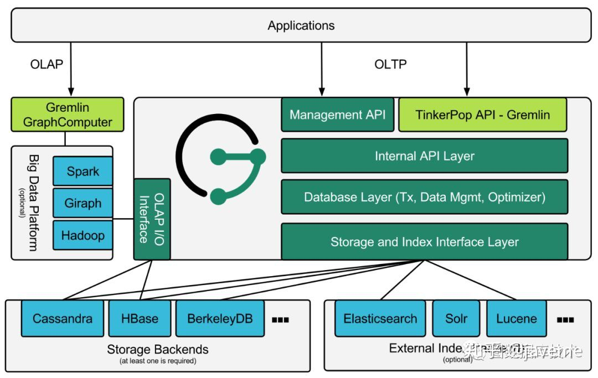

## 背景

在众多不同的数据模型里，关系数据模型处于统治地位，而且出现了不少巨头，如Oracle、MySQL。然而，随着关系数据库使用范围的不断扩大，也暴露出一些它始终无法解决问题，其中最主要的是数据建模中的一些缺陷和问题，以及在大数据量和多服务器之上进行水平伸缩的限制。

互联网发展也产生了一些新的趋势变化：用户、系统和传感器产生的数据量呈指数增长，数据量不断增加，大数据的存储和处理；新时代互联网形势下的问题急迫性，这一问题因互联网、社交网络，智能推荐等的大规模兴起和繁荣而变得越加紧迫。而在应对这些趋势时，关系数据库产生了更多的不适应性，从而导致大量解决这些问题中某些特定方面的不同技术出现，它们可以与现有RDBMS相互配合或代替它们。

过去的几年间，出现了大量新型数据库，它们被统称为NoSQL数据库。

<!-- more -->

## NoSQL数据库的数据模型

NoSQL是一类范围非常广泛的持久化解决方案，它们不遵循关系数据库模型，也不使用SQL作为查询语言。其数据存储可以不需要固定的表格模式，也经常会避免使用SQL的JOIN操作，一般有水平可扩展的特征。

简言之，NoSQL数据库可以按照它们的数据模型分成4类：

键-值存储库（Key-Value-stores）;
BigTable实现（BigTable-implementations）;
文档库（Document-stores);
图形数据库（Graph Database）;

## GraphDB

GraphDB图数据库作为一种新型的NoSQL数据库，最近几年广受关注。
图数据库是基于图论的数据库，其基本含义是以“图”这种数据结构存储和查询数据。需要注意的是图数据库并不是存储图片的数据库。图数据库的数据模型由顶点（Vertex）、边（Edge）和属性来体现。其基本数据类型可表示为G=(V, E)。

## HugeDB

HugeGraph是一款易用、高效、通用的开源图数据库系统（Graph Database，GitHub项目地址）， 实现了Apache TinkerPop3框架及完全兼容Gremlin查询语言， 具备完善的工具链组件，助力用户轻松构建基于图数据库之上的应用和产品。HugeGraph支持百亿以上的顶点和边快速导入，并提供毫秒级的关联关系查询能力（OLTP）， 并可与Hadoop、Spark等大数据平台集成以进行离线分析（OLAP）。

HugeGraph典型应用场景包括深度关系探索、关联分析、路径搜索、特征抽取、数据聚类、社区检测、 知识图谱等，适用业务领域有如网络安全、电信诈骗、金融风控、广告推荐、社交网络和智能机器人等。

本系统的主要应用场景是解决百度安全事业部所面对的反欺诈、威胁情报、黑产打击等业务的图数据存储和建模分析需求，在此基础上逐步扩展及支持了更多的通用图应用。

HugeGraph支持在线及离线环境下的图操作，支持批量导入数据，支持高效的复杂关联关系分析，并且能够与大数据平台无缝集成。HugeGraph支持多用户并行操作，用户可输入Gremlin查询语句，并及时得到图查询结果，也可在用户程序中调用HugeGraph API进行图分析或查询。

本系统具备如下特点：

易用：HugeGraph支持Gremlin图查询语言与Restful API，同时提供图检索常用接口，具备功能齐全的周边工具，轻松实现基于图的各种查询分析运算。
高效：HugeGraph在图存储和图计算方面做了深度优化，提供多种批量导入工具，轻松完成百亿级数据快速导入，通过优化过的查询达到图检索的毫秒级响应。支持数千用户并发的在线实时操作。
通用：HugeGraph支持Apache Gremlin标准图查询语言和Property Graph标准图建模方法，支持基于图的OLTP和OLAP方案。集成Apache Hadoop及Apache Spark大数据平台。
可扩展：支持分布式存储、数据多副本及横向扩容，内置多种后端存储引擎，也可插件式轻松扩展后端存储引擎。
开放：HugeGraph代码开源（Apache 2 License），客户可自主修改定制，选择性回馈开源社区。

本系统的功能包括但不限于：
支持从多数据源批量导入数据(包括本地文件、HDFS文件、MySQL数据库等数据源)，支持多种文件格式导入(包括TXT、CSV、JSON等格式)
具备可视化操作界面，可用于操作、分析及展示图，降低用户使用门槛
优化的图接口：最短路径(Shortest Path)、K步连通子图(K-neighbor)、K步到达邻接点(K-out)、个性化推荐算法PersonalRank等。

基于Apache TinkerPop3框架实现，支持Gremlin图查询语言
支持属性图，顶点和边均可添加属性，支持丰富的属性类型
具备独立的Schema元数据信息，拥有强大的图建模能力，方便第三方系统集成
支持多顶点ID策略：支持主键ID、支持自动生成ID、支持用户自定义字符串ID、支持用户自定义数字ID
可以对边和顶点的属性建立索引，支持精确查询、范围查询、全文检索。
存储系统采用插件方式，支持RocksDB、Cassandra、ScyllaDB、HBase、MySQL、PostgreSQL、Palo以及InMemory等
与Hadoop、Spark GraphX等大数据系统集成，支持Bulk Load操作。
支持高可用HA、数据多副本、备份恢复、监控等
基于TinkerPop 3 API实现，支持Gremlin图查询语言；
拥有完善的周边工具链和相关功能组件，可以满足图数据库开发的基本需求，提供易用高效的使用体验；
具备独立的Schema管理模块，丰富完善的Schema校验机制，确保图数据库中的数据完整性和一致性；
支持数据的备份和还原，可以在不同的后端存储之间转换；
多种ID生成策略应对不同业务场景，拥有完善的索引管理机制，支持多种索引查询操作；
可以实现与Hadoop、Spark、HBase、ES等大数据系统集成，支持多种Bulk Load操作，实现海量数据快速插入；
除上述特定之外，HugeGraph还针对图数据库的高频应用（例如：ShortestPath、k-out、k-neighbor等）做了特定性能优化，并且为用户提供更为高效的使用体验。

## Janus

JanusGraph图数据库，源自于TitanDB开源图数据库。TitanDB在2012年发布第一个版本，2015年被Datastax公司收购，后续不再维护导致项目停滞。

图数据库有2个最具代表性的查询语言：Cypher 及 Gremlin。Cypher是商业公司Neo4j出品，Neo4j图数据库在2007年发布了第一个版本，是商用图数据库领域的开拓者。Gremlin是Apache TinkerPop框架下规范的语言，TinkerPop属于当前图数据库领域最流行的框架规范，具备开源开放、功能丰富、生态完善等特点，拥有大量厂商支持（超过20家），Titan当属TinkerPop框架下最成功的开源图数据库实现，后续的不少图数据库或多或少借鉴了Titan的思想，Titan的几位核心作者包括：Dan、Matthias、Marko(okram)、Stephen(spmallette)等，其中的两位--Marko和Stephen同时也是TinkerPop的核心作者。个人在此致敬Titan和TinkerPop。

非常令人遗憾的是，Titan在2015年被收购后，其开源社区无人维护，否则以其前三年的势头来看，大有一统图江湖的趋势，不过没有如果。而Janus稍许弥补了这个遗憾，也算是后继之人，但是Janus绝大部分功能沿袭自Titan，没有更上一个台阶发扬光大，只是做了一些小修补。下面是对Titan/Janus的一些总结和分析。

2016年由其他人基于Titan源码Fork出了Janus，到目前（2020年）Janus已经合入了700多个Pull Request，主要包括：

支持Bigtable后端；
跟进TinkerPop框架的版本升级，目前已支持3.4.4；
后端存储升级与兼容，比如兼容Apache Cassandra 3.x, Apache HBase 2.x；
其它方面的增强与Bugfix，比如：新增Schema约束、新增HBase TTL、丰富GEO索引查询、优化AdjacentID查询等。
总结来说，在大方向上Janus对Titan改进并不多，主要包括2方面：

提供后端存储的版本升级与兼容适配；
新增极少的新Feature，大多是小修补，有少量功能增强。

Janus整体架构分为3层，中间层是图引擎，最底层是存储层，最上层是应用程序层：

图引擎：图数据库核心，对外提供图方式的读写API。处理写请求，将数据索引起来、按照特定的格式写到存储层；处理读请求，按照特定格式从存储层高效读取数据，组装成图结果返回上层。
存储层：用于持久化图数据，包括两方面数据：1、图数据（包括顶点和边），存储在Storage Backend里面，可以选择配置一种后端存储，比如Cassandra或HBase；2、Mixed模糊索引数据（包括范围索引和全文索引等），存储在External Index Backend里面，也可以选则配置一种后端存储，比如ES或Solr；如果不开启Mixed模糊索引，则无需配置索引后端。
应用层：业务程序可以有两种方式来使用：1、内嵌到程序中，与业务程序共用同一个进程JVM；2、以服务的方式单独启动，业务程序通过HTTP API来访问。

## Nebula

Nebula Graph是一款开源的图数据库，擅长处理千亿个顶点和万亿条边的超大规模数据集。

全对称分布式架构
存储与计算分离
水平可扩展性
RAFT 协议下的数据强一致
类 SQL 查询语言
用户鉴权

图数据库，可能有 20 个自称图数据库的产品。我认为这些产品可以分成两类，一种就是原生的，还有一类是多模的。
对于图原生的产品，在设计时考虑了图数据的特性，存储、计算引擎都是基于图的特点做了特别设计和优化。

而对于多模的产品，就有很多，比如说ArangoDB或者Orientdb，还有一些云厂商的服务。它们的底层是一个表或文档型数据库，在上层增加图的服务。对于这类多模数据库，图服务层所做的操作，比如：遍历、写入，最终将被映射到下面的存储层，成为一系列表和文档的操作。所以它最大的问题是整个系统并不是为了图这种多对多的结构特点设计，一旦数据量或者并发量增大之后，问题就比较明显。我们最近碰到一个比较典型的 case，客户使用多模 DB，在数据量很小时还比较方便，但当数据量大到一定程度，做二跳三跳查询时 touch 的数据非常多，而多模 DB 底层是关系型数据库，所有关系最终要映射到关系型数据库的 join 操作，做三四层的 join ，性能会非常的差。

Nebula 在设计存储时，采用 share-nothing 的分布式架构，本质上存储节点间没有数据共享，也就是整个分布式结构无中心节点。这样的好处在于，第一，容易做水平拓展；第二，即使部分机器 Crash，通过数据强一致性—— Raft 协议能保证整个系统的可用性，不会丢失数据。

因为业务会越发复杂，所以Nebula支持多种存储引擎。有的业务数据量不大但对查询的实时性要求高，Nebula 支持纯内存式的存储引擎；数据量大且查询并发量也大的情况下，Nebula 支持使用内存加 SSD 模式。当然 Nebula 也支持第三方存储引擎，比如HBase，考虑到这样使用存在的主要问题是性能不佳，我们建议用在一些对性能要求不是很高的场景。

## Neo4j(已闭源)

开源的 Neo4j 是单机架构

## 图数据库选型

首先功能丰富、性能高效、易用性好等通用标准就不细说了。如果数据规模较小，比如千万级以内，可以选择偏内存型或单机型的。如果数据规模较大，比如超过十亿级，则需要选择偏分布式存储型的，且支持图分片的，支持存储可扩展的。如果技术能力强可以选择开源的，如果希望省事可以选择商业付费的，如果希望又省事又自主可控可以选择开源的商业版。另外，开源开放的使用者众多，稳定性、可持续性上比较有保障。图查询语言选择比较关键，尽量选择一个标准或通用的图语言，目前比较主流的图语言是Gremlin和Cypher。标准意味着通用规范、学习资料多、迁移成本低、开发人员多、生态完善等。目前图数据库的开发语言本身已Java居多，图生态完善，也有部分C++的，可以适当结合开发人员的技术栈进行选择。如果业务需要从传统关系型数据库或消息队列导入数据，则需要选择工具链本身已提供支持的，可以免去自己开发的工作。如果使用者面向数据分析人员而非程序员，则需要选择支持易用的可视化界面的。当然对于程序员来说有一个高效丰富的界面也是非常好的辅助。当然还可以根据喜好选择国际的和本土的，国际的知名度好、本土的技术支持和交流有优势。

## 图计算Plato

腾讯图计算TGraph正式开源高性能图计算框架Plato，达到业界领先水平，超大规模图计算全面进入分钟级时代。

图作为一种表示和分析大数据的有效方法，已成为社交网络、推荐系统、网络安全、文本检索和生物医疗等领域至关重要的数据分析和挖掘工具。例如，定期对网页进行影响力排序以提升用户的搜索体验；分析庞大的社交网络结构以便精准地为用户推荐服务；通过子图匹配等方式了解蛋白质间的相互作用从而研制更有效的临床医药。

图数据是高维度数据，图算法的计算性能是决定图挖掘能否成功的关键因素之一。对于腾讯超过十亿级节点的超大规模社交网络数据，计算性能显得尤为重要。遗憾的是，工业界和学术界的各种分布式图计算框架，对于腾讯超大规模社交网络图数据，性能达不到可用的要求，例如，对于社交网络的某些基础统计特征，现有计算框架都无法在有限资源和有限时间内完成计算。

腾讯图计算TGraph，整合腾讯内部图计算资源，致力于打造业界领先的超大规模图计算平台。针对十亿级节点的超大规模图计算，TGraph涌现出了自研的高性能图计算框架Plato，将算法计算时间从天级缩短到分钟级，性能提升数十倍，达到业界领先水平，并且打破了动辄需要数百台服务器的资源瓶颈，最少只需十台服务器即可完成计算。高性能图计算框架Plato赋能腾讯内部包括微信在内的众多核心业务，极大的创造了业务价值。

## ThinkerPop

TinkerPop是一个面向实时事务处理（OLAP）以及批量、分析型（OLTP）的开源的图计算框架。TinkerPop是一个可以应用于不同图形数据库的抽象层，避免应用程序与特定数据库高度依赖。

提供通用的API和工具，使开发人员可以基于不同图数据库轻松创建图形应用程序，使图形数据库与图计算解耦，方便切换不同图形数据库，简化其工作。

Apache TinkerPop是一个由Apache软件基金会维护的独立于具体图数据库厂商的开源图计算框架。如果一个图数据库系统使用图数据作为底层数据模型并能支持使用Gremlin图遍历语言对其进行查询，那么该系统被称为“支持TinkerPop框架的”（TinkerPop-enabled）。

TinkerPop框架的核心是Gremlin图遍历语言。Gremlin图遍历语言是一种函数式语言，用来定义Gremlin图遍历机进而图数据进行基于遍历的查询。Gremlin图遍历机是一种逻辑上的自动机。该自动机机由若干指令集组成并由执行引擎来执行。执行引擎具体实现独立于编程语言，只要求这个编程语言是支持函数式编程的。目前已经有基于Java、Scala等多种函数编程语言的执行引擎。基于Gremlin图自动机，不同的数据系统基于不同的编程语言对其进行执行，进而得结果。

## 链接

[入门教程](https://blog.csdn.net/javeme/article/details/82501797)
[入门教程2](https://blog.csdn.net/chencas/article/details/103967797)
[图数据库](https://zhuanlan.zhihu.com/p/97063030)
