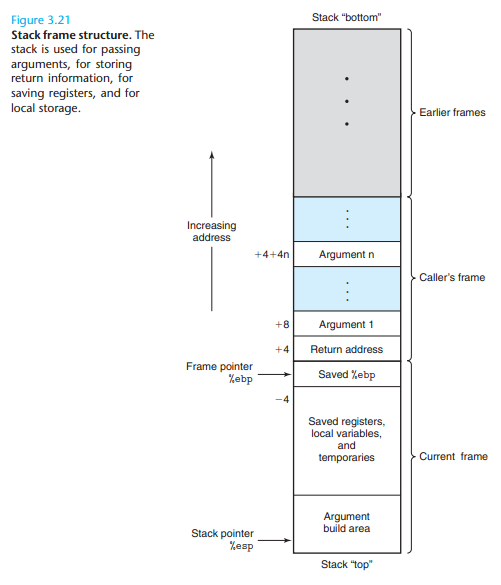
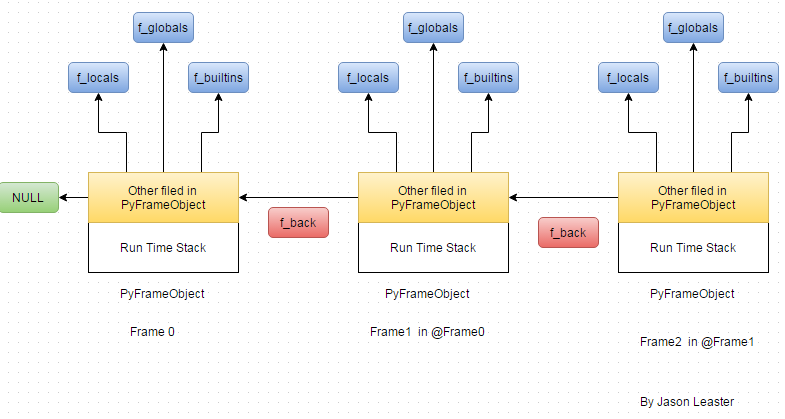
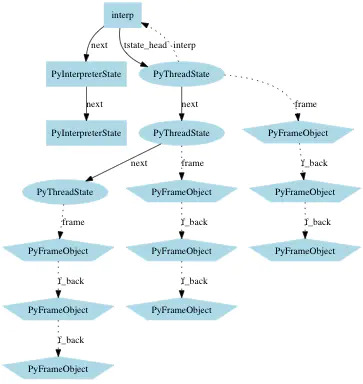

## 起源

python的起源！
1989，为了度过圣诞假期，Guido开始编写Python语言编译器。Python这个名字来自Guido的喜爱的电视连续剧《蒙蒂蟒蛇的飞行马戏团》。他希望新的语言Python能够满足他在C和Shell之间创建全功能、易学、可扩展的语言的愿景。
1991年，第一个python解释器诞生了！！它是用c语言实现的 并且能够调用c语言的库文件！！所以python也是全面向对象的！！
一句话讲 就是有一个牛人 为了打发无聊的时间 决定写一个新的解释程序，于是就在圣诞节这几天写了一个python的原型！写完之后用了一年时间优化，然后立即把代码开源出去，让全世界的程序员共同努力，打造了今天非常强大的语言--python

<!-- more -->


照片中这个人就是吉多，首先必须知道一句话 就是 人生苦短 我用python。这句话就是吉多讲的

## python的设计哲学

1，优雅（就是python的代码要写的工整，整齐）
2，明确（就是明确每一句代码要做的事情）
3，简单（就是让每一句代码都尽量的简单）
python中崇尚的是做一件事情只用一种方法，越简单越明确越好！！

## 优点

- 学习曲线低，非专业人士也能上手
- 开源系统，拥有强大的生态圈
- 解释型语言，完美的平台可移植性
- 支持面向对象和函数式编程
- 能够通过调用C/C++代码扩展功能
- 代码规范程度高，可读性强

## 领域

云基础设施 - Python / Java / Go
DevOps - Python / Shell / Ruby / Go
网络爬虫 - Python / PHP / C++
数据分析挖掘 - Python / R / Scala / Matlab
机器学习 - Python / R / Java / Lisp

数值计算工具：NumPy，SciPy；
符号计算工具：SymPy；
机器学习工具：Scikit-Learn，XGBoost，lightGBM，catBoost，PySpark；
深度学习工具：TensorFlow，PyTorch；
时间序列工具：FbProphet；
数据分析工具：Pandas；
地图分析工具：folium；
web开发工具：Django，Flask；
可视化工具：matplotlib；
图计算工具：networkx

## python版本

### python2

Python 2 发布于 2000 年年底，意味着较之先前版本，这是一种更加清晰和更具包容性的语言开发过程。而先前版本的 Python 应用的是 PEP (Python 增强协议)，这种技术规范能向 Python 社区成员提供信息或描述这种语言的新特性。

此外，Python 2 还包括了更多的程序性功能，包括能自动化地管理内存的循环检测垃圾收集器，增加了对 Unicode 的支持以实现字符的标准化，并采用列表综合的方式以在现有列表基础上创建列表。 随着 Python 2 的不断发展，更多的功能被添加进来，包括将 Python 的类型和类在 Python 2.2 版本中统一为一层。

Python 2.7 具有 Python 2 和 Python 3.0 之间的早期迭代版本的独特位置，它因为对许多具有鲁棒性的库具有兼容性，对于程序员而言一直是非常流行的选择。当我们今天讨论 Python 2 时，我们通常指的是 Python 2.7 版本，因为它是最常用的版本。
虽然 Python 2.7 和Python 3 有许多类似的功能，但它们不应该被认为是完全可互换的。虽然你可以在任一版本中编写出优秀的代码和有用的程序，但是值得了解的是，在代码语法和处理方面两者会有一些相当大的差异。

### python3

Python 3 被视为 Python 的未来，是目前正在开发中的语言版本。作为一项重大改革，Python 3 于 2008 年年末发布，以解决和修正以前语言版本的内在设计缺陷。Python 3 开发的重点是清理代码库并删除冗余，清晰地表明只能用一种方式来执行给定的任务。

对 Python 3.0 的主要修改包括将 print 语句更改为内置函数，改进整数分割的方式，并对 Unicode 提供更多的支持。

起初，Python 3的采用很缓慢，因为该语言不能向后兼容 Python 2，这就需要人们决定该使用哪个版本的语言。此外，许多封装库库只适用于 Python 2，但是由于 Python 3 背后的开发团队重申了终止对 Python 2 的支持，促使更多的库被移植到 Python 3 上来。从对 Python 3 提供支持的 Python 包的数量可以看出，Python 3 已得到越来越多的采用，在撰写本文时，支持它的包就已包括了 339 个最受欢迎的 Python 包。

## python流行

一、python这些年在编程语言排行榜上名次一直在上升，这个并不是偶然。python发展了几十年，中间好长一段时间无人问津，现在已经发展很成熟了，像新的语言go很多需要的包都没有，而python上各种包很多，用户开发不可能自己慢慢写包，直接调用包，快得多，有立杆见影的效果。

二、python可以工作的领域很多，一开始只是在linux上代替脚本使用，后来发现python可以做数据分析，后来又有人搞了web开发包，pyqt桌面开发包，数据库驱动，再后来发展出了人工智能，深度学习，gpu加速，这样python可以应用的范围就很广了，特别在服务器上，不像客户端那样需要安装，很多linux都内置了python。这样在服务器上python可以作用很大，性能不够时，可以用显卡等加速措施。

三、python是开源，像java，c#主要用于商业软件开发，大家都看不到其他人开发的源码，开发文档更是没有，而python天生就是开源运行代码，可按需修改，这样大家一共享，在市场上有n多包可以使用，形成了开源包文化，大家相互受益。这样学习时，可以调用大量的成熟的开源包，对开发就省事了很多，开源文化的共享，为python快速发展提供了基础。

四、python在工人智能领域，特别方便，很多开源的人工智能框架，都优先使用python，人工智能的学习成本很高，python刚好可以简化编程，像你学习用c++开发tensorflow会特别累，而用python的keras来开发tensorflow程序写得代码量很少，在初学级段，这很重要，必竟人工智能这几年才开始发展，发展速度很快，很多人需要学习这方面的入门技术。

五、欧美学习python历史悠久，以前中国把qbasic（vb)，这类语言做为计算机考级语言，这完全是害了大家，如果当年你学python，基于python的开源原因，基本上可以用一辈子，而qbasic，vb这种商业语言微软都打算放弃了。这样国家为了未来着想，也让人们学习python，而c语言太复杂，学会了基本语言，还需要学习计算机原理和操作系统知识，学习周期太长了，不适合做为大面积普及的编程语言。

六、python简学难精，入门容易精通难，编程语言都是这样，这样低手需要学习，高手也需要学习，大家都学，导致比较容易受到关注，如低手学基本语法，高手学机器学习，领域算法，可以学习的部分很多，这个语言的有很深的行业积累。python适合开发代码量并不大的程序，像工程化应用，功能复杂模块多，建议用java这种带静态检查的程序，很多代码问题能第一时间发展，通过模块化开发，可以隔离复杂度在整个系统中不扩散，如果用python组成团队开发大规模程序，像java那样，也是需要学习大量软件工程，计算机编程领域的各种技巧，实现分层，分模块，按协议标准开发。

七、python是很多领域的嵌入语言，如maya的脚本就是开源的，你做动画，可以用脚本来做很多工作，python可以方便植入到其他系统中，可以通过调用c/c++编译的动态链接库，来实现各种调用，也可以使用消息队列、通信、数据库等方法，很方便地和其他系统交互，如python可以和java一道工作在linux服务器上，这样需要学习的需求量增长了很多。

八、python运行速度是要慢一些，但现在的计算机性能过剩，运行常规程序你几时看到你的cpu跑满过（如果你的cpu经常跑满，赶紧看看是不是中毒或被挖矿了），运行python基本上不会有性能问题，就算有性能问题一般也是卡在io输入输出的速度上，也有的是算法本身设计的有问题，如果做计算密集型程序，可以使用gpu加速来实现，像深度学习的卷积神经网络，就是用的gpu加速来实现，这样python的速度就能提升上来了，你用c++幸苦写个算法，可能还没有python开启个gpu加速快，如果一个gpu不行，还有分布式集群gpu，这个是很多语言也很难实现的，用c++也可以实现，但是c++的开发成本特别高，根本不划算。

九、很超级实用的python包，导致了python的繁荣，python中像opencv的调用非常简单，像信号处理算法的调用类似matlab，而买个matlab很贵，像互联网公司，数据处理是在服务器，服务器都是开源linux的不要交版权费，python可以很方便地运行自动化运维工具，很多公司的云计算背后的胶水语言用的就是python。很多科学家，用python研究科学，如引力波程序就是python写的，像分析基因的很多程序也是python写的，这些科学家写程序主要是解决业务领域的问题，对计算机的原理并不想了解太多，而python的开箱即用，刚好满足他们的需求，发展出了科学分析，科学计算大量的包。

十、python语言以前是学校不教的，现在是开始全民学习python。由于科技发展的重要性与连续性，国家为了发展移动互联网，大数据，人工智能产业，在小学都编写了教材，实现人人编程，学习编程，这样可以更加深刻理解电脑，包括移动互联网的各个方面的技术也是基于电脑技术，未来各个产业需要信息化，网络化，对计算机的知识只会越来越高。而教育大众，python的简单入门就是很大优点，小孩子都能入门学习。如果你学会了编程，很多电脑知识学起来了就很容易了，根本不需要记忆具体内容，因为编程出来的软件都差不多，你看编程高手的计算机知识肯定比常人要高，这样对信息化的理解也是高于常人的。十一、python不需要知识产权费，是开放源代码的，美国现在开始对中国封锁科技，中国未来只有依靠开源软件才能突破重围，开源软件不属于某个国家，虽然开发人员可能某个国家占多数，但别人完全可以再换个名称来继续使用，如果你用封源软件，那天美国一封锁，你可能连安全补丁都打不了，像俄罗斯在gov，安全部门都是使用自己的操作系统，自己的cpu，这样美国一点办法都没有，安全性也大大加强，他们的操作系统是linux开源的修改版，这个源码是人人都可以修改的，软件一旦开源了，源码复制就非常简单，虽然在美国有软件专利一说，但在中国并没有软件专利相关申请，很多软件专利在国内并不认可，国内申请软件专利都是附带硬件申请的，未来尽量使用开源软件，就能避开这些陷阱，可能你那天成立个商业公司，有点规模（这些公司的名言是，羊要养肥了再宰），你使用商业软件可能别人就要找上门来问你要授权费（国内已经有很多家公司收到过这样的律师涵或电话摧要），这个可能是个定时炸弹，有的小公司就是这样倒闭的，便宜的软件每套要好几千上万，高级软件授权可能达到几百万上千万，很多公司利润很低根本没有这么多除钱来交这些，像国内互联网公司，他们都知道这些陷阱，所以清一色使用linux，全面使用开源软件，这样商业化使用能省下很多钱，省钱实际就是挣钱。如果全面使用开源软件，那么整个经济每年就要少交很多授权费，就能减少了整个经济运行的摩擦力，对个人可以促进就业，对公司有利于降低成本。

## python虚拟机

### pycodeobject

python将编译结果字节码存储到pyc文件中，事实上这个结论还不够全面。pyc中除了字节码还存储了很多python程序运行时信息包括定义的字符串、常量等。python的编译结果的的奥秘全部藏在PyCodeObject中，PyCodeObject是python中的一个命名空间(命名空间指的是有独立变量定义的Code block如函数、类、模块等)的编译结果在内存中的表示。

```
typedef struct {
    PyObject_HEAD
    int co_argcount;        /* #arguments, except *args */
    int co_nlocals;     /* #local variables */
    int co_stacksize;       /* #entries needed for evaluation stack */
    int co_flags;       /* CO_..., see below */
    PyObject *co_code;      /* instruction opcodes */
    PyObject *co_consts;    /* list (constants used) */
    PyObject *co_names;     /* list of strings (names used) */
    PyObject *co_varnames;  /* tuple of strings (local variable names) */
    PyObject *co_freevars;  /* tuple of strings (free variable names) */
    PyObject *co_cellvars;      /* tuple of strings (cell variable names) */
    /* The rest doesn't count for hash/cmp */
    PyObject *co_filename;  /* string (where it was loaded from) */
    PyObject *co_name;      /* string (name, for reference) */
    int co_firstlineno;     /* first source line number */
    PyObject *co_lnotab;    /* string (encoding addr<->lineno mapping) See Objects/lnotab_notes.txt for details. */
    void *co_zombieframe;     /* for optimization only (see frameobject.c) */
    PyObject *co_weakreflist;   /* to support weakrefs to code objects */
} PyCodeObject;
```

Python在真正执行的时候并不是面对的PyCodeObject对象，而是PyFrameObject对象，它包含静态的PyCodeObject和执行环境。

Python提供了获取当前栈帧的接口：sys._getframe()



```
typedef struct _frame {
    PyObject_VAR_HEAD
    struct _frame *f_back;  /* previous frame, or NULL */
    PyCodeObject *f_code;   /* code segment */
    PyObject *f_builtins;   /* builtin symbol table (PyDictObject) */
    PyObject *f_globals;    /* global symbol table (PyDictObject) */
    PyObject *f_locals;     /* local symbol table (any mapping) */
    PyObject **f_valuestack;/* points after the last local */
    /* Next free slot in f_valuestack.  
    Frame creation sets to f_valuestack.
    Frame evaluation usually NULLs it, but a frame that yields sets it
    to the current stack top. */
    PyObject **f_stacktop;
    ...
} PyFrameObject;

```



python虚拟运行时，对象创建和销毁的生命周期。

