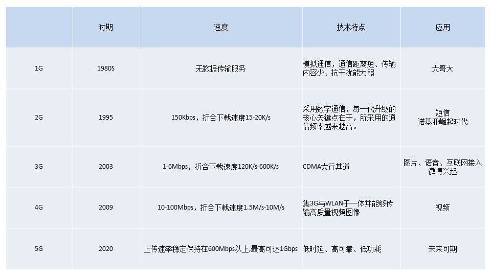
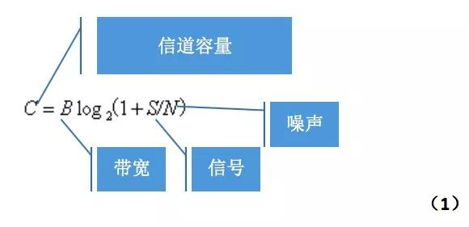
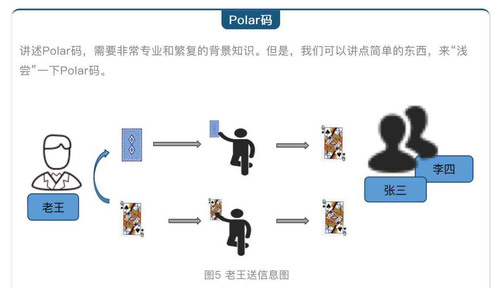
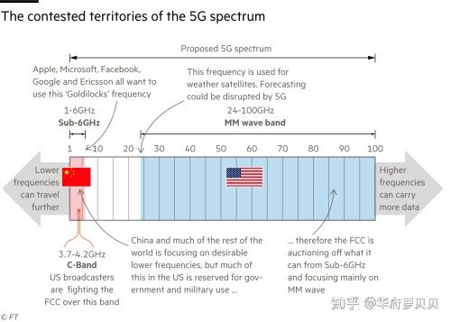
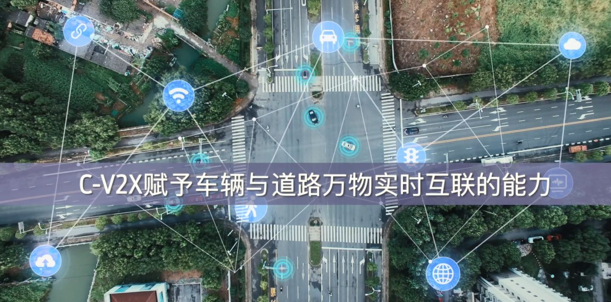

## 移动通信系统演进

在历代的移动通信技术中，统一标准的制定是最重要的。
我们现在都经常讨论的5G，其全称是“第五代移动电话行动通信标准”。我们都知道，通信业是典型的具有“网络效应”的行业。
如果每家公司都制定一个独立的通信标准，那互联互通就是一个很大的问题，就跟把几十个不同国家（都只会母语）的人凑到一起聊天一样，根本无法沟通。

设备之间要通信，需要有统一的编码规则，这个大家都遵从的规则就是通信标准。

<!-- more-->

### 1G时代

1G本来始于在二战期间美国的军方项目，1940年起，摩托罗拉深度参与这个军用的移动通信项目，这个通信设备在今天来看庞大笨拙，大概有5磅重，但是却实现了“收”和“发”在同一个终端上。摩托罗拉在20世纪80年代，引领了移动通信的商用时期。摩托罗拉制定的移动通信标准，也就是后来我们说的1G。

### 2G时代

在1G的民用时期，诺基亚开始提前布局，研发2G的通信设备和新的通信标准，并在90年代投入使用。
仅仅经历了10年，摩托罗拉便没有维持住自己的霸主地位，2G是诺基亚的主导时期。美国在2G时期有三个通信标准，互相竞争。中国当时也是有两种制式的：GSM和CDMA。而欧洲的通信运营商和设备商报团取暖，统一了一个通信标准，也就是GSM。通信行业是一个典型的网络效应很强的行业，统一的标准大大节约了兼容成本。这给了诺基亚一个反超的机会。

1G是模拟电路，2G是数字电路。在数字电路的应用下，一个小小的芯片就能替代模拟电路的几十个芯片，所以2G时代手机变小了，更加便携了。

### 3G时代

随着3G网络的覆盖，一代巨头诺基亚黯然离场。

苹果手机从起初看起来，只是一个大屏幕的手机，随着各种应用的开发，发现伴随着3G网络速率的提升，移动互联网有更大的空间，从方方面面改变每个人的生活。

操作系统之战以谷歌的安卓系统和苹果公司的 iOS胜出告终，塞班、黑莓、微软的视窗接连离场。开发者的开发成本被降低，这为移动互联网的飞速发展提供了便捷。2G时代，通信方式主要是打电话、发短信，无线上网速度非常慢。在3G时代，数据传输的速度提升了40倍。

### 4G时代

4G时代，依然是苹果一统天下，也成为了第二个突破万亿美金市值的公司（第一个是中石油）...
但同时，4G又给了一些新兴公司发展的机会，包括移动支付领域的支付宝和微信支付；设备商、终端商：华为和小米；移动互联网：字节跳动（头条、抖音）、滴滴打车、美团外卖、移动电商拼多多等等... ...

4G网络同时应用了互联网和电信网络的技术进步。刚才我们提到3G时期，语音和数据的传输网络是分开的，到4G才实现了真正的统一。这让4G的网络速度得到了大幅提升。4G的理论网速已经很快了，大部分的民用场景都够用了。
但4G还有一个硬伤：网络拥塞，4G网络的缺陷是万物互联的瓶颈。

### 5G时代

4G的网络拥塞是因为信息的传输率大于信道容量，那么第一个解决方案就是加大带宽。

5G的理论带宽是4G的20倍。这需要把频段范围扩大，频段向上扩展。但是问题又来了，频段越高，就越容易被障碍物影响，怎么办？把基站建得足够密才行，在4G时期每2-3公里建一个基站，在5G时期，则是在200-300米建一个基站。因为相对于4G时期1公里的覆盖范围，5G每个基站的覆盖半径大概只有一百多米。

这时，在每个基站覆盖半径从1km降低到100多米的情况下，每个基站的覆盖人数能减少两个数量级，这样拥塞的问题就解决了，而且给更多终端接入移动网络留下了空间，让未来的万物互联成为可能。

## 5G技术

作为一个老司机，你一定清楚，车要跑得快，路要宽，路面要平，油还要给足。同样，上网速度想提高，信号传输的通道要宽，噪声要小，信号功率还要大。但是，1948年以前，没有人能清楚地描述信号传输速率和通道宽度、噪声大小以及信号功率的关系。直到香农提出了信息论，给出了香农公式。

这公式形式简约，含义深远。C是单信道的信道容量，是指我们建立了一个单点输入、单点输出的通信通道（我们称为信道）后，这条通道每秒最多可以传送多少bit的信息量。B是信道的带宽，可以简单理解为分配给一个信道可用的频率范围的一半；S是传送信号的平均功率，而N则是噪声或者干扰信号的平均功率。从香农公式可知，对于单信道而言，要增加信道容量C，无非三种方式：或增加带宽B，或增加信号功率S，或减少噪声或干扰信号的功率N。

随着无线通信的发展，带宽也好，功率也好，这些资源只会越来越紧张，而空间中无线电的相互干扰也只会越来越大。怎么办？天无绝人之路。对于有多个输入和多个输出的信道而言，即使不改变以上三个条件，只要能保证该系统中的各输入源或输出源的信号可以彼此区分，就可以提高总的信道容量。

如果这个模型是无线电传输的，则信道的噪声N不会变化。信号总功率还定为S，每个信道各分一半，即S/2。可以提高信道容量，第五代移动通信，主要就是利用多输入与多输出技术（Multiple-Input Multiple-Output，MIMO）来提高信道容量。

对于无线通信而言，MIMO是指在基站上使用更多数量的天线。这当然就意味着在不增加频带和功率的情况下增加信道容量。
最能在直观上体现这种信道容量增加的，是波束赋形（beam forming）技术。无线电波是一种电磁波，和水波、声波一样，有相干现象。如果使用很多天线发射同样频率的电磁波，控制好发射的波的相位，就可以让这个信号向一个或几个特定的方向传播。这样的信号不仅能量集中，远距离传输时功率也不会急剧降低，还可以区分不同的空间位置。利用这种区分度，也就相当于建立了更多的信道。

非正交复用技术（NOMA）是指利用某种资源差异（比如接收功率差异、空间位置差异等）来区分不同接收手机的收发信号的技术。由于这些手机和基站之间使用的是同一个频道，只通过资源差异做一定区分，这在通信技术上意味着无法划出独立的信道，所以叫“非正交”。最成熟的NOMA方式是利用功率差异。

信道容量，是理论上的一个极限值，被称为香农极限（Shannon limit）。

真实的通信过程，要接近极限并不容易。为了对抗信道中的干扰，我们必须对要传递的信息进行编码。这样一来，在大多数情况下，即使传送的信号由于受到干扰而在到达目的地时出错，我们也能根据出错情况把原始信息恢复出来。比如，在干扰不太严重时，我们把同样的码传上3遍，然后3判2，一般就能恢复信息。当然，这样编码的效率非常低，浪费了信道的容量。而一个好的编码，不但要能克服噪声或者干扰，其中用来克服干扰的信息位数还要足够少，这样才有可能接近香农极限。

2008年，Gallager的学生，土耳其毕尔肯大学的Erdal Arikan教授提出了Polar码。由于大家的关注点都在LDPC码上，所以他的发现在欧美厂商那里受到了冷遇。

隔壁老王要给张三传递消息，但又不想让李四知道，怎么办？他就想到用纸牌来送消息，牌面朝上表示明天有空，朝下表示明天忙。但是，老王碰到了两个麻烦。一个麻烦是，附近有个小孩总会在张三、李四不在时来翻牌，会有40%的可能把牌翻个面（如图5，小孩把第一张牌翻了面）。另外有个麻烦是，李四多次观察，已经知道了纸牌正面和反面的含义。于是，老王决定用两张牌，第二张牌的含义还跟原来一样，正面表示有空，反面表示忙，但第一张牌则用来跟张三进行事前约定，约定两张牌的牌面是相同还是相反。通过这样的方法，老王认为他既能更好地对抗小孩的干扰，也能防止李四猜准结果。请问，老王的办法靠谱吗？信息论回答我们，靠谱！先看李四碰到的情况。如果李四直接通过第二张牌来判断老王是否有空，那么准确率只有60%。这个准确率还能不能再提高呢？比如，李四可不可以先猜猜老王事先跟张三的约定是什么？如果老王决定两张牌同面和反面的概率各为50%，那么，通过概率论计算，李四推断出约定内容的可能性最多为52%。如果他想在此基础上再推断牌面的准确含义，也就是想同时猜准约定的内容和老王是否有空，那么结果只会更糟，只有36%的可能猜对。总的看来，还不如直接用第二张牌的6成把握算了。再说张三。比如图5中的情况，既然事先约好了牌面相反，张三一看牌面相同就知道被小孩动过手脚，便会直接根据第二张牌推断，准确性即6成；但是，假设张三碰上的是牌面相反的情况，那么，通过概率论计算，他判断的准确率将一跃至69%，比60%高了不少。总结起来，我们可以认为张三占了好信道，好的时候准确率高达69%；而李四占了烂信道，他不像张三能提前知道老王的约定，他猜对约定内容的准确率只有52%。这个概率着实不高，因为我们都知道，李四就算乱猜其实也有50%的机率猜对。信道分了好和烂，就是极化（Polarization），也就是两极分化的意思。所谓极化码的编码技术，就是以一种比较复杂的嵌套方式，并使用足够多的牌，通过老王的约定，最后产生非常严重的信道极化。可以从数学上证明，只要有足够多的牌，李四到最后啥也猜不到；而只要张三事前知道了足够多的约定内容，那么再严重的小孩干扰，都挡不住老王传递的每一个信息。当然，小孩干扰的情况越轻，需要的约定越少。

## 5G之争

中美之间的5G之争，其实是5G标准之争。

5G可以被理解为高传输速率、大量单次信息和极低响应时间的通讯网络。但5G的真正前景不在于速度，而是利用这些优点，进行技术开发的能力。

具体而言，上一代网络连接通常是为消费者设计的。但5G却是为机器之间对话而设计的。
5G网络可以连接数十亿个传感器，机器人和自动驾驶汽车，在他们之间不断地相互传送大量数据，并且运用大数据实现技术飞跃。5G的可以实现机器和机器之间的高速对话，因此，5G对行业，国家安全和人类福利具有革命性的意义，也成为了主要的国际政治战场。

事实上，在中国开发的5G的同时，美国也一直在进行5G开发。
但是美国的开发一直大幅落后于中国，这主要因为中国和美国在开发时采用了不同的频段。
中国开发的5G系统采用了6GHz以下频段。但是美国的6GHz以下频段已经划定为国防频段，商业禁止使用。想要国防部更换频段显然费钱费时费力，几乎不可能。因此，美国的5G开发只能使用24GHz至300GHz之间的高频。高频段需要的基站间距更小，并且容易在使用过程中造成信号折损，这对于美国地广人稀的农村地区非常不经济。

另起炉灶去开辟全新的难度更大更费钱的高频段5G是导致美国5G开发速度远远落后于中国的主要原因之一。

中美之间的5G之争，不仅对未来的技术创新之争，也是未来行业标准和频段之争。双方都希望吸纳更多国家加入使用自己的频段和技术标准。

基于频段问题，美国当然不希望自己在欧盟北约的军事行动使用的通讯频段与当地民用撞车，这会使美国盟军的军事行动情报合作陷入高风险。因此才竭力要求自己的军事盟友们一定要放弃华为而选择美国的高频段标准。

另外美国之所以阻止其他国家使用华为5G，除了担心自身的全球影响力减弱，最主要的担心是华为的设施对中国政府开放后门，使中国有能力监视和控制其他国家.

而为什么美国政府反应如此迅速果断，就是因为曾经的美国政府就是那么做的。

## 5G应用

5G网络主要有三大特点，

- eMBB增强型移动互联网：enhanced Mobile Broadband，顾名思义就是大带宽的移动互联网，当前4G移动网络的最快下行速度为100Mbps左右；5G将提高到平均1Gbps，峰值20Gbps的水平。
- mMTC：海量物联网连接：massive Machine Type Communications，支持海量设备接入网络，并可在设备之间直接进行通信，单位面积内接入设备数量将比现在提升至少10倍。
- uRLLC: 高可靠低时延通信：ultra Reliable Low Latency Communications，将通信的延时降低到毫秒级，提高传输的可靠性和实时性，除了降低游戏延时，也能为远程的精确控制提供支持

### 高速率

5G可以说是站在巨人的肩膀上，依托4G良好的技术架构，5G可以比较方便的在其基础之上构建新的技术。未来的5G愿景最强烈的一个方面就是用户体验到的网络速率。4G现在已经很快了，但是还不够，5G要做到的目标是最大10Gbps（defined by METIS)。

现在的移动网络工作在相对较低的频段，低频段的好处的是传播性能优越，可以使运营商用较少的成本（少量基站）达到很好的覆盖。但是有一点不足就是低频段的连续频率资源非常宝贵，在国外各大运营商会通过竞标的方式购买频段的使用权，而在我们国家是政府分配。在4G LTE中单个载波最大的频率范围是20MHz，通过载波聚合技术可以将多个非连续的载波合起来使用达到更高的速率，但是这样还依然不够。5G的一个特点就是高频，受限于高频的传播性能，所以很多的高频段频率资源没有被使用，这正是5G可以好好利用的资源。但是如何解决高频通信的传播问题呢？这就轮到大规模天线（massive MIMO）登场的时候了，高频资源的频率很高，波长就很短（毫米波），那么在天线设计的时候可以做到天线阵子和他们之间的距离很小，就可以在很小的范围内集成天线阵列。天线阵子数量的增加可以带来额外的增益，结合波束赋形，波束追踪技术以弥补高频通信在传播上的受限。

    高速上传下载
    3D视频，4K甚至8K视频流的实时播放
    结合云技术，工作，生活和娱乐全都交给云
    AR，VR与游戏生活相结合
    Media everywhere 改变媒体传播的方式

### 大容量

物联网这个话题最近几年来一直占据着热门，但是受限于终端的功耗以及无线网络的覆盖，广域物联网仍处于萌芽的状态，伴随着5G网络的出现，可以预见未来它必将大热。
功耗问题是困扰着物联网技术发展的最大障碍，因为物联网的节点太多，而且由于很多条件的限制，终端没有办法充电，只有通过初次装入电池，寄希望于终端自身能够节省电能，使用越久越好。为了解决这个问题3GPP专门推出了针对广域物联网的窄带物联网技术，通过限定终端的速率（物联网终端对通信的实时性一般不高），降低使用带宽，降低终端发射功率，降低天线复杂度（SISO），优化物理层技术（HARQ，降低盲编码尝试），半双工使终端的耗电量降低。而5G还会在这个基础上走得更远，通过降低信令开销使终端更加省电，使用非正交多址技术以支持更多的终端接入。

    物联网
    智慧城市
    智慧家居
    智慧电网
    智能放牧，种植
    物流实时追踪

### 低时延高可靠

LTE网络的出现使移动网络的时延迈进了20ms的关口，使对实时性要求比较高的应用如游戏，视频，数据电话成为可能。而5G网络的出现，将会使时延降到更低1ms，会为更多对时延要求极致的应用提供生长的土囊。

    远程医疗手术
    远程驾驶
    车联网自动驾驶
    工业控制

Cellular Vehicle-to-Everything，X代表一切可能，to代表connect to。是一种基于蜂窝移动通信技术（4G、5G）的车联网应用——将汽车与交通场景中的其他车辆、行人、交通标志、信号灯等对象通过移动网络进行连接，让交通的所有参与者能实时进行信息的交换，有效提升交通的效率和安全性。在其子应用中，与其他车（Vehicle）通信称为V2V，与行人（Pedestrian）通信称为V2I，与基础设施（Infrastructure）称为V2I。

## 参考链接

[5G入门科普](https://zhuanlan.zhihu.com/p/41182443)
