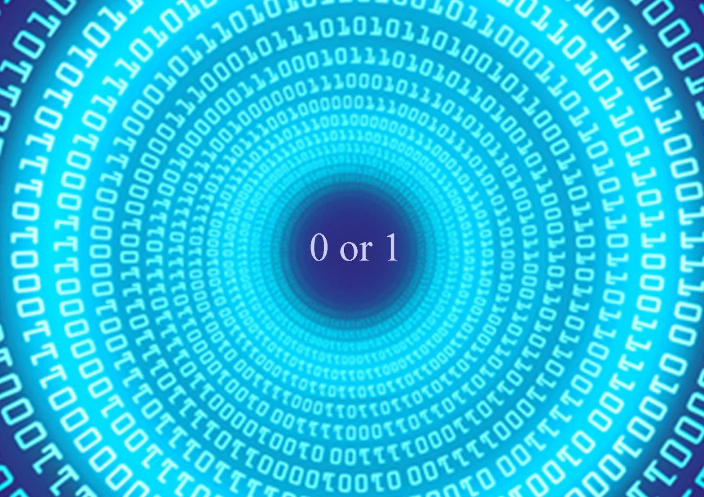
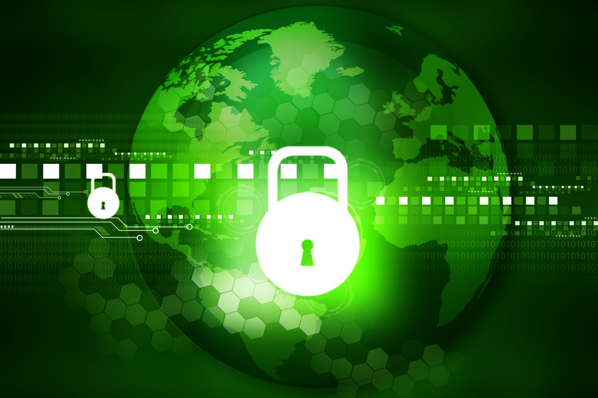

## 物理学的四次革命

我们在探索自然的过程中，会发现很多奇妙的现象，我们也发展了很多漂亮的理论来解释这些现象。随着发现越来越多，也会有越来越多的理论。这时，我们就想把这些不同的理论统一起来，得到一个更加全面更加深刻的理论，用它来理解更多的现象。物理学就是这样在“发现、统一、再发现、再统一”的循环中，一次又一次登上人类认知的巅峰。

<!-- more -->

每一次大统一，都代表一次物理革命，都给我们带来一个新的世界观，使我们以全新的眼光来看世界。这一新眼光就像为瞎子赋予视觉，展示了一个全新的景象。每次物理革命带来的认知的角度是如此之新，连我们描写自然的语言都必须是全新的，所用的数学也都是全新的。可以说，每次物理革命都给我们带来了脱胎换骨的升华。

第一次物理学革命是牛顿的力学革命。 牛顿统一了两个似乎毫不相关的自然现象：夜空中行星的位移和地面上苹果的坠落。他用万有引力和力学理论统一地解释了这两个很不同的现象。更重要的是，他提出了一个世界观来理解万物：所有物质都是由粒子组成的，而这些粒子的运动满足牛顿方程。这使得牛顿力学成为理解万物的普适理论。当牛顿发展他的理论时，描写这个理论的数学语言还没有发明。牛顿不得不又当一个数学家，发展了这一套数学理论——微积分。这是最高层次的发现和创新。牛顿既做物理学家又做数学家，非常不容易。

第二次物理革命是麦克斯韦的电磁革命。它把电、磁和光这三种看起来很不相同的物理现象给统一起来了。麦克斯韦先统一了电和磁，发明了麦克斯韦方程。他发现麦克斯韦方程的波动解——电磁波的波速——和当时测的光速差不多。于是，麦克斯韦又提出电磁波就是光，把电、磁和光都统一了。第二次物理革命更加本质的地方在于发现了一种新的物质形态：波形态物质。和牛顿的粒子形态物质不同，波形态物质运动不是由牛顿方程来描写，而是由麦克斯韦方程来描写的

第三次革命是爱因斯坦的相对论革命。爱因斯坦指出，引力作用其实来源于时空的扭曲。在更深的层次上，相对论革命发现了第二种形态物质——引力波。引力波不是别的，就是时空扭曲的波动。引力波的运动也不是由牛顿方程来描写的，而是由爱因斯坦方程描写。

从此以后，我们认为世界上有两种形态的物质：粒子形态物质和波形态物质。粒子形态物质之间的各种相互作用是由各种波形态物质所引起的。描写波形态物质的理论，麦克斯韦理论，爱因斯坦广义相对论及其后来的一个推广——杨-米尔斯理论，也需要一个新的数学语言——纤维丛理论——来描写。纤维丛理论描写了时空本身和时空上的场的几何扭曲。其后，这种以几何眼光看世界的理论就成为理论物理的主流。

第四次物理革命应该是量子革命。量子力学是非常非常深刻的革命，也是最具有颠覆性的物理革命。但它不是一个人搞出来的，而是一大群人的共同成果。量子革命给我们带来了最深刻的变革，它统一了粒子形态物质和波形态物质。它告诉我们，我们世界的真实物质只有一种形态：波粒形态。也就是说物质的存在形式又是粒子，又是波；又不是粒子，又不是波。这篇文章我们将着重介绍这种不可思议的存在形式，介绍我们世界中的存在为什么有如此诡异的性质。

作为一个全新的理论，量子力学的数学基础是线性代数，把微积分、纤维丛这些几何分析理论给扔掉了，由几何变成了代数。所以说量子力学之后，我们开始以代数的眼光来看世界。这是一个全新的眼光，它所带来的变革，目前还在继续发生与深化。

## 量子、台阶、离散

一个首当其冲的问题是，什么是量子？这个词虽然看起来有些抽象，但实际的意思却很简单，可以解释为“离散变化的最小单元”。比如我们登台阶时，只能上一个台阶、两个台阶等，而不可能上半个台阶、1/3个台阶等，这就是一种离散的概念，一个台阶就相当于一个量子。

在微观世界里，很多物理量都是离散变化的，这是微观世界的一种本质特征。例如，氢原子中电子的能量只能取一个基本值（-13.6电子伏特）或者它的1/4、1/9、1/16、1/25等等，但不能取其2倍或1/2、1/3。准确地描述微观世界的物理学理论就是量子力学。

宏观物体是由微观粒子组成的，所以要准确描述宏观世界，原则上也必须用量子力学。牛顿力学只是量子力学在宏观条件下的一个近似理论，又被称为经典力学。在后文中，我们将会看到在某些问题中经典结果和量子结果的对比。读者只要记住“如果两个结果不一致，量子总是对的，经典总是错的”，就差不多了。

## 新旧量子论

量子力学的起源是在1900年，普朗克（Max Planck）在研究“黑体辐射”问题时，第一次发现必须把某个物理量当作离散变化的，在黑体辐射中这个物理量是辐射携带的能量。在此基础上，爱因斯坦（Albert Einstein）、玻尔（Niels Henrik David Bohr）、德布罗意（Louis Victor de Broglie）等人后来提出了许多重要的概念，大大扩展了量子力学的应用范围。

有趣的是，爱因斯坦获得诺贝尔物理学奖，是因为他在解释光电效应时提出了光量子理论，而不是因为相对论。上述这些科学家的工作被后人称为“旧量子论”，因为，虽然屡经扩展，这些理论却仍然是一堆智慧的碎片，缺乏统一的数学框架，对稍微复杂一点的体系就无法定量处理了。

1925年，这种状况被海森堡（Werner Karl Heisenberg）的工作所改变，他使用矩阵的数学语言，第一次给出了一套能够精确描述任何微观现象的理论。过了没多久，薛定谔（Erwin Rudolf Josef Alexander Schrödinger）用微分方程的数学语言给出了另一套理论，很快又证明了两种理论是等价的。从那以后，人类更深一步地了解了微观世界的奥秘，进而创造了不计其数的奇迹。

## 量子力学

### 叠加

比特是计算机科学的基本概念，指的是一个有且仅有两个可能的状态“0”和“1”的体系，这类似于硬币的正、反两个面。但在量子力学中，情况出现了本质的不同。量子力学有一条基本原理叫做叠加原理：如果两个状态是一个体系允许出现的状态，那么它们的任意线性叠加也是这个体系允许出现的状态。

那么，什么叫做“状态的线性叠加”呢？为了说清楚这一点，最方便的办法是用一种数学符号表示量子力学中的状态，就是在一头竖直一头尖的括号“|>”中填一些表征状态特征的字符。在量子信息中，经常把两个基本状态写成|0>和|1>。而|0>和|1>的线性叠加，就是a|0> + b|1>，其中a和b是两个常数。这种符号是狄拉克（Paul Adrien Maurice Dirac）发明的，称为狄拉克符号。叠加原理说的是，如果一个体系能够处于|0>和处于|1>，那么它也能处于任何一个a|0> + b|1>。后面在讨论第二大神秘“测量”的时候，我们会看到，对a和b唯一的限制就是它们的绝对值的平方和等于1，即|a|^2 + |b|^2= 1。

叠加原理乍看起来完全和常识相反。假如用|0>代表你正在北京喝茶，|1>当作你正在巴黎喝茶，那么(|0> + |1>)/√2就意味着你同时处于北京与巴黎喝茶！这种状态怎么可能存在呢？但量子力学的一切实验结果都表明，叠加原理是正确的，是一条必不可少的基本原理。至少在微观世界的应用中，科学家对叠加原理充满信心。一个电子确实可以同时位于两个地方。至于宏观世界里为什么没见过一个人同时位于两处，那是另一个深奥的问题，相当于著名的问题“薛定谔的猫”。

为了更方便地理解这个概念，我们可以把一个量子力学的状态理解成一个矢量，实际上狄拉克符号|>正是为了让人联想到矢量而设计的。在一个由这些态矢量组成的平面上，|0>和|1>定义了两个方向，相当于两个坐标轴上的单位矢量。在|a|^2 + |b|^2 = 1的条件下，a|0> + b|1>就是任何一个从原点到半径为1的单位圆上一点的矢量。看清楚这个几何图象，我们立刻就明白，单位圆上任何一点的地位都是相同的，没有一个状态比其他状态更特殊，可谓“众生平等”。

现在来定义两个状态，|+> = (|0> + |1>)/√2和|-> = (|0> - |1>)/√2。它们相当于|0>和|1>都向一边旋转45度。如果把|+>和|->当作基本状态，用它们的线性叠加来表示所有的其他状态，同样是可行的。取一组矢量，如果其他所有的矢量都能表示成这组矢量的线性叠加，那么这组矢量就叫做“基组”。|0>和|1>构成一个基组，|+>和|->也构成一个基组，这样的基组有无穷多个。

### 测量

在经典力学中，测量固然是一种重要的操作，但我们并不会认为测量过程跟其他过程服从不同的物理规律。可是在量子力学中，测量跟其他过程确实有本质性的区别，描述量子力学中的测量要用与众不同的物理规律！关于量子力学的许多著名的争论，如“薛定谔的猫”、多世界理论，都是由测量造成的。我们在这里不拟详细讨论这些争论，而是直接给出绝大多数科学家接受的共识。

量子力学中的测量，特殊在哪里呢？首先，一次测量必须对应某个基组。不同次的测量可以改变基组，比如说这次用|0>和|1>，下次用|+>和|->，这是允许的，但你每次必须说清当前用的是哪个基组。然后，在|0>和|1>的基组中测量a|0> + b|1>（a和b都不等于0），会使这个状态发生突变，变成|0>和|1>中的某一个。我们无法预测特定的某次测量变成|0>还是|1>，能预测的只是概率：以|a|^2的概率得到|0>，|b|^2的概率得到|1>。由于只可能有这两种结果，所以这两个概率相加等于1，这就是前面所说的|a|^2 + |b|^2 = 1的来源。

这种内在的随机性是量子力学的一种本质特征。在经典力学中，一切变化都是有确定原因的，同样的原因必然要导致相同的结果，而量子力学却不是。

### 纠缠

在经典力学中，我们如何描述一个两粒子体系的状态？我们会说，粒子1处于某某状态，粒子2处于某某状态。在量子力学中，有些两粒子体系的状态也可以用这种方式来描述，例如常用狄拉克符号|00>表示两个粒子都处于自己的|0>态，|01>表示粒子1处于|0>态，粒子2处于|1>态，|11>表示两个粒子都处于自己的|1>态。在数学上，把这样的状态称为两个单粒子状态的“直积”，就是直接相乘的意思。我们还可以用直积来定义两个粒子都处于自己的|+> =(|0> + |1>)/√2态的状态，即|++> = [(|0> + |1>)/√2] [(|0> + |1>)/√2] = (|00> + |01> + |10> + |11>)/2。看起来，直积态已经能表示所有的多粒子态了，但是这不对，事实并非如此！

1935年，爱因斯坦、波多尔斯基（Boris Podolsky）和罗森（Nathan Rosen）提出了一个思想实验，后人用他们的姓名首字母称为EPR实验。先让两个粒子处于|β00>态，这样一对粒子称为“EPR对”。然后把这两个粒子在空间上分开很远，可以任意的远。然后测量粒子1。如果你测得粒子1在|0>，那么你就立刻知道了粒子2现在也在|0>。好比成龙电影《双龙会》中有心灵感应的双胞胎，一个做了某个动作，另一个无论有多远都会做同样的动作。而最重要的问题是，既然两个粒子已经离得非常远了，粒子2是怎么知道粒子1发生了变化，然后发生相应的变化的？EPR认为两个粒子之间出现了“鬼魅般的超距作用”，信息传递的速度超过光速，从而违反了狭义相对论。所以，看来量子力学肯定有“问题”。

这个问题非常深邃。不过量子力学有一个标准回答：处于纠缠态的两个粒子是一个整体，绝不能把它们看作彼此独立无关的，无论它们相距有多远。当你对粒子1进行测量的时候，两者是同时发生变化的，并不是粒子1变了之后传一个信息给粒子2，粒子2再变化。所以这里没有发生信息的传递，并不违反相对论。

EPR现象既然是一个真实的效应，而不是爱因斯坦等人以为的悖论，人们就想到利用它。现在EPR对成了量子信息中最有力的工具。对此我们只能说，深刻的错误超过浅薄的正确，伟人连错误都是很有启发性的！

现在科学家们认为，纠缠是一种新的基本资源，其重要性可以和能量、信息、熵或任何其他基本的资源相比。但目前还没有描述纠缠现象的完整的理论，人们对这种资源的理解还远不够深入。有人把纠缠比喻为“青铜时代的铁”，它可能会在下一个历史时代大放异彩。

### 对量子态的变换

前面说了这么多，都是对量子态的描述，还没有回答另一个基本问题：如何把一个态变成另一个态？对这个问题的回答倒是不神秘：所有的可逆变换都是可以实现的。用线性代数的术语说，可逆变换就是“酉变换”，不过在下文中我们不使用这个术语。

在可逆变换中，信息没有损失。例如对两粒子体系，有一个对换操作，把两个粒子的状态对换，即把|ab>变成|ba>。如果这个操作连续进行两次，就回到了最初的状态，例如|01>变成|10>，又变回了|01>。

测量也能改变量子态，但它是不可逆的，会丢失信息。例如对处于|+> =(|0> + |1>)/√2态的一个粒子，在|0>和|1>基组下测量，第一次测量得到|0>，那么后面你再做多少次同样的测量，体系都一直保持在|0>，再也不可能回到|+>态了。在经典力学的实验中，随便在哪里进行一次测量都没有关系。但在量子力学的实验中，在某个地方进行一次测量会造成不可逆的后果（不一定是有害的），所以一定要仔细设计，确保由此得到的结果对实验的目的有利。事实上，量子信息的许多应用都用到了测量操作。

### 量子信息的优势

量子信息跟经典信息相比有很大的优势。经典比特的0和1只有两个状态，量子比特的a|0> + b|1>却有无穷多个状态，这是一个显而易见的优势。还有一个稍微复杂一点的优势。一个包含n个经典比特的体系，总共有2^n个状态。想知道一个变换在这个n比特体系上的效果，需要对这2^n个状态都计算一遍，总共要2^n次操作。对n个量子比特的体系，却有一个巧妙的办法。使所有量子比特都处于自己的|+>态，那么整个体系的状态是|++…+> = (|00…0> + |00…1> + … + |11…1>) /2^(n/2)，0和1的所有长度为n的组合都出现在其中。对这个叠加态做一次操作，所有2^n个结果都会产生出来！

## 量子信息的应用

### 量子钞票

设想一家银行在钞票上印一个|0>和|+>的量子比特序列，除了银行外没有人知道这个序列是什么，那么这种钞票是无法伪造的。为什么呢？一个用户拿到一张钞票，与银行联系，银行告诉它量子比特的序列。然后他对|0>的位置在|0>和|1>的基组下测量，必然得到|0>，对|+>的位置在|+>和|->的基组下测量，必然得到|+>，这样就确认了钞票的真实性。

假如有一个人拿到这张真钞后企图复制一张伪钞，在银行不告诉他真实状态的情况下，他只能自己做测量来尝试知道哪些位置是|0>，哪些位置是|+>。但一旦他对|0>用了|+>和|->的基组，或者对|+>用了|0>和|1>的基组，就有一定的概率产生不应该有的|1>或|->。随着量子比特序列的长度增加，这个概率无限趋近于100%，所以造假者会以接近100%的几率暴露其面目。

### 超密编码

有两个粒子处于前述的EPR态|β00> = (|00> + |11>)/√2，甲乙两人各持有一个粒子。现在甲想要传给乙一个两位的经典信息（即00、01、10或11这四个字符串中的一个），却只允许他传一个量子比特，他能做到吗？回答是：能。

做法是这样的。如果想传00，甲什么都不用做。如果想传01，甲就对手里的粒子做一个变换，使整个体系变成|β01> = (|00> - |11>)/√2。如果想传01，甲就对手里的粒子做另一个变换，使整个体系变成|β10> = (|01> + |10>)/√2。如果想传11，甲就对手里的粒子做另一个变换，使整个体系变成|β11> = (|01> - |10>)/√2。做完这个变换后，甲把手里的粒子交给乙，现在乙有了这两个粒子的整体。所有这四个态|β00>、|β01>、|β10>和|β11>都是EPR对，或者称为贝尔态。它们构成一个双粒子态的基组，称为贝尔基组。乙在贝尔基组下对两个粒子做一次测量，确认是哪一个EPR对，就知道了甲要传的是哪个二比特信息。

当然，这里用到了两个量子比特，但甲从来都没有和乙手里的粒子打交道。关键在于，仅仅对自己手里的粒子做一次操作，就能使双粒子状态从一个贝尔态变成另一个贝尔态。

前面说过，一个量子比特潜在地具有很大的信息量。到底是多大呢？超密编码说明，在某种意义上，一个量子比特相当于两个经典比特，能够以一当二！

### 因数分解

所谓因数分解，就是把一个合数分解成质因数的乘积，例如21 = 3 × 7。因数分解是数学中的经典难题。有人也许会问，这有什么难的？分解21当然轻而易举，但分解2^67 - 1 = 147,573,952,589,676,412,927呢？这是个18位数。直到1903年，人们才发现它是一个合数，等于193,707,721 × 761,838,257,287。

让我们想想，如何分解一个数字N。最容易想到的算法，是从2开始，一个一个地试验能否整除N，一直到N的平方根为止。如果N用二进制表示是个n位数，即N约等于2^n，那么尝试的次数大约就是2^(n/2)。位数n出现在指数上，这是非常糟糕的情况，因为指数增长是一种极快的增长，比n的任何多项式都更快。举个例子，2^(n/2)比n的10000次方增长得还要快。

在计算机科学中，把计算量指数增长的问题称为不可计算的，把计算量多项式增长的问题称为可计算的。当然，你可以寻找效率更高的算法。对于因数分解，“从2开始一个一个试”并不是最聪明的算法。在经典计算机的框架中，目前最好的算法叫做数域筛，计算量是exp[O(n^(1/3) log^(2/3)n)]（在数学中，大写字母O后面跟一个式子，表示结果跟这个式子具有同等的数量级），虽然有些改进，但仍然是指数增长。如果计算机一秒做10^12次运算，那么分解一个300位的数字需要15万年，分解一个5000位的数字需要50亿年！

由此可以看出因数分解的一个特点：它的逆操作，即找两个质数并算出乘积，是非常容易的；而它本身，却是非常困难的。这种“易守难攻”的特性，使它在密码学中得到了重要的应用。现在世界上最常用的密码系统叫做RSA加密算法，这个名字是三位发明者李维斯特（Ron Rivest）、萨莫尔（Adi Shamir）和阿德曼（Leonard Adleman）的首字母缩写。RSA是一种公开密钥密码体系，它的密钥是对所有人公开的。为什么敢公开？因为解密需要知道这个密钥分解成哪两个质数，而发布者有信心别人在正常的时间段内解不开。

但是这种状况要被量子计算改变了。前面说过，量子计算相对经典计算有潜在的巨大优势，只是实现这种优势需要聪明的算法设计，只有对极少数问题能够设计出这样的算法。而因数分解，就是这样的问题之一。1994年，肖尔（Peter Shor）发明了一种量子算法，把因数分解的计算量大幅减少到O(n^2 logn loglogn)，指数式地加快！在这里我们只举两个例子表明它的威力。同样还是分解300位和5000位的数字，量子算法把所需时间从15万年减到不足1秒钟，从50亿年减到2分钟！

如此重大的变化，足以令密码人员陷入恐慌。但实际上还没有，人们仍然在淡定地用着RSA。为什么呢？因数分解的量子算法只是理论，真要实现它还需要很多努力。

如前所述，量子计算的实验非常难做。第一次真正用量子算法分解质因数是在2007年实现的，把15分解成3 × 5。有两个研究组同时做出了这个实验，一个是中国科学技术大学的潘建伟和陆朝阳等人，一个是澳大利亚布里斯班大学的A. G. White和B. P. Lanyon等人。此后各国科学家不断努力，使用种种办法推向前进。目前分解的最大的数是143 = 11 × 13，是由中国科学技术大学的杜江峰和彭新华等人在2012年实现的，他们把肖尔算法改进成了量子绝热算法。所以，密码人员仍然可以照常工作，但必须时常关心量子计算的进展。不定什么时候，全世界的密码体系就必须彻底更新换代了！

### 量子搜索

设想有一部杂乱无章的N个人名的花名册，其中的人名没有按照任何特别的顺序排列，你想在其中找到一个特定的名字，如“张三丰”，怎么办呢？在经典框架下，最好的算法就是老老实实地从头看到尾。如果运气好，第一个就找到了；运气不好，到最后一个即第N个才找到。平均而言，这需要N/2次操作。

1996年，格罗弗（Lov Kumar Grover）提出了一种全局搜索的量子算法。如前所述，量子计算机能在一次操作中遍历所有的条目。但如果我们只做一次操作然后去做测量，就只有1/N的概率得到正确结果，所以这没有用处。但如果我们做了一次操作后不做测量，再做另一个操作，就会使正确结果的概率增大一些。把这种操作重复√N次，就会使正确结果的概率达到一半。把整个过程再重复几次，就可以以非常接近100%的概率找到所需的条目。量子搜索付出的代价是结果不再是完全确定的，但好处是计算量从O(N)下降到了O(√N)，而不确定程度可以随需求任意减少。

因子分解的量子算法对经典算法是指数级的改进，把不可计算变成了可计算。量子搜索对经典搜索却只是平方级的改进，没有发生质的变化，仍然是不可计算。但是这个改进已经非常大了。如果N等于一亿，这就是一万倍的节约。一类问题不可计算的意思，并不是完全不能计算，而是在问题的尺度大到一定程度后才算不动。量子搜索带来的计算量下降，可以使“在实际条件下能够计算”的问题范围大大增加。由于全局搜索是非常常见而重要的问题，所以量子搜索的重要性并不逊于量子因数分解，甚或犹有过之。

### 量子隐形传态

量子隐形传态是1993年设计出来的一种实验方案，把粒子A的未知的量子态传输给远处的粒子B，让粒子B的状态变成粒子A最初的状态。请注意，传的是状态而不是粒子，两个粒子的空间位置都没有变化。好比A处有一辆汽车或一个人，不是把这辆汽车或这个人搬到B处，而是把B处本来就有的一堆汽车零件或原子组装成这辆汽车或这个人。

很多人认为隐形传态可以瞬间把人传到任意远的地方，而且超过光速，推翻相对论。很遗憾，这个理解又是错误的。量子力学中状态的变化确实是瞬时的，但是隐形传态的方案中有一步是把一个重要的信息（可以理解为一个密码）从A处传到B处，利用这个信息才能把B粒子的状态变成目标状态。这个信息需要用经典信道传送，例如打电话、发邮件，这一步的速度不能超过光速，所以整个隐形传态的速度也不能超过光速。

也有人以为隐形传态是先扫描出A处的物或人的状态，再在B处组装一个相同的物或人。事实也并非如此。如果要先知道目标状态，那还有什么意思？隐形传态是在不知道A粒子的状态的情况下，把B粒子变成这个状态！就像送快递，不知道送的是什么东西，但保证原原本本地送到。

总而言之，量子隐形传态是以不高于光速的速度、破坏性地把一个粒子的未知状态传输给另一个粒子。打个比方，用颜色表示状态，A粒子最初是红色的，通过隐形传态，我们让远处的B粒子变成红色，而A粒子同时变成了绿色。但是我们完全不需要知道A最初是什么颜色，无论A是什么颜色，这套方法都可以保证B变成A最初的颜色，同时A的颜色改变。

量子隐形传态的基本思路是这样：让第三个粒子C跟B组成EPR对，而C跟A离得很近，跟B离得很远。做一个操作，改变C的状态，于是B的状态也发生了相应的变化。这时A和C这个两粒子集合的状态有四种可能，即四个贝尔态。B的状态也相应地有四种可能，每一种可能都跟A最初的状态有一定程度的相似之处，可以通过某些量子力学的操作变成目标状态。对A和C的整体做一次测量，A和C就随机地突变到了四个贝尔态中的某一个上，相当于得到了一个两比特的字符串，00、01、10或11，B也突变到了相应的状态。把这个两比特的字符串通过经典的通讯手段（比如电话、光缆）告诉B那边的人，对B按照密码进行操作，就得到了A最初的状态。在某种意义上，可以把量子隐形传态理解为超密编码的逆操作，都是一个量子比特和两个经典比特的交换，区别只是交换的方向。

第一次实现量子隐形传态是在1997年，当时潘建伟在奥地利因斯布鲁克大学的塞林格（Anton Zeilinger）教授门下读博士，他们在《自然》上发表了一篇题为《实验量子隐形传态》（“Experimental quantum teleportation”）的文章，潘建伟是第二作者。这篇文章后来入选了《自然》杂志的“百年物理学21篇经典论文”，跟它并列的论文包括伦琴发现X射线、爱因斯坦建立相对论、沃森和克里克发现DNA双螺旋结构等等。

2015年，潘建伟、陆朝阳等人在《自然》上发表了《单个光子的多个自由度的量子隐形传态》（“Quantum teleportation of multiple degrees of freedom of a single photon”），新的成果是“多个自由度”。这项成果被英国物理学会评为2015年十大物理学突破之首。

什么是自由度呢？自由度就是描述一个体系所需的变量的数目。例如在数学中确定一条线上一个点的位置，只需要一个数，自由度就是1。定位一个面上的一个点，无论用直角坐标、极坐标还是任何其他的坐标系，都需要两个数，自由度就是2。同理，定位三维空间中的一个点，需要三个数，自由度就是3。在物理中描述三维空间中一个运动的粒子，确定位置需要3个数，确定速度又需要3个数，所以自由度是6。光子具有自旋角动量和轨道角动量，如果你看不懂这两个词，没关系，只要明白它们是两个自由度就够了。在1997年的实验中，传的只是自旋角动量。此后人们传输过多种体系的多种自由度，但每次实验都只能传输一个自由度。

传输一个自由度固然很厉害，但是只具有演示价值。隐形传态要实用，就必须传输多个自由度。这在理论上是完全可以实现的。打个比方，现在用颜色加形状来表示状态，A粒子最初是红色的正方形，我们通过隐形传态让B粒子变成红色的正方形，同时A变成绿色的圆形。这个扩展看似显而易见，但跟传输一个自由度相比，有极大的技术困难。隐形传态需要一个传输的“量子通道”，这个通道是由多个粒子组成的，这些粒子纠缠在一起，使得一个粒子状态的改变立刻造成其他粒子状态的改变。用量子力学的术语说，这些粒子处于“纠缠态”。让多个粒子在一个自由度上纠缠起来已经是一个很困难的任务了，而要传输多个自由度，就需要制备多粒子的多个自由度的“超纠缠态”，这更加令人望而生畏。潘建伟研究组就是攻克了这个难关，搭建了6光子的自旋-轨道角动量纠缠实验平台，才实现了自旋和轨道角动量的同时传输。

### 量子密码

这是迄今唯一接近实用化的量子信息应用。虽然只有这一个，但这一个就具有极高的军事和商业价值，足以证明各国对量子信息的大力投入是物有所值的。许多人把量子密码跟量子隐形传态混为一谈，其实它们完全是两回事，而且在实现的难度上相差甚远。在许多语境下，“量子通信”这个词指的就是量子密码，也就是量子保密通信。

前面说到目前最流行的密码体系是RSA，它的可靠性是以因数分解的困难性为基础的。量子密码的基本出发点与它不同，不是基于任何数学运算的困难性，而是基于物理原理。因此，量子计算的进步会使RSA岌岌可危，量子密码却不会被任何技术进步攻破。这么好的东西，原理究竟是什么呢？

其实很简单。制备若干个处于|β00> = (|00> + |11>)/√2态的EPR对，每一个EPR对都让甲乙两人（在文献中常称为Alice和Bob）各拿一个粒子。甲通过掷骰子产生一个序列，掷出正面时就在自己粒子的|0>和|1>基组中做测量，掷出反面时就在自己粒子的|+>和|->基组中做测量。乙通过掷骰子产生另一个序列，也是掷出正面时就在自己粒子的|0>和|1>基组中做测量，掷出反面时就在自己粒子的|+>和|->基组中做测量。请注意，(|00> + |11>)/√2 = (|++> + |-->)/√2，所以这个EPR对不但在测量粒子1的|0>和|1>态时必然使粒子2变成相同的状态，也在测量粒子1的|+>和|->态时必然使粒子2变成相同的状态。

掷完骰子，做完测量后，甲乙两人通过公开的经典信道把自己的骰子序列传输给对方。有些地方骰子序列不同，两人做的是不同基组下的测量，那就把这些测量结果扔掉，只留下那些相同基组下测量的结果。这样就得到一串0和1的序列。由于|β00>这个纠缠态的性质，两人的序列必然是完全相同的。而且这个序列还是完全随机的，在测量之前无法预测，每次重新生成也都会不同。这正是密码学中“一次性便笺”的思想。

为了应对可能的窃听者，甲乙两人在相同基组下测量的结果中又随机地挑一些公布，和对方的结果对比。一旦发现有一个不同的，就说明有人在窃听，因为窃听是一种测量，必然会改变系统的状态。随着对比的位数增多，窃听者会以趋近于100%的几率暴露无遗。

通过反窃听的检验后，两人把序列中剩下的部分作为密钥。这时他们可以放心，这个密钥没有任何别人知道。然后他们用任何经典的方法传输信息，电话也好，电子邮件也好，光缆也好，甚至平信，都可以。唯一的特别之处，只是用量子密钥对信息进行了加密，对方收到后用同一个量子密钥解密。

量子密码有多种实现方案或者称为协议，以上所述是其中的一种“EPR协议”。各种协议的基本思想是一样的，都是利用量子力学的内在随机性，在物理层面上排除被破解的可能性。如果说因数分解的量子算法是最强的矛，量子密码是最强的盾，那么请问，以子之矛攻子之盾，谁胜？答案是：盾胜！

有趣的是，研究量子密码的紧迫性跟量子计算的进展有关。等到可以破解RSA的量子计算机实用化时，量子密码必然成为各国的不二选择。

### 量子卫星

量子科学实验卫星是干什么的呢？量子保密通信的理论是欧美科学家提出的，而在实验方面是中国科学家领先。最初只能在不到1米的距离内传输，现在已经超过了200公里。近年来纪录不断刷新，而创造纪录的几乎全都是中国科学技术大学的研究组。但目前都还是在地面上的光缆中传输。下一个问题就是，能不能在太空与地面之间的自由空间中传输？这就是量子科学实验卫星要实验的首要科学问题。

不但如此，量子卫星还可以进行更多的量子信息实验。它包括4个有效载荷：量子密钥通信机、量子纠缠发射机、量子纠缠源、量子试验控制与处理机。现在，你明白这些词都是什么意思了吧？卫星采用的是平台和载荷一体化设计，体积不大，重量只有数百公斤。

量子卫星发射，标志着中国的量子通信产业化迈出一大步。中国首先创造一个新的产业，丛人类进入现代社会以来还是第一次。中国的高铁现在做到了世界第一，但日本早就有新干线了。华为在通信领域做到世界第一，但通信行业也早已存在。只有量子通信，在国际上是没有先例的，所以这个中国首创的产业历史意义非常重大。现在中国的发展已经到了要以科技创新为核心的阶段。潘建伟、郭光灿、杜江峰等科学家的业绩，是时代的最强音。

## 参考链接

[波和粒子的统一]([波和粒子的统一](https://zhuanlan.zhihu.com/p/60404130)
[从量子力学到量子卫星](https://zhuanlan.zhihu.com/p/22306837)
