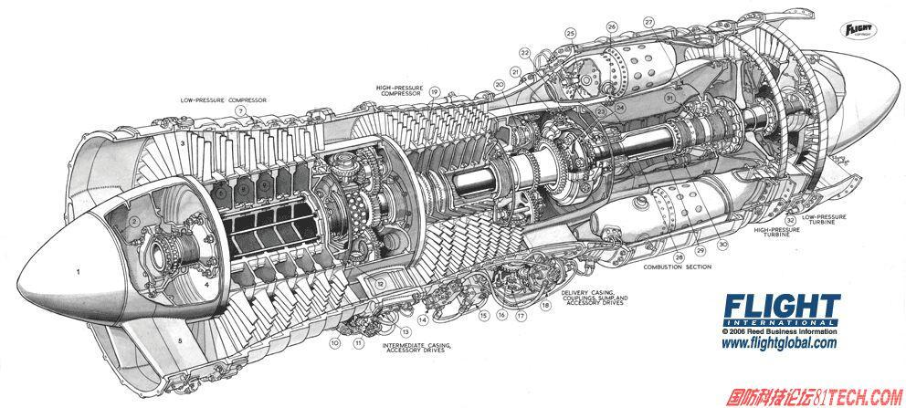
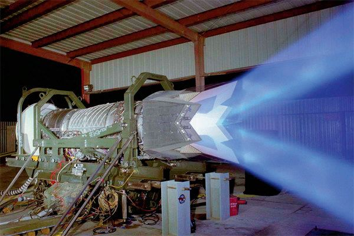
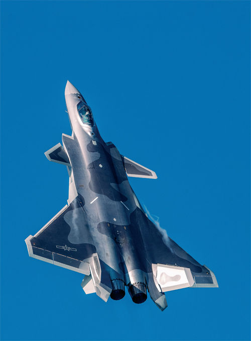

## 航空发动机

航空发动机（aero-engine）是一种高度复杂和精密的热力机械，作为飞机的心脏，不仅是飞机飞行的动力，也是促进航空事业发展的重要推动力，人类航空史上的每一次重要变革都与航空发动机的技术进步密不可分。
经过百余年的发展，航空发动机已经发展成为可靠性极高的成熟产品，正在使用的航空发动机包括涡轮喷气/涡轮风扇发动机、涡轮轴/涡轮螺旋桨发动机、冲压式发动机和活塞式发动机等多种类型，不仅作为各种用途的军民用飞机、无人机和巡航导弹动力，而且利用航空发动机派生发展的燃气轮机还被广泛用于地面发电、船用动力、移动电站、天然气和石油管线泵站等领域。

<!-- more -->

进入21世纪，航空发动机正在进一步加速发展，将为人类航空领域带来新的重大变革。传统的航空发动机正在向齿轮传动发动机、变循环发动机、多电发动机、间冷回热发动机和开式转子发动机发展，非传统的脉冲爆震发动机、超燃冲压发动机、涡轮基组合发动机，以及太阳能动力和燃料电池动力等也在不断成熟，这些发动机的发展将使未来的航空器更快、更高、更远、更经济、更可靠，并能够满足更加严格的环保要求，并将使高超声速航空器、跨大气层飞行器和可重复使用的天地往返运输成为现实。

在世界上所有的机械设备中，航空发动机毫无疑问是最为复杂的一种，它被誉为现代工业的“皇冠”，而在航空发动机的所有零部件中，涡轮叶片是其关键部件，也被誉为“皇冠上的明珠”。

## 矢量发动机

任何技术都有其发展过程，推力矢量技术亦是如此。传统的战斗机采用气动舵面控制，当飞行迎角过大时，气动舵面失效，飞机就会面临失速的危险。20 世纪 40 年代，采用推力矢量技术控制飞机的概念被提出，之后推力矢量发动机应运而生。推力矢量发动机与常规发动机的不同之处在于：它不仅能够为飞机提供前进的推力，而且还可以通过喷管的转向，实现推力方向的偏转。相比只能提供轴向推力、不直接参与飞机控制的常规发动机，采用推力矢量喷管的发动机可以弥补或取代飞机的气动舵面，并直接参与到对飞机的控制，这将显著提高战斗机的飞行性能。

推力矢量技术（Thrust Vector Control）是一项涉及航空航天技术、控制技术、计算流体力学等学科的复杂技术，为了使得这项复杂的技术得以付诸实现，科研人员展开了漫长的探索，并不断在推力矢量技术领域取得新突破。20 世纪 70 年代，德国 MBB 公司著名飞机设计师沃尔夫岗·赫尔伯斯博士结合未来空战对空中格斗的要求，提出利用偏转装置改变发动机尾喷流的方向来提高飞机的机动性能，即推力矢量控制技术。1985 年，美国国防高级技术研究计划局（DARPA）和西德梅塞施密特集团联合开展了有关推力矢量技术的可行性研究。1990 年 3 月，美国罗克韦尔公司、波音公司和德国 MBB 公司共同研发的试验研究飞机 X-31 出厂，该机在发动机尾喷管装有可改变推力方向的 3 块碳纤维复合材料舵面，顺利完成了试飞，其舵面可相对发动机轴线偏转±10 度，在迎角为 70 度时仍然能够操作自如，具有良好的过失速性能。

目前主要研究的推力矢量类型按矢量推力产生方式可分为外推力矢量和内推力矢量。

外推力矢量凭借安装在发动机喷管或飞机尾部结构名为「燃气舵」的偏转构件改变喷流方向，该方法的优势在于结构较为简单，推力矢量容易实现;但缺点是气动损失大，结构破坏飞机气动外形。在喷流转向时，气流偏转角度远低于燃气舵偏转角度，因此该结构仅适用于推力矢量技术的试验论证，并不适用于实际使用的战机。

内推力矢量依靠控制发动机喷管转向，也被称为推力矢量喷管。

### 矢量发动机与普通发动机的区别

敏捷性，提高飞机的格斗能力，这个大部分网友都知道，但是敏捷性也要包括短距离起降概念，这个很多人不知道了。矢量技术早期研究后今后的一个发展目的，就是短距离起降。其实英国“鹞”式垂直起落飞机的飞马发动机就是一种原始的喷流矢量技术。

减重和增推，这个大部分人不理解，发动机功率大，对飞机飞行有好处，但是同时发动机会更沉，而飞机的控制系统和控制气动力平面会更大更多，导致飞机更重，用了矢量发动机，能减轻这个结构重量，能用相对小推力的发动机解决更大的问题，这个概念和导弹的燃气舵相通。

隐身的增益效果，美国人搞F22时认为，结构隐身重要，
外形隐身也很重要，而减少外形中飞控气动力平面的数量和面积是最佳捷径，装上矢量发动机的喷口，可以有效减少飞控面的数量，对隐身起到好处

矢量喷口的一大难点，是发动机的推力对结构和材质的摧残，飞机发动机的推力和破坏力是很大的，这样说吧，在一米左右的距离，一部普通的大推力航空发动机不用加力，就能轻松的吹翻一辆大卡车，这样的推力被强制改变方向，那矢量喷口的结构强度和材质没有绝对的值是做不到的。矢量发动机尾喷口还有一个技术难点就是如何能长期有效的工作，因为要改变喷流就要面对高温高速燃气，耐热材料要过关。其次热胀冷缩的缘故，机械动作的可靠性也是一个问题，在正常温度范围内运行可靠的机械机构，放在高温高压下，就未必了，物理性质的变化会对可靠性造成影响，而耐热耐变形性能不好的材料，长时间后会造成部件变形，导致不能正常工作。

中国在矢量发动机上属于追赶型的国家，欠账很多，目前在集中攻克WS15的核心技术瓶颈。这也是将来计划作为J20动力的主要选项。我国的J20面临的发动机推力问题，和发动机适配性问题，所以一开始并没有上矢量。实话讲我国对矢量的研究起步不晚，尤其是导弹上的各种矢量，水平还是极高的。但是涡扇上的，限于过去的发动机推力不行，所以一直是以跟进、低水平验证为主，并没有像美苏等那样，在70年代就开始筹划专业的矢量试飞型号。近年来研究资金到位了，开始集中发力，不过钱有了不代表就水到渠成，这种高精尖技术是需要撞墙试错，还有多年的实验积累

## 双发重型隐形战斗机歼-20

1997 年，台海曾密布的战云刚刚散去不久，距亚洲万里之外的美国天空之上，首次起飞了世界第一架第五代战斗机：被称作「猛禽」的 F-22。这架造型优美的铁鸟，在其 F119-PW-100 低涵道比「加力涡扇发动机」仿佛能撕裂天空般的尖锐鸣叫中，宣告属于它的空中霸主时代到来。

被中国军迷亲切称为「爱芙娘娘」的 F-22 首飞的同一年，成都飞机工业集团 611 所里，以杨伟总设计师为首的工程师团队也默默开始了中国第五代战斗机的立项工作。首架歼-20 技术验证机于 2009 年制造成功，并于 2011 年 1 月在成都黄田坝军用机场实现首飞，在 2016 年 11 月珠海航展上向全世界做出了成功展示。

从此，中国继美国之后，也拥有了自主知识产权的第五代战斗机，从空军大国迈进了世界顶尖的空军强国之列。

世界上有谱的五代机只有5款，美帝的娘娘（F22），肥电（F35），俄罗斯的t50（苏57），中国的J20，J31（FC31）

只有实现 4S 的战斗机才能被称作第五代战机（按俄国标准为第五代，美国标准为第四代），4S 即：Stealth（隐身性）;Super Sonic Cruise（超音速巡航）;Super Maneuverability（超机动性）;Superior Avionics for Battle Awareness and Effectiveness（超信息化）。

歼-20 在全世界第五代战机中已经坐稳了三甲位置，基本可以满足突防第二岛链的设计初衷。

其实，我们仔细分析一下，就发现这个4S其实并不客观，其中除了隐形之外，其它的3s都可以在四代或者四代半战机上实现或者说已经实现。超音速巡航，指的是在发动机不开加力的情况下实现超音速飞行。超机动性，这个指标无法量化，这个机动性指的究竟是盘旋能力？加速能力？还是过失速机动？或者是指的超音速状态下的机动性？很多三代机都在这些超机动性能上有自己的特长。超感知能力，这个就更难以评判了，指的大概是有源相控阵雷达以及光电分布孔径系统等传感器所以，你很容易就能发现，所谓的4S，除了隐形之外的其它3S，都不是五代机独有的绝活。四代机安装一个大推力的矢量发动机加上各种传感器一样可以实现超音速巡航、超机动性、和超感知能力。相反，某些五代机比如F35在超音速巡航和超机动性上却缺乏亮点，而F22没有安装光电分布孔径系统，自己都满足不了美国自己提出的4S。所以，下次如果有人再跟你说J20满足不了美国人提出的4S标准，你就可以打他的脸了。看五代机，最重要的指标还是隐身。隐身性能主要指的是雷达和红外低可探测性，实现这一点主要靠以下几个方面，一是机身的设计，要对雷达波有良好的折射和散射率，减小机体正前方的RCS。二是机体材料，比如复合材料的使用，能有效提高关键地方的透波能力（但是注意，复合材料占比率并不是越高越好）。三是隐身涂料，隐身涂料的作用是吸收雷达波转化为热能。四是减少红外辐射。

## 铼

铼，是一种极为稀有的金属元素。这种超级金属比钻石还珍贵。铼在地壳中的含量约为十亿分之一，仅仅大于镤和镭。这种金属熔点为 3180 ℃，是仅次于钨（3308 ℃）的第二难熔金属，而且它不形成固定矿物，通常与其他金属伴生，是自然界最后被发现的稀有元素。

除高熔点外，铼还有强度高、塑性好等特点，因此，在高温、急速冷却或急速升温并同时有剧烈机械冲击和振动等极端恶劣的条件下，它也能够长时间工作，抵御变形和开裂。此外，特殊的电子构型使铼及其化合物都具有优异的催化活性。

铼的这些特性使得它很快进入了科学家们的视野，并在工程界得到了大量运用。航空发动机工作时温度达1600多度，唯有铼不会被熔化。

## 航发公司

美国通用电气航空集团，通用电气，英文简写GE，是世界上最大的综合性动力和设备制造商，像世界上单台引擎推力最强的民航发动机GE90、最优越的民用引擎CF6-80C/E、最强大的涡轮轴发动机CT7-8系列都是GE的杰作，使用广泛的波音737使用的CFM56发动机也是GE牵头研发的。

英国罗尔斯·罗伊斯公司是欧洲最大的航空发动机企业，最著名的产品是军用和民用航空发动机。它是全球第二大军用发动机和第二大民用发动机制造商。同时，作为大型豪华公务飞机生产商湾流公司的主要发动机提供商，罗尔斯·罗伊斯占据着全球1300架湾流公务机中的大部分发动机市场。遄达是罗尔斯·罗伊斯公司迄今发展的推力最大、性能最好的大涵道比民用涡扇发动机。波音787、空客A380、空客A330等均使用遄达系列发动机。罗尔斯·罗伊斯大有超越通用电气(GE)航空的趋势。 [13] 

美国普拉特·惠特尼公司是全球航空航天和建筑业高科技产品和服务供应商——美国联合技术公司的一个分公司，是知名的军用发动机、直升机用发动机及民用发动机制造商，其生产的发动机以军用为主，在军用领域一直保持着强大的竞争力。 [13] 
普拉特·惠特尼是美国主力战机F-22和F-35的唯一动力供应商。其中，用于F-22先进战斗机的F119发动机是世界上第一种带二元推力矢量喷管的战斗机发动机。在民航方面，普拉特·惠特尼也毫不逊色。其中，PW4000系列从1984年投入使用，一直延续到现在，不同衍生型号的发动机推力不断增加，也是著名的发动机“常青树”。中国支线客机新舟60飞机使用的就是普拉特·惠特尼公司生产的涡桨发动机。

## 参考链接
