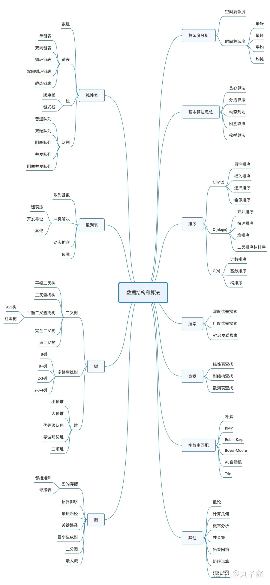
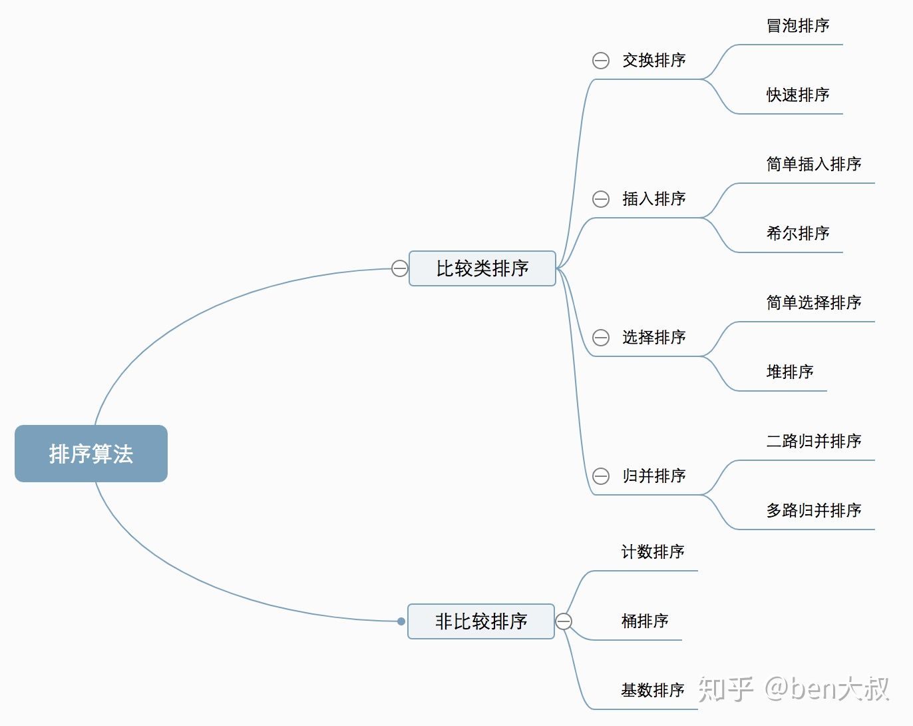
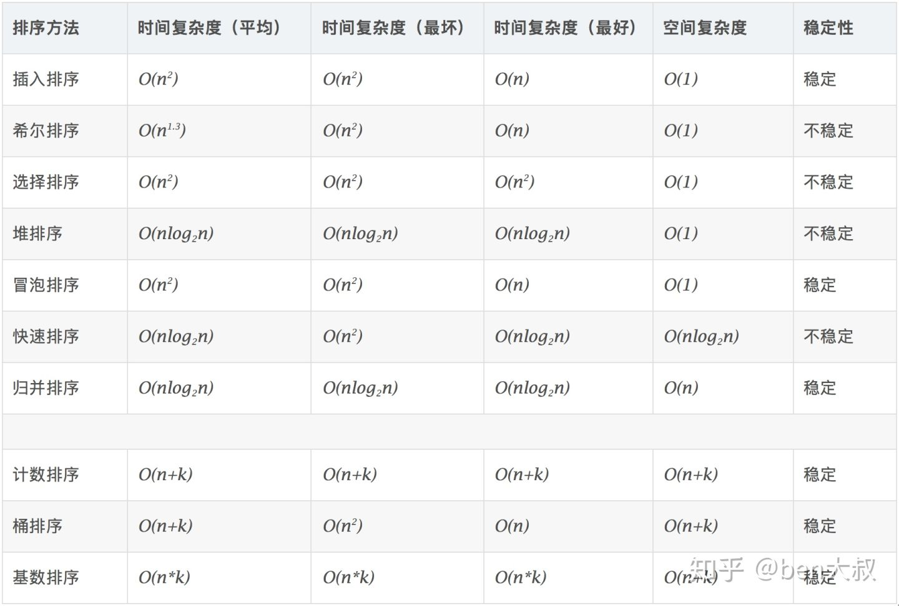
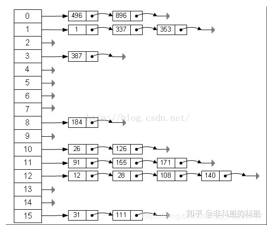
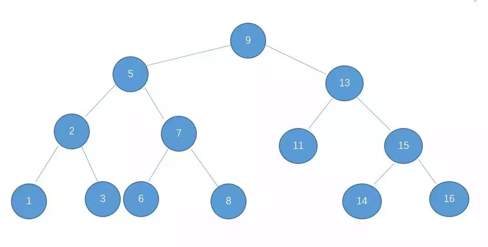
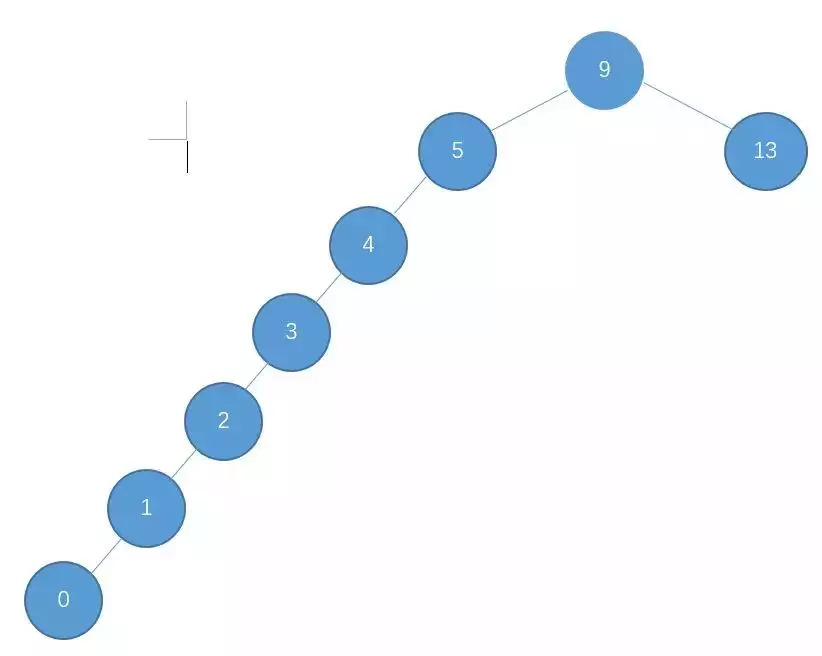
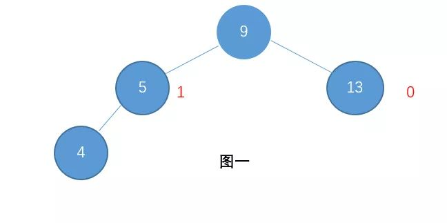
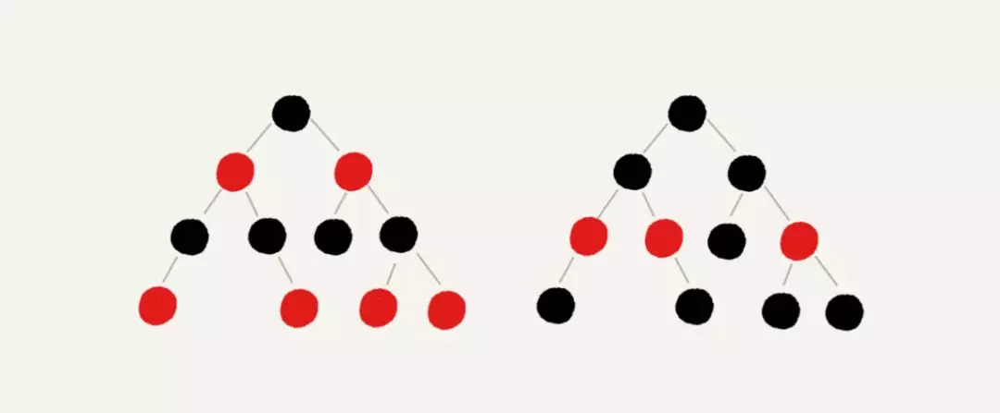
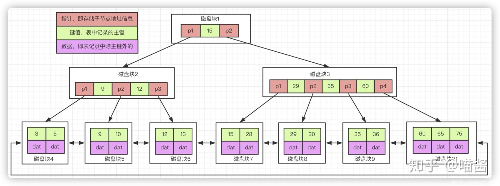
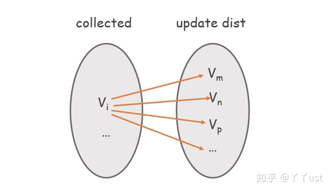

算法思想：

二分搜索 Binary Search 
分治 Divide Conquer 
宽度优先搜索 Breadth First Search 
深度优先搜索 Depth First Search
回溯法 Backtracking 
双指针 Two Pointers 
动态规划 Dynamic Programming 
扫描线 Scan-line algorithm
快排 Quick Sort数据结构部分

<!-- more -->

## 排序

比较类排序：通过比较来决定元素间的相对次序，由于其时间复杂度不能突破O(nlogn)，因此也称为非线性时间比较类排序。
非比较类排序：不通过比较来决定元素间的相对次序，它可以突破基于比较排序的时间下界，以线性时间运行，因此也称为线性时间非比较类排序。

## 哈希

“散列表（Hash table，也叫哈希表），是根据键（Key）而直接访问在内存存储位置的数据结构。也就是说，它通过计算一个关于键值的函数，将所需查询的数据映射到表中一个位置来访问记录，这加快了查找速度。这个映射函数称做散列函数，存放记录的数组称做散列表。哈希表操作的时间复杂度为0（1），这是它的一个重要优点。

哈希算法的特点：
（1）不同的信息，理论上得到的hash值不同，我们称之为“无碰撞”，或者发生“碰撞”的概率非常小。
（2）不可逆，hash算法是单向的，从hash值反向推导出原始信息是很困难的。所以，有些系统中，我们可以使用hash算法对密码进行处理后保存。

### hashmap

哈希表是基于哈希函数的，哈希表中的元素是有哈希函数确定的，哈希表作为一种数据结构，我们用哈希表来存储数据，在保存的时候存入的是一个<key—value>的结构，value由哈希函数作用于key上得到。但是存在一个哈希冲突问题，那就是当你用hash函数作用在两个互不相同的key上，得到的value值相等。

### 哈希碰撞（hash collision）的解决方式

拉链法

## 二叉书/平衡树/红黑树/B树

### 二叉树

二叉查找树的特点就是左子树的节点值比父亲节点小，而右子树的节点值比父亲节点大。

基于二叉查找树的这种特点，我们在查找某个节点的时候，可以采取类似于二分查找的思想，快速找到某个节点。n 个节点的二叉查找树，正常的情况下，查找的时间复杂度为 O（logn）

之所以说是正常情况下，是因为二叉查找树有可能出现一种极端的情况:

这种情况也是满足二叉查找树的条件，然而，此时的二叉查找树已经近似退化为一条链表，这样的二叉查找树的查找时间复杂度顿时变成了 O(n)，可想而知，我们必须不能让这种情况发生，为了解决这个问题，于是我们引申出了平衡二叉树。

### 平衡二叉树

平衡二叉树就是为了解决二叉查找树退化成一颗链表而诞生了，平衡树具有如下特点

1、具有二叉查找树的全部特性。
2、每个节点的左子树和右子树的高度差至多等于1。

平衡树基于这种特点就可以保证不会出现大量节点偏向于一边的情况了。

于是，通过平衡树，我们解决了二叉查找树的缺点。对于有 n 个节点的平衡树，最坏的查找时间复杂度也为 O(logn)。

### 红黑树

虽然平衡树解决了二叉查找树退化为近似链表的缺点，能够把查找时间控制在 O(logn)，不过却不是最佳的，因为平衡树要求每个节点的左子树和右子树的高度差至多等于1，这个要求实在是太严了，导致每次进行插入/删除节点的时候，几乎都会破坏平衡树的第二个规则，进而我们都需要通过左旋和右旋来进行调整，使之再次成为一颗符合要求的平衡树。

显然，如果在那种插入、删除很频繁的场景中，平衡树需要频繁着进行调整，这会使平衡树的性能大打折扣，为了解决这个问题，于是有了红黑树，红黑树具有如下特点：

1、具有二叉查找树的特点。
2、根节点是黑色的。
3、每个叶子节点都是黑色的空节点（NIL），也就是说，叶子节点不存数据。
4、任何相邻的节点都不能同时为红色，也就是说，红色节点是被黑色节点隔开的。
5、每个节点，从该节点到达其可达的叶子节点是所有路径，都包含相同数目的黑色节点。

正是由于红黑树的这种特点，使得它能够在最坏情况下，也能在 O(logn) 的时间复杂度查找到某个节点。至于为什么就能够保证时间复杂度为 O(logn)，我这里就不细讲了，后面的文章可能会讲。

不过，与平衡树不同的是，红黑树在插入、删除等操作，不会像平衡树那样，频繁着破坏红黑树的规则，所以不需要频繁着调整，这也是我们为什么大多数情况下使用红黑树的原因。

不过，如果你要说，单单在查找方面的效率的话，平衡树比红黑树快。

所以，我们也可以说，红黑树是一种不大严格的平衡树。也可以说是一个折中发方案。

### B树

B*-tree是B+-tree的变体，在B+树的基础上(所有的叶子结点中包含了全部关键字的信息，及指向含有这些关键字记录的指针)，B*树中非根和非叶子结点再增加指向兄弟的指针；

B*树定义了非叶子结点关键字个数至少为(2/3)*M，即块的最低使用率为2/3（代替B+树的1/2）。

通常数据库索引使用B+树

## 图

图是数据结构中重要内容。相比于线性表与树，图的结构更为复杂。在线性表的存储结构中，数据直接按照前驱后继的线性组织形式排列。在树的结构中，数据节点以层的方式排列，节点与节点之间是一种层次关系。但是，在图的结构中数据之间可以有任意关系，这就使得图的数据结构相对复杂。

定义：图（Graph）是由顶点的有穷非空集合和顶点之间边的集合组成，通常表示为：G（V，E），其中，G表示一个图，V 是图 G 中顶点的集合，E 是图 G 中边的集合。

图的遍历最常用的有两种：深度优先搜索（Depth-first Search, DFS）和广度优先搜索（Breadth-First Search, BFS）。

深度优先搜索，有点类似于树的前序遍历，即从一个选定的点出发，选定与其直接相连且未被访问过的点走过去，然后再从这个当前点，找与其直接相连且未被访问过的点访问，每次访问的点都标记为“已访问”，就这么一条道走到黑，直到没法再走为止。没法再走怎么办呢？从当前点退回其“来处”的点，看是否存在与这个点直接相连且未被访问的点。重复上述步骤，直到没有未被访问的点为止。

广度优先搜索，有点类似于树的层序遍历，也就是像剥洋葱一样，“一层一层地剥开♩♩♩”。即从一个选定的点出发，将与其直接相连的点都收入囊中，然后依次对这些点去收与其直接相连的点。重复到所有点都被访问然后结束。

最短路径，Dijkstra算法

体来说，Dijkstra算法的核心在于：从起点（或者说源点）开始，将其装进一个“袋子”里，然后不断往这个袋子里搜罗顶点，当顶点收进去后，能保证从源点到该顶点的当前最短路径是确定的。每次收录的顶点是在未收录的集合里寻找最短路径最小的点（即离源点最近的点），然后将与收进去的顶点直接相连的点的最短路径进行更新。

## 参考链接

[排序](https://zhuanlan.zhihu.com/p/73714165)