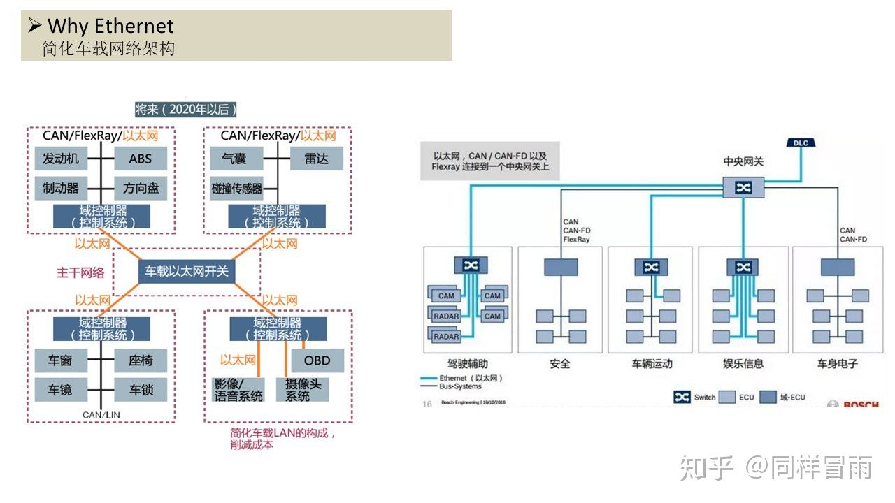

## 车载以太网

着汽车电子技术的飞速发展，车与互联网的深度结合，汽车和通信技术也不可避免的交织在了一起。笔者是硬件工程师，在通信行业从业多年，眼见着通信速率从100M,到1G，再到10G,25G,100G,400G。板上的信号速率也发展到目前的25G PAM4。而汽车电子这边，却一直在10M以下。当然，随着车联网，5G,V2X等技术的出现，车上的总线也必须要提速了。

<!-- more -->

1）汽车以太网概念是由 OPEN 联盟 SIG 提出来的，也叫IEEE 802.3bw ( 原 BroadR-Reach)，是为汽车联网应用设计的一种以太网物理层标准，如高级安全功能、舒适和信息娱乐功能。
2）车载以太网是一种用于连接汽车内不同电气设备的新型局域网技术。
3）车载以太网主要由MAC（介质访问控制）、PHY（物理接口收发器）组成；为实现更高的信号带宽，车载以太网在双绞线电缆上采用全双工通信链路，支持同时收发功能及 PAM3 信令，可实现100Mbit/s及以上的传输速率。

## 为什么要研究车载以太网

车载网络是非常复杂的系统，同时存在多重通讯网络，哪怕是常见的CAN总线也会分不同速率的CAN总线，比如动力系统的发动机控制、变速箱控制等，会采用高速的500K CAN总线控制，舒适系统的，比如门、灯、窗等会采用125K的CAN总线控制。随着处理器运算能力和硬件的高速发展，ADAS，高品质的车载娱乐以及远程升级等新增功能的需求，使得ECU网络带宽需求呈现爆炸式增长，同时也促使车载以太网成为车载网络的一员。

车载以太网未来应用趋势：
a) 车载诊断系统升级，特别针对大数据量刷写升级；
b) 智能驾驶，针对激光雷达和摄像头大数据音视频流量传输；
c) 车载信息娱乐系统开发，特别针对娱乐系统多屏互动连接和硬件一体化设计；
d) 信息互联系统集成开发，特别针对无线互联,V2X等不同通信介质介入的场景。

## 几种技术流派

当前车载以太网有三大代表性成果：博通公司的BroadR-Reach技术、AVnu联盟的AVB/TSN技术和TTTech公司的TTEthernet技术。

a) 2011年博通公司在一对非屏蔽双绞线（传统以太网使用4对双绞线）上重新实现了以太网的物理层电气规范，支持100Mbps的传输速度，25m的传输距离和车内使用环境，简称Broad-Reach技术，如果IVN全部使用博通以太网技术，预计车内互联的成本降低80%，线缆重量减少30%。BroadR-Reach技术已经应用在2014和2015款宝马，捷豹路虎部分车型中，但Broadr-Reach技术没有改变以太网MAC层协议，高速降低了碰撞机会，但延时的不确定性仍然存在，不易适用于时间苛刻的领域。

b) AVnu联盟的AVB、TSN技术在传统以太网的基础上，通过保障带宽、限制延迟、精确时钟同步、提供完美的服务质量QoS，以支持响应时间介于时间触发的实时网络与异步传输的以太网之间，对时间敏感的各种实时音、视频网络多媒体应用，目前仍处于标准完善中。

c) TTTech公司的TTEthernet技术以时间触发机制和时钟同步机制为基础，实现了硬实时、软实时和没有实时性要求的不同数据并行传输，同时也支持安全性和可用性标准，可用于汽车ADAS、车载多媒体以及汽车线控等领域。

## 车载以太网在汽车上的应用

1） 阶段1：子系统级别应用

基于DoIP标准的车载诊断系统（OBD）和ECU软件刷新。
a、以ECU软件刷新为例，和原有的CAN（1M／S）相比，刷新时间将缩短为原来的百分之一，该应用将大大提升诊断和刷新效率，节省时间、生产及服务成本。
b、基于DoIP标准的车载诊断系统（OBD），具有高速的数据传输速率。总数据速率达到100MBit/s，与使用ISO-TP(ISO 15765-2)的高速CAN相比，DOIP诊断总体速率是CAN诊断的100-200倍。DOIP技术可以完美匹配IT基础设施，固定诊断和远程诊断均能应用。

2） 阶段2：系统级别应用
应用于车载信息娱乐系统和ADAS系统
随着BroadR－Reach技术的日益成熟和标准化的不断推进，基于AVB，SOME／IP等技术将逐步推广使用，车载以太网将以单节点或多个节点的形式进行搭载，如使用高分辨率的IP摄像头的全景泊车等驾驶辅助系统和多屏互动的高清信息娱乐系统。

3） 阶段3：整车架构级别应用

以太网为主干网的车载网络

未来的汽车总线将由以太网将取代CAN成为主干网，而子网将是由若干域控制器（Domain Controller）组成。该车载网络以高速以太网作为骨干，将4个核心域控制器（动力总成域、车身域、影音域、ADAS域）连接在一起。同时，车内的网络还可以通过车联网模块与外部的云端服务平台进行信息交互。

以太网将取代CAN成为骨干网，而子网将是由若干域控制器(Domain Controller)组成的车载网络结构，且以太网和CAN等传统车载网络将在较长的一段时间内共存。

## 其他车载网络协议

CAN（Controller Area Network）,由Bosch公司最早定义的支持实时和分布式通讯的串行总线，目的是解决汽车电子系统中多个ECU之间的数据传输问题。CAN总线中各个节点以线性拓扑结构连接，通信介质采用双绞线或同轴电缆。

CAN总线（Controller Area Network，控制器局域网络）由德国博世公司于上世纪80年代提出，近20年来，随着CAN总线在工业测控与汽车领域的普及，CAN网络技术不断优化，取得了长足发展。如今CAN总线已经成为了汽车上不可或缺的重要环节，ECU内部的CAN总线开发也占到了ECU开发中的很大分量。在汽车中为了满足车载系统的不同要求，主要采用高速CAN和低速CAN。这两者以不同的总线速率工作以获得最佳的性价比，在两条总线之间采用CAN网关进行连接。

1）高速CAN（动力总线）
高速CAN总线的传输速率范围在125kbit/s - 1Mbit/s之间，主要用于传动系数传输的实时性要求（如发动机控制、自动变速箱控制、行驶稳定系统、组合仪表等）。

（2）低速CAN（舒适总线）
低速CAN总线的传输速率范围在5kbit/s - 125kbit/s之间。主要用于舒适系统和车身系统的数据传输的实时性要求（如空调控制、座椅调节、车窗升降等）。

### CAN总线特点

CAN总线是一种串行数据通讯协议，其中包含了CAN协议的物理层以及数据链路层。可以完成对数据的位填充，数据块编码，循环冗余效验，帧优先级的判别等工作。其主要特点如下：

（1）多主机方式工作，网络上任意一个节点（未脱离总线）均可以随时向总线网络上发布报文帧。
（2）节点发送的报文帧可以分为不同的优先级，满足不同实时要求。
（3）采用载波侦听多路访问/冲突检测（CSMA/CD）技术，当两个节点同时发布信息时，高优先级报文可不受影响地传输数据。
（4）节点总数实际可达110个。
（5）采用短帧结构，每一帧最多有8个有效字节。
（6）当某个节点错误严重时，具有自动关闭功能，切断与总线的联系，致使总线上的其他操作不受影响。

LIN（Local Interconnect Network）是一种基于UART/SCI的低成本开放式串行通讯总线，其定位是对CAN总线的低成本辅助网络，主要用于车内分布式电控系统，即车身电子控制中各模块节点间的低端通信。LIN采用星型拓扑及单线连接，并通过CAN网关和其他ECU进行信息交互。典型的LIN总线节点数可以达到12个，最大传输速率为19.2kb/s。

MOST（Media Oriented Systems Transport）是一种服务于汽车多媒体应用的网络总线标准，可以用于管理所有多媒体设备，其最大优势在于能够准确有效处理针对不同目标的多个数据流而不发生错误。MOST总线采用环形拓扑，以单根光纤为载体，总线传输率可达24.8Mbit/s，远高于CAN总线。

高速容错网络FlexRay。FIexRay总线结合事件触发和时间触发两种方式，具有更高的网络传输速率，更强的数据灵活性、更全面的拓扑选择和更可靠的容错运算，多用于汽车核心通讯需求，FlexRay采用星型拓扑结构，在物理上分为两条独立的通信通道，单通道最大数据传输速率为10Mbit/s，双通道总速率可达20Mbit/s。