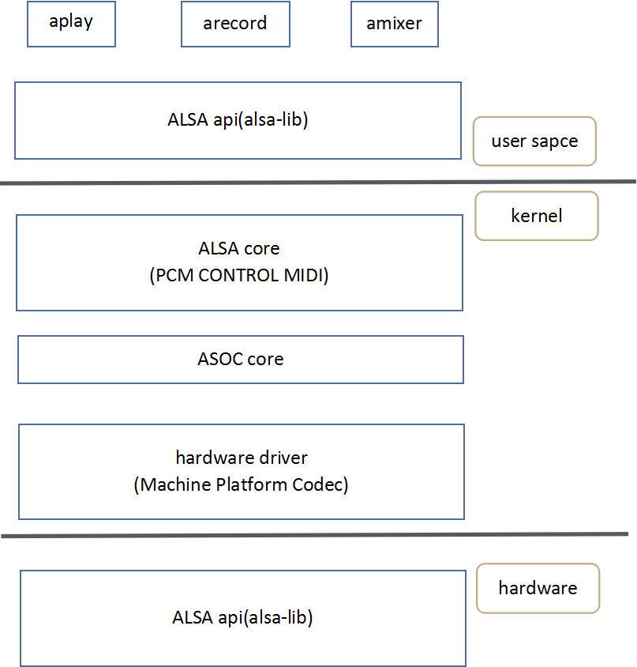

## 1.ALSA简介

ALSA是Advanced Linux Sound Architecture 的缩写，目前已经成为了linux的主流音频体系结构。
在内核设备驱动层，ALSA提供了alsa-driver，同时在应用层，ALSA为我们提供了alsa-lib，应用程序只要调用alsa-lib提供的API，即可以完成对底层音频硬件的控制。


## 2.ALSA设备文件结构

我们从alsa在linux中的设备文件结构开始我们的alsa之旅. 看看我的电脑中的alsa驱动的设备文件结构: 

```
    cd /dev/snd
    ls -l
```

| 设备          | 说明           |
| ------------- |:-------------:|
| controlC0     | 用于声卡的控制        | 
| midiC0D0      | 用于播放midi音频      |
| pcmC0D0c      | 用于录音的pcm设备     |
| pcmC0D0p      | 用于播放的pcm设备      |
| seq       | 音序器     |
| timer      | 定时器     |
