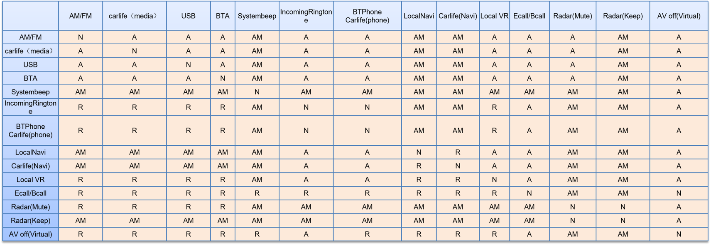
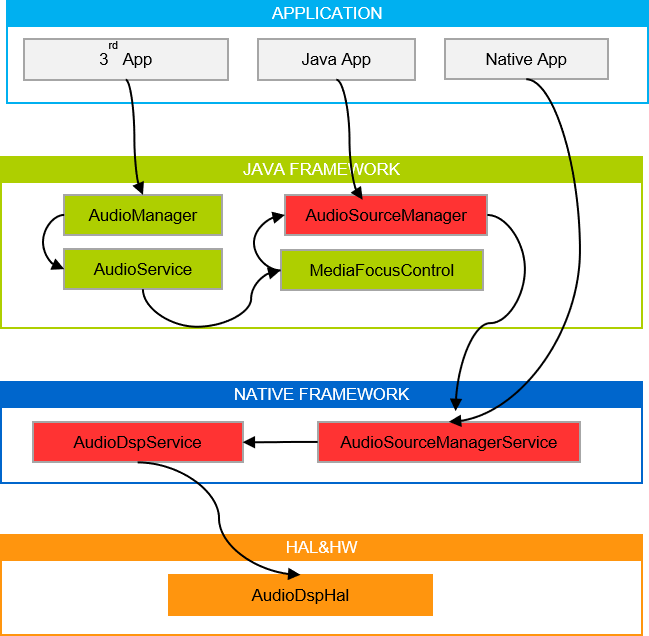
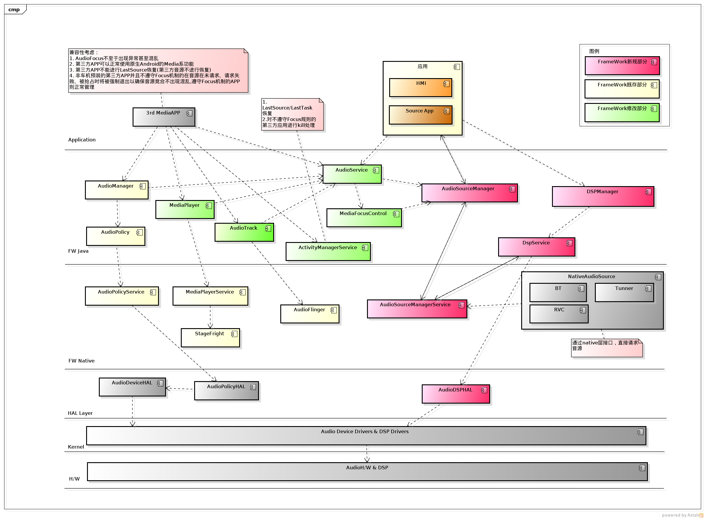
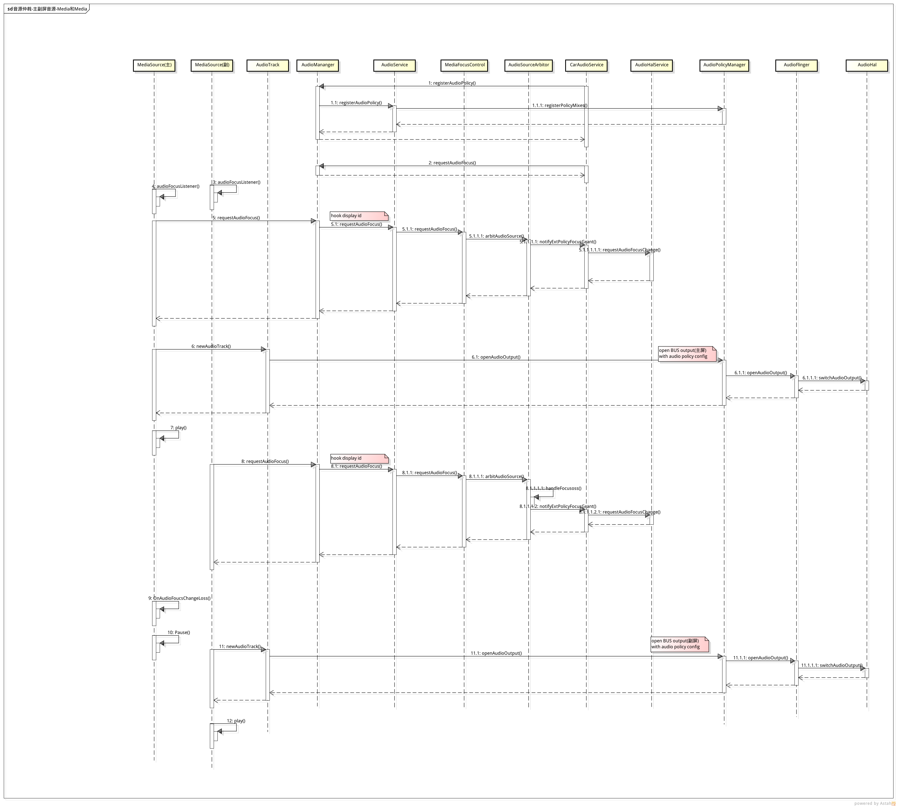
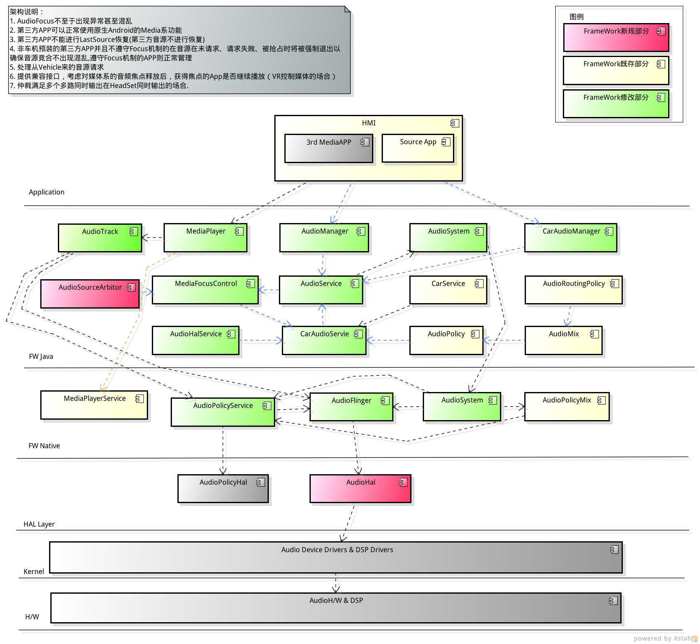

## 车载音源设计(Android Car之前)

### 机制介绍

1. 使用AudioFocus管理对Audio资源的竞争的管理与协调。
2. 在使用Audio之前,需要申请AudioFocus,在获得AudioFocus之后才可以使用Audio。
3. 当前正在使用的Audio被抢占，需要在收到通知后做停止播放或者降低声音的处理。
4. 该机制是需要合作完成，即所有使用Audio资源的程序都按照这种机制来实现。

### 对车载的而言的缺点

1. 失去AudioFocus的时候仍然在使用Audio。
2. 用户可能安装没遵守这种机制的程序进行request。
3. Audio的请求没有优先级，是基于Stack的抢占机制，而车机要求对所有的AudioSource进行管控。

需要对Android AF机制定制满足车载音源的复杂要求和变化。

### Android音源接口

    AudioManager.requestAudioFocus	请求音源
    AudioManager.abandonAudioFocus	释放音源

### 车载音源仲裁设计

### 定制AF架构

### 时序图

## 车载音源设计(Android Car)

### 定制Car Audio

### 支持多屏音源管理时序图

### 适配Car音源接口

    CarAudioManager.requestAudioFocus	请求音源
    CarAudioManager.abandonAudioFocus	释放音源

## 音源切换

不同车机的硬件平台AP和DSP不一样，要看具体音频通路配置进行通路的切换。
